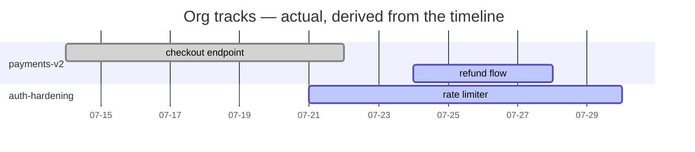
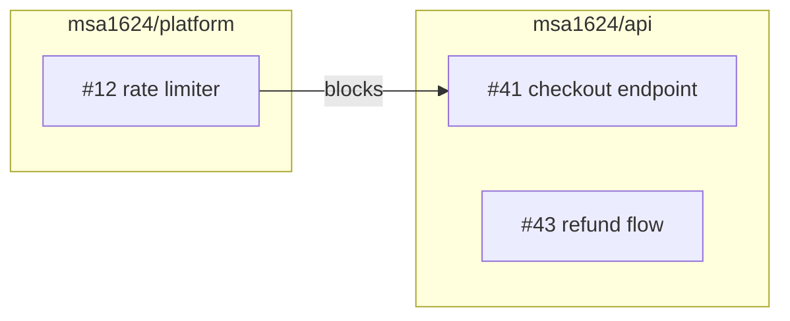

# Tracking Format — shared reference

> **This is a reference document, not a skill.** It has no frontmatter and never triggers on its
> own. The three skills — start-work, end-work, and `/snapshot` — each read it as their first step.
> There are exactly three skills in this design (plus gh-to-mcp, which has its own independent
> trigger); this file exists so the substrate they share isn't copied three ways and left to drift.

start-work, end-work, and `/snapshot` all read and write one shared substrate: a per-org tracking
repo plus two machine-local cursor files. This file owns that substrate. The three skills own their
workflows and defer here for everything about *where things live and what shape they are*.

**Core principle:** State lives in GitHub and is always fetched live. Events live in the timeline
and are never re-derived. Nothing caches the other.

**REQUIRED SUB-SKILL:** Use gh-to-mcp before running any `gh` command. All GitHub access goes
through the `plugin:github:github` MCP server. Plain `git` against the tracking clone and product
repos is not `gh` and is used directly.

## The Five Principles

Everything below follows from these. When a case isn't covered, decide by them.

1. **State vs. event.** *State* is what is true right now — an issue's status, assignee, blockers.
   *Events* are what happened, when, and by whom. State lives only in GitHub, fetched live, never
   cached here. Events live only in the timeline, never re-derived from GitHub, because the past
   does not change. A report needing both fetches state live and joins history against it.
2. **Pointer, not content.** A track's registry entry holds a pointer to its parent issue plus the
   handful of facts GitHub cannot express. If a field exists on the issue, the registry does not
   store it.
3. **Append-only.** Timeline events are written once and never rewritten, on any schedule, for any
   reason. A correction is a new event.
4. **No ranking.** The timeline answers "what happened and how does work connect," never "who did
   more." Nothing generated from it compares people against each other.
5. **Out-of-band.** The record of the work never lives on a branch of the work it describes. Branch
   identity is *data on an event*, never the *location* of an event.

## Paths

Derive the org once, at the start of every run:

```bash
git config --get remote.origin.url
```

Parse the owner. Every path follows from it deterministically — **nothing records these paths, and
nothing caches them**:

| What | Path |
|---|---|
| Tracking clone | `~/.claude/.tracking/<org>/` |
| Session cursor | `~/.claude/<org>.status.json` |
| Snapshot cursor | `~/.claude/<org>.snapshot.json` |

The cursors live **outside** the clone deliberately. A file that must survive a reclone, a
`git clean`, or a bad rebase inside that clone cannot live where the clone's own git operations can
reach it.

> **Two paths that differ only by location — read carefully.**
>
> | Path | What it is |
> |---|---|
> | `~/.claude/.tracking/<org>/` | **Home directory.** The machine-local clone of `<org>/tracking`. Runtime data, one per org, created by the bootstrap below. Never inside a product repo, never committed. |
> | `<skills repo>/.claude/.tracking/` | **Where this file lives.** Committed reference material — this document plus the `assets/` seed templates. Holds no runtime data. |
>
> Only the leading `~` separates them. Every path in this document is the **home** one unless it
> says otherwise, and nothing described here is ever written next to this file.

**Product repos get nothing.** No cursor, no clone, no tracking directory, no `.gitignore` entry.
Nothing here lands in a repo you work in.

### Write surfaces — these three, and nowhere else

| Location | Writes permitted |
|---|---|
| `~/.claude/.tracking/<org>/` | The only place anything is committed or pushed — always after showing the diff and confirming. |
| `~/.claude/<org>.{status,snapshot}.json` | Local cursor writes. No git involved. |
| Product repos | Branch creation and checkout, by start-work only. No file contents modified, nothing committed, nothing pushed. |

Everything else — issues, PRs, other people's repos — is read-only unless the owning skill's
workflow says otherwise (end-work updates issue statuses; that is its documented job).

## Bootstrap & Access

Run this preflight on **every** invocation of start-work, end-work, and `/snapshot`. There is no
stored sync timestamp and nothing is conditional on one.

### Step B1 — Is the clone present?

```bash
git -C ~/.claude/.tracking/<org> rev-parse --git-dir 2>/dev/null
```

**Present** → pull it (Step B3). **Missing** → does the remote exist?

```
search_repositories(query: "repo:{org}/tracking")
```

### Step B2 — Bootstrap

| Result | Behaviour |
|---|---|
| Remote exists, no local clone | `git clone https://github.com/{org}/tracking.git ~/.claude/.tracking/{org}` — say you did it and where. |
| Remote does not exist | **Offer to create it, and wait for a clear yes.** Creating a repo is outward-facing and never happens implicitly. |

On confirmation:

```
create_repository(name: "tracking", organization: "{org}", private: true,
                  description: "Org work tracking — track registry, event timeline, generated views",
                  autoInit: true)
```

Then clone it and seed three files from `.claude/.tracking/assets/`:

- `README.md` ← `assets/README.template.md`, with `{org}` substituted
- `.gitattributes` ← `assets/gitattributes` (one line: `*.jsonl merge=union`)
- `tracks.yml` ← an empty registry: `# Org track registry. See README.md.\ntracks: []`

Commit and push all three in one commit. A shared record whose format nobody can read is not shared
— the README is not optional.

### Step B3 — Pull, every run

```bash
git -C ~/.claude/.tracking/<org> pull --rebase
```

A clone left dirty by a previous run is surfaced in its own report line. It is **not** merged into
the developer's uncommitted-work blocker — they are different problems with different fixes.

### Step B4 — Write access (end-work only, before writing anything)

```bash
git -C ~/.claude/.tracking/<org> push --dry-run
```

| Result | Behaviour |
|---|---|
| Succeeds | Proceed. |
| Permission denied | **end-work stops before writing anything.** Do not bank events nobody will see. Say plainly that the developer lacks push access to `{org}/tracking`. |

start-work and `/snapshot` skip this check — both only read.

A `--local-only` escape hatch exists for someone knowingly accepting an unshared record. It is never
the default, never silent, and only ever used when the developer asks for it by name after being
told access is missing.

**Operate visibly, not silently.** Committing in a directory the developer never named is something
they are told about, even when it is exactly what they asked for.

## The Tracking Repo

```
{org}/tracking
├── README.md                       the format, for anyone who opens the repo cold
├── .gitattributes                  *.jsonl merge=union — and nothing else
├── tracks.yml                      the org-wide track registry
├── timeline/
│   └── YYYY-MM/
│       └── <dev>.jsonl             append-only, one file per developer per month
└── views/                          generated, never hand-edited
    ├── gantt.md
    └── dependencies.md
```

It contains no application code and runs no CI.

**One branch, always.** The tracking repo is never branched, force-pushed, squashed, or rebased into
a different shape. Its history is linear and append-only, which is what lets principle 3 hold.

**`merge=union` applies to `*.jsonl` and nothing else.** Timeline files are append-only, so a union
merge of two developers' appends is always correct. It is deliberately *not* extended to `views/` —
union-merging two generated Markdown files produces a document that is neither. View conflicts are
resolved by regeneration.

**One clone serves every worktree and repo on the machine.** So does one `status.json`, with each
active worktree appearing in `session.threads[]`.

## Cursor Files

Two files, two owners, zero shared fields. **Neither skill opens the other's.**

### `<org>.status.json` — owned by start-work / end-work

```json
{
  "schema": 1,
  "org": "msa1624",
  "last_session": {
    "started_at": "2026-07-25T09:00:00Z",
    "started_repo": "msa1624/api",
    "ended_at": "2026-07-25T18:20:00Z",
    "ended_repo": "msa1624/api"
  },
  "session": {
    "id": "2026-07-25-nilendu-01",
    "started_at": "2026-07-25T09:00:00Z",
    "threads": [
      { "track": "payments-v2", "thread": "msa1624/api#43", "repo": "msa1624/api", "branch": "feat/api-43-refunds", "worktree": "/Users/x/work/api" }
    ]
  }
}
```

- **`last_session`** — where the previous session began and ended. This is the "since you left off"
  boundary. It is not a calendar cursor and carries no assumption that the previous session was
  yesterday.
- **`session`** — the live session. Absent when no session is open. At most one is open at a time.
- **`session.threads[].worktree`** is load-bearing: it is the list end-work iterates to enforce the
  iron law across every repo a session touched. Store an **absolute** path, not `~`-relative.

end-work moves the closing session into `last_session` and clears `session`.

### `<org>.snapshot.json` — owned by `/snapshot`

```json
{ "schema": 1, "org": "msa1624", "last_checked": "2026-07-25T05:26:35Z" }
```

That is the whole file.

## Tracks & Threads

- **Track** — a set of related work. An epic: "Payments v2," "Q3 auth hardening." Spans repos and
  weeks; has an owner, a target date, and exit criteria.
- **Thread** — one unit of work inside a track. One GitHub issue, plus the PRs, branches, and
  commits that close it.

Parent/child structure comes from **GitHub sub-issues**, not a shadow hierarchy. **A milestone is
not a track** — a milestone is a shipping checkpoint owned by GitHub, a track is a registry entry
owned by `tracks.yml`, and one track's threads may span several milestones.

### `tracks.yml` — four fields, per principle 2

```yaml
tracks:
  - id: payments-v2
    parent: msa1624/api#38          # the parent issue — title, owner, dates all live here
    status: active                  # active | paused | done | abandoned
    exit_criteria: "checkout flow live for 100% of traffic"
  - id: auth-hardening
    parent: msa1624/platform#12
    status: active
    exit_criteria: "all endpoints behind rate limiter, pen-test clean"
```

A track's title, owner, start date, and target date live on the parent issue and are **not**
duplicated here — anything needing them follows `parent` and reads it live. `id` is the stable slug
timeline events reference. The remaining two are the facts GitHub cannot express:

- **`status`** — four states where an issue offers open or closed. A paused track is not a closed
  one; an abandoned track is not a finished one.
- **`exit_criteria`** — a structured, checkable definition of done. As prose in the parent's body
  nothing could read it. **Required on every track.** Without it a track never closes; it stops
  generating events and leaves a permanent bar on the Gantt.

`tracks.yml` has exactly one home: the tracking repo. A track spanning `{org}/api` and `{org}/web`
is a single entry.

## Issue Fields in This Org

Every thread has an issue, and every issue carries the org's standard fields, **set at creation**.

**Discover them at runtime — never hardcode the list:**

```
list_issue_fields(owner: "{org}")        → org-level custom fields and their valid options
list_issue_types(owner: "{org}")         → valid issue types
```

As of this writing `msa1624` defines exactly four custom fields, and they are what "every required
field" means here:

| Field | Type | Valid values |
|---|---|---|
| Priority | single-select | Urgent · High · Medium · Low |
| Effort | single-select | High · Medium · Low |
| Start date | date | `YYYY-MM-DD` — the planned start |
| Target date | date | `YYYY-MM-DD` — the planned finish |

Issue types are **Task · Bug · Feature**. There is no `Epic` type; a track's parent issue is a
`Feature` unless the developer says otherwise, and it is a track because `tracks.yml` points at it,
not because of its type.

Two fields the design calls for are **not available in this org**, and are handled rather than faked:

| Field | Reality | What to do |
|---|---|---|
| Size, Estimate | Not defined as org Issue Fields | Do not invent them. Effort is the only recorded sizing signal; `/snapshot` compares Effort against the sessions the timeline shows. |
| Relationships | A GitHub feature with no write tool in `plugin:github:github` | Read whatever `issue_read` surfaces, plus `#N` references and blocks/depends-on prose in bodies. The timeline's `blocked_by` is the authoritative record of a dependency actually hit. |

**Values are never guessed.** A value the conversation has not established is asked for, not
invented — an estimate nobody stated is not a field to fill in with a plausible number.

Start date and Target date are what make a thread's *planned* dates exist at all, which is what
`/snapshot` charts actuals against. Milestone and any relationships are live issue state, read live
wherever needed, and **never copied** into the timeline or `tracks.yml`.

## Event Timeline

One file per developer per month: `timeline/YYYY-MM/<dev>.jsonl`. One JSON object per line, no
blank lines, newline-terminated. Two developers wrapping up simultaneously never touch the same
file; the same developer on two machines can, and `merge=union` resolves it.

```jsonl
{"schema":1,"ts":"2026-07-25T09:02:11Z","session":"2026-07-25-ali-01","dev":"ali","event":"session_start","mode":"resume_same","threads":1}
{"schema":1,"ts":"2026-07-25T09:14:00Z","session":"2026-07-25-ali-01","dev":"ali","event":"branch_created","track":"payments-v2","thread":"msa1624/api#41","repo":"msa1624/api","branch":"feat/api-41-checkout","title":"checkout endpoint"}
{"schema":1,"ts":"2026-07-25T13:40:00Z","session":"2026-07-25-ali-01","dev":"ali","event":"progress","track":"payments-v2","thread":"msa1624/api#41","repo":"msa1624/api","branch":"feat/api-41-checkout","commits":["a1b2c3d","e4f5a6b"],"note":"idempotency keys on charge endpoint"}
{"schema":1,"ts":"2026-07-25T15:10:00Z","session":"2026-07-25-ali-01","dev":"ali","event":"blocked","track":"payments-v2","thread":"msa1624/api#41","repo":"msa1624/api","branch":"feat/api-41-checkout","blocked_by":["msa1624/platform#12"],"note":"needs the new rate-limit middleware"}
{"schema":1,"ts":"2026-07-25T18:20:00Z","session":"2026-07-25-ali-01","dev":"ali","event":"session_end","threads_touched":1,"repos_touched":1}
```

| Field | Rule |
|---|---|
| `schema` | version integer, always `1` today, so the format can evolve without breaking readers of old files |
| `ts` | UTC, ISO 8601, always — local time makes cross-timezone charts lie |
| `session` | the session id shared by every event in one sitting. This is what stitches a session together when it fans out across tracks, branches, and repos |
| `dev` | the GitHub handle of the person the work is attributed to |
| `event` | `session_start` · `session_resume` · `branch_created` · `progress` · `blocked` · `unblocked` · `done` · `handoff` · `session_end` |
| `track` | the `tracks.yml` id this work belongs to. Thread-scoped events only |
| `thread` | always `owner/repo#N`, never bare `#N`. Thread-scoped events only |
| `repo` | `owner/repo` — required on every thread-scoped event |
| `branch` | the branch the work happened on, or `null` on `main`/detached. Never inferred later |
| `title` | on `branch_created` only: the thread's title as of when work started. A label for the views, never refreshed and never authoritative |
| `commits` | short SHAs, so an entry can be checked against git rather than trusted on its word |
| `note` | one line of free text: what actually happened. Expected on `progress` and `blocked` |
| `blocked_by` | array of `owner/repo#N` — a dependency hit while working |
| `to` | on `handoff` only: the GitHub handle the work is being handed to |
| `mode` | `session_start` only: `resume_same` · `fan_out` · `handoff` · `new_track` |
| `threads` | `session_start` only: how many threads the session opened with |
| `threads_touched` / `repos_touched` | `session_end` only: counts, so a session's shape is readable without replaying it |
| `inferred` | `true` on a synthetic `session_end` written for an abandoned session. Never set on a recorded event |

**Session-scoped vs. thread-scoped.** `session_start`, `session_resume`, and `session_end` describe
the sitting rather than a piece of work, and a session routinely spans several tracks, repos, and
branches. `track`/`thread`/`repo`/`branch` do not apply to them and are **omitted** — not set to
null. Every other event is thread-scoped and carries all four.

`branch_created` is its own event type rather than a flavour of `progress`: it fixes a thread's
actual start date, and the Gantt's bars begin there.

**No duration or hours field.** Session boundaries place work on a Gantt at day granularity. A
computed "time worked" number invites exactly the per-person comparison principle 4 rules out.

### Session ids

`YYYY-MM-DD-<dev>-NN`, where `NN` is a zero-padded counter of that developer's sessions on that
date. Derive it by counting `session_start` events already in `timeline/YYYY-MM/<dev>.jsonl` whose
`ts` falls on that date, and adding one. Never reuse an id.

### Branch naming

`<type>/<repo-shortname>-<issue#>-<slug>` — e.g. `feat/api-41-checkout`,
`fix/platform-12-ratelimit`. `<type>` is `feat`, `fix`, `chore`, or `docs`. `<slug>` is the issue
title, lowercased, non-alphanumerics collapsed to `-`, trimmed to roughly three words.

start-work generates every branch it creates this way, so the branch→thread link is recoverable from
the branch name alone, with **no lookup table to maintain**.

### Attribution

`dev` is the human who triggered the session, matching commit *authorship* — read from the author
field and `Co-authored-by:` trailers, with bots excluded. An agent-authored commit co-authored to a
person attributes to that person. Get the handle from `get_me()`.

## Generated Views

`views/gantt.md` and `views/dependencies.md` are rebuilt from `tracks.yml` and the timeline on every
end-work run, after pulling latest. Both open with:

```
<!-- GENERATED — do not edit, rebuilt by end-work -->
```

**They are built from the timeline and `tracks.yml` alone — never from GitHub.** A committed file
carrying an issue's assignee, status, or planned dates would be a cache of state, wrong the moment
someone reassigned the issue. Everything here derives from events, which cannot go stale because
they describe the past.

Node labels come from the `title` recorded on that thread's `branch_created` event — **not** a live
lookup. It is the title as it stood when work began, and it stays that way. If the issue is renamed,
the view keeps the old label; the event is a record of what was true then. A thread with no
`branch_created` falls back to its bare `owner/repo#N`.

### `views/gantt.md`

Charts **actuals only**. Planned dates live on the issue's Start/Target fields, so charting them
here would mean caching them here — `/snapshot` reports planned-vs-actual instead.

- One `section` per track, in `tracks.yml` order. Tracks with no events are omitted.
- One bar per thread. **A thread with no events does not appear.**
- Bar starts at the date of the thread's earliest `branch_created`; if it has none, its earliest
  event of any kind.
- Bar ends at the date of its `done` event → status `done`. Still open → ends at its latest event
  date, status `active`. A bar that would be zero-width gets a `1d` duration.
- A thread whose events carry **no commit SHAs at all** gets ` (unverified)` appended to its label —
  principle: verifiable, not trusted.

````
<!-- GENERATED — do not edit, rebuilt by end-work -->

````

No assignees, no statuses, no colour-coding by state — all of that is live GitHub data, rendered by
`/snapshot` on request. What survives here is structure, which the timeline owns outright.

### `views/dependencies.md`

Edges come from **one source only**: each event's `blocked_by` field — a dependency someone actually
hit while working. For an event on thread `T` with `blocked_by: [B]`, the edge is `B -->|blocks| T`.
Deduplicate; an edge recorded five times is one edge. Nodes are grouped into a `subgraph` per repo.
Node ids are the repo shortname plus the issue number (`api41`), which keeps them mermaid-safe.

````
<!-- GENERATED — do not edit, rebuilt by end-work -->

````

Edges recorded on the issues themselves are **not** baked in, whether they live in a structured
Relationships field or as `#N` references and "blocks"/"depends on" prose in a body. Both are issue
state: an issue's relationships can be edited at any time, so a committed copy would be wrong
without warning. `/snapshot` joins them live to render the fuller map, and is the only view that can
show the two sources disagreeing.

When there are no `blocked_by` events at all, write the header plus one line saying no dependencies
have been encountered yet. Do not write an empty mermaid block.

### Conflict resolution

**View conflicts are discarded and regenerated, never resolved.** On a rejected push: throw away
local changes under `views/`, `pull --rebase` (only `*.jsonl` remains in play, and `merge=union`
handles it), regenerate the views from the merged timeline, push again. This is safe because views
are derived — a regenerated file is always correct, a merged one may be neither developer's output.

## Guardrails

- **Verifiable, not trusted.** Every `progress` event carries commit SHAs. An entry with no SHAs
  renders visibly softer in the views than one that can be checked.
- **No leaderboards, ever.** Every developer's session log sits in one repo, which is what makes the
  org view work and what makes principle 4 easy to violate. No generated view ranks or compares
  people, and no view may be added that does.
- **Retention: keep everything, forever.** A developer generating ~10 events a day produces a few
  hundred KB a year. There is no compaction and no pruning — an append-only log rewritten on any
  schedule is not append-only.
- **The timeline stays event-shaped.** If `tracks.yml` accumulates statuses, assignees, or
  descriptions duplicating the parent issue, it has become a second issue tracker and principle 2
  has been abandoned.

## Red Flags — STOP

- Writing anything under `~/.claude/.tracking/<org>/` without having pulled first
- Rewriting, reordering, or deleting an existing timeline line — corrections are new events
- Creating a branch in the tracking repo, or force-pushing it
- Hand-resolving a conflict in `views/` instead of discarding and regenerating
- Putting an issue's status, assignee, or planned dates into a committed view or `tracks.yml`
- Reading current status out of the timeline, or re-deriving a past event from GitHub
- Setting `track`/`thread`/`repo`/`branch` on a `session_*` event
- Writing a bare `#N` into a `thread` or `blocked_by` field
- Creating the tracking repo without an explicit yes
- Filling in Priority, Effort, or a date the conversation never established
- Adding a `Size` or `Estimate` field this org doesn't define
- Recording a duration, an hours count, or anything that ranks developers
- Letting `/snapshot` write an event, a commit, or a GitHub change

## Quick Reference

| Situation | Action |
|---|---|
| Start of any run | Derive org → bootstrap if missing → `git pull --rebase` |
| Clone path | `~/.claude/.tracking/<org>/`, derived, never recorded |
| Need "when did I stop last time" | `<org>.status.json` → `last_session.ended_at` |
| Need "when was the last report" | `<org>.snapshot.json` → `last_checked` |
| Tempted to read the other skill's cursor | Don't. Zero shared fields, no cross-reads. |
| Need current status of an issue | Fetch live from GitHub. Never the timeline. |
| Need when work started | The timeline's `branch_created`. Never GitHub. |
| Need a thread's title for a view | The `title` on its `branch_created` event |
| Track has no `exit_criteria` | Ask for one. It is required. |
| Issue field values not in the conversation | Ask. Never guess. |
| Push to tracking rejected | Discard `views/`, `pull --rebase`, regenerate, push |
| Push fails for permissions | end-work stops before writing; start-work and `/snapshot` are unaffected |
| Push fails transiently (offline) | Leave events on disk, report it, they push next run |
| About to run a `gh` command | Stop, use gh-to-mcp |

## Common Rationalizations

| Excuse | Reality |
|---|---|
| "I'll cache the issue's status in `tracks.yml` so reports are faster" | That is a second issue tracker, and it is wrong the moment someone edits the issue. Four fields. |
| "The timeline says the issue was blocked, so it's blocked" | The timeline says it *was* blocked, at a moment in the past. Current state is a live fetch. |
| "This event has a typo, I'll just fix the line" | Append-only means append-only. Write a new event. |
| "Union-merging the views is easier than regenerating" | A union-merged Markdown document is neither developer's output. Regenerate — views are derived, so a regenerated file is always correct. |
| "The developer obviously wants the tracking repo, I'll create it" | Creating a repo is outward-facing. Ask, and wait for a yes. |
| "Effort is basically an estimate, I'll put a number in Estimate" | This org has no Estimate field. Inventing one puts fabricated data where a reader expects a record. |
| "No push access, but I'll write the events locally so nothing is lost" | Events nobody will ever see are lost already, just more slowly. Stop and say so — unless the developer names `--local-only`. |
| "I'll record how long the session ran, it's useful context" | It is the raw material for a leaderboard. Session boundaries are recorded; durations are not. |
