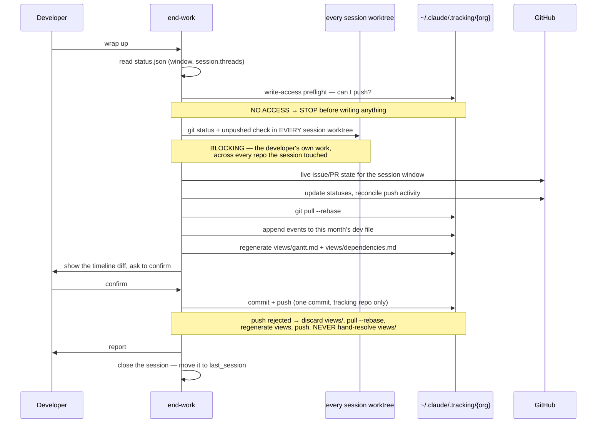

# End Work

## Overview

Close the session: land the record of what happened, update the issues that moved, regenerate the
org views, and leave the developer knowing exactly what is still uncommitted and where.

**Core principle:** Uncommitted or unpushed work blocks a clean handoff. Everything else is
reporting.

**Announce at start:** "I'm using the end-work skill to wrap up your session."

**REQUIRED READING — first, before anything else:** `.claude/.tracking/format.md`. It holds the
paths, bootstrap procedure, cursor schemas, event format, and view-generation rules this skill
depends on.

**REQUIRED SUB-SKILL:** Use gh-wrapper before running any `gh` command.

## The Iron Law

```
NO CLEAN HANDOFF WITH UNCOMMITTED OR UNPUSHED WORK
```

Checked first, on every run, and reported at the top. Not a footnote, not "worth mentioning."

**The check runs in every worktree the session touched** — iterating `session.threads[].worktree`,
not just the repo the developer happens to be standing in when they wrap up. A session that branched
in three repos leaves work in three trees, and the developer wraps up in one of them.

## The Process



### Step 1: Read the Session

Derive the org. Read `~/.claude/<org>.status.json`.

| What you find | What you do |
|---|---|
| A live `session` | Its `started_at` is the window; `threads[]` is what to check and report on. |
| No `session` | No session was opened. Say so, use midnight today as the window, and report what you can. Still write `last_session` at the end. |

`get_me()` for the developer's handle.

### Step 2: Write-Access Preflight (BEFORE ANYTHING IS WRITTEN)

```bash
git -C ~/.claude/.tracking/<org> push --dry-run
```

Permission denied → **stop**. Do not run the rest, do not append events, do not update issues. A
developer without push rights does not get a degraded wrap-up that banks events locally forever.
Say plainly that they lack push access to `{org}/tracking`, and that `--local-only` exists if they
knowingly want an unshared record.

This is a *permissions* check. A transient network failure is handled in Step 8, not here.

### Step 3: The Iron Law (BLOCKING)

For **every** entry in `session.threads[]`, deduplicated by `worktree`:

```bash
git -C <worktree> status --short
git -C <worktree> log --oneline @{u}.. 2>/dev/null || git -C <worktree> log --oneline origin/HEAD..HEAD
```

| Found | Report as |
|---|---|
| Uncommitted files | Blocker, grouped under that repo |
| Commits not on the remote | Blocker, grouped under that repo |
| The worktree path no longer exists on disk | **Its own reported line** — never silently skipped |

**Blockers are reported grouped by repo, never as one flat list** — three uncommitted files across
three repos are three separate pieces of work to land.

Also check the tracking clone itself:

```bash
git -C ~/.claude/.tracking/<org> status --short
```

A clone left dirty by a previous run gets **its own report line**. It is never merged into the
developer's uncommitted-work blocker — they are different problems with different fixes.

### Step 4: Live State for the Window

The window is `session.started_at`. Never widen it silently.

```
search_issues(query: "org:{org} updated:>={window}", sort="updated", order="desc")
search_pull_requests(query: "org:{org} updated:>={window}", sort="updated", order="desc")
search_issues(query: "org:{org} state:closed closed:>={window}")
search_pull_requests(query: "org:{org} state:merged merged:>={window}")
```

For items updated but not closed, `issue_read` / `pull_request_read` for comments and review history
— what actually changed, not just that something did.

### Step 5: Update Statuses on GitHub

For session threads with meaningful progress:

```
add_issue_comment(owner, repo, issue_number, body: "Progress: implemented X, Y. Remaining: Z.")
issue_write(method: "update", owner, repo, issue_number, labels: [...])
issue_write(method: "update", owner, repo, issue_number, state: "closed", state_reason: "completed")
issue_write(method: "update", owner, repo, issue_number,
            issue_fields: [{field_name: "Target date", value: "YYYY-MM-DD"}])
```

Update labels *before* closing, so the next scan reads the right state. Shift a Target date only
when the developer said the timeline moved — never to make a date look met.

### Step 6: Reconcile Push Activity — the Compliance Pass

Every `git push` is supposed to be followed by a progress comment on each issue the pushed commits
reference, closure when a closing keyword was used **and the work is genuinely done**, and field
updates when the timeline shifted. That doesn't reliably happen at push time. This catches what
slipped.

For each worktree, over the session window:

```bash
git -C <worktree> log --since="<window>" --oneline
```

| Found | Fix |
|---|---|
| Commit references `#N`, no comment mentions that commit | Add a comment summarizing what it did |
| Closing keyword (`Fixes`/`Closes`/`Resolves #N`) used, work genuinely complete, issue still open | `issue_write` with the right `state_reason` |
| Commit references `#N` with **no corresponding timeline event** | Append the missing `progress` event now, carrying its SHAs |
| Work shifted urgency or timeline | Update the relevant issue field |

Report every gap repaired under "Compliance gaps found" — that section is the signal that the
push-time self-check needs attention.

### Step 7: Append the Events

Pull first: `git -C ~/.claude/.tracking/<org> pull --rebase`.

Append to `timeline/YYYY-MM/<dev>.jsonl` — creating the month directory if this is the first event
of the month. One line per event, newline-terminated, **never rewriting an existing line**:

- A `progress` event per thread that moved, carrying its `commits` and a one-line `note` of what
  actually happened.
- `blocked` / `unblocked` where the session hit or cleared a dependency. `blocked_by` is an array of
  `owner/repo#N` — this is the only thing `views/dependencies.md` is built from, so a dependency hit
  and not recorded here is a dependency the org never learns about.
- `done` for threads that finished. Check the work is actually complete first.
- `handoff`, with `to` set to the handle, when work is being passed on.
- `session_end`, last, with `threads_touched` and `repos_touched`.

Field rules, event by event, are in **`.claude/.tracking/format.md` → Event Timeline**.
Session-scoped events carry no `track`/`thread`/`repo`/`branch`.

**Never invent a SHA, a note, or a blocker.** An event with no commits behind it renders visibly
softer in the views, which is the correct outcome — not a reason to pad it.

### Step 8: Regenerate the Views, Commit, Push

Rebuild `views/gantt.md` and `views/dependencies.md` from `tracks.yml` and the **whole** timeline —
never from GitHub. Rules in **`.claude/.tracking/format.md` → Generated Views**.

Show the developer the diff — the appended timeline lines and the view changes — and **wait for a
yes**. Then one commit, tracking repo only:

```bash
git -C ~/.claude/.tracking/<org> add -A
git -C ~/.claude/.tracking/<org> commit -m "session 2026-07-25-nilendu-01 — 3 threads, 3 repos"
git -C ~/.claude/.tracking/<org> push
```

| Push outcome | What you do |
|---|---|
| **Rejected** (someone else pushed) | `git checkout -- views/` to discard the generated files, `pull --rebase` (only `*.jsonl` is left in play, and `merge=union` handles it), regenerate the views from the merged timeline, push again. **Never hand-resolve a `views/` conflict.** |
| **Transient failure** (offline, or a race outliving the retry) | Leave the events on disk, append-only, and report it. They push on the next run. |
| **Permission failure** | Cannot happen here — Step 2 caught it. If it somehow appears, treat it as Step 2 and say so. |

### Step 9: Close the Session

Last, after the report is delivered: move `session` into `last_session` in
`~/.claude/<org>.status.json` —

```json
"last_session": {
  "started_at": "<session.started_at>",
  "started_repo": "<repo the session opened in>",
  "ended_at": "<now, UTC>",
  "ended_repo": "<repo you're wrapping up in>"
}
```

— and delete `session` entirely.

**Write it even when Step 3 found blocking changes.** The boundary records when you stopped, not
whether the handoff was clean.

## Output Format

```
## Session closed — 2026-07-25-nilendu-01
Org: msa1624 | Window: 2026-07-25 09:00 → 18:20 UTC | 3 threads, 3 repos

### Pending Changes (BLOCKING)
**msa1624/api** (~/work/api, feat/api-43-refunds)
- Uncommitted: src/refunds.ts, src/refunds.test.ts
- Unpushed: 9f2c1ab — refund state machine

**msa1624/web** (~/work/web, feat/web-22-payment-ui)
- Uncommitted: src/PaymentForm.tsx

**Action required**: commit and push in both repos before this work is handed off.

Note: ~/work/platform is listed in the session but no longer exists on disk.
Note: the tracking clone had uncommitted changes from a previous run — resolved by regenerating.

### Recorded to the timeline (timeline/2026-07/nilendu.jsonl)
- progress · payments-v2 · msa1624/api#43 · feat/api-43-refunds · 9f2c1ab — refund state machine
- blocked · payments-v2 · msa1624/web#22 — blocked by msa1624/api#43, "UI needs the refund endpoint shape settled"
- done · auth-hardening · msa1624/platform#12 — rate limiter shipped
- session_end · 3 threads, 3 repos

Views regenerated. Pushed to msa1624/tracking as 4a91c07.

### Completed
| Thread | Repo | Title | Status |
|---|---|---|---|
| #12 | msa1624/platform | rate limiter | Closed |
| #47 | msa1624/api | refund endpoint | Merged |

### Carry-over
- msa1624/api#43 — refund flow
  - Done: state machine
  - Remaining: idempotency, tests
  - Blocks: msa1624/web#22
- msa1624/web#22 — payment UI
  - Blocked on msa1624/api#43

### Compliance gaps found
- msa1624/api#43 had a commit referencing it with no progress comment — added
- 9f2c1ab referenced #43 but had no timeline event — appended
```

Omit the Pending Changes section entirely when Step 3 comes back clean.

## Red Flags — STOP

- Writing anything before the write-access preflight has passed
- Running `git status` only in the current directory when `session.threads[]` lists three worktrees
- A missing worktree skipped silently instead of reported
- Uncommitted changes found and put anywhere but the top of the report
- Describing unpushed commits as "minor" or "just local"
- The tracking clone's dirtiness folded into the developer's blocker section
- Hand-resolving a `views/` conflict instead of discarding and regenerating
- Rewriting or reordering an existing timeline line
- Building a view from GitHub data instead of the timeline
- Closing an issue because a commit said `Fixes #N`, without checking the work is done
- A `blocked` event with a bare `#N` in `blocked_by`
- Inventing a commit SHA, a note, or a blocker to make an event look complete
- Pushing the tracking repo without showing the diff
- Recording a duration or an hours count
- Finishing the run without moving `session` into `last_session`

## Quick Reference

| Situation | Action |
|---|---|
| Start of every run | Read `status.json` → write-access preflight → iron law in every worktree |
| No push access | Stop before writing anything. Mention `--local-only`, don't default to it. |
| Session worktrees | Iterate `session.threads[].worktree`, deduplicated |
| Worktree gone from disk | Report it as its own line |
| Pending changes exist | Top-of-report BLOCKING section, grouped by repo, with an action-required line |
| Tracking clone dirty | Separate report line, never the developer's blocker |
| Window | `session.started_at`. No session → midnight today, and say so. |
| Item made progress but isn't done | `add_issue_comment` + labels + a `progress` event |
| Item is genuinely done | `issue_write` closed/completed **and** a `done` event |
| Dependency hit while working | A `blocked` event with `blocked_by: ["owner/repo#N"]` — the only source the dependency view has |
| Commit references `#N` with no event | Append the missing `progress` event, report it as a compliance gap |
| Push rejected | Discard `views/`, `pull --rebase`, regenerate, push |
| Push fails transiently | Events stay on disk, reported, pushed next run |
| End of every run | Move `session` → `last_session`, clear `session` — even on a dirty run |
| Referencing an item | Always `owner/repo#N` |
| About to run a `gh` command | Stop, use gh-wrapper |

## Common Rationalizations

| Excuse | Reality |
|---|---|
| "The uncommitted changes are trivial, I'll note them at the bottom" | Trivial changes are exactly what gets lost. Top of report, marked blocking. |
| "The commits are local, that still counts as done" | Unpushed work is invisible to everyone else. It isn't handed off until it's pushed. |
| "I'm standing in ~/work/api, so that's the repo to check" | The session touched three. Iterate `session.threads[].worktree`. |
| "~/work/platform is gone, so there's nothing to report there" | A worktree that vanished mid-session is a finding, not a non-event. Say it. |
| "The tracking clone is dirty too, I'll list it with the other blockers" | Different problem, different fix. The developer's work needs committing; the clone needs regenerating. |
| "No push access, but I'll write the events locally so nothing is lost" | Events nobody will see are already lost. Stop and say so. |
| "The views conflict is two lines, I'll just merge them by hand" | The result is neither developer's output. Views are derived — discard and regenerate. |
| "The commit said `Fixes #N`, so close it" | Closing keywords state intent, not completion. Verify first. |
| "Push reconciliation is redundant, I commented at push time" | Step 6 exists because that check demonstrably doesn't always fire. Run it and report what you find. |
| "I don't have the SHA handy, I'll write the progress event without commits" | Then it renders as unverified, which is honest. Inventing one isn't. |
| "The session ran three days, I'll report it as today" | Say it was three days. A silently stretched window makes the whole report wrong in a way nobody can see. |
| "Recording hours would make the Gantt more precise" | It would make it a productivity metric. Day granularity, no durations. |
