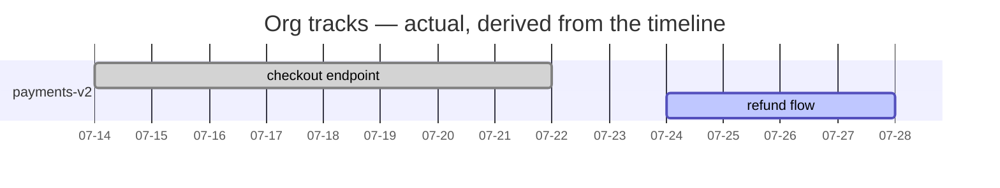
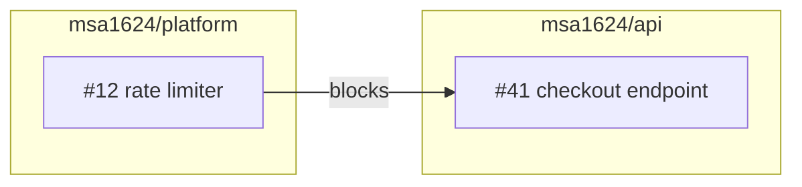
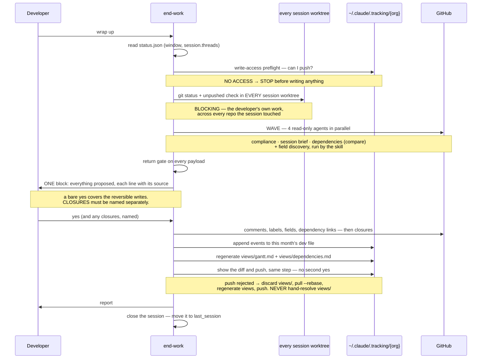

# End Work

## Overview

Close the session: land the record of what happened, update the issues that moved, regenerate the
org views, and leave the developer knowing exactly what is still uncommitted and where.

**Core principle:** Uncommitted or unpushed work blocks a clean handoff. Everything else is
reporting.

**Announce at start:** "I'm using the end-work skill to wrap up your session."

**READ *The Substrate* BELOW FIRST.** It holds the paths, bootstrap procedure, cursor schema, event
format, and view-generation rules this skill depends on.

**REQUIRED SUB-SKILL:** Use gh-wrapper before running any `gh` command. It routes GitHub access down
a three-rung ladder — MCP tool, then `gh` flag, then `gh api graphql` — and nothing is reported
impossible until all three have been walked.

**Write surfaces, per target-workflow §2:** the tracking clone and cursor files, plus issue
comments, labels, state, and field values on issues the session touched. **Never an issue body,
never a PR, never a product repo's file contents.**

## The Iron Law

```
NO CLEAN HANDOFF WITH UNCOMMITTED OR UNPUSHED WORK
```

Checked first, on every run, and reported at the top. Not a footnote, not "worth mentioning."

**The check runs over the worktree set derived in Step 1** — every worktree the session touched
**plus the repo the developer is standing in**, and with no session open, the current repo plus every
repo on their timeline since the window. A session that branched in three repos leaves work in three
trees, and the developer wraps up in one of them.

**It is never `session.threads[]` alone, and never empty.** On a no-session run that list is empty,
and iterating it silently checks nothing — on precisely the run where nobody opened a session and
work is likeliest to be sitting uncommitted.

**And it is never delegated.** A subagent the skill cannot see into reporting "clean" is exactly the
failure that ships someone's uncommitted work. It runs here, before any research is dispatched.

## The Substrate

<!-- SUBSTRATE: the five principles, paths, bootstrap, tracks.yml, issue fields, and the event
     format are shared with start-work and snapshot — keep in sync. Sections marked (end-work only)
     are not. -->

### The Five Principles

When a case isn't covered, decide by these.

1. **State vs. event.** *State* is what is true now — status, assignee, blockers — and lives only in
   GitHub, fetched live, never cached. *Events* are what happened, when, by whom, and live only in
   the timeline, never re-derived from GitHub, because the past does not change.
2. **Pointer, not content.** A track's registry entry points at its parent issue plus the few facts
   GitHub cannot express. If a field exists on the issue, the registry does not store it.
3. **Append-only.** Timeline events are written once and never rewritten. A correction is a new event.
4. **No ranking.** Nothing generated compares people. No durations, ever.
5. **Out-of-band.** The record never lives on a branch of the work it describes. Branch identity is
   *data on an event*, never the *location* of one.

### Paths

Derive the org once per run — `git config --get remote.origin.url` — and parse the owner. Every path
follows deterministically. **Nothing records these paths and nothing caches them.**

| What | Path |
|---|---|
| Tracking clone | `~/.claude/.tracking/<org>/` |
| Session cursor | `~/.claude/<org>.status.json` |

The cursor lives **outside** the clone deliberately: a file that must survive a reclone, a
`git clean`, or a bad rebase inside that clone cannot live where the clone's own git operations reach
it. `~/.claude/<org>.snapshot.json` belongs to `/snapshot` — **never open it.**

**Product repos get nothing.** No cursor, no clone, no tracking directory, no `.gitignore` entry.

### Write surfaces

| Location | Writes permitted |
|---|---|
| `~/.claude/.tracking/<org>/` | The only place anything is committed or pushed — always after showing the diff. The yes was given at the confirmation block, not at the push. |
| `~/.claude/<org>.status.json` | Local cursor writes. No git involved. |
| Issues the session touched | Comments, labels, state, and field values — this skill's documented job. |

**Never an issue body, never a PR, never a product repo's file contents.**

### Bootstrap & access — every run, in this order

**B1. Is the clone present?**

```bash
git -C ~/.claude/.tracking/<org> rev-parse --git-dir 2>/dev/null
```

Present → pull (B3). Missing → `search_repositories(query: "repo:{org}/tracking")`.

**B2. Bootstrap.** Remote exists but no clone → `git clone https://github.com/{org}/tracking.git
~/.claude/.tracking/{org}`, and say where. **Remote does not exist → offer to create it and wait for
a clear yes**; creating a repo is outward-facing and never happens implicitly. Seed `README.md`
(explaining the format for anyone opening the repo cold), `.gitattributes` containing exactly
`*.jsonl merge=union`, and an empty `tracks.yml`, in one commit.

**B3. Pull, every run.**

```bash
git -C ~/.claude/.tracking/<org> pull --rebase
```

A clone left dirty by a previous run gets **its own report line** — never merged into the developer's
uncommitted-work blocker. Different problems, different fixes.

**B4. Write access *(end-work only)* — after B3, before writing anything.**

```bash
git -C ~/.claude/.tracking/<org> push --dry-run
```

**B4 never runs before B3.** A clone behind its remote fails with a non-fast-forward rejection, which
is *not* a permission failure and must not be read as one.

| Result | Behaviour |
|---|---|
| Succeeds | Proceed. |
| **Rejected, non-fast-forward** | **Not a permissions result.** B3 didn't run, or the remote moved mid-run. Pull and re-check once, then judge on the second result. |
| Failure **naming** permission or authentication | **Stop before writing anything.** Do not bank events nobody will see. Say plainly they lack push access. `--local-only` exists for someone knowingly accepting an unshared record — never the default, never silent. |

### The tracking repo

```
{org}/tracking
├── README.md          ├── tracks.yml        └── views/          (generated)
├── .gitattributes     └── timeline/             gantt.md
                           YYYY-MM/<dev>.jsonl   dependencies.md
```

**One branch, always** — never branched, force-pushed, squashed, or rebased. That linearity is what
lets principle 3 hold.

**`merge=union` applies to `*.jsonl` and nothing else.** Timeline files are append-only, so a union
merge of two developers' appends is always correct. It is deliberately **not** extended to `views/` —
union-merging two generated Markdown files produces a document that is neither.

### `<org>.status.json`

```json
{ "schema": 1, "org": "msa1624",
  "last_session": { "started_at": "2026-07-25T09:00:00Z", "started_repo": "msa1624/api",
                    "ended_at": "2026-07-25T18:20:00Z", "ended_repo": "msa1624/api" },
  "session": { "id": "2026-07-25-nilendu-01", "started_at": "2026-07-25T09:00:00Z",
    "threads": [ { "track": "payments-v2", "thread": "msa1624/api#43", "repo": "msa1624/api",
                   "branch": "feat/api-43-refunds", "worktree": "/Users/x/work/api" } ] } }
```

`session.threads[].worktree` seeds the worktree set. Paths are **absolute**, never `~`-relative.
end-work moves the closing session into `last_session` and clears `session`.

### Tracks & threads

```yaml
tracks:
  - id: payments-v2
    parent: msa1624/api#38          # title, owner, dates all live here
    status: active                  # active | paused | done | abandoned
    exit_criteria: "checkout flow live for 100% of traffic"
```

**Four fields, per principle 2.** Follow `parent` and read title, owner, and dates live. If
`tracks.yml` accumulates statuses or assignees it has become a second issue tracker.

### Issue Fields in this org

**Discover at runtime — never hardcode, and never write a field name you did not discover this run:**

```
list_issue_fields(owner: "{org}")        → org fields and their valid options
```

At the last check `msa1624` defined exactly these four. **Treat this as the expected result of that
call, not the definition.**

| Field | Type | Valid values |
|---|---|---|
| Priority | single-select | Urgent · High · Medium · Low |
| Effort | single-select | High · Medium · Low |
| Start date | date | `YYYY-MM-DD` — planned start |
| Target date | date | `YYYY-MM-DD` — planned finish |

**`Size` and `Estimate` are not defined in this org. Do not invent them.** If a role has no field,
**say so** — never approximate it with a neighbouring field that happens to accept a write.

**Relationships** is the dependencies API, writable at rung 2 (`gh issue edit --add-blocked-by`, URL
form for cross-repo). **A dependency research *found* is not one a session *hit*:** discovered
blockers go on the issue only; `blocked_by` events record what a session actually ran into.

### Established vs. guessed

A value is **established** when it has a **source**, the source is **shown to the developer** beside
it, and the developer **said yes after seeing it** — all three. Missing any one, it is **guessed**,
and a guessed value is asked for, never written. **Source first, then value. Never value, then
rationale.**

### Event timeline

`timeline/YYYY-MM/<dev>.jsonl` — one JSON object per line, newline-terminated, no blank lines.
Create the month directory if this is the month's first event.

```jsonl
{"schema":1,"ts":"2026-07-25T13:40:00Z","session":"2026-07-25-ali-01","dev":"ali","event":"progress","track":"payments-v2","thread":"msa1624/api#41","repo":"msa1624/api","branch":"feat/api-41-checkout","commits":["a1b2c3d","e4f5a6b"],"note":"idempotency keys on charge endpoint"}
{"schema":1,"ts":"2026-07-25T15:10:00Z","session":"2026-07-25-ali-01","dev":"ali","event":"blocked","track":"payments-v2","thread":"msa1624/api#41","repo":"msa1624/api","branch":"feat/api-41-checkout","blocked_by":["msa1624/platform#12"],"note":"needs the new rate-limit middleware"}
{"schema":1,"ts":"2026-07-25T18:20:00Z","session":"2026-07-25-ali-01","dev":"ali","event":"session_end","threads_touched":1,"repos_touched":1}
```

| Field | Rule |
|---|---|
| `schema` | always `1` today |
| `ts` | UTC, ISO 8601, always — local time makes cross-timezone charts lie |
| `session` | the id shared by every event in one sitting |
| `dev` | the GitHub handle the work is attributed to |
| `event` | `session_start` · `session_resume` · `branch_created` · `progress` · `blocked` · `unblocked` · `done` · `handoff` · `session_end` |
| `track` · `thread` · `repo` · `branch` | thread-scoped events only. `thread` is always `owner/repo#N`, never bare `#N` |
| `commits` | short SHAs, so an entry can be checked against git rather than trusted |
| `note` | one line: what actually happened. Expected on `progress` and `blocked` |
| `blocked_by` | array of `owner/repo#N` — a dependency **hit while working** |
| `to` | `handoff` only: the handle the work passes to |
| `threads_touched` / `repos_touched` | `session_end` only: counts, so a session's shape reads without replaying it |
| `inferred` | `true` only on a synthetic `session_end` for an abandoned session |

**Session-scoped events** — `session_start`, `session_resume`, `session_end` — **omit**
`track`/`thread`/`repo`/`branch` rather than setting them null.

**No duration or hours field, ever.** Session boundaries place work on a Gantt at day granularity; a
computed "time worked" is the raw material for exactly the comparison principle 4 rules out.

### Attribution

`dev` is the human who triggered the session, matching commit **authorship** — read from the author
field and `Co-authored-by:` trailers, bots excluded. An agent-authored commit co-authored to a person
attributes to that person. Handle from `get_me()`.

### Generated views *(end-work only)*

`views/gantt.md` and `views/dependencies.md` are rebuilt from `tracks.yml` and the **whole** timeline
on every end-work run, after pulling. Both open with:

```
<!-- GENERATED — do not edit, rebuilt by end-work -->
```

**Built from the timeline and `tracks.yml` alone — never from GitHub.** A committed file carrying an
issue's assignee, status, or planned dates would be a cache of state, wrong the moment someone
reassigned the issue.

Node labels come from the `title` on that thread's `branch_created` event — **not a live lookup**. If
the issue is renamed the view keeps the old label; the event records what was true then. A thread
with no `branch_created` falls back to its bare `owner/repo#N`.

**`views/gantt.md` charts actuals only.** Planned dates live on the issue's Start/Target fields, so
charting them here would mean caching them here.

- One `section` per track, in `tracks.yml` order. Tracks with no events are omitted.
- One bar per thread. **A thread with no events does not appear.**
- Bar starts at the earliest `branch_created`, else the earliest event of any kind.
- Bar ends at its `done` date → status `done`; still open → its latest event date, status `active`.
  A zero-width bar gets a `1d` duration.
- A thread whose events carry **no commit SHAs at all** gets ` (unverified)` appended to its label.

````
<!-- GENERATED — do not edit, rebuilt by end-work -->

````

No assignees, no statuses, no colour-coding by state — that is all live GitHub data, which
`/snapshot` renders on request.

**`views/dependencies.md` edges come from one source only:** each event's `blocked_by`. For an event
on thread `T` with `blocked_by: [B]`, the edge is `B -->|blocks| T`. Deduplicate. Group nodes into a
`subgraph` per repo; node ids are repo shortname plus issue number (`api41`), which keeps them
mermaid-safe.

````
<!-- GENERATED — do not edit, rebuilt by end-work -->

````

**Edges recorded on the issues are not baked in** — not the Relationships field, not `#N` references
or "blocks"/"depends on" prose. Those are issue state, editable at any time, so a committed copy
would be wrong without warning. `/snapshot` joins them live and is the only view that can show the
two sources disagreeing. With no `blocked_by` events at all, write the header plus one line saying no
dependencies have been encountered yet — **not** an empty mermaid block.

**Conflict resolution.** View conflicts are **discarded and regenerated, never resolved**. On a
rejected push: throw away local changes under `views/`, `pull --rebase` (only `*.jsonl` remains in
play, and `merge=union` handles it), regenerate from the merged timeline, push again. Safe because
views are derived — a regenerated file is always correct, a merged one may be neither developer's
output.

### Guardrails

- **Verifiable, not trusted.** Every `progress` event carries commit SHAs; one without renders
  visibly softer in the views, which is the correct outcome.
- **No leaderboards, ever.** No generated view ranks or compares people, and none may be added.
- **Keep everything, forever.** No compaction, no pruning.
- **The timeline stays event-shaped.**

## The Process



### Step 1: Read the Session

Derive the org. Read `~/.claude/<org>.status.json`.

| What you find | What you do |
|---|---|
| A live `session` | Its `started_at` is the window; `threads[]` seeds the worktree set below. |
| No `session` | No session was opened. Say so, use midnight today as the window, and derive the worktree set from the fallback below. Still write `last_session` at the end. |

`get_me()` for the developer's handle.

#### The worktree set

The iron law iterates a **worktree set**, derived here. It is *not* `session.threads[]` directly,
because on a no-session run that list is empty — and that is exactly the run where the developer
never opened a session and is likeliest to have work sitting uncommitted.

| Case | The set |
|---|---|
| Live session | Every distinct `session.threads[].worktree`, **plus** the repo root of the current directory if it isn't already in the list |
| No session | The repo root of the current directory, **plus** the repo root of every distinct `repo` on this dev's timeline events since the window. The clone is local — this is a file scan, not an API call |

Deduplicate by resolved absolute path.

**A worktree set of size zero is a bug, not a clean run.** It always contains at least the repo you
are standing in. If the derivation somehow produces nothing, say so and check the current directory
anyway.

### Step 2: Sync, Then Write-Access Preflight (BEFORE ANYTHING IS WRITTEN)

Run **_The Substrate_ → B3 (pull) and then B4 (write access)**, in that order. B4 is
BLOCKING.

**The order is not cosmetic.** A clone that is behind its remote fails `push --dry-run` with a
non-fast-forward rejection, which is not a permission failure — and reading it as one stops a run
that had nothing wrong with it. Pull first.

Permission denied, where the failure **names** permission or authentication → **stop**. Do not run
the rest, do not append events, do not update issues. A developer without push rights does not get a
degraded wrap-up that banks events locally forever. Say plainly that they lack push access, and that
`--local-only` exists if they knowingly want an unshared record.

This is a *permissions* check. A stale clone is handled by the pull above; a transient network
failure is handled in Step 8.

### Step 3: The Iron Law (BLOCKING)

For **every worktree in the set derived in Step 1**:

```bash
git -C <worktree> status --short
# unpushed: prefer the upstream. A branch with no upstream has never been pushed,
# so fall back to the default branch — and only if origin/HEAD is actually set.
git -C <worktree> log --oneline @{u}.. 2>/dev/null \
  || git -C <worktree> log --oneline "$(git -C <worktree> symbolic-ref -q --short refs/remotes/origin/HEAD || echo origin/main)"..HEAD
```

A branch with no upstream is **not** a clean result — it means nothing on it has ever reached the
remote. Report it as unpushed work, naming the branch.

| Found | Report as |
|---|---|
| Uncommitted files | Blocker, grouped under that repo |
| Commits not on the remote | Blocker, grouped under that repo |
| The worktree path no longer exists on disk | **Its own reported line** — never silently skipped |

**Blockers are reported grouped by repo, never as one flat list** — three uncommitted files across
three repos are three separate pieces of work to land.

Also check the tracking clone itself:

```bash
git -C ~/.claude/.tracking/<org> status --short
```

A clone left dirty by a previous run gets **its own report line**. It is never merged into the
developer's uncommitted-work blocker — they are different problems with different fixes.

### Step 4: Research — the Wave

**The iron law has already run, in this skill, above.** It is never delegated: a subagent the skill
cannot see into reporting "clean" is exactly the failure that ships someone's uncommitted work.

**Spawn three `Explore` subagents in one message, in parallel**, and run field discovery yourself —
it is one cheap call and it is what makes "never write a field name you did not discover this run"
checkable against every proposed write.

```
list_issue_fields(owner: "{org}")   → this run's field set. Pass it into the briefs.
```

#### Shared preamble — goes in every brief

```
You are a READ-ONLY research agent. Return findings; never act on them.

NEVER call issue_write, add_issue_comment, sub_issue_write, setIssueFieldValue, any
GraphQL mutation, or gh issue edit/create/close/comment. If something seems to need
one, return it in asks[] — never as an action. You CAN call these tools; not calling
them is the rule you are being held to.
DO NOT read the timeline, status.json, or tracks.yml. Everything you must compare
against is supplied in your INPUT. Sourcing both sides of a comparison yourself
destroys the comparison.
NEVER check whether work is uncommitted or unpushed. That check is the caller's iron
law and it already ran. You report pushed:true|false per commit; nothing more.

Ladder: MCP tool → gh flag → gh api graphql. Never report something unreachable
without walking all three and naming all three. MCP missing is not a capability gap:
say so once (rung_reason "mcp_absent") and work rungs 2-3 for the whole run.
Cross-repo blocker rollups start at rung 3 by ROUTING, not escalation.
NEVER read issue_dependencies_summary to decide whether something is blocked.
The fields are blockedBy / blocking on Issue — NOT blockedByIssues.
HTTP 200 can carry an "errors" key. Nulls under errors are FAILURES, not absences.
NEVER invent a SHA, a note, or a blocker. An event with no commits behind it renders
as unverified, which is honest — not a reason to pad it.

Every reference is owner/repo#N. Never bare #N.
Return exactly one fenced json block as your LAST message, in this envelope:
{ "agent","status":"ok|partial|failed","rung","rung_reason","covered":[],
  "not_covered":[],"surface_log":[{"call","rung","class":"read","ok"}],
  "asks":[],"unavailable":[],"data":{} }
covered/not_covered are MANDATORY.
```

#### Brief 1 — compliance

> **Purpose.** Find what slipped between pushing and recording it, and propose the repair.
>
> **INPUT you supply:** the worktree set, the window, `existing_events[]` read from the local
> timeline, `fields[]`.
>
> Read local git with Bash — `git -C <worktree> log/show/cat-file`. `existing_events` is the only
> record of what is already logged; treat it as complete for the window.
>
> **`data`:** `commits[]` — `{sha, repo, branch, author, committer, co_authors[], subject, refs[],
> closing_refs[], pushed}`. `gaps[]` — `{kind, commit, thread, evidence, proposed_action, …,
> confidence}`. `no_gap_found_for[]`, `commits_with_no_issue_ref[]`.
>
> **`proposed_action` is a closed enum: `add_issue_comment` · `append_progress_event` ·
> `append_blocked_event` · `update_field` · `ask_user_whether_done`. There is no `close_issue`
> value.** A closing keyword on a still-open issue can only ever produce `ask_user_whether_done` —
> closing keywords state *intent*, not completion.
>
> **Report the author, not the committer** (they differ after rebases, merges, admin pushes), and
> honour `Co-authored-by:`. `track` is always `null` in a proposed event — you don't read
> `tracks.yml`. `evidence` is what you actually checked, concretely: "no comment mentions this
> commit," never "looks undocumented." An `append_blocked_event` requires **session** evidence — a
> dependency merely declared on the issue is not one.

#### Brief 2 — session brief

> **Purpose.** Live issue and PR state across the window, per thread, with comment and review history.
>
> **INPUT you supply:** `since` = `session.started_at`, the session's threads, `fields[]`.
>
> **`data`:** `moved[]`, `awaiting_you[]`, `thread_standing[]` — same shapes as start-work's. `what`
> says what actually changed, never that a timestamp moved. `fields[].value: null` means the issue
> lacks that field, which is a finding.

#### Brief 3 — dependencies, compare mode

> **Purpose.** What was declared on the issues versus what this session actually ran into.
>
> **INPUT you supply:** the threads, and `encountered[]` = this session's `blocked_by` events from
> the local timeline.
>
> **`encountered` is ground truth about what a session hit.** You cannot verify it and must not try.
>
> **`data`:** `declared[]`, `prose_hints[]`, `diff{hit_not_declared[], declared_not_hit[]}`,
> `ready_now[]`, `still_blocked[]`.

**If a brief fails**, retry once narrowed, then run the inline procedure below yourself. **A failed
compliance brief does not block** — the session still closes, the events still append, and "the
compliance pass did not run" is a printed line rather than an omitted section.

#### The return gate — run before rendering or writing

| Gate | On failure |
|---|---|
| **Envelope** parses and carries every required field | Treat as no-return. **Never scrape values out of prose.** |
| **Write-class** — every `surface_log[].class == "read"`, no `call` matching `issue_write`, `add_issue_comment`, `sub_issue_write`, `setIssueFieldValue`, `^mutation`, `gh issue (edit\|create\|close\|comment)` | **Discard the whole payload** and say a read-only agent attempted a write. |
| **SHA** — every SHA bound for a `commits` array survives `git -C <worktree> cat-file -e <sha>^{commit}` | Append the event **without** `commits`. It renders `(unverified)`, which is the honest outcome. **Never `git fetch` to make a fabricated SHA real.** |
| **Discovery** — every proposed field name is in this run's `list_issue_fields` | Drop it; report that field unset, naming it. |
| **Existence** — every `owner/repo#N` resolves | Drop the ref and say so. `data: null` with an `errors` block at HTTP 200 is a permissions or transient failure, **not** a hallucination. |
| **Reference form** — matches `^[\w.-]+/[\w.-]+#\d+$` | Reject the record. A bare `#N` in `thread` or `blocked_by` is unresolvable from another repo. |
| **Encountered vs. declared** — an `append_blocked_event` carries session evidence | Reject it. A discovered dependency goes on the issue only; feeding it to `blocked_by` makes `/snapshot`'s join compare a set with itself. |
| **Ladder honesty** — unreachability claims backed by rungs 1, 2 **and** 3, or `mcp_absent` | Unproven. **Re-walk the ladder yourself.** |
| **Coverage** — `not_covered[]` printed | Never omit it. |

**Nothing a subagent returns is a receipt.** Every write happens here, in the main conversation,
after the block in Step 6.5 is accepted.

The window is `session.started_at`. Never widen it silently.

```
search_issues(query: "org:{org} updated:>={window}", sort="updated", order="desc")
search_pull_requests(query: "org:{org} updated:>={window}", sort="updated", order="desc")
search_issues(query: "org:{org} state:closed closed:>={window}")
search_pull_requests(query: "org:{org} state:merged merged:>={window}")
```

For items updated but not closed, `issue_read` / `pull_request_read` for comments and review history
— what actually changed, not just that something did.

### Step 5: Propose the GitHub Writes

**This step proposes. Nothing here is written until Step 6.5's block is accepted.**

For session threads with meaningful progress. Every proposed field write is checked against the field
set **this run's discovery** returned — end-work must not write a field name it did not
discover this run:

```
add_issue_comment(owner, repo, issue_number, body: "Progress: implemented X, Y. Remaining: Z.")
issue_write(method: "update", owner, repo, issue_number, labels: [...])
issue_write(method: "update", owner, repo, issue_number, state: "closed", state_reason: "completed")
issue_write(method: "update", owner, repo, issue_number,
            issue_fields: [{field_name: "<discovered-planned-finish-field>", value: "YYYY-MM-DD"}])
```

Update labels *before* closing, so the next scan reads the right state. Shift the planned-finish
field — `Target date` in this org — only when the developer said the timeline moved, **never to make
a date look met.**

**Every proposed comment carries its provenance**, the way start-work puts it in the issue body.
end-work must not rewrite bodies, so the source lines go in the comment it is already posting.

**If a write fails, that is a rung, not a verdict.** Drop to `gh issue edit` and then
`gh api graphql` before reporting anything unset, and name what you tried. If a role has no field in
this org, say so rather than writing the nearest field that accepts the value.

**Dependencies discovered during the session.** The timeline's `blocked_by` is the authoritative
record **by design, not because the write is unavailable** — see *The Substrate* → Issue Fields in this
Org. The Relationship itself is writable at rung 2:

```bash
gh issue edit <N> --add-blocked-by <number-or-full-URL>   # URL form crosses repos
```

Offer that write when the developer wants the dependency visible on the issue too. Appending the
`blocked_by` event is not optional either way.

### Step 6: Reconcile Push Activity — the Compliance Pass

*(Delegated to the compliance brief. This section is what it returns, and your fallback if it fails.)*

Every `git push` is supposed to be followed by a progress comment on each issue the pushed commits
reference, closure when a closing keyword was used **and the work is genuinely done**, and field
updates when the timeline shifted. That doesn't reliably happen at push time. This catches what
slipped.

For each worktree, over the session window:

```bash
git -C <worktree> log --since="<window>" --oneline
```

| Found | Proposed repair |
|---|---|
| Commit references `#N`, no comment mentions that commit | A comment summarizing what it did |
| Closing keyword (`Fixes`/`Closes`/`Resolves #N`) used, issue still open | **Ask whether it's actually done.** Never an automatic closure — the compliance brief's action enum has no `close_issue` value precisely so this cannot slip through |
| Commit references `#N` with **no corresponding timeline event** | The missing `progress` event, carrying its verified SHAs |
| Work shifted urgency or timeline | A field update, only where the developer said so |

Report every gap repaired under "Compliance gaps found" — that section is the signal that the
push-time self-check needs attention.

### Step 6.5: The Confirmation Block

**One block. Everything you are about to do, each line with its source. Nothing written yet.**

```
## Wrapping up 2026-07-25-nilendu-01 — 3 threads, 3 repos
Window 2026-07-25 09:00 → 18:20 UTC. Nothing written yet.

### Pending changes (BLOCKING)
**msa1624/api** (~/work/api, feat/api-43-refunds)
- Uncommitted: src/refunds.ts, src/refunds.test.ts
- Unpushed: 9f2c1ab — refund state machine

Commit and push before this is handed off. Wrapping up anyway records that you
stopped, not that it was clean.

Note: ~/work/platform is in the session but no longer exists on disk.

### To the timeline (timeline/2026-07/nilendu.jsonl)
  progress   api#43   9f2c1ab — refund state machine   ← the only commit in the
                                                         window on this branch
  blocked    web#22   blocked_by [msa1624/api#43]      ← you said 14:40 "UI needs
                                                         the refund endpoint shape"
  session_end  3 threads, 3 repos

### To GitHub
  api#43       comment: "state machine done; idempotency
               and tests remain"                        ← from 9f2c1ab
  web#22       add-blocked-by api#43                    ← the blocker above, not
                                                          yet on the issue
  platform#12  label ship-ready                         ← PR #19 merged 16:12

### Closing — needs its own yes, naming them
  platform#12  rate limiter → closed/completed
               ← PR #19 merged 16:12; exit criteria "all endpoints behind rate
                 limiter" met by 3a1f, b92c; no open sub-issues

### Compliance gaps found
- 9f2c1ab referenced #43 with no timeline event — the progress event above repairs it

Researched: 3 worktrees, 11 commits, live state on 5 issues and 3 PRs, 22 timeline
events. 0 writes so far.

→ Yes records the timeline, the comments, the labels, the fields, and the dependency,
  then pushes. It does NOT close platform#12 — say "yes, close 12" for that.
```

#### Two consent levels, and why

**A bare "yes" confirms every reversible write in the block. It never confirms a closure.**

Closures are confirmed only by a reply that names them, or that names closing explicitly. A closure
the developer did not name is reported as *proposed, not closed*, and re-proposed next run.

The reason: every other write here is a comment, a label, a field value, or an append — visible,
correctable, additive. **A closure is the one write that changes what other people believe is
finished**, and it is the one nobody watches you make. `Fixes #N` states intent, not completion.

Silence is not a yes. A reply about something else is not a yes.

### Step 7: Append the Events

```
BEFORE appending any event:
1. PREFLIGHT: Step 2 passed — B3 pulled, THEN B4 confirmed push access
2. CHECKED:   git status ran in EVERY worktree in the set, output read in full
3. GATED:     every agent payload passed the return gate
4. ACCEPTED:  the developer said yes to the block as rendered
5. PULLED:    Substrate B3, re-run now if the session ran long
6. ONLY THEN: append

Skip any step = fabricating a record of work you did not verify
```

Append to `timeline/YYYY-MM/<dev>.jsonl` — creating the month directory if this is the first event
of the month. Append semantics are **_The Substrate_ → Event timeline**:

- A `progress` event per thread that moved, carrying its `commits` and a one-line `note` of what
  actually happened.
- `blocked` / `unblocked` where the session hit or cleared a dependency. `blocked_by` is an array of
  `owner/repo#N` — this is the only thing `views/dependencies.md` is built from, so a dependency hit
  and not recorded here is a dependency the org never learns about. The timeline owning this edge is
  a design choice about what the timeline is for, **not** a consequence of the Relationship being
  unwritable; Step 5 covers writing it on the issue as well.
- `done` for threads that finished. Check the work is actually complete first.
- `handoff`, with `to` set to the handle, when work is being passed on.
- `session_end`, last, with `threads_touched` and `repos_touched`.

Field rules, event by event, are in **_The Substrate_ → Event timeline**.
Session-scoped events carry no `track`/`thread`/`repo`/`branch`.

**Never invent a SHA, a note, or a blocker.** An event with no commits behind it renders visibly
softer in the views, which is the correct outcome — not a reason to pad it.

### Step 8: Regenerate the Views, Commit, Push

Rebuild `views/gantt.md` and `views/dependencies.md` from `tracks.yml` and the **whole** timeline —
never from GitHub. Rules in **_The Substrate_ → Generated views**.

**Show the diff and push in the same step. Do not wait for a second yes.** The developer's yes was
given at the block in Step 6.5, and asking again is a gate on a decision already made — the cost of
which is that people stop reading the first one. Showing the diff is a *disclosure* requirement
(operate visibly, not silently); waiting on it was never the same requirement, and the old text
conflated the two.

One commit, tracking repo only:

```bash
git -C ~/.claude/.tracking/<org> add -A
git -C ~/.claude/.tracking/<org> commit -m "session 2026-07-25-nilendu-01 — 3 threads, 3 repos"
git -C ~/.claude/.tracking/<org> push
```

| Push outcome | What you do |
|---|---|
| **Rejected** (someone else pushed) | Discard, pull, regenerate, push again — the recipe is **_The Substrate_ → Conflict resolution**. **Never hand-resolve a `views/` conflict.** |
| **Transient failure** (offline, or a race outliving the retry) | Leave the events on disk, append-only, and report it. They push on the next run. |
| **Permission failure** | Cannot happen here — Step 2 caught it. If it somehow appears, treat it as Step 2 and say so. |

### Step 9: Close the Session

Last, after the report is delivered: move `session` into `last_session` in
`~/.claude/<org>.status.json`, then **delete `session` entirely**. The `last_session` shape is
**_The Substrate_ → `<org>.status.json`**.

**Write it even when Step 3 found blocking changes.** The boundary records when you stopped, not
whether the handoff was clean.

## Output Format

```
## Session closed — 2026-07-25-nilendu-01
Org: msa1624 | Window: 2026-07-25 09:00 → 18:20 UTC | 3 threads, 3 repos

### Pending Changes (BLOCKING)
**msa1624/api** (~/work/api, feat/api-43-refunds)
- Uncommitted: src/refunds.ts, src/refunds.test.ts
- Unpushed: 9f2c1ab — refund state machine

**msa1624/web** (~/work/web, feat/web-22-payment-ui)
- Uncommitted: src/PaymentForm.tsx

**Action required**: commit and push in both repos before this work is handed off.

Note: ~/work/platform is listed in the session but no longer exists on disk.
Note: the tracking clone had uncommitted changes from a previous run — resolved by regenerating.

### Recorded to the timeline (timeline/2026-07/nilendu.jsonl)
- progress · payments-v2 · msa1624/api#43 · feat/api-43-refunds · 9f2c1ab — refund state machine
- blocked · payments-v2 · msa1624/web#22 — blocked by msa1624/api#43, "UI needs the refund endpoint shape settled"
- done · auth-hardening · msa1624/platform#12 — rate limiter shipped
- session_end · 3 threads, 3 repos

Views regenerated. Pushed to msa1624/tracking as 4a91c07.

### Completed
| Thread | Repo | Title | Status |
|---|---|---|---|
| #12 | msa1624/platform | rate limiter | Closed |
| #47 | msa1624/api | refund endpoint | Merged |

### Carry-over
- msa1624/api#43 — refund flow
  - Done: state machine
  - Remaining: idempotency, tests
  - Blocks: msa1624/web#22
- msa1624/web#22 — payment UI
  - Blocked on msa1624/api#43

### Compliance gaps found
- msa1624/api#43 had a commit referencing it with no progress comment — added
- 9f2c1ab referenced #43 but had no timeline event — appended
```

Omit the Pending Changes section entirely when Step 3 comes back clean.

## Red Flags — STOP

- Writing anything before the write-access preflight has passed
- Iterating `session.threads[]` instead of the worktree set — on a no-session run that list is empty
  and the iron law silently passes on exactly the run that needs it most
- Running `git status` only in the current directory when the worktree set lists three
- Concluding "no push access" from a `push --dry-run` that failed non-fast-forward, before B3 has run
- A missing worktree skipped silently instead of reported
- Writing a field name you did not discover this run
- Closing an issue on a bare "yes" to the block, without the developer naming it
- Waiting for a second yes at the push, after the block was already accepted
- Rendering an agent payload before it has passed the return gate
- Proposing a `note` or a `blocked_by` an agent produced with no commit or session evidence behind it
- Delegating the iron law to a subagent
- Passing an agent's prose into the report instead of re-rendering its rows
- Reporting a field unsettable after one failed attempt, without walking rungs 2–3
- Rewriting an issue body, or writing to a PR
- Uncommitted changes found and put anywhere but the top of the report
- Describing unpushed commits as "minor" or "just local"
- The tracking clone's dirtiness folded into the developer's blocker section
- Hand-resolving a `views/` conflict instead of discarding and regenerating
- Rewriting or reordering an existing timeline line
- Building a view from GitHub data instead of the timeline
- Closing an issue because a commit said `Fixes #N`, without checking the work is done
- A `blocked` event with a bare `#N` in `blocked_by`
- Inventing a commit SHA, a note, or a blocker to make an event look complete
- Pushing the tracking repo without showing the diff
- Recording a duration or an hours count
- Finishing the run without moving `session` into `last_session`

**The first three mean: stop, the check has not actually run. The rest mean: you are about to write
something false into the record, or into a surface that isn't yours to write.**

## Quick Reference

| Situation | Action |
|---|---|
| Start of every run | Read `status.json` → write-access preflight → iron law in every worktree |
| No push access | Stop before writing anything. Mention `--local-only`, don't default to it. |
| Which worktrees to check | The **worktree set** from Step 1 — never `session.threads[]` directly |
| No session open | The set is still non-empty: current repo + repos on the timeline since the window |
| Worktree gone from disk | Report it as its own line |
| Pending changes exist | Top-of-report BLOCKING section, grouped by repo, with an action-required line |
| Tracking clone dirty | Separate report line, never the developer's blocker |
| Window | `session.started_at`. No session → midnight today, and say so. |
| Item made progress but isn't done | `add_issue_comment` + labels + a `progress` event |
| Item is genuinely done | `issue_write` closed/completed **and** a `done` event |
| Dependency hit while working | A `blocked` event with `blocked_by: ["owner/repo#N"]` — the only source the dependency view has. Offer `gh issue edit --add-blocked-by` too. |
| Which fields to update | **This run's `list_issue_fields` result** — never a remembered name |
| Research | Four agents in parallel, after the iron law, before the block |
| An agent payload | Return gate before rendering or writing |
| A closure | Its own named yes. A bare "yes" never closes anything. |
| After the block is accepted | Write, then show the diff and push in one step |
| A field write fails | Walk gh-wrapper's rungs 2–3, then report unset naming what you tried |
| Commit references `#N` with no event | Append the missing `progress` event, report it as a compliance gap |
| Push rejected | Discard `views/`, `pull --rebase`, regenerate, push |
| Push fails transiently | Events stay on disk, reported, pushed next run |
| End of every run | Move `session` → `last_session`, clear `session` — even on a dirty run |
| Referencing an item | Always `owner/repo#N` |
| About to run a `gh` command | Stop, use gh-wrapper |

## Rationalization Prevention

| Excuse | Reality |
|---|---|
| "The uncommitted changes are trivial, I'll note them at the bottom" | Trivial changes are exactly what gets lost. Top of report, marked blocking. |
| "I know the date field is called Target date" | You know what it was called last time. Discover it, then write it. |
| "`issue_write` failed, so the field can't be set" | That's rung 1 of three. `gh issue edit`, then `gh api graphql`. Then report, naming all three. |
| "Relationships has no write tool, so the timeline is all we can do" | It has no *MCP* write tool. Rung 2 writes it. The timeline is authoritative by design, not by inability. |
| "The commits are local, that still counts as done" | Unpushed work is invisible to everyone else. It isn't handed off until it's pushed. |
| "I'm standing in ~/work/api, so that's the repo to check" | The session touched three. Iterate the worktree set. |
| "There's no session, so there's nothing to check" | The run where nobody opened a session is the run where uncommitted work is likeliest to be forgotten. The worktree set is never empty. |
| "`push --dry-run` failed, so they can't push" | Read the failure. Non-fast-forward is a stale clone; permission-denied is a permission. Pull, re-check, then conclude. |
| "~/work/platform is gone, so there's nothing to report there" | A worktree that vanished mid-session is a finding, not a non-event. Say it. |
| "The tracking clone is dirty too, I'll list it with the other blockers" | Different problem, different fix. The developer's work needs committing; the clone needs regenerating. |
| "No push access, but I'll write the events locally so nothing is lost" | Events nobody will see are already lost. Stop and say so. |
| "The views conflict is two lines, I'll just merge them by hand" | The result is neither developer's output. Views are derived — discard and regenerate. |
| "The commit said `Fixes #N`, so close it" | Closing keywords state intent, not completion. Verify first, then get it named. |
| "They confirmed the block, so the closures are confirmed" | A block-level yes covers the reversible writes — comments, labels, fields, appends. A closure changes what everyone else believes is finished, and it's the one write nobody watches you make. Name the issues; get a yes for them. |
| "Asking again before the push is safer" | It's a second gate on a decision already made, and the cost is that people stop reading the first one. Show the diff, then push. |
| "The research agent said the state machine is done" | Then it can name the commits. An agent's summary with no SHAs behind it is the same fabricated note as one you wrote yourself. |
| "The agent already discovered the fields" | You pass the discovery down; you don't take four agents' word for four schemas. Compare every proposed write against the one result. |
| "The compliance agent failed, so I'll skip the wrap-up" | It doesn't block. Close the session, append the events, and print that the compliance pass didn't run. |
| "Push reconciliation is redundant, I commented at push time" | Step 6 exists because that check demonstrably doesn't always fire. Run it and report what you find. |
| "I don't have the SHA handy, I'll write the progress event without commits" | Then it renders as unverified, which is honest. Inventing one isn't. |
| "The session ran three days, I'll report it as today" | Say it was three days. A silently stretched window makes the whole report wrong in a way nobody can see. |
| "Recording hours would make the Gantt more precise" | It would make it a productivity metric. Day granularity, no durations. |

## The Bottom Line

**Verify before you write. Walk the ladder before you declare a limit.**

The handoff is only as honest as its worst line. Uncommitted work described as clean, a fabricated
SHA, and a field reported unsettable that was merely untried all break it the same way.
