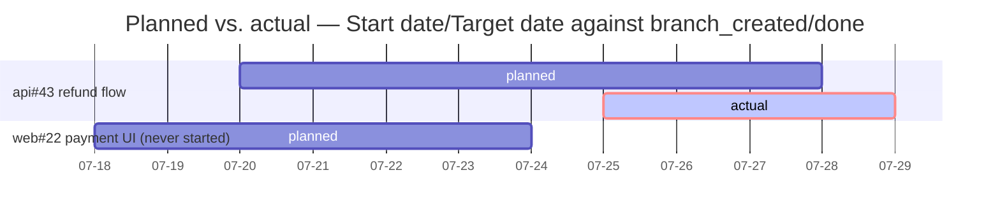
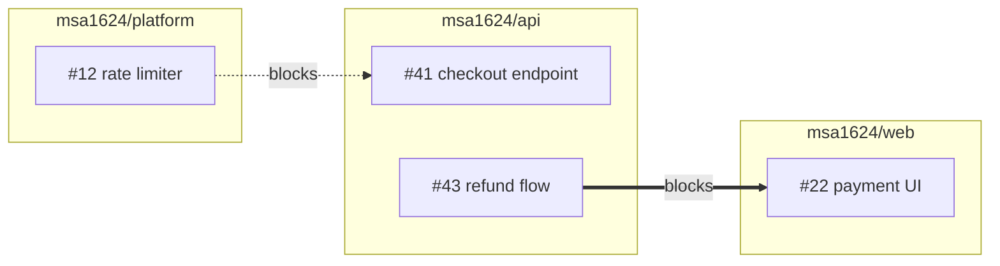

# /snapshot

## Overview

A three-layer, org-scoped, per-developer report: **detail on the repos in scope**, an **org-wide
rollup**, and **who did what**. Each layer joins live GitHub state against timeline history — computed at
report time and cached nowhere.

**Every run produces two documents from one pass.** The **technical report** — three layers, four
joins, the two mermaid diagrams — and a **business report** written for non-technical stakeholders,
rendered from the same computed layers and joins so the two can never disagree. Both are written
locally under `<base>/.claude/snapshots/`, then **committed and pushed together to `reports/` in the
tracking repo in one commit**, where GitHub renders the mermaid. The chat gets a brief summary, both
local paths, and **two permalinks pinned to the commit SHA**. See *The Report Document*.

**This skill publishes.** It is the one part of `/snapshot` that writes something other people can
see, and it does so on every run without asking — that is the configured behaviour, not an oversight.
Everything else it touches, it only reads.

**Announce at start:** "I'm using the snapshot skill to build your report."

**READ *The Substrate* BELOW FIRST.** It holds the paths, bootstrap procedure, cursor schema, and
event format this skill depends on.

**REQUIRED SUB-SKILL:** Use gh-wrapper before running any `gh` command. It routes GitHub access down
a two-rung ladder — a `gh` flag, then `gh api graphql` — and nothing is reported
impossible until both have been walked.

## The Iron Law

```
READ THE RECORD, NEVER WRITE IT. PUBLISH ONLY YOUR OWN REPORT.
STATE COMES LIVE. HISTORY COMES FROM THE TIMELINE.
REPORT WHICH COMPARISON YOU ACTUALLY RAN.
```

The value is entirely in joining the two sources. A degraded join presented as the full analysis is
worse than no join — it looks complete to the person acting on it.

**The law used to read "READ, NEVER AUTHOR," and the change is real.** This skill now commits and
pushes. What did *not* change is the part that mattered: it writes **nothing that anything else
reads as truth**. No timeline event, no issue, no board card, no `views/` file — those are the
record, and they stay closed. `reports/` is its own output, written once, never amended, and read by
nobody but a human.

The test for any new write: **would another run, another skill, or another developer treat this as a
source?** If yes, this skill must not write it.

## Explicitly Invoked Only

This runs when someone asks for it **by name** — `/snapshot`, or "run a snapshot." It does not fire
on conversational phrasing. "Where do things stand?", "what's the status of the payments work?", and
"how's the week looking?" are questions to answer directly, not triggers for a three-layer org
report.

**Don't use for:** opening a work session or triaging what to do next — that's start-work, which is
scoped to open work rather than to a window.

## What It Writes, and What It Never Touches

| Never | Only |
|---|---|
| No timeline events | Its own `<base>/.claude/<org>.snapshot.json` cursor |
| No `views/` regeneration, and no edit to any existing file in the tracking repo | Its own report document under `<base>/.claude/snapshots/` |
| No issue comments, field writes, closures, or labels | Its own **two new** files under `reports/` in the tracking repo — the technical report and the business report — committed and pushed in one commit |
| No board membership adds and no `Status` moves — a stale card is reported, never corrected | |

**`reports/` and `views/` live in the same repo under opposite rules, and confusing them is the
likeliest way to break this design:**

| | `views/` | `reports/` |
|---|---|---|
| Owner | end-work | `/snapshot` |
| Means | **now** — regenerated every run | **then** — one moment, stamped in the filename |
| Live issue state | **Forbidden.** A regenerated "current picture" holding a cached assignee is wrong with no visible symptom | **Expected.** That is the report |
| Rewritten | Every end-work run | **Never.** Written once, then immutable |
| On conflict | Discard and regenerate | **Rebase and retry. Never discard, never regenerate** — see *Publishing* |

A timestamped report is an **archive**, not a cache: nobody reads "as of 2026-08-05T11:42Z" as a
claim about now. A regenerated view carries no such date and is read as current — which is exactly
why it may hold nothing live. **Never "fix" one rule to match the other.**

It **does** clone the tracking repo if missing and pull it before every run — sync is not
authorship, and a report built on a stale clone is wrong.

**But it clones a repo that exists; it never creates one.** Cloning is sync, creating is authorship,
and creating a repo is outward-facing. If `{org}/tracking` does not exist, say so, name start-work as
the way to create it, and run the layers that don't need it — reporting the timeline-dependent joins
as not-run rather than quietly omitting them.

If the report surfaces something that should be fixed, surface it and let the user ask. Fixing it is
a separate request.

## The Substrate

<!-- SUBSTRATE: the five principles, paths, bootstrap, tracks.yml, issue fields, and the event
     format are shared with start-work and end-work — keep in sync. Sections marked (snapshot only)
     are not. -->

### The Five Principles

When a case isn't covered, decide by these.

1. **State vs. event.** *State* is what is true now — status, assignee, blockers — and lives only in
   GitHub, fetched live, never cached. *Events* are what happened, when, by whom, and live only in
   the timeline, never re-derived from GitHub. **A report needing both fetches state live and joins
   history against it** — which is this skill's entire job.
2. **Pointer, not content.** A track's registry entry points at its parent issue plus the few facts
   GitHub cannot express.
3. **Append-only.** Timeline events are written once and never rewritten.
4. **No ranking.** Nothing generated compares people. No durations, ever.
5. **Out-of-band.** The record never lives on a branch of the work it describes.

### Paths

Resolve two things once per run, before touching anything. Every path below follows
deterministically from them. **Nothing records these paths and nothing caches them.**

**1. The base** — the working directory the skill was invoked in, as an **absolute** path (`pwd`).
Resolve it once and reuse that absolute form everywhere.

**2. The layout and the repo set.** The base is one of two shapes, and one command tells you which:

```bash
git -C <base> rev-parse --show-toplevel 2>/dev/null
```

| Result | Layout | Repo set | Current repo |
|---|---|---|---|
| A path | **R** — the base is, or sits inside, an org repo | that one repo | it |
| Nothing | **P** — the base is a parent of org repo clones | every depth-1 child holding a `.git`, mapped to `owner/repo` from its remote | **none** |

**Layout R is the one-element case of layout P, not a separate mode.** Scan one level down, never
recursively. **In layout P every child belongs to the org**; a child whose
owner differs is a violated premise to name, not a case to resolve silently.

This is what Layer 1 is scoped to — see *The Three Layers*.

**3. The org** — in this order, stopping at the first that answers:

| Source | How |
|---|---|
| The current repo's remote *(layout R)* | `git config --get remote.origin.url`, parsed for the owner |
| The repo set's remotes *(layout P)* | the owner they agree on. **They disagree → ask; never pick a majority** |
| A recorded answer | `<base>/.claude/tracking-org`, one line, the org login |
| The developer | Ask once, then **write it to `<base>/.claude/tracking-org`** so no later run asks again |

**A base with no git remote is normal, not an error.** In layout P the base never has one — the org
comes from its children. Falling back to the recorded answer is the designed path, not a degraded one.

| What | Path |
|---|---|
| Tracking clone | `<base>/.claude/.tracking/<org>/` |
| Snapshot cursor | `<base>/.claude/<org>.snapshot.json` |
| Report documents *(local)* | `<base>/.claude/snapshots/<org>-YYYY-MM-DD-HHMM.md` |
| Report documents *(published)* | `<clone>/reports/YYYY-MM/YYYY-MM-DD-HHMM.md` |
| Org record | `<base>/.claude/tracking-org` |

The published path carries no `<org>` prefix — inside `{org}/tracking` the org is the repo. It is
foldered by month like `timeline/`, and **the timestamp is the same one in the local filename and in
`last_checked`**, which is what lets a local copy and a permalink be matched up later.

`<base>/.claude/<org>.status.json` belongs to start-work and end-work. **Never open it** — its boundaries
mean something else, and this skill's window never comes from there.

**The record is per working directory, not per machine.** A snapshot run from a base whose clone is
missing sees an empty timeline — which reads exactly like "nothing happened." It is not the same
thing. If the clone had to be created this run, say so rather than reporting a quiet org.

Writing `tracking-org` is the **one** exception to the write-surface table below: it is local
configuration, not record content, and without it a base with no remote can never run this skill.

### Write surfaces — these four, and nowhere else

| Location | Writes permitted |
|---|---|
| `<base>/.claude/<org>.snapshot.json` | The `last_checked` timestamp. Nothing else in the file. Local. |
| `<base>/.claude/snapshots/<org>-YYYY-MM-DD-HHMM.md` | This run's report document. A new file each run; **never an overwrite of an earlier one**. Local and gitignored. |
| `<base>/.claude/snapshots/<org>-YYYY-MM-DD-HHMM-business.md` | This run's business report. Same stamp as the technical one, same rules: a new file each run, never an overwrite. Local and gitignored. |
| `<clone>/reports/YYYY-MM/YYYY-MM-DD-HHMM.md` | The same report, committed and pushed. **A new file only** — never a modification, rename, or deletion of anything already in the tracking repo, and never a touch to `tracks.yml`, `timeline/`, `status-policy.yml`, or `views/`. |
| `<clone>/reports/YYYY-MM/YYYY-MM-DD-HHMM-business.md` | The same business report, committed in the **same commit** as the technical one. A new file only, under every rule the row above carries. |

No events, no issue comments, no field writes, no labels, no closures. **The one commit this skill
ever makes adds exactly two files** — the technical report and the business report, both under
`reports/YYYY-MM/`, both carrying this run's stamp. If a `git status` in the clone shows a third
path, or a path that is not one of those two, stop and say so: a snapshot run staging anything else
has gone wrong somewhere upstream.

### Bootstrap *(snapshot variant — clones, never creates)*

**B0.** Resolve the base (`pwd`, absolute), then the layout and repo set, then the org — the current
repo's or the children's remotes, then `<base>/.claude/tracking-org`, then ask once and record it.
Then, **in layout R only**, ensure the exclusion lines are in that repo's `.git/info/exclude` —
**`.git/info/exclude`, never `.gitignore`**, which is tracked and would land the exclusion in
someone's commit:

```
.claude/.tracking/
.claude/*.status.json
.claude/*.snapshot.json
.claude/snapshots/
.claude/tracking-org
```

`.claude/snapshots/` matters here more than the rest: it is the one path this skill *creates*, and
an unexcluded report document is a file full of live issue state sitting in the developer's
`git status`. **Ensure the line before writing the first document**, not after. In layout P
`<base>/.claude/` sits in no repo, so there is nothing to exclude and nothing to write into the
children. No path below is computable until the base and org answer.

**B1.** `git -C <base>/.claude/.tracking/<org> rev-parse --git-dir 2>/dev/null`. Present → pull. Missing →
`gh repo view {org}/tracking` (a 404 means it does not exist).

**B2.** Remote exists but no clone → `git clone https://github.com/{org}/tracking.git
<base>/.claude/.tracking/{org}`, and say where.

**Remote does not exist → do NOT offer to create it.** Cloning is sync; creating is authorship, and
this skill does the first only. Report that `{org}` has no tracking repo, name start-work as the way
to create one, and run degraded — see Step 1.

**B3.** `git -C <base>/.claude/.tracking/<org> pull --rebase`, every run. There is no stored sync
timestamp and nothing is conditional on one.

**B4. Write-access preflight — and it never stops the run.**

```bash
gh repo view {org}/tracking --json viewerPermission -q .viewerPermission   # WRITE / MAINTAIN / ADMIN can push
```

Check it **here**, before the expensive research wave, so the answer is known by the time there is
something to publish.

**No access → run in full anyway.** Build the report, write it locally, and say plainly that it
could not be published and why. **This is the one place `/snapshot` deliberately parts company with
end-work**, which refuses to run without push access: end-work's output is *events*, and banking
events nobody will ever see is dishonest, whereas a snapshot report is self-contained and worth
exactly as much on disk as it is on GitHub. A read-only collaborator loses the permalink and nothing
else.

Never treat missing access as a reason to skip the report, and never ask for a permission grant.

### `<org>.snapshot.json`

```json
{ "schema": 1, "org": "msa1624", "last_checked": "2026-07-25T05:26:35Z" }
```

That is the whole file.

### Tracks & threads

```yaml
tracks:
  - id: payments-v2
    parent: msa1624/api#38          # title, owner, dates all live here
    status: active                  # active | paused | done | abandoned
    exit_criteria: "checkout flow live for 100% of traffic"
```

**Four fields, per principle 2.** A track's title, owner, and dates are **not** stored — follow
`parent` and read them live. A track spanning three repos is one entry, which is what the per-repo
table cannot show. A milestone is *not* a track: it is a shipping checkpoint owned by GitHub, and one
track's threads may span several milestones.

### Issue Fields in this org

**Discover at runtime — never hardcode, never recall:**

```bash
gh api /orgs/{org}/issue-fields   # org fields and their valid options
```

At the last check `msa1624` defined exactly these four. **Treat this as the expected result of that
call, not the definition** — if a run discovers a different set, the discovered set wins.

| Field | Type | Valid values |
|---|---|---|
| Priority | single-select | Urgent · High · Medium · Low |
| Effort | single-select | High · Medium · Low |
| Start date | date | `YYYY-MM-DD` — the planned start |
| Target date | date | `YYYY-MM-DD` — the planned finish |

**`Size` and `Estimate` are not defined in this org.** Never report a value for either. Effort is the
only sizing signal, and the sizing join says so in its own label.

**Four** mechanisms sit on the same issue and are read differently: **Issue Fields** (above),
**Milestone** (a native issue field), **Relationships** (the dependencies API), and **Projects v2
board membership** (`issue.projectItems`). **Do not conflate them** — a value read from one and
reported as another is wrong even when it looks right. An issue can carry every field the org
defines and be on no board at all.

**Board membership is worth a Notes line because it fails silently.** Auto-add workflows are usually
scoped to some repos and not others, so issues created outside that scope land nowhere and look
completely normal. Discover the org's projects once, with the fields
(`organization(login:){projectsV2}`, or `user(login:)` on a personal account — projects are **not**
org-only), then report open issues that are on no board. **Report only — this skill never adds one.**

**A stale board `Status` is now a finding, not background noise.** start-work and end-work maintain
`Status` from `status-policy.yml` in the tracking repo, so a card that disagrees with what the
timeline shows — `Backlog` on a thread with `branch_created` weeks ago, `In Progress` on one with a
`done` event — means either a session was never wrapped up or someone moved the card by hand. Read
the policy to know what the moments *should* map to; **never write it, and never move a card.**
Report the disagreement in Notes and let the workday skills fix it on their next run.

### Event timeline *(reading only)*

`timeline/YYYY-MM/<dev>.jsonl` — one JSON object per line. This skill **reads** it and never appends.

| Field | What it tells you |
|---|---|
| `ts` | UTC, ISO 8601, always |
| `session` | the id shared by every event in one sitting — this is what turns a commit list into "what this person was working on" |
| `dev` | the GitHub handle the work is attributed to |
| `event` | `session_start` · `session_resume` · `branch_created` · `progress` · `blocked` · `unblocked` · `done` · `handoff` · `pr_opened` · `session_end` |
| `track` · `thread` · `repo` · `branch` | thread-scoped events only; `thread` is always `owner/repo#N` |
| `title` | on `branch_created`: the thread's title **as of when work began**. Never refreshed, never authoritative |
| `commits` | short SHAs — an entry with none is unverified, and renders that way |
| `blocked_by` | `owner/repo#N` — a dependency **actually hit** while working |
| `pr` · `draft` · `linked` | on `pr_opened`: the PR as `owner/repo#N`, whether it opened as a draft, and whether the closing keyword actually created the linked-issue relationship. **`linked: false` is a finding** — that PR's issue will not close on merge, and nothing on either item shows it |

**`branch_created` fixes a thread's actual start; `done` fixes its actual finish.** Those two are the
only source for the actual side of any join. Planned dates come from the issue, live. **Swapping them
makes the join meaningless.**

**There is no duration or hours field, by design.** Do not compute one.

### Attribution

Attribute from the record only: commit **author** (not committer — they differ after rebases, merges,
and admin pushes), PR author, assignee, reviewer, and the timeline's `dev`. Honour
`Co-authored-by:` — pair and mob work is shared credit, and an agent-authored commit co-authored to a
person attributes to that person. Exclude bots (`dependabot`, `renovate`, `github-actions`, anything
`[bot]`-suffixed).

## Step 0: The Window

**Read the cursor before presenting any options.** Its contents change what you may offer, so this
cannot happen after the user has already picked.

`<base>/.claude/<org>.snapshot.json`:

```json
{ "schema": 1, "org": "msa1624", "last_checked": "2026-07-25T05:26:35Z" }
```

| What you read | What you may offer |
|---|---|
| A valid `last_checked` | "Since last check" — and show *when*, e.g. "Since last check (2026-07-20 14:30 UTC)", so the user can judge whether it's useful |
| Absent or malformed | Say plainly there's no prior check on record. Offer only the other options. |

Then ask which window, unless the request already named one:

1. **Since last check** — only offer when the read succeeded
2. **Past day**
3. **Past week**
4. **Custom** — ask for an explicit start, and optionally an end

Convert relative language ("since Monday", "yesterday") to absolute `YYYY-MM-DD` before building any
query. Never read the window from `<org>.status.json` — that's the workday skills' cursor and its
boundaries mean something else.

At the **end** of every run, whichever window was chosen, overwrite `last_checked` with the current
timestamp.

## The Process

### Step 1: Preflight

Derive org and repo from `git config --get remote.origin.url`. Clone the tracking repo if it exists
but isn't cloned, then `git pull --rebase`. See **_The Substrate_ → Bootstrap**, whose B2
table names `/snapshot` explicitly: it clones, and it never offers to create. **Run the B4
write-access preflight here too** — knowing now whether the report can be published costs one call
and avoids discovering it after the whole research wave has run. A `no` never stops the run.

**If `{org}/tracking` does not exist**, run degraded rather than stopping: Steps 2–4 work against
GitHub alone, and the planned-vs-actual, sizing-vs-actual, and declared-vs-encountered joins each
report *"could not run — no timeline for this org."* Say once, near the top, that the org has no
tracking repo and that start-work will offer to create one.

Read `tracks.yml` and the timeline files covering the window. One `git pull` plus local file reads
gives you every developer, every track, every repo — rather than API calls fanned out across the
org. That cheapness is the whole point of the tracking repo.

**Discover the fields once, here, before dispatching anything:**

```bash
gh api /orgs/{org}/issue-fields   # the fields, their types, and single-select options
```

**This runs exactly once per run and the result is passed to every agent.** No agent discovers
fields for itself. Four agents discovering independently can return four different mappings, and the
report would render them as one schema — wrong with no visible symptom. It also makes "read at call
time, never from memory" checkable from outside: any field name in a payload that isn't in this
result is rejected.

Map what comes back onto the roles in target-workflow §5 — ordering, planned start, planned finish,
sizing. A role with no field is recorded as unfilled here, and every join that needs it will report
itself not-run.

### Step 1.5: Dispatch the Research Wave

**Spawn four `Explore` subagents in one message, in parallel.** All read-only; all receive the single
field discovery above, plus whatever local reads they need — they must not open the tracking clone
themselves. **A fifth agent runs later, after the joins are complete — see *Step 5.5*. It is not part
of this wave and must never be dispatched here**: its entire input is the output of Steps 2–5, so a
Brief 5 launched in parallel would have nothing to read and would go to GitHub to find it.

#### Shared preamble — goes in every brief

```
You are a READ-ONLY research agent. Return findings; never act on them.

NEVER call setIssueFieldValue, addProjectV2ItemById,
updateProjectV2ItemFieldValue, any GraphQL mutation, or gh issue
edit/create/close/comment, gh project item-add/item-edit, or
gh pr create/edit/merge/review. You CAN call these tools; not calling them is the
rule you are being held to. YOU write NOTHING to GitHub — if something seems
to need a write, return it in asks[]. end-work opens PRs; /snapshot never does, and
neither do you.
The skill that dispatched you does publish its own report file to the tracking repo
at the end of the run. That is its write, not yours, and it is not a licence for
any write here. Nothing you can call is on that path.
DO NOT read the timeline, tracks.yml, or status.json. Everything you must compare
against is supplied in your INPUT. Sourcing both sides of a comparison yourself
turns it into a set compared with itself, which looks fine and means nothing.
DO NOT run your own field discovery. The field set is supplied. Several agents discovering
independently can return several mappings, which the report would render as one.

Ladder: gh flag → gh api graphql. Never report something unreachable
without walking both and naming both.
Cross-repo rollups start at rung 2 by ROUTING — one GraphQL query costs 1 point where
the REST equivalent is 18 requests. Say rung_reason "routing".
NEVER read issue_dependencies_summary to decide whether something is blocked.
The fields are blockedBy / blocking on Issue — NOT blockedByIssues.
search_* takes dedicated sort/order params — never `sort:` inside the query string.
list_* cannot span an org; org scope needs search_* with org:{org}.
HTTP 200 can carry an "errors" key. Nulls under errors are FAILURES, not absences.

NO RANKING. Never sort by a count. Never emit a key named rank, score, total,
percentile, top_*, productivity, or velocity. Never write an evaluative word about a
person or their week — not "light", "heavy", "slow", "quiet", "impressive".
Attribute from the record only: commit author (never committer), PR author, assignee,
reviewer. Never infer from a title, a file path, or who usually works where.

Every reference is owner/repo#N. Return exactly one fenced json block as your LAST
message, in this envelope:
{ "agent","status":"ok|partial|failed","rung","rung_reason","covered":[],
  "not_covered":[],"surface_log":[{"call","rung","class":"read","ok"}],
  "asks":[],"unavailable":[],"data":{} }
covered/not_covered are MANDATORY. A repo you could not read is NOT a repo with no
activity — it goes in not_covered.
```

#### Brief 1 — repo detail and org rollup *(Steps 2–3)*

> **INPUT you supply:** `repos_in_scope[]` (the repo set — one entry in layout R, N in layout P),
> window, `fields[]`, and `tracks[]` + `track_threads{}` read from `tracks.yml` and the timeline.
>
> Follow each track's `parent` and read its title, owner, and dates **live** — that is what keeps
> "pointer, not content" true across the boundary. Never echo back a stored copy of live state.
>
> **`data`:** `repo_detail[]` — one entry **per repo in scope**,
> `{repo, counts{shipped, in_progress, backlog_untouched}, rows[]}`, where each
> row is `{ref, kind, title, who, status, fields[], url}`; `org_rollup[]` —
> `{repo, shipped, in_progress, contributors[], activity}`; `track_rollup[]` —
> `{track, parent, parent_title, parent_owner, parent_fields[], threads{total,done,active,blocked},
> repos_spanned[], registry_status}`.
>
> **`who: null` when unassigned — never a guess.** `fields[].value: null` means the item lacks that
> field, which is a finding, not a row to omit. `activity` is `active`/`quiet`/`none` and describes
> **volume, not people**. `backlog_untouched` is a count only — never enumerate it.

#### Brief 2 — who did what *(Step 4)*

> **INPUT you supply:** window, repo list, and `timeline_activity{}` per dev (sessions, threads,
> tracks) read from the timeline.
>
> Run your own org-scoped PR search rather than waiting on Brief 1 — one extra cheap search buys a
> fully parallel wave. Echo `timeline_activity`'s counts; never recompute them.
>
> **`data`:** `people{}` — **a map keyed by handle, emitted in alphabetical order, never an array**,
> each `{prs_authored[], prs_reviewed[], commits[], issues_assigned[], issues_closed[], themes[],
> timeline_sessions, timeline_tracks[]}`. Plus `bots_excluded[]`, `identity_questions[]`,
> `unattributed[]`.
>
> **This is a contribution record, not a scoreboard.** The map shape exists so there is no ordering a
> renderer could mistake for a leaderboard. `themes` is **at most five noun phrases lifted from
> commit messages** — describe the work, never the worker. One person with several handles goes in
> `identity_questions` with `phrased_as_question` filled in, **never silently merged**. A commit whose
> author isn't on the record stays in `unattributed`. The handle is the identifier: don't guess a real
> name from it, and don't guess pronouns — write "they."

#### Brief 3 — planned vs. actual, and sizing vs. actual

> **INPUT you supply:** `roles{planned_start, planned_finish, sizing}`, `fields[]`, threads, and
> `actuals[]` built **only** from `branch_created` and `done` events —
> `{thread, first_branch_created, done, latest_event, session_count, event_count, has_commit_shas}`.
>
> **One source per side, and they are not interchangeable.** Planned dates and sizing come from a
> **live issue fetch**; actuals come from `actuals[]`. Building planned dates from the timeline, or
> actuals from the issue, makes the whole join meaningless.
>
> **A `null` role means that join does not run.** You have no other date field to reach for and no way
> to invent one — return `ran: false` with a `reason` and a `phrase`, and `substituted: false`.
>
> **`data`:** `join_planned_vs_actual{ran, planned_source, actual_source, rows[], skipped[]}` with
> `verdict` from the closed enum `on_plan` · `started_late` · `started_early` · `ran_long` ·
> `finished_early` · `planned_never_started` · `no_planned_dates` · `no_actuals`; and
> `join_sizing_vs_actual{ran, comparison_label, caveat, rows[], cross_person_comparison}`.
>
> **`comparison_label` is required and must name the fields actually passed in** — "Effort against
> sessions the timeline shows", never "estimate vs. actual". Presenting one signal as two is the
> failure this join is most prone to. **`cross_person_comparison: false` is a required literal.**
> "Planned but never started" — dates on the issue, no `branch_created` — is one of the most useful
> things you produce; always report it.

#### Brief 4 — declared vs. encountered dependencies

> **INPUT you supply:** threads, and `encountered[]` built **only** from timeline `blocked_by` events.
>
> `encountered` is ground truth about what a session hit. You cannot verify it and must not try.
>
> **`data`:** `declared[]`, `prose_hints[]`, `diff{hit_not_declared[], declared_not_hit[]}`,
> `ready_now[]`, `still_blocked[]`.
>
> **Both directions of disagreement matter**: a dependency hit in practice but never declared, and a
> declared relationship no session ever ran into. Never infer a dependency from a shared label, a
> shared milestone, a similar title, or two issues touching the same file.
>
> **The prohibition is absolute here, and stays absolute even though start-work now searches.** Both
> sides of this join are sets someone committed to — declared on the issue, or encountered by a
> session. A search candidate is neither. Admitting one would make the diff report a disagreement
> that never existed, which reads exactly like a real finding. **`/snapshot` runs no candidate
> scan**: that surface belongs to start-work, at creation, where a developer is present to see what
> was found and drop it in four words.

#### The return gate — run before rendering a line

| Gate | On failure |
|---|---|
| **Envelope** parses and carries every required field | Treat as no-return. **Never scrape values out of prose.** |
| **Write-class** — every `surface_log[].class == "read"`, no `call` matching `setIssueFieldValue`, `addProjectV2ItemById`, `updateProjectV2ItemFieldValue`, `^mutation`, `gh issue (edit\|create\|close\|comment)`, `gh project item-(add\|edit)`, `gh pr (create\|edit\|merge\|review)`, `gh api --method (POST\|PATCH\|PUT\|DELETE)` | **Discard the whole payload** and say a read-only agent attempted a write. The skill publishing its own report file changes nothing here — no agent has any write surface at all, and one reaching for the record is the loudest possible finding. |
| **No ranking** — `people` keys alphabetical; no `rank`/`score`/`total`/`percentile`/`top_*`/`velocity` key; nothing sorted by a count; `themes` free of evaluative words | **Drop the layer.** Say the contribution layer could not be rendered safely. |
| **Comparison label** names the roles you actually passed in | Reject the join; print it as not-run. |
| **Discovery** — every field name is in this run's org `issueFields` list | Drop it; report that field unset, naming it. |
| **Existence** — every `owner/repo#N` resolves | Drop the ref. If it was load-bearing — one side of a dependency edge, a track's parent — **the containing join reports itself not-run** rather than rendering with a hole. `data: null` with an `errors` block at HTTP 200 is a permissions failure, **not** a hallucination. |
| **Ladder honesty** — unreachability claims backed by **both** rungs | Unproven. **Re-walk the ladder yourself.** |
| **Coverage** — `not_covered[]` printed | Never omit it. |

**Agents return rows; you render them.** That is what keeps principle 4 enforceable — you cannot
reliably strip editorializing out of a paragraph after the fact, but you can refuse to accept
anything that isn't structured.

**You write the "which comparison I ran" line, never the agent.** An agent that ran a partial join is
the worst-placed thing in the system to describe how partial it was. Build it from the union of every
brief's `covered` / `not_covered`, and print `phrase` verbatim for any join that came back
`ran: false`.

**If a brief fails**, retry once narrowed, then run that layer's inline procedure below yourself and
say which layer ran degraded. Steps 2–5 remain both the specification and the fallback.

### Step 2: Detail on the Repos in Scope

*(Delegated to Brief 1. This section is what it returns, and your fallback if it doesn't.)*

**"In scope" is the repo set** — the current repo in layout R, every child clone in layout P. Layer 1
is the close-up layer, and what it is close to is where the developer opened Claude: one repo when
they're standing in one, their whole workspace when they're standing above it.

**In layout P, render one detail section per repo, never a merged one.** Merging them produces a
layer indistinguishable from the org rollup below it, and the two layers stop earning their
separation. **Name the repo set in the report** — "3 repos in scope: api, web, platform" — so a
missing clone reads as missing rather than as a repo with nothing happening.

Scoped to each repo in the set, for the window:

```bash
gh issue list -R {owner}/{repo} --state all --json number,updatedAt,...   # filter updatedAt against the window
gh pr    list -R {owner}/{repo} --state all --json number,updatedAt,...   # same
gh search issues --repo {owner}/{repo} --state closed --closed ">={window}"
gh search prs    --repo {owner}/{repo} --merged --merged-at ">={window}"
```

Field values come from the **single discovery in Step 1**, passed down — never a second
discovery call and never a remembered list of names.

Then for each in-window item, `gh issue view N --json` / `gh pr view N --json` for title, labels, **the discovered
field values**, linked issues, and **the people on it** — PR author, issue assignees, PR reviewers.

Three mechanisms sit on the same issue and are read differently: **Issue Fields** (discovered
above), **Milestone** (a native issue field), and **Relationships** (the dependencies API). Do not
conflate them — a value read from one and reported as another is wrong even when it looks right.

Three groups: **shipped this window**, **in progress**, and **untouched backlog** (a count, not
detail). Every row carries a **Who** column — PR author, or issue assignee. No assignee is `—`,
never a guess.

### Step 3: Org Rollup

*(Delegated to Brief 1, in the same call as Step 2.)*

```bash
gh search issues --owner {org} --updated ">={window}" --sort updated --order desc
gh search prs    --owner {org} --updated ">={window}" --sort updated --order desc
```

Group by repo: shipped, in progress, contributors, activity level. Then group by **track**, joining
`tracks.yml` against the timeline — a track spanning three repos is one row, which the per-repo
table cannot show. Follow each track's `parent` and read its title, owner, and dates **live**.

Milestone is available on every issue and is the natural grouping for a release-shaped report, which
cuts across tracks rather than following them. Offer it when the user asks about a release.

### Step 4: Who Did What

*(Delegated to Brief 2, which runs its own PR search rather than waiting on
Brief 1 — one extra cheap search buys a fully parallel wave.)*

Build from the PRs gathered in Steps 2–3:

```bash
gh pr view N -R {owner}/{repo} --json commits
gh api "/repos/{owner}/{repo}/commits?since={start}&until={end}"   # commits that landed outside a PR
```

Both paginate — request 5–10 at a time and stop once the window is covered. Cross-reference against
the timeline: the events show which sessions touched which threads, which is what turns a commit
list into "what this person was actually working on."

**Aggregate per person:** PRs authored and which merged; commits and the themes they touch (read the
messages, don't just count); issues assigned and closed; PRs reviewed.

**Attribution rules — these matter more than the numbers:**

- Attribute from the record only: commit author, PR author, assignee, reviewer, and the timeline's
  `dev`. Never infer who "probably" did something from a title, a file path, or a code style.
- A commit's **author** wrote it; the **committer** may be someone else entirely (rebases, merges,
  admin pushes). Report the author. Honor `Co-authored-by:` trailers — pair and mob work is shared
  credit. An agent-authored commit co-authored to a person attributes to that person.
- One person can appear under several identities. If two are plainly the same person, say so as a
  **question** in Notes rather than silently merging them.
- Exclude bots (`dependabot`, `renovate`, `github-actions`, anything `[bot]`-suffixed). Note their
  volume separately if it's material.
- Use the GitHub handle as the identifier. A handle is not a name — don't guess a real name, and
  don't guess pronouns; write "they."

**This is a contribution record, not a scoreboard.** Report what each person worked on. Do not rank
developers, compute productivity metrics, editorialize about output ("light week for X"), or draw
performance conclusions — commit and PR counts measure none of that, and a PM reading a ranked list
will act on it as if they did. If the user explicitly asks for a ranking, give the counts and say
plainly what they do and don't measure.

### Step 5: The Four Joins

This is what neither source can produce alone, and what `/snapshot` exists for.

*(Joins 1–2 are delegated to Brief 3, join 3 to Brief 4.
Join 4 stays here — delegating a `git pull` plus local file reads would cost more than it saves.)*

**You write the "which comparison I ran" line, not the agent.** An agent that ran a partial join is
the worst-placed thing in the system to describe how partial it was. Build that line from the union
of every agent's `covered` / `not_covered`, and print `phrase` verbatim for any join that came back
`ran: false`.

#### Planned vs. actual

| Side | Source |
|---|---|
| Planned | The planned-start and planned-finish fields — `Start date` / `Target date` in this org — **fetched live** from the issue |
| Actual | The timeline — `branch_created` for the real start, `done` for the real finish, latest event for still-open work |

The committed Gantt charts actuals only, precisely so the planned side is never cached. Report
started-late, ran-long, finished-early, and **planned but never started** (an issue with dates and
no `branch_created`).

If either role has no field in this org, say the join could not run rather than substituting a
different date.

#### Sizing vs. actual

This org defines **Effort** but no Estimate or Size field
(see *The Substrate* → Issue Fields in this org).
So the comparison available is the sizing field against **what the timeline shows the work actually
took** — sessions, elapsed days, event count. Report the mismatches: a Low-effort thread spanning
two weeks of sessions, a High-effort thread closed in one.

**Name the comparison you ran.** Write "Effort vs. sessions the timeline shows", not "estimate vs.
actual" — the report must not imply an estimate that was never recorded. One signal is one signal;
presenting it as two is the failure this join is most prone to.

This is how estimates get calibrated. It is **never** compared across people.

#### Declared vs. encountered dependencies

| Side | Source |
|---|---|
| Declared | Live issue state — the Relationships dependencies API, plus `#N` references and "blocks"/"depends on"/"relates to" prose in bodies and comments |
| Encountered | The timeline's `blocked_by` — what a session actually ran into |

**Both directions of disagreement are worth surfacing:**
- A dependency hit in practice but never declared on the issue
- A declared relationship no session ever ran into

This is the only view that can show them disagreeing — `views/dependencies.md` is built from the
encountered side alone, **by design**. The declared side is readable and writable (rung 1); it is
excluded from the committed view because the timeline owns what a session actually hit, not because
the Relationship could not be reached.

Read the dependency list endpoint, never `issue_dependencies_summary` — the counter lags a write by
about a second and reads as "no dependencies" when there are some. See gh-wrapper's Read-After-Write
Trap.

#### The complete org rollup, cheaply

One `git pull` plus local file reads covers every developer, track, and repo. Say what the timeline
covers: a repo with no timeline events isn't inactive, it's untracked, and those are different.

### Step 5.5: Brief 5 — the Business Framing

*(The business report's interpretation layer. One agent, dispatched alone, after every join above has
returned and passed its gate.)*

**It works from the computed pass and never from GitHub.** Its brief carries the finished layers,
joins, threads, and verdicts. It performs no `gh` call, no field discovery, and no lookup of any
kind. That is what makes the two documents incapable of disagreeing: they describe one moment,
computed once. An agent that fetched its own numbers would read GitHub at a different instant, and
the business report could then state a figure the technical report contradicts — with nothing in the
run able to detect it.

**Give it the shared preamble** from Step 1.5, unchanged, plus the brief below.

> **INPUT you supply:** `tracks[]` with each track's parent, owner, and live dates;
> `join_planned_vs_actual{rows[], skipped[], ran}`; `join_sizing_vs_actual{ran, phrase}`;
> Brief 4's `diff{hit_not_declared[], declared_not_hit[]}` and `still_blocked[]`;
> Brief 1's `repo_detail[]` rows and `track_rollup[]`; the window; and the union of every brief's
> `covered[]` / `not_covered[]`.
>
> **You make no GitHub call of any kind.** Not a read, not a search, not a `gh api graphql` query.
> Everything you need is above. If something appears to be missing, it is missing from the run — say
> so in `not_covered[]` and return. `surface_log` should come back empty, and an empty one is the
> expected result rather than a sign you did too little.
>
> Your job is interpretation, not retrieval: group threads into **themes** a non-engineer would
> recognize, call each track's **verdict**, and name the items that **need a decision** from someone
> outside the team.
>
> **`data`:**
>
> ```json
> { "themes":    [{"headline": "...", "items": ["msa1624/api#43"], "evidence": "..."}],
>   "verdicts":  [{"track": "payments-v2", "verdict": "at_risk", "owner": "@nilendu",
>                  "observation": "planned 2026-07-18, no branch_created"}],
>   "decisions": [{"item": "msa1624/web#22", "why": "...", "who": "@priya|null"}],
>   "not_covered": [] }
> ```
>
> `verdict` is the closed enum `on_track` · `at_risk` · `blocked` · `not_started`. **Every verdict
> carries an `observation` that cites something outside itself** — a planned date against a missing
> `branch_created`, a `still_blocked` entry, an absent assignee. "At risk because it is risky"
> restates the verdict and is the failure this field exists to prevent.
>
> `headline` is a plain-language noun phrase a non-engineer would recognize — "refund handling now
> works end to end", never "merged #47 into the charge path". `evidence` names which supplied row it
> came from. `items[]` are `owner/repo#N` refs **taken from your input**; you cannot introduce one.
>
> `decisions[]` holds only what someone outside the team must act on: blocked on an external party,
> planned and never started, slipped past its Target date, or open with no owner. `who: null` means
> unowned, which is itself the decision — never guess a name to fill it.
>
> **No numbers you were not given.** No percent-complete, no forecast date unless that exact date
> was supplied as a Target date, no confidence score, no duration, no count you computed yourself.
>
> **Write about work, never about people.** An owner is a routing label attached to a track or a
> decision. There is no per-person section here, no contribution list, and no count of anyone's
> output — that layer exists in the technical report and does not cross over.

#### The return gate — Brief 5

The Step 1.5 gate applies in full. These are additional, and each **discards the whole payload**:

| Gate | Why |
|---|---|
| `surface_log` is non-empty — **any** call, read-class included | This agent had no reason to reach GitHub at all. A read here means it went looking for numbers instead of using the ones it was given, and the two documents can now disagree |
| Any `owner/repo#N` in `themes[].items`, `verdicts[].track`, or `decisions[].item` that was not in the brief | It came from somewhere, and the only somewhere available is invention |
| A `verdict` outside the four-value enum, or a verdict with a missing or empty `observation` | An unsourced verdict is the business-report form of a guessed field value |
| An `observation` that restates its verdict without citing a supplied row | The rationale was composed after the value was chosen — the exact failure *Established vs. guessed* exists to catch |
| Any percentage, duration, ranking, score, or a number absent from the input | Invented certainty. A stakeholder cannot tell a computed figure from a plausible one |
| Any per-person key, contribution list, or count of a person's output | Principle 4, in the artifact most likely to be read as a performance signal |

**On a discarded payload: do not retry, and do not write the business report yourself.**

This is a **deliberate exception** to the rule at the end of Step 1.5, where a failed brief is
retried once and then run inline as a fallback. It does not apply here, and the reason is specific:
Steps 2–5 are both specification and fallback because their output is *rows* — you can produce the
same rows yourself and the reader cannot tell the difference, because there is none. Brief 5's
output is *interpretation*, and a skill that composes the interpretation after rejecting the agent's
has removed the only check on it. The technical report publishes as normal, no business document is
written, and the chat says so with the reason.

### Step 6: Write, Publish, Summarize, Then Write the Cursor

In this order, and the order is the failure design:

1. **Ensure `.claude/snapshots/` is excluded** (layout R) and the directory exists.
2. **Write the technical document locally** — every layer, every join, both diagrams.
3. **Write the business document locally** — same stamp, `-business.md`. Skip only if Brief 5's
   payload was discarded; the run continues either way.
4. **Publish** — copy both into `<clone>/reports/YYYY-MM/`, verify **exactly the expected paths are
   staged**, commit once, push, and capture the SHA. Skip if B4 found no write access or the tracking
   repo does not exist. On rejection: `pull --rebase`, push once more, then give up gracefully. See
   *Publishing*.
5. **Print the chat summary** — both permalinks first, then headline counts, the "which comparison I
   ran" line, the findings worth acting on, and the local paths. Not the whole report.
6. **Overwrite `last_checked`** with this run's timestamp — the same one in every filename.

**Every failure degrades one step and stops:**

| What failed | What still happens |
|---|---|
| The push | Local copy stands. Summary says it is unpublished, and why. Cursor still written |
| No write access, or no tracking repo | Same, minus the attempt. Never a reason to skip the report |
| The local write | Say so and **print the full report in chat**. A failed write must never silently downgrade the run to a summary of a report nobody can read |
| Brief 5, or its return gate | The technical report is written and published exactly as normal. **No business document is written, and none is composed by hand.** The chat names the reason. Everything else about the run is unaffected |
| The business document's local write | Say so. The technical report still publishes; publish nothing under `-business.md` that was never written locally |

The cursor is written last and is written **whatever happened above** — the run occurred, and the
next "since last check" window must start from it.

## Identifying Items

In **tables**, a bare `#N` is fine — the row carries the title.

In the **dependency and planned-vs-actual sections**, which are read by someone skimming rather than
cross-referencing, identify each item by its **title, rendered as a markdown link**:

- Link text is the title: `[Fix auth bug in login flow](https://github.com/owner/repo/issues/2)`
- Phrase relationships plainly: "X is blocked by Y (still open)"
- Append a bare `#N` in parentheses only as a lookup aid, never as the primary identifier
- Put `owner/repo` disambiguation in the URL you're building anyway, not in the visible text

Someone should understand each bullet on one read, without opening GitHub.

## The Report Document

### Where it goes

Two copies of one byte-identical document:

```
<base>/.claude/snapshots/<org>-YYYY-MM-DD-HHMM.md               local, gitignored, written first
<base>/.claude/snapshots/<org>-YYYY-MM-DD-HHMM-business.md      local, gitignored
<clone>/reports/YYYY-MM/YYYY-MM-DD-HHMM.md                      committed and pushed
<clone>/reports/YYYY-MM/YYYY-MM-DD-HHMM-business.md             committed in the same commit
```

UTC, **the same timestamp in all four filenames and in `last_checked`**, so the local copies, the
permalinks, and the cursor all point at one run. Two new files per run in each place. Never overwrite
an earlier document — they accumulate, nothing prunes them, and this skill deletes none of them.

**Local first, always, and not as a formality.** The local write is what makes the run survive a
push failure, a missing tracking repo, or no write access. A run that publishes but never wrote
locally has no fallback when the push is rejected.

**The document is output, not a record**, and publishing does not change that:

| It is | It is not |
|---|---|
| Derived — every line recomputed from live GitHub plus the timeline | A source anything reads back. **No skill ever parses one**, including this one on its next run |
| Point-in-time, stamped, correct only as of its timestamp — an **archive** | A cache. A day-old document describes a day-old org and is not evidence of anything now |
| Committed once, then immutable | A file to amend, regenerate, or correct later. A wrong report is superseded by the next run, never edited |
| Shared, and permanently linkable | Private. It names people and what they worked on — see *What publishing means* |

Open it with a header saying exactly that:

```
<!-- Generated by /snapshot at 2026-08-05T11:42:03Z. Point-in-time output, not a record.
     Nothing reads this back. Safe to delete.
     Diagrams are mermaid. If your viewer shows the source, nothing is missing —
     every finding is also written out beneath its diagram. -->
```

### The business document

The same run, the same data, a different reader. A stakeholder needs a link they can forward without
the per-repo issue tables attached — which is why this is a second file rather than a section at the
top of the first one.

**Everything the *It is / It is not* table above says applies here unchanged.** Derived,
point-in-time, written once, never amended, read back by nothing.

Open it with the same header, plus the line naming its counterpart:

```
<!-- Generated by /snapshot at 2026-08-08T14:42:11Z. Point-in-time output, not a record.
     Business summary. The full technical report for this run is
     reports/2026-08/2026-08-08-1442.md — same moment, same data. -->
```

**Four sections, in this order.**

**1. Where things stand.** One line per track — verdict, owner, and the observation behind the
verdict. Then the **planned-vs-actual gantt, reused unchanged** from the technical report: the same
fenced mermaid block, bound to `join_planned_vs_actual`, under every rule *The two diagrams* already
carries. If that join reported `ran: false` there is **no chart here either** — print its `phrase`
verbatim, exactly as the technical report does. The omitted-thread caption sits outside the fence,
and every finding the chart shows appears in the prose beneath it, because this document is read in
email and in pagers at least as often as on GitHub.

**2. What landed this window.** `themes[]`, rendered as plain-language bullets, each item linked by
title per *Identifying Items*. No commit counts. No per-person breakdown.

**3. Needs a decision.** `decisions[]`. If it is empty, say so in a line — an absent section reads as
an oversight rather than as good news.

**4. What this doesn't cover.** Not-run joins with their `phrase` printed verbatim, `not_covered[]`
repos, and repos with no timeline coverage — untracked, not inactive. **The honesty rule does not
relax because the audience changed.** It binds harder: this reader has no way to tell a thin report
from a complete one, and no instinct to go check.

#### Two prohibitions specific to this document

These sit on top of principle 4, which already forbids rankings, scores, and durations everywhere.

**No per-person section, no counts, no durations.** Owners are named on tracks and on decision items
so a reader knows who to ask. "Who Did What" stays in the technical report only. A business-facing
per-person contribution list is the single most likely thing in this system to be read as a
productivity comparison — and it is permanent and linkable.

**No invented certainty.** No percent-complete, no forecast date unless that date is a Target date on
the issue, no confidence score. A verdict of *at risk* names the observation behind it — "planned
2026-07-18, no branch cut yet" — and never restates itself. This is the same sourced-then-shown rule
the rest of the system applies to field values, and it fails the same way: a plausible value with a
rationale composed afterwards to justify it. The audience is what makes it dangerous here. An
engineer reading "at risk" opens the issue; a stakeholder acts on it.

### Live titles are correct here — unlike in `views/`

`views/gantt.md` and `views/dependencies.md` label their nodes from the `title` captured on
`branch_created`, never a live lookup, because those files are **regenerated to mean "now"** and a
live title baked into a current-picture file is a cache that silently goes stale.

**The snapshot document is stamped and never rewritten, so it uses live titles** — which is the
whole reason it can render joins the committed views cannot. Both now sit in the same repo; the
difference is not local-vs-committed but **dated-vs-current**. Do not "correct" one to match the
other.

### Publishing

After the local write, and only if the write-access preflight (B4) said yes:

```bash
mkdir -p <clone>/reports/YYYY-MM
# copy both documents in, byte-identical to the local ones
git -C <clone> add reports/YYYY-MM/YYYY-MM-DD-HHMM.md reports/YYYY-MM/YYYY-MM-DD-HHMM-business.md
git -C <clone> status --porcelain          # MUST show exactly these paths, added, and nothing else
git -C <clone> commit -m "snapshot: {window description} ({YYYY-MM-DD HHMM}Z)"
git -C <clone> push
git -C <clone> rev-parse HEAD              # the SHA both permalinks pin to
```

**Check `status --porcelain` before committing, every time.** The only acceptable result is **added
paths, all under `reports/YYYY-MM/`, all carrying this run's stamp, and no others** — two of them
normally, one when Brief 5's payload was discarded and no business document exists. Anything else — a
modified `views/` file, a stray `tracks.yml` edit, a rebase leftover, a report from another run —
means something else touched the clone, and committing it would make `/snapshot` the author of a
change it never intended. Stop, report what was staged, and publish nothing.

**Count the paths against what you wrote, not against the number two.** A run that discarded Brief 5
stages one file legitimately; a run that stages two when only one was written is staging something
that is not this run's output.

**Build both permalinks from the same SHA, never from the branch:**

```
https://github.com/{org}/tracking/blob/{full-sha}/reports/{YYYY-MM}/{YYYY-MM-DD-HHMM}.md
https://github.com/{org}/tracking/blob/{full-sha}/reports/{YYYY-MM}/{YYYY-MM-DD-HHMM}-business.md
```

One commit, one SHA, two links. Two SHAs would mean two commits, which would mean the documents
describe the same moment but landed as separate events in the repo's history.

**On a rejected push — rebase and retry. Never discard, never regenerate.** Report filenames are
unique per run, so there is no content conflict to resolve: `git -C <clone> pull --rebase` then push
again, once. This is the **opposite** of end-work's rule for `views/`, and the difference is not
arbitrary — a view is derivable, so regenerating it is always correct, whereas a report describes a
moment that has already passed. Regenerating it would silently produce a *different* report under
the same filename.

**If the push still fails**, keep the local copy, say the report exists locally and could not be
published, and give the reason. Never retry in a loop, never force, and never `--force-with-lease`.

**If `{org}/tracking` does not exist**, there is nothing to publish to. Report locally and name
start-work as the way to create the repo — creating one is authorship and outward-facing, and this
skill still never does it.

### What publishing means

Every run now puts a permanent, linkable, per-person record of a work window into a shared repo.
That is the intended behaviour, and it deserves to be stated rather than discovered:

- **"Who Did What" is durable now.** A local file evaporated; a commit does not. Someone can link to
  what a named person did in a given week, forever.
- **Principle 4 therefore binds harder, not softer.** No ranking, no scoring, no durations, no
  evaluative word about a person or their week — the guardrails do not relax because the artifact
  became shareable. If anything is borderline, leave it out.
- **The audience is everyone with repo access**, not just the person who ran it. Write it that way.
- **A report is never edited to soften it.** It is superseded by the next run, or the commit is
  reverted by a human who decides it should not be there. `/snapshot` does neither.

### Rendering — GitHub does it, and the prose still stands alone

**This skill has no mermaid dependency and never invokes one.** It writes fenced ```` ```mermaid ````
text; rendering is the reader's surface, and the skill neither installs, probes, nor checks for a
renderer. Nothing to set up on any machine.

**Publishing is what makes the diagrams reliably visible** — GitHub renders mermaid in markdown, so
the permalink is a rendered report for anyone with repo access and no local tooling at all. That is
the reason publishing exists, so **lead the chat summary with the permalink**, not the local path.

**But the prose invariant does not relax.** The local copy is read in whatever the developer has,
raw files get opened in pagers, and a failed push leaves the local copy as the only copy:

| Surface | What the reader gets |
|---|---|
| The GitHub permalink | A rendered diagram — the reason this is published |
| Obsidian, GitHub-flavoured previewers, most modern IDE markdown plugins | A rendered diagram |
| VS Code's built-in preview | Source, unless a mermaid extension is installed |
| `cat`, `bat`, `less`, `glow`, any terminal pager | Source |
| Claude, asked to read the file | Source, read perfectly well |

**So the diagrams are additive, never load-bearing — and this is a hard rule:**

> **Every finding a diagram shows must also appear in the prose beneath it.**

The gantt sits above the planned-vs-actual bullets; the graph sits above the hit-but-never-declared
and declared-but-never-hit lists. A reader whose viewer shows raw mermaid loses the *shape* of the
finding and none of the finding itself. Captions — the omitted-thread count, the edge-shape legend —
go **outside** the fence for the same reason: they are the part that must survive unrendered.

A finding that exists only as a node, an edge, or a bar is invisible to a reader with a pager, and
that reader has no way to know they missed it.

### The two diagrams

Both are **mermaid**, and both exist because they show something no table and no committed view can.
Each is bound to a join: **if the join reported `ran: false`, there is no diagram** — print its
`phrase` verbatim in place of the block. A diagram drawn past a join that did not run is the most
convincing way this skill could lie.

#### Diagram 1 — planned vs. actual *(from `join_planned_vs_actual`)*

`views/gantt.md` charts **actuals only**, because it is regenerated to mean "now" and a planned date
baked into a current-picture file is a cache. This document is dated, so it is where both sides
appear on one axis — which is the point of the join. Both files now sit in the same repo; only one
of them carries a timestamp, and that is what licenses the difference.

- **One `section` per thread**, labelled with the repo shortname, `#N`, and the title — `api#43
  refund flow`. The full `owner/repo#N` lives in the prose bullets under the chart, which is where
  someone cross-references from.
- **Two bars per thread**: `planned` from the planned-start / planned-finish fields, fetched live;
  `actual` from `branch_created` and `done`. **Never build one side from the other's source.**
- Task ids follow the established shortname convention — `p_api43` for planned, `a_api43` for
  actual — which keeps them mermaid-safe.
- Bar tags: planned is untagged; actual is `active` while the thread is open, `done` once it has a
  `done` event, and takes `crit` as well when the verdict is `started_late` or `ran_long`.
- **Planned but never started** — dates on the issue, no `branch_created` — is a planned bar with no
  actual bar and ` (never started)` on the section label. It is one of the most useful things this
  join produces; never drop it for being half-empty.
- A zero-width bar gets a `1d` duration, matching `views/gantt.md`.
- **Day granularity, and no durations, ever** (principle 4). The chart places work on an axis; it
  does not measure how long anyone took.
- **Issue titles appear only in section labels, never on a task line** — the task name is always the
  literal word `planned` or `actual`. That is what makes arbitrary titles safe here: a task line is
  colon-delimited, and a title carrying a colon lands in the parser's data segment. Section labels
  run to end of line and take colons, parentheses, and `#` without escaping.
- **Insert the title raw. Do NOT escape `<` or `>` here** — gantt renders section labels as plain
  SVG text, which escapes them for you. Pre-escaping shows the reader a literal `&lt;script&gt;`.
  **This is the exact opposite of Diagram 2's rule**, and the two are easy to "harmonize" wrongly.
- Threads the join `skipped[]`, or that came back `no_planned_dates` / `no_actuals`, are **omitted
  from the chart and named in a caption underneath with the count and the reason**. A chart that
  quietly drops half the threads reads as a complete picture of all of them.

````

````

*Charted: 2 of 5 threads. Omitted: 3 with no planned dates (api#51, api#52, web#9).*

#### Diagram 2 — declared vs. encountered dependencies *(from Brief 4)*

`views/dependencies.md` is built from the **encountered** side alone, by design. This is the only
place both sides appear on one graph, and the only place they can be seen disagreeing.

- Group nodes into a `subgraph` per repo; node ids are repo shortname plus number (`api41`).
- Node labels: `#N title`, live, and **always double-quoted** — `api41["#41 checkout endpoint"]`.
  This is not style. An unquoted label containing parentheses or brackets is a **parse error**, and
  issue titles carry them routinely (`payment UI (v2)`), so the quotes are what stop one ordinary
  title from taking the whole graph down.
- **Quoting is not enough. Escape `<` as `&lt;` and `>` as `&gt;` in the title.** Flowchart labels
  are rendered as **HTML**, so a tag-like run is *silently deleted*: `"#41 Fix <script> handling"`
  renders as **`#41 Fix handling`**. It parses cleanly and nothing warns you — the reader sees a
  shorter title and cannot tell anything is missing. Titles carry `<T>`, `<script>`, and `<div>`
  often enough that this is a live hazard, not a hypothetical. **Do not apply this escaping to the
  gantt's section labels**, where it would show as literal entity text.
- **Direction is blocker → blocked**, the same convention `views/dependencies.md` uses: for a thread
  `T` blocked by `B`, the edge runs `B --> T` and is labelled `|blocks|`. Reversing it inverts every
  reading of the graph and looks completely normal.
- **Edge shape carries the join, and there are exactly three:**

| Shape | Meaning |
|---|---|
| `-->` | Declared **and** encountered — the two sources agree |
| `==>` | Encountered but never declared — a session hit it, nothing on either issue says so |
| `-.->` | Declared but never encountered — recorded on the issue, no session ever ran into it |

- Put the legend in prose under the block. Do not build it as a subgraph of fake nodes — a legend
  node is indistinguishable from a real issue at a glance.
- **Never draw an inferred edge.** Not from a shared label, a shared milestone, a similar title, or
  two issues touching the same file — and **never from a search candidate**, which belongs to
  start-work at creation and is neither of this join's two sides.
- Nodes with no edges are omitted.
- **With no edges in either direction, write one line saying no dependencies were declared or
  encountered — not an empty mermaid block**, which reads as a rendering failure.

````

````

*Solid: declared and encountered. Thick: encountered, never declared. Dotted: declared, never
encountered.*

### No third diagram

Two things are deliberately not drawn, and both are tempting:

- **Nothing that restates a table.** A track-to-repo graph is the `repos_spanned[]` column with more
  ink. If a table already carries it, the diagram earns nothing.
- **Nothing that charts people.** No contributor graph, no commit-volume bars, no per-person
  timeline. Principle 4 holds harder in a diagram than in prose: a chart of people invites
  comparison by its shape alone, whatever the caption says, and "Who Did What" is a contribution
  record precisely so there is no ordering to read as a ranking.

## Output Format

The field columns below are **this org's discovered fields at the time of writing**, not a fixed
schema. Build the columns from what the org's `issue-fields` discovery returned this run.

### The document — `<base>/.claude/snapshots/msa1624-2026-07-25-1442.md`

```
<!-- Generated by /snapshot at 2026-07-25T14:42:11Z. Point-in-time output, not a record.
     Nothing reads this back. Safe to delete. -->

# Snapshot — {window description} (as of 2026-07-25)
Org: msa1624 | In scope: 2 repos (api, web) — workspace ~/work | Timeline: 3 developers, 2 tracks
Window: 2026-07-18 → 2026-07-25 | Comparison run: all four joins except sizing-vs-actual

### msa1624/api
Shipped: 2 merged PRs, 1 closed issue | In progress: 3 | Backlog untouched: 11

| # | Type | Title | Who | Status | Priority | Effort |
|---|------|-------|-----|--------|----------|--------|
| 47 | PR | Refund endpoint | @nilendu | merged | High | Medium |
| 43 | Issue | Refund flow | @nilendu | in progress | High | Medium |
| 51 | Issue | Flaky nightly build | — | in progress | Low | Low |

### msa1624/web
Shipped: 0 | In progress: 1 | Backlog untouched: 4

| # | Type | Title | Who | Status | Priority | Effort |
|---|------|-------|-----|--------|----------|--------|
| 22 | Issue | Payment UI | @priya | in progress | Medium | Medium |

### Org Rollup
| Repo | Shipped | In Progress | Contributors | Activity |
|------|---------|-------------|--------------|----------|
| api | 2 | 3 | @nilendu, @ali | active |
| web | 0 | 1 | @priya | quiet |

| Track | Parent | Owner | Target | Threads | Status |
|-------|--------|-------|--------|---------|--------|
| payments-v2 | api#38 | @nilendu | 2026-08-15 | 3 (1 done, 1 active, 1 blocked) | active |
| auth-hardening | platform#12 | @ali | 2026-08-01 | 1 (done) | active |

### Who Did What
**@nilendu** — 1 PR merged, 4 commits, 3 sessions
- [Refund endpoint](https://github.com/msa1624/api/pull/47) — 3 commits, refund state machine
- Sessions on payments-v2 across api and web

**@ali** — 1 PR merged, 6 commits, 2 sessions
- [Rate limiter](https://github.com/msa1624/platform/pull/19) — 6 commits, middleware and config
- Reviewed [Refund endpoint](https://github.com/msa1624/api/pull/47)

Bot activity excluded: 7 dependabot PRs.

### Planned vs. Actual

<mermaid gantt — Diagram 1, then the caption naming what was omitted>

- [Refund flow](https://github.com/msa1624/api/issues/43) — planned 2026-07-20 → 2026-07-28,
  actually started 2026-07-25. Five days late starting; target unchanged.
- [Payment UI](https://github.com/msa1624/web/issues/22) — planned to start 2026-07-18,
  no branch_created yet. Planned but never started.

### Sizing vs. actual — Effort against sessions the timeline shows
*(This org records no Estimate or Size field, so this is one signal against the timeline, not a
planned-vs-recorded comparison.)*
- [Refund flow](https://github.com/msa1624/api/issues/43) — Effort: Medium, but 3 sessions across
  8 days and still open. Worth a second look at the sizing.

### Dependencies — declared vs. encountered

<mermaid graph LR — Diagram 2, then the one-line prose legend>

**Hit but never declared:**
- [Payment UI](https://github.com/msa1624/web/issues/22) was blocked by
  [Refund flow](https://github.com/msa1624/api/issues/43) on 2026-07-25 — no relationship recorded
  on either issue.

**Declared but never encountered:**
- [Checkout endpoint](https://github.com/msa1624/api/issues/41) declares a dependency on
  [Rate limiter](https://github.com/msa1624/platform/issues/12) — no session ever hit it.

### Notes
- Repos with no timeline coverage: msa1624/web-legacy (untracked, not inactive)
- Items missing one or more discovered field values
- Open items on no Projects v2 board: msa1624/api#6, msa1624/web#2 (payments-board exists;
  its auto-add appears scoped to msa1624/api only — reported, not changed)
- Board Status disagreeing with the timeline: msa1624/api#43 sits in Backlog, but
  branch_created fired 2026-07-14 and the policy maps that to In Progress — likely a session
  that was never wrapped up. Reported, not moved.
- Open items with no assignee — flagged, not guessed
- Open PRs whose closing keyword never linked (`linked: false`): msa1624/api#52 — based on
  `release/2.1`, not the default branch, so msa1624/api#41 will not close on merge
- Possible duplicate identities (@ali and ali-work — confirm?)
```

### The chat summary

Short, and it always carries three things: **the permalink**, **the comparison actually run**, and
**what is worth acting on**. Everything else is in the file.

**The permalink leads**, because it is the copy that renders and the copy anyone else can open. The
local path follows it as a one-liner.

```
Snapshot published → https://github.com/msa1624/tracking/blob/a3f9c21e4b8/reports/2026-07/2026-07-25-1442.md
Local copy → .claude/snapshots/msa1624-2026-07-25-1442.md

Org: msa1624 | In scope: 2 repos (api, web) | Window: past week
Shipped 2 PRs and 1 issue; 4 in progress; 15 backlog untouched.

Ran: repo detail, org rollup, who-did-what, planned-vs-actual, declared-vs-encountered.
NOT run: sizing-vs-actual — no Effort value on 3 of 5 threads.
Not covered: msa1624/platform (no read access).

Worth a look:
- web#22 was planned to start 2026-07-18 and has no branch_created yet
- api#52's closing keyword never linked — api#41 will not close on merge
- api#43 sits in Backlog but branch_created fired 2026-07-14

Full report, both diagrams, and the per-repo tables are in the file.
```

**The summary is a pointer, not a second report.** Do not reproduce the tables, do not paste the
mermaid source — it renders as noise in a terminal, which is the reason the diagrams live in a file
at all. **But never compress away `not_covered[]` or a not-run join**: those are precisely the lines
someone skimming the summary must not miss, and a summary that reads clean while the file admits a
gap is worse than either alone.

## Red Flags — STOP

- Firing on "where do things stand" — that's a question, not a `/snapshot` invocation
- Offering to create the tracking repo — `/snapshot` clones what exists and creates nothing
- Offering "since last check" without having read the cursor
- Filling in a `last_checked` you didn't read
- Reading the window from `<org>.status.json`
- Appending a timeline event, or touching an issue
- Committing **anything but one new file under `reports/`** — a `views/` regeneration, a `tracks.yml`
  edit, a `timeline/` append, or a rebase leftover that happened to be sitting in the clone
- Skipping the `git status --porcelain` check before committing, and so authoring a change that some
  other process left staged
- Writing the report document anywhere but the two paths — into `views/`, into a product repo, or
  into the org record's directory
- Amending, regenerating, or force-pushing a published report. It is written once; a wrong one is
  superseded by the next run, never corrected in place
- Regenerating the report after a rejected push instead of rebasing and retrying — the second
  report would describe a different moment under the same filename
- Writing the exclusion into `.gitignore` instead of `.git/info/exclude`, or writing the first
  document before the exclusion line exists
- Overwriting an earlier document rather than writing a new one for this run
- Reading a previous snapshot document back as a source for anything — nothing parses them, and a
  stale one describes a stale org
- Refusing to run, or skipping the report, because there is no write access — the report is worth
  the same on disk, and only the permalink is lost
- Asking for a permission grant, or retrying a rejected push in a loop
- Building planned dates from the timeline, or actual dates from the issue — they come from opposite
  sources, and swapping them makes the whole join meaningless
- Reporting a `Size` or `Estimate` value in an org that defines neither
- Reading field names from memory instead of this run's field discovery
- Letting a research agent run its own field discovery instead of receiving the one discovery
- Letting an agent write the "which comparison I ran" line — it is the worst-placed thing in the
  system to describe how partial its own join was
- Reporting a join as run when the agent that produced it reported partial coverage
- Passing agent prose into the report instead of re-rendering its rows
- Rendering any agent payload before it has passed the return gate
- Dropping `not_covered[]` because the report already looks long
- Presenting a degraded join as the full analysis, without naming the comparison you ran
- Drawing a diagram for a join that reported `ran: false` — the most convincing way this skill could
  lie is a chart standing where a not-run notice belongs
- Charting a subset of threads with no caption naming how many were omitted and why
- Leaving a finding **only** in a diagram — a bar, a node, or an edge with no prose beneath it. To a
  reader whose viewer shows raw mermaid it does not exist, and they cannot tell they missed it
- Putting a caption or legend *inside* the fence, where it disappears along with the picture
- Installing, invoking, or checking for a mermaid renderer. The skill writes text; rendering is the
  reader's surface and none of this skill's business
- Dropping the prose beneath a diagram because "GitHub renders it anyway" — the local copy, a raw
  file view, and every failed-push run are all read unrendered
- Building the permalink off a branch ref instead of the commit SHA
- Putting a raw `<` or `>` in a **flowchart** node label — the tag-like run is silently deleted and
  the title renders short with no warning. Escape it. **But never escape the gantt's section
  labels**, where the entity shows literally. The two diagrams take opposite treatment
- Relaxing principle 4 — a ranking, a score, a duration, a characterization of someone's week — in
  an artifact that is now permanent and linkable. It binds harder here, not softer
- Drawing a dependency edge inferred from a label, a milestone, a title, a shared file, or a search
  candidate — the graph is held to the same prohibition as the prose
- Charting people: a contributor graph, commit-volume bars, or a per-person timeline
- Computing a duration off the gantt, or adding an hours axis
- Reproducing the whole report in chat instead of summarizing, or dropping `not_covered[]` and
  not-run joins from the summary because it is meant to be short
- Substituting a different field when a role has no field, instead of saying the join couldn't run
- Reading `issue_dependencies_summary` to decide whether something is blocked
- A dependency bullet whose primary identifier is a number
- Attributing work to someone the record doesn't name
- Reporting the committer as the author, or dropping a `Co-authored-by:` collaborator
- Ranking developers, scoring output, or characterizing anyone's week
- Guessing a real name or pronouns from a GitHub handle
- Calling a repo with no timeline events "inactive"
- Reporting a quiet org when the truth is that **this base had no clone** and one was created this
  run — a freshly cloned timeline and a genuinely idle org read identically, and only one is news
- Guessing the org from the directory name because the base has no remote
- Picking a majority owner when the repo set's remotes disagree, instead of asking
- Merging a workspace's repos into one Layer 1 section, which makes it a second org rollup
- Reporting Layer 1 without naming the repos in scope — a repo nobody cloned then reads as a repo
  with nothing happening
- Adding anything to a Projects v2 board — this skill reports membership, never writes it
- Treating an issue's Issue Field values as evidence it is on a board; they are separate
  mechanisms and an issue can have every field and no board
- Concluding a personal account has no projects from an empty `organization(...)` query
- Finishing without overwriting the cursor

**The first group means: you are about to run when you shouldn't, or write when you must not. The
rest mean: you are about to put something in a report that the sources do not support.**

## Quick Reference

| Situation | Action |
|---|---|
| Invoked conversationally | Don't run. Answer the question directly. |
| Very start of every run | Read `<org>.snapshot.json` before offering window options |
| Cursor missing or malformed | Say there's no prior check; don't offer "since last check" |
| Relative window | Convert to absolute `YYYY-MM-DD` first |
| Which layout | `git -C <base> rev-parse --show-toplevel` — a path is R, nothing is P |
| Layer 1 scope | The repo set: the current repo (R), or every child clone (P). One section per repo |
| Layer 1 query | `list_*` / `search_*` with `repo:{owner}/{repo}`, per repo in scope |
| Base has no git remote | Layout P's normal state — org from the children, else `tracking-org`, else ask once and record |
| Repo set's remotes disagree on the owner | Violated premise. Name it and ask; never take the majority |
| Org scope | `search_*` with `org:{org}` — `list_*` can't span an org |
| Track scope | `tracks.yml` + timeline, following `parent` for live title/owner/dates |
| Release-shaped report | Group by Milestone, which cuts across tracks |
| Which fields exist | `gh api /orgs/{org}/issue-fields` **once**, in Step 1, passed to every agent |
| Which boards exist | `organization(login:){projectsV2}` **once**, in Step 1, passed down |
| A card's `Status` disagrees with the timeline | A Notes line, citing both. Read `status-policy.yml` to know the intended mapping; never write it, never move the card |
| Issue is on no board | Notes line. Report it; never add it. |
| Research | Four agents, one message, in parallel — then the return gate before rendering |
| An agent failed | Retry once narrowed, then run that layer's inline procedure and say it ran degraded |
| No tracking repo for the org | Report it, name start-work, run the GitHub-only layers. Never offer to create it. |
| Planned dates | Live from the planned-start / planned-finish fields on the issue |
| Actual dates | The timeline's `branch_created` and `done` |
| A role has no field | Say the join couldn't run. Never substitute a different field. |
| "Is this blocked?" | The dependency list endpoint, never `issue_dependencies_summary` |
| Per-PR commit authorship | `gh pr view N --json commits` |
| Commits with no PR | `gh api /repos/{o}/{r}/commits` with `since`/`until` |
| Where the report goes | Local `<base>/.claude/snapshots/<org>-<stamp>.md`, then `<clone>/reports/YYYY-MM/<stamp>.md`, committed and pushed |
| Before writing the first document | Ensure `.claude/snapshots/` is in `.git/info/exclude` (layout R) |
| Can I push? | `gh repo view {org}/tracking --json viewerPermission` at B4, before the research wave |
| No write access | Run in full, write locally, say it could not be published. **Never refuse to run** |
| Before the commit | `git status --porcelain` — exactly one added path, or publish nothing |
| Permalink form | `blob/{full-sha}/reports/{YYYY-MM}/{stamp}.md` — SHA, never a branch |
| Push rejected | `pull --rebase`, push once more. **Never discard, never regenerate, never force** |
| A published report is wrong | Superseded by the next run. Never amended, never force-pushed |
| What goes in chat | Permalink first, then headline counts, comparison run, findings worth acting on, local path — not the tables, not the mermaid |
| A join reported `ran: false` | No diagram. Print its `phrase` where the block would have gone |
| Threads omitted from the gantt | Caption underneath with the count and the reason |
| No dependency edges either direction | One line saying so — never an empty mermaid block |
| Reader's viewer can't render mermaid | Nothing to do. No dependency, no check — the prose beneath each diagram carries every finding |
| Title contains `<` or `>` | **Flowchart node label:** escape to `&lt;`/`&gt;` or it is silently deleted. **Gantt section label:** leave raw, or the entity shows literally |
| Document write fails | Say so, print the full report in chat instead |
| Item has no assignee | `—`, flagged in Notes |
| Commit author ≠ committer | Credit the author, plus `Co-authored-by:` names |
| Bot accounts | Excluded from Who Did What; volume noted separately |
| Same person, two handles | Ask in Notes; never merge identities silently |
| Repo with no timeline events | Untracked, not inactive. Say which. |
| End of every run | Overwrite `last_checked` |
| About to run a `gh` command | Stop, use gh-wrapper |

## Rationalization Prevention

| Excuse | Reality |
|---|---|
| "They asked how things are going, close enough to /snapshot" | It's explicitly invoked. A three-layer org report nobody asked for is noise. Answer the question. |
| "I know this org's fields, discovery is a wasted call" | Recall is not discovery. An admin can change the set and the report would be wrong with no sign of it. |
| "Each agent can discover the fields it needs" | Four discoveries can disagree, and the report would show one schema built from four. Discover once, pass it down. |
| "The agent's summary paragraph reads well, I'll use it" | Then principle 4 is enforced by hoping a subagent chose its adjectives carefully. Take rows, render them yourself. |
| "The dependency agent only covered 4 of 7 threads, but the join still says something" | It says something about 4 threads. Print `not_covered` next to it, or the reader will take it for all 7. |
| "There's no tracking repo, so /snapshot can't run" | Three layers work off GitHub alone. Run them, and report the three timeline joins as not-run. |
| "There's no tracking repo — I'll create it while I'm here" | Cloning is sync; creating is authorship. This skill does the first only. Name start-work and move on. |
| "One of the joins can't run, I'll just present the other three" | Present them, and say the fourth didn't run and why. A silently missing join reads as "nothing to report there." |
| "I'll offer the window options first, then read the cursor" | The cursor's contents determine which options are valid. Reading it after means offering a window that may not exist. |
| "No cursor file, I'll estimate when the last check was" | Never fabricate a timestamp. Say there's no prior check on record. |
| "The report found a stale issue, I'll just fix it while I'm here" | This skill reports. Surface it and let the user ask for the change. |
| "Writing a file is authoring — the Iron Law says no" | The law protects what others read as truth: the timeline, issues, boards, `views/`. `reports/` is this skill's own output, written once and read by nobody as a source. |
| "`views/` may not hold live state, so `reports/` may not either" | The rule was never local-vs-committed — it is **dated-vs-current**. A view is read as "now" and must not cache. A report says "as of 11:42Z" and is an archive. |
| "The report is wrong — I'll fix it and force-push" | Reports are immutable. Run again; the new one supersedes it. A rewritten permalink is a permalink that lies. |
| "The push was rejected, so I'll regenerate and try again" | Regenerating queries live state again and produces a *different* report under the same timestamp. Rebase and retry, which is the opposite of the `views/` rule and deliberately so. |
| "No push access, so `/snapshot` can't run" | It runs in full and writes locally. Only the permalink is lost, and end-work's refuse-without-access rule doesn't transfer: it banks events, this renders a report. |
| "Nobody else reads the tracking repo, so the per-person layer is fine to loosen" | It is permanent and linkable now. Every guardrail on ranking and characterization binds harder, not softer. |
| "Same org, same day — I'll overwrite this morning's document" | Two runs are two point-in-time reports, and the second does not supersede the first. New timestamp, new file. |
| "Last week's snapshot already has the repo detail, I'll read it instead of re-querying" | Then you are reading a week-old cache and calling it live state. Nothing parses these files, including you. |
| "The sizing join didn't run, but I have the dates — I'll draw the gantt anyway" | A chart standing where a not-run notice belongs is read as the analysis having run. Print the `phrase`. |
| "Only 2 of 5 threads have planned dates — a 2-bar chart still shows something" | It shows something about 2 threads. Without the caption, it reads as the whole picture of 5. |
| "These two issues share a milestone, so the edge is obvious" | Inferred edges are prohibited in the prose and equally in the graph. Declared or encountered, nothing else. |
| "A commit-count chart per person would make the doc more useful" | It would make it a leaderboard with better typography. Principle 4 binds diagrams hardest — a chart of people ranks them by its shape. |
| "The gantt already shows the late start — repeating it in prose is redundant" | Only if it rendered. In a pager it is a wall of `:a_api43, 2026-07-25`. The prose is the finding; the chart is the shape of it. |
| "I should check whether their editor renders mermaid before writing the block" | There is nothing to check and no dependency to install. Write the text, guarantee the prose, and let the viewer do what it does. |
| "The permalink renders, so the prose under each diagram is redundant" | The local copy, a raw file view, and every failed-push run are read unrendered. The prose is the finding; the chart is its shape. |
| "The user can open the file, so the summary can be one line" | The path alone hides which joins didn't run and which repos weren't covered. Those belong in the summary precisely because they are what a skimmer would otherwise miss. |
| "The timeline has the target date on it too, I'll read it from there" | It doesn't, by design — that would be a cached copy of live state. Planned comes from the issue, always. |
| "The base isn't a repo, so there's no Layer 1 to run" | It's a workspace of N repos, and all N are in scope. Layer 1 is close-up on where they opened Claude, whatever shape that is. |
| "Five repos in scope is a lot of sections — I'll merge them" | Merged, Layer 1 becomes the org rollup with different column headers, and the close-up layer is gone. One section each. |
| "There's no Estimate field, so I'll compare Effort to Effort" | Compare Effort to what the timeline shows the work took. That's the calibration signal available here. |
| "The window was 'since last check', so no need to update the cursor" | Every run updates it, whichever window was used. |
| "This PR touches auth, and @ali owns auth — I'll credit them" | Attribution comes from the record, not from who usually works where. Unassigned is `—`. |
| "Counting commits per dev is just data, the PM can interpret it" | A ranked list gets acted on as a performance signal. Report what each person worked on. |
| "@ali and ali-work are obviously the same person, I'll combine them" | Probably — but say so as a question. Silently merging identities puts words in someone's mouth. |
| "repo-legacy has no events, so it's been quiet" | It has no events because nobody ran these skills there. Untracked ≠ inactive. |

## The Bottom Line

**Read, never author. Name the comparison you ran.**

A report is only worth what its least-supported line is worth. A guessed attribution, a cached
planned date, and a one-signal join presented as two all mislead the person acting on it — and none
of them look wrong on the page.
