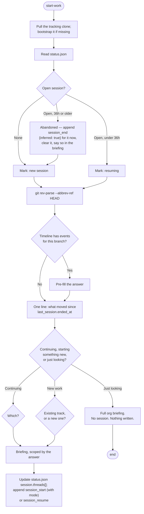

# Start Work

## Overview

Open a work session, decide what it's for, and brief the developer on it. A session is bounded by
start-work and end-work, **not by the calendar** — it may run twenty minutes or span several days,
and it may be one continuous sitting or a series of bursts.

**Core principle:** The branch you're standing on is a strong hint about what you're doing. Use it
to collapse the question tree, never to decide for the developer.

**Announce at start:** "I'm using the start-work skill to open your session."

**REQUIRED READING — first, before anything else:** `.claude/.tracking/format.md`. It holds the
paths, bootstrap procedure, cursor schemas, and event format this skill depends on. Read it before
touching anything under `~/.claude/`.

**REQUIRED SUB-SKILL:** Use gh-to-mcp before running any `gh` command. All GitHub access goes
through the `plugin:github:github` MCP server.

## What This Skill Owns

start-work **owns session lifecycle**: it is the only skill that opens a session, resumes one, or
closes an abandoned one. Recovery belongs here because a developer who abandons a session is, by
definition, one who did not run end-work.

**It never writes to a product repo's files.** It creates and checks out branches. Nothing else.

## The Process



### Step 1: Preflight

Derive the org, bootstrap the clone if missing, `git pull --rebase`. See
**`.claude/.tracking/format.md` → Bootstrap & Access**. No write-access check here — start-work only
reads the tracking repo until its final step, and a developer without push rights still gets a full
briefing.

Get the developer's handle with `get_me()`.

### Step 2: Resolve the Session

Read `~/.claude/<org>.status.json`.

| `session` field | Age of `session.started_at` | What you do |
|---|---|---|
| Absent | — | New session. |
| Present | Under 36h | **Resume it.** Same id, same threads. Append `session_resume`. |
| Present | 36h or older | **Abandoned.** Close it now, then open a new one. |

**An open session is stale after 36h without a close.** The threshold marks abandonment, not a
calendar boundary: a session left open that long was walked away from rather than paused, since
anyone still working it would have triggered start-work again inside the window and resumed it.

**Closing a stale session happens here, in preflight, not at the end.** It concerns work that is
already over and does not depend on this run's answers, so write it immediately:

```json
{"schema":1,"ts":"<now>","session":"<the stale id>","dev":"<dev>","event":"session_end","threads_touched":<count from its threads[]>,"repos_touched":<distinct repos>,"inferred":true}
```

Append it to the stale session's **own month file** — `timeline/YYYY-MM/<dev>.jsonl` keyed on
`session.started_at`, not on today — then move it into `last_session`, clear `session`, and say so
in the briefing. Never set `inferred` on an event that was actually recorded.

**Re-running start-work on a live session resumes it rather than restarting.** Append
`session_resume` and continue with the same id, so a later burst lands inside the existing session
instead of forking a second one covering the same work.

### Step 3: Read the Branch as a Hint

```bash
git rev-parse --abbrev-ref HEAD
git status --short
```

Branches created by this skill are named `<type>/<repo>-<issue#>-<slug>`, so the thread is
recoverable from the name alone. Confirm it against the timeline:

- Grep the timeline for events carrying this `branch`.
- Found → pre-fill the default: *"You're on `feat/api-41-checkout`, so track `payments-v2`, thread
  `msa1624/api#41`, last touched Thursday by you."*
- Not found → no pre-fill.

**The branch lookup is a hint, not a decision.** It pre-selects a default; the developer can always
choose otherwise. Standing on `main` with a clean tree simply means no pre-fill.

### Step 4: One Line on What Moved

Using `last_session.ended_at` as the boundary:

```
search_issues(query: "org:{org} updated:>={date}", sort="updated", order="desc", perPage=10)
search_pull_requests(query: "org:{org} updated:>={date}", sort="updated", order="desc", perPage=10)
```

| What you read | What you say |
|---|---|
| `ended_at` under 36h old | "Since you wrapped up 2026-07-24 18:40 UTC: …" |
| `ended_at` older | Say how old it is and that it's advisory. Report against it anyway. |
| Absent or malformed | Say there's no prior wrap-up on record. Skip this line. |

Never fabricate a boundary you didn't read. `last_session` is not a calendar cursor — it carries no
assumption that the previous session was yesterday.

### Step 5: The Question Tree

Ask what this session is for. One question, three answers.

#### "Continuing existing work"

| Sub-choice | What you do |
|---|---|
| **This branch's thread** (pre-selected when Step 3 found it) | Brief scoped to that thread's activity and blockers. |
| **Other in-flight threads** | List open threads this developer owns across **all** tracks and repos. **Multi-select.** Check out each one's branch in its worktree. |
| **Someone's handoff** | Scan the timeline for `handoff` events with `to` matching this developer. Show their carry-over note and the branch they left it on. |

Mode for the `session_start` event: `resume_same` for one thread, `fan_out` for several,
`handoff` when picking up someone else's work.

#### "Starting something new"

| Sub-choice | What you do |
|---|---|
| **Task in an existing track** | Pick the track from `tracks.yml` → create a sub-issue under its `parent` → create the branch. |
| **Brand new track** | Create the parent issue → add the `tracks.yml` entry → create the first sub-issue → create the branch. |

**When `tracks.yml` is empty, "task in an existing track" is not offered.** The flow degrades to
"brand new track" with no special case.

Creating the issue — see **`.claude/.tracking/format.md` → Issue Fields in This Org**, and discover
the fields at runtime rather than trusting this list:

```
list_issue_fields(owner: "{org}")
list_issue_types(owner: "{org}")
issue_write(method: "create", owner, repo, title, body, type: "Task",
            issue_fields: [
              {field_name: "Priority",    field_option_name: "..."},
              {field_name: "Effort",      field_option_name: "..."},
              {field_name: "Start date",  value: "YYYY-MM-DD"},
              {field_name: "Target date", value: "YYYY-MM-DD"}
            ])
sub_issue_write(method: "add", owner, repo, issue_number: <parent>, sub_issue_id: <new issue id>)
```

**Ask for every value the conversation hasn't established.** A Priority nobody stated is not a field
to fill in with a plausible guess. For a brand new track, `exit_criteria` is required — a track
without it never closes.

Then create the branch, in the product repo, named `<type>/<repo>-<issue#>-<slug>`:

```bash
git -C <worktree> checkout -b feat/api-41-checkout
```

and append `branch_created`, carrying the issue's `title` as of now.

Mode: `new_track` when a track was created, otherwise `resume_same` / `fan_out` by thread count.

#### "Just looking"

Full org briefing built from the tracking clone — tracks, their threads, recent events, the
generated views — plus live open issues and PRs.

**No session is opened. Nothing is written.** Not the cursor, not an event, not a branch. A skill
that demands a track before it will say anything is a skill people stop running. Stop after the
briefing.

### Step 6: Brief, Then Write

Deliver the briefing (format below). **Then**, last:

1. Write `session.threads[]` into `~/.claude/<org>.status.json` — one entry per thread, each with
   `track`, `thread`, `repo`, `branch`, and an **absolute** `worktree` path.
2. Append `session_start` (carrying `mode` and `threads`) or `session_resume` to
   `timeline/YYYY-MM/<dev>.jsonl`.
3. Commit and push the tracking clone — **after showing the diff and getting a yes.**

`session_start` carries `mode` and the thread list, neither known until the question tree resolves,
which is why it is written here and not in preflight.

If the push fails transiently, say so; the events stay on disk and go up on the next run. If it
fails for permissions, say so — start-work still did its job, and the events will push once access
exists.

## Output Format

```
## Session opened — 2026-07-25 · session 2026-07-25-nilendu-01
Org: msa1624 | Mode: fan_out | Threads: 3

### Since you wrapped up (2026-07-24 18:40 UTC)
- msa1624/api#44 (PR): @ali approved — ready to merge
- msa1624/web#22 (Issue): new comment from @priya awaiting your reply

### This session
| Track | Thread | Title | Branch | Worktree |
|---|---|---|---|---|
| payments-v2 | msa1624/api#43 | refund flow | feat/api-43-refunds | ~/work/api |
| payments-v2 | msa1624/web#22 | payment UI | feat/web-22-payment-ui | ~/work/web |
| auth-hardening | msa1624/platform#12 | rate limiter | fix/platform-12-ratelimit | ~/work/platform |

### Where each thread stands
**msa1624/api#43 — refund flow** (payments-v2)
- Last event: progress, 2026-07-24, "refund state machine"
- Blocks: msa1624/web#22
- Priority: High | Target date: 2026-08-01

**msa1624/web#22 — payment UI** (payments-v2)
- Blocked by msa1624/api#43 since 2026-07-24 — "UI needs the refund endpoint shape settled"

### Recovered
- Session 2026-07-22-nilendu-01 was left open 62h and has been closed as abandoned.

### Tracking repo
Appended session_start to timeline/2026-07/nilendu.jsonl, pushed to msa1624/tracking.
```

For **"just looking"**, replace the session sections with the org briefing and end with a line
saying no session was opened and nothing was written.

## Red Flags — STOP

- Opening a second session while one is live and under 36h — resume it
- Writing `session_start` before the question tree has resolved
- Appending an abandoned session's `session_end` to *this* month's file when it started last month
- Setting `inferred: true` on anything but a synthetic close
- Writing anything at all on a "just looking" run
- Deciding the thread from the branch name without offering the developer a choice
- Creating an issue with a Priority, Effort, or date nobody stated
- Creating a track with no `exit_criteria`
- Offering "existing track" when `tracks.yml` is empty
- Committing or modifying a file in a product repo — branches only
- Storing a `~`-relative `worktree` path that a later `cd` can't resolve
- Pushing the tracking repo without showing the diff first

## Quick Reference

| Situation | Action |
|---|---|
| Start of every run | Bootstrap check → `git pull --rebase` → `get_me()` |
| Open session under 36h | Resume: same id, append `session_resume` |
| Open session 36h+ | Close it in preflight with `session_end {inferred:true}`, then open a new one |
| Deriving the session id | `YYYY-MM-DD-<dev>-NN`, NN from counting that day's `session_start` events |
| On a `<type>/<repo>-<N>-<slug>` branch | Pre-fill the thread; confirm, don't assume |
| On `main`, clean tree | No pre-fill. Ask. |
| Developer picks several threads | `fan_out`, one `session.threads[]` entry each, check out every branch |
| Picking up someone's work | Timeline `handoff` events with `to` = this dev; mode `handoff` |
| New task in a track | Sub-issue under the track's `parent`, all four fields set, then branch |
| Brand new track | Parent issue → `tracks.yml` entry with `exit_criteria` → sub-issue → branch |
| `tracks.yml` is empty | Don't offer "existing track" |
| "Just looking" | Brief and stop. No cursor write, no event, no branch. |
| Referencing an item | Always `owner/repo#N` |
| About to run a `gh` command | Stop, use gh-to-mcp |

## Common Rationalizations

| Excuse | Reality |
|---|---|
| "There's already a session open, I'll start a fresh one to keep things clean" | Two sessions covering one stretch of work make the timeline lie about the session's shape. Resume it. |
| "The branch name says thread 41, so that's what we're working on" | It's a hint. The developer may be about to switch. Pre-fill and confirm. |
| "They're just looking, but I'll record the session anyway — it's harmless" | It's a `session_start` with no work behind it, and end-work will later close a session that never happened. Write nothing. |
| "The stale session's `session_end` goes in today's file, that's when I noticed" | `ts` is when you wrote it; the *file* is keyed to when the session ran. Filing it under today hides it from that month's history. |
| "I'll set Priority to Medium — it's the safe default" | A guessed value is indistinguishable from a real one downstream. Ask. |
| "Exit criteria can be added once the track takes shape" | Then it never is, and the track sits on the Gantt forever. It's required at creation. |
| "I'll just commit the branch's first change while I'm here" | start-work creates branches. It does not modify, commit, or push product-repo files. |
