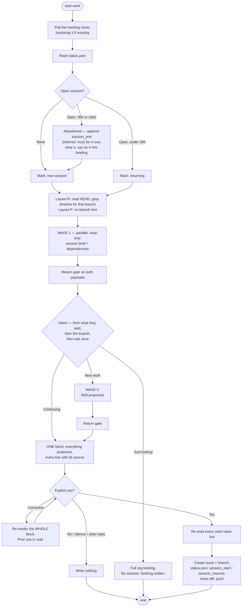

# Start Work

## Overview

Open a work session, decide what it's for, and brief the developer on it. A session is bounded by
start-work and end-work, **not by the calendar** — it may run twenty minutes or span several days,
and it may be one continuous sitting or a series of bursts.

**Announce at start:** "I'm using the start-work skill to open your session."

**READ *The Substrate* BELOW FIRST**, before touching anything under `<base>/.claude/`. It holds the
base resolution, paths, bootstrap procedure, cursor schema, and event format this skill depends on.

**REQUIRED SUB-SKILL:** Use gh-wrapper before running any `gh` command. It routes GitHub access down
a three-rung ladder — MCP tool, then `gh` flag, then `gh api graphql` — and nothing is reported
impossible until all three have been walked.

## The Iron Law

```
LOOK IT UP, DON'T ASK IT.
EVERY VALUE HAS A SOURCE, SHOWN BEFORE IT IS WRITTEN.
THE DEVELOPER STILL DECIDES.
```

**Do the looking-up yourself.** The developer should not have to open the project board to answer
your questions. What blocks this thread, what the parent issue's dates are, what siblings carry, what
moved since they left — all of that is discoverable, and discovering it is your job, not theirs.

**Then show your work before you write it.** Every value you propose is rendered next to the source
it came from, and the developer says yes to the block. See **_The Substrate_ → Established vs.
guessed**: a value is established when it has a source, the source is shown, *and* the developer
accepted it — all three. Research moves the work; it does not lower the bar.

**The branch remains a hint, not a decision.** It collapses the common case to a single
confirmation. It never picks for them.

## What This Skill Owns

start-work **owns session lifecycle**: it is the only skill that opens a session, resumes one, or
closes an abandoned one. Recovery belongs here because a developer who abandons a session is, by
definition, one who did not run end-work.

**Its write surfaces are three, per target-workflow §2:** branch creation and checkout, issue
creation with its fields, and the tracking clone plus cursor files. **It never modifies a product
repo's file contents, never rewrites an issue body, and never writes a PR.**

## The Substrate

<!-- SUBSTRATE: the five principles, paths, bootstrap, tracks.yml, issue fields, and the event
     format are shared with end-work and snapshot — keep in sync. Sections marked (start-work only)
     are not. -->

### The Five Principles

When a case isn't covered, decide by these.

1. **State vs. event.** *State* is what is true now — status, assignee, blockers — and lives only in
   GitHub, fetched live, never cached. *Events* are what happened, when, by whom, and live only in
   the timeline, never re-derived from GitHub, because the past does not change.
2. **Pointer, not content.** A track's registry entry points at its parent issue plus the few facts
   GitHub cannot express. If a field exists on the issue, the registry does not store it.
3. **Append-only.** Timeline events are written once and never rewritten. A correction is a new event.
4. **No ranking.** Nothing generated compares people. No durations, ever.
5. **Out-of-band.** The record never lives on a branch of the work it describes. Branch identity is
   *data on an event*, never the *location* of one.

### Paths

Resolve three things once per run, before touching anything. Every path below follows
deterministically from them. **Nothing records these paths and nothing caches them.**

**1. The base** — the working directory the skill was invoked in, as an **absolute** path (`pwd`).
Resolve it once and reuse that absolute form everywhere. A bare relative path is not good enough:
this skill `cd`s into product worktrees to cut branches, and a relative base silently retargets the
moment it does.

**2. The layout and the repo set.** The base is one of two shapes, and one command tells you which:

```bash
git -C <base> rev-parse --show-toplevel 2>/dev/null
```

| Result | Layout | Repo set | Current repo |
|---|---|---|---|
| A path | **R** — the base is, or sits inside, an org repo | that one repo | it |
| Nothing | **P** — the base is a parent of org repo clones | every depth-1 child holding a `.git`, mapped to `owner/repo` from its remote | **none** |

**Layout R is the one-element case of layout P, not a separate mode.** Everything downstream reads
the **repo set** and, where it exists, the **current repo** — never "the repo you're standing in."
That phrase has no referent in P, which is why it is gone from this skill.

```bash
# layout P: build the repo set — one level down, no deeper
for d in <base>/*/; do
  git -C "$d" config --get remote.origin.url 2>/dev/null   # → owner/repo, plus the path
done
```

**Scan one level, never recursively.** A workspace's repos are its children; walking deeper turns a
`node_modules` or a vendored checkout into a candidate product repo.

**In layout P every child repo belongs to the org.** That is the assumed shape, so a child whose
owner differs from the rest is a violated premise, not a case to resolve silently — name it and ask
once.

**3. The org** — in this order, stopping at the first that answers:

| Source | How |
|---|---|
| The current repo's remote *(layout R)* | `git config --get remote.origin.url`, parsed for the owner |
| The repo set's remotes *(layout P)* | the owner they agree on. **They disagree → ask; never pick a majority** |
| A recorded answer | `<base>/.claude/tracking-org`, one line, the org login |
| The developer | Ask once, then **write it to `<base>/.claude/tracking-org`** so no later run asks again |

**A base with no git remote is normal, not an error.** In layout P the base itself never has one —
the org comes from its children. A base that is neither, with no children cloned yet, falls back to
the recorded answer, and that is the designed path rather than a degraded one.

| What | Path |
|---|---|
| Tracking clone | `<base>/.claude/.tracking/<org>/` |
| Session cursor | `<base>/.claude/<org>.status.json` |
| Org record | `<base>/.claude/tracking-org` |

The cursor lives **outside** the clone deliberately: a file that must survive a reclone, a
`git clean`, or a bad rebase inside that clone cannot live where the clone's own git operations reach
it. `<base>/.claude/<org>.snapshot.json` exists and belongs to `/snapshot` — **never open it.**

**The record is per working directory, not per machine.** Two directories on one machine each keep
their own clone and cursor, even for the same org — they share a remote, not a local state. The
consequence is worth stating because it will bite someone: **a session opened in one directory is
invisible from another.** Open and close a session from the same base. A session that looks missing
is usually a session opened somewhere else, not an abandoned one.

**The layouts are the common way to trip on this**, because they are two places one developer can
legitimately start from: the repo, or its parent. So in **layout R, before treating an absent
session as absent, check the parent** — one `ls`, no adoption:

```bash
ls <base>/../.claude/*.status.json 2>/dev/null
```

Found → say the parent holds a cursor and name the directory, so the developer can re-run there.
**Never read it, never adopt it, never write to it.** It belongs to that base, and a session opened
from the parent is closed from the parent.

### When the base is inside a git repo *(layout R)*

The record is **out-of-band** (principle 5) — it must never be committed into the work it describes.
So when `<base>` sits inside a git repo, exclude it, **using `.git/info/exclude`, not `.gitignore`**:

```bash
git -C <base> rev-parse --show-toplevel        # is there a repo, and where is its root?
# if there is, ensure these lines exist in <toplevel>/.git/info/exclude:
.claude/.tracking/
.claude/*.status.json
.claude/*.snapshot.json
.claude/tracking-org
```

**`.git/info/exclude` rather than `.gitignore` is the whole point.** `.gitignore` is a tracked file;
writing it would modify the product repo's contents, show up in the developer's diff, and land in
someone's commit. `.git/info/exclude` is local-only and untracked, so the exclusion costs the repo
nothing and the write surfaces below stay intact.

Check this every run and add any missing line, saying that you did. Note what is **not** excluded:
`.claude/skills/` and other project Claude config are ordinary tracked files and none of this
applies to them.

**In layout P there is nothing to exclude and nothing to check.** `<base>/.claude/` sits in no repo,
so the record is already out-of-band. **Never write exclusion lines into the child repos** — they
don't hold the record, and `.git/info/exclude` is not a file to touch on spec.

### Write surfaces — these three, and nowhere else

| Location | Writes permitted |
|---|---|
| `<base>/.claude/.tracking/<org>/` | The only place anything is committed or pushed — always after showing the diff. The yes was given at the confirmation block, not at the push. |
| `<base>/.claude/<org>.status.json` | Local cursor writes. No git involved. |
| Product repos | **Branch creation and checkout only.** No file contents modified, nothing committed, nothing pushed. `.git/info/exclude` is the one exception, and it is untracked by design — see above. |

**`<base>` being inside a product repo does not widen this.** The tracking clone is still the only
thing committed, and it is committed to `{org}/tracking` — never to the repo it happens to sit in.

Issues get created with their fields — that is this skill's documented job. Issue **bodies** are
never rewritten and PRs are never written.

### Bootstrap — every run

**B0. Resolve the base, the layout, the repo set, the org, and the exclusion.** All of it before any
path is used, in this order — the clone path is not computable until the org answers, and the org's
first two sources are the layout's.

```bash
pwd                                            # the base, absolute
git -C <base> rev-parse --show-toplevel        # layout R or P — and, in R, where to check the exclusion
git -C <base>/*/ config --get remote.origin.url  # layout P: the repo set, one level down
cat <base>/.claude/tracking-org                # org, recorded fallback
```

If no org source answers, **ask once and record the answer** — do not guess an org from a directory
name. A directory called `acme-web` implies nothing about which GitHub org owns it.

**B1. Is the clone present?**

```bash
git -C <base>/.claude/.tracking/<org> rev-parse --git-dir 2>/dev/null
```

Present → pull (B3). Missing → `search_repositories(query: "repo:{org}/tracking")`.

**B2. Bootstrap.** Remote exists but no clone → `git clone https://github.com/{org}/tracking.git
<base>/.claude/.tracking/{org}`, and say you did it and where.

**Remote does not exist → offer to create it, and wait for a clear yes.** Creating a repo is
outward-facing and never happens implicitly.

```
create_repository(name: "tracking", organization: "{org}", private: true,
                  description: "Org work tracking — track registry, event timeline, generated views",
                  autoInit: true)
```

Then clone it and seed three files in one commit. **The README is not optional — a shared record
whose format nobody can read is not shared.**

`.gitattributes` is exactly one line:

```
*.jsonl merge=union
```

`tracks.yml` starts empty:

```yaml
# Org track registry. See README.md.
tracks: []
```

`README.md` explains the format to anyone opening the repo cold: what `tracks.yml`, `timeline/`, and
`views/` are; that **state lives in GitHub and events live here**; that `tracks.yml` holds four fields
and becomes a second issue tracker if it grows more; that the timeline is append-only, one branch,
`merge=union` on `*.jsonl` only; that `views/` is generated and hand edits are overwritten; and that
there are no durations, no rankings, and no pruning.

**B3. Pull, every run.**

```bash
git -C <base>/.claude/.tracking/<org> pull --rebase
```

A clone left dirty by a previous run gets its own report line — never merged into the developer's
uncommitted-work blocker. Different problems, different fixes.

**No write-access check here.** start-work only reads the tracking repo until its final step, and a
developer without push rights still gets a full briefing.

### The tracking repo

```
{org}/tracking
├── README.md          ├── tracks.yml        └── views/          (generated)
├── .gitattributes     └── timeline/             gantt.md
                           YYYY-MM/<dev>.jsonl   dependencies.md
```

**One branch, always** — never branched, force-pushed, squashed, or rebased. That linearity is what
lets principle 3 hold. One clone and one `status.json` serve every worktree on the machine.

### `<org>.status.json`

```json
{ "schema": 1, "org": "msa1624",
  "last_session": { "started_at": "2026-07-25T09:00:00Z", "started_repo": "msa1624/api",
                    "ended_at": "2026-07-25T18:20:00Z", "ended_repo": "msa1624/api" },
  "session": { "id": "2026-07-25-nilendu-01", "started_at": "2026-07-25T09:00:00Z",
    "threads": [ { "track": "payments-v2", "thread": "msa1624/api#43", "repo": "msa1624/api",
                   "branch": "feat/api-43-refunds", "worktree": "/Users/x/work/api" } ] } }
```

- **`last_session`** — the "since you left off" boundary. Not a calendar cursor; it carries no
  assumption the previous session was yesterday.
- **`session`** — the live session, absent when none is open. At most one at a time.
- **`session.threads[].worktree`** is load-bearing — end-work iterates it to enforce its iron law.
  Store an **absolute** path, never `~`-relative.

### Tracks & threads

A **track** is a set of related work (an epic); a **thread** is one unit inside it — one issue plus
its PRs, branches, and commits. Parent/child comes from GitHub **sub-issues**. A milestone is *not* a
track.

```yaml
tracks:
  - id: payments-v2
    parent: msa1624/api#38          # title, owner, dates all live here
    status: active                  # active | paused | done | abandoned
    exit_criteria: "checkout flow live for 100% of traffic"
```

**Four fields, per principle 2.** Title, owner, and dates live on the parent — follow the pointer and
read them live. `status` exists because an issue offers only open or closed, and a paused track is
not a closed one. **`exit_criteria` is required on every track**: without it a track never closes, it
just stops generating events and leaves a permanent bar on the Gantt.

### Issue Fields in this org

Every thread has an issue, and every issue carries the org's fields, **set at creation**.

**Discover at runtime — never hardcode:**

```
list_issue_fields(owner: "{org}")        → org fields and their valid options
list_issue_types(owner: "{org}")         → valid issue types
```

At the last check `msa1624` defined exactly these four. **Treat this as the expected result of that
call, not the definition** — if a run discovers a different set, the discovered set wins.

| Field | Type | Valid values |
|---|---|---|
| Priority | single-select | Urgent · High · Medium · Low |
| Effort | single-select | High · Medium · Low |
| Start date | date | `YYYY-MM-DD` — planned start |
| Target date | date | `YYYY-MM-DD` — planned finish |

Types are **Task · Bug · Feature**. There is no `Epic`; a track's parent is a `Feature` unless the
developer says otherwise, and it is a track because `tracks.yml` points at it.

**`Size` and `Estimate` are not defined in this org. Do not invent them.** Effort is the only sizing
signal. If a role has no field, **say so** — never approximate it with a neighbouring field that
happens to accept a write.

**Relationships** is not an Issue Field; it is the dependencies API, writable at rung 2
(`gh issue edit --add-blocked-by`, URL form for cross-repo). **A dependency that research *found* is
not one a session *hit*:** a discovered blocker goes on the issue and **nowhere else**. Only a
blocker a session actually ran into becomes a `blocked` timeline event, which end-work writes.

### Projects v2 board membership

**Board membership is a fourth mechanism, and it is the one that fails silently.** Issue Fields,
Milestone, and Relationships are all visible on the issue; an issue on no board looks completely
normal, and only the people planning off that board ever notice it is missing.

**Discover the org's projects once per run, alongside the fields** — gh-wrapper carries the ladder,
the personal-account root, and the idempotency note:

```
gh api graphql -f query='{ organization(login:"{org}"){
  projectsV2(first:20){ nodes{ number title id } } } }'
```

Then treat the result as a line in the confirmation block like any other:

| Discovery | The block shows |
|---|---|
| No project | Nothing to link. Say so once; do not treat it as a failure. |
| Exactly one project, issue would not be on it | Propose the link, `←` the discovery |
| Several projects | `— ask`, listing them. **Never pick one.** |

**Never skip the link because an auto-add workflow probably caught it.** Those workflows are scoped
to some repos and not others, and the scope is not readable from here — an issue created in a repo
outside the scope lands nowhere, which is exactly how a board silently drifts. Adding is idempotent,
so linking something already on the board costs nothing.

**gh-wrapper reports; this skill links.** gh-wrapper has no confirmation surface, so it discovers
and hands back `on_project: true|false` rather than writing. The write happens here, after the block
is accepted, like every other write in this skill.

### Established vs. guessed

A value is **established** when three things are true:

1. It has a **source** — a live-read issue field, a counted set of timeline events, a structural
   fact, or the calendar.
2. The source is **shown to the developer**, in one line, beside the value.
3. The developer **said yes after seeing it.**

All three. Missing any one, it is **guessed**, and a guessed value is asked for, never written.

Research does not lower the bar — it moves the work. You do the looking-up; the developer does the
accepting. What is never permitted is the middle: a plausible value with a rationale invented
afterwards to justify it.

**The order is load-bearing: source, then value. Never value, then rationale.**

| Class | What it is | Renders |
|---|---|---|
| **Derived** | the source states the value, or a stated rule maps it | `←` and the source |
| **Inferred** | the source is only suggestive | `?` and the source, **re-listed** in a closing line |
| **Unsourced** | nothing establishes it, no precedent exists | `— ask`, with a suggestion labelled as one. The block cannot be accepted until it is answered. |

### Event timeline

`timeline/YYYY-MM/<dev>.jsonl` — one JSON object per line, newline-terminated, no blank lines. Two
developers never touch the same file; the same developer on two machines can, and `merge=union`
resolves it.

start-work writes **`session_start`**, **`session_resume`**, and **`branch_created`**.

```jsonl
{"schema":1,"ts":"2026-07-25T09:02:11Z","session":"2026-07-25-ali-01","dev":"ali","event":"session_start","mode":"resume_same","threads":1}
{"schema":1,"ts":"2026-07-25T09:14:00Z","session":"2026-07-25-ali-01","dev":"ali","event":"branch_created","track":"payments-v2","thread":"msa1624/api#41","repo":"msa1624/api","branch":"feat/api-41-checkout","title":"checkout endpoint"}
{"schema":1,"ts":"2026-07-25T14:02:00Z","session":"2026-07-25-ali-01","dev":"ali","event":"session_resume","mode":"fan_out","threads":2,"threads_added":["msa1624/web#22"]}
```

| Field | Rule |
|---|---|
| `schema` | always `1` today, so the format can evolve without breaking readers of old files |
| `ts` | UTC, ISO 8601, always — local time makes cross-timezone charts lie |
| `session` | the id shared by every event in one sitting; this is what stitches a session together across tracks, branches, and repos |
| `dev` | the GitHub handle the work is attributed to |
| `track` · `thread` · `repo` · `branch` | thread-scoped events only. `thread` is always `owner/repo#N`, never bare `#N`. `branch` is `null` on `main`/detached, and **never inferred later** |
| `title` | `branch_created` only: the thread's title as of when work started. A label for the views, never refreshed |
| `mode` | `session_start` and `session_resume`: `resume_same` · `fan_out` · `handoff` · `new_track`. On a resume it describes *that resume* |
| `threads` | `session_start`: threads opened with. `session_resume`: the total **after** the resume |
| `threads_added` | `session_resume` only: array of `owner/repo#N` picked up. **Omitted, not `[]`**, when none |
| `inferred` | `true` only on a synthetic `session_end` for an abandoned session. Never on a recorded event |

**Session-scoped vs. thread-scoped.** `session_start`, `session_resume`, and `session_end` describe
the sitting, so `track`/`thread`/`repo`/`branch` are **omitted** — not set to null. `threads_added`
is what lets a resume record *which* thread joined while staying session-scoped.

`branch_created` is its own event type rather than a flavour of `progress`: it fixes a thread's
actual start date, and the Gantt's bars begin there.

**No duration or hours field, ever.** Session boundaries place work on a Gantt at day granularity; a
computed "time worked" is the raw material for exactly the comparison principle 4 rules out.

### Session ids *(start-work only)*

`YYYY-MM-DD-<dev>-NN`, `NN` zero-padded. Derive it by counting `session_start` events already in
`timeline/YYYY-MM/<dev>.jsonl` whose `ts` falls on that date, and adding one. **Never reuse an id.**

### Handoff scan *(start-work only)*

A `handoff` event is written by the **sender**, into the sender's own month file — the recipient's
file has no record of it. Finding one means reading other people's files, which is why the scan needs
a stated bound.

**Bounds: this month and last, all developers.** The clone is local, so this is a grep:

```bash
grep -h '"event":"handoff"' \
  <base>/.claude/.tracking/<org>/timeline/{<this-month>,<last-month>}/*.jsonl
```

Filter to `to == <this dev>`, then drop any whose `thread` has a later `done` event or reads closed
live — a handoff already picked up is not pending. **State the bound in the output**: "1 handoff
waiting (scanned June and July)." Widen only on request, and say that you did.

### Branch naming *(start-work only)*

`<type>/<repo-shortname>-<issue#>-<slug>` — `feat/api-41-checkout`, `fix/platform-12-ratelimit`.
`<type>` is `feat`, `fix`, `chore`, or `docs`. `<slug>` is the issue title lowercased,
non-alphanumerics collapsed to `-`, trimmed to roughly three words.

Generate every branch this way, so the branch→thread link is recoverable **from the name alone**,
with no lookup table to maintain.

### Guardrails

- **Verifiable, not trusted.** Every `progress` event carries commit SHAs; one without renders
  visibly softer in the views.
- **No leaderboards, ever.** Every developer's log sits in one repo, which is what makes the org view
  work and principle 4 easy to violate.
- **Keep everything, forever.** No compaction, no pruning — an append-only log rewritten on a
  schedule is not append-only.
- **The timeline stays event-shaped.** If `tracks.yml` accumulates statuses or assignees, it has
  become a second issue tracker and principle 2 is gone.

## The Process



### Step 1: Preflight

Resolve the layout and repo set, derive the org, bootstrap the clone if missing, `git pull --rebase`.
See **_The Substrate_ → Paths** and **→ Bootstrap**. Say which layout you're in and how many repos
are in scope — it explains the presence or absence of the branch hint before anyone wonders. No write-access check here — start-work only
reads the tracking repo until its final step, and a developer without push rights still gets a full
briefing.

Get the developer's handle with `get_me()`.

### Step 2: Resolve the Session

Read `<base>/.claude/<org>.status.json`.

| `session` field | Age of `session.started_at` | What you do |
|---|---|---|
| Absent | — | New session. |
| Present | Under 36h | **Resume it.** Same id, same threads. Append `session_resume`. |
| Present | 36h or older | **Abandoned.** Close it now, then open a new one. |

**An open session is stale after 36h without a close.** The threshold marks abandonment, not a
calendar boundary: a session left open that long was walked away from rather than paused, since
anyone still working it would have triggered start-work again inside the window and resumed it.

**Closing a stale session happens here, in preflight, not at the end.** It concerns work that is
already over and does not depend on this run's answers, so write it immediately:

```json
{"schema":1,"ts":"<now>","session":"<the stale id>","dev":"<dev>","event":"session_end","threads_touched":<count from its threads[]>,"repos_touched":<distinct repos>,"inferred":true}
```

Append it to the stale session's **own month file** — `timeline/YYYY-MM/<dev>.jsonl` keyed on
`session.started_at`, not on today — then move it into `last_session`, clear `session`, and say so
in the briefing. Never set `inferred` on an event that was actually recorded.

**Re-running start-work on a live session resumes it rather than restarting.** Append
`session_resume` and continue with the same id, so a later burst lands inside the existing session
instead of forking a second one covering the same work.

### Step 3: Read the Branch as a Hint *(layout R only)*

```bash
git -C <current repo> rev-parse --abbrev-ref HEAD
git -C <current repo> status --short
```

Branches created by this skill are named `<type>/<repo>-<issue#>-<slug>`, so the thread is
recoverable from the name alone. Confirm it against the timeline:

- Grep the timeline for events carrying this `branch`.
- Found → pre-fill the default: *"You're on `feat/api-41-checkout`, so track `payments-v2`, thread
  `msa1624/api#41`, last touched Thursday by you."*
- Not found → no pre-fill.

**The branch lookup is a hint, not a decision.** It pre-selects a default; the developer can always
choose otherwise. Standing on `main` with a clean tree simply means no pre-fill.

**In layout P this step does not run.** There is no current repo, so there is no branch to read and
no pre-fill to make — say so in one line ("no branch hint; the base is a workspace of 3 repos") and
resolve intent from what the developer said. **Never run `rev-parse` from a layout-P base and never
substitute a child repo's branch for it**: N children have N branches, none of them "the" one, and a
hint picked from an arbitrary child is a confident pre-fill with nothing behind it.

### Step 4: Research — Wave 1 (before you ask anything)

**Spawn two `Explore` subagents in one message, in parallel.** Their output is what the developer
reads *instead of* going to the project board. Give each the shared preamble below plus its brief.

Also grep locally, which no subagent should do for you: this branch's timeline events, and pending
handoffs per *Handoff scan* above (state the bound).

Discover the fields once here — `list_issue_fields(owner: "{org}")` — and pass the result into both
briefs. **No subagent runs its own discovery**; two discoveries can disagree and the block would show
one schema built from two.

**Discover the org's projects in the same step**, per *The Substrate* → Projects v2 board membership.
It is one cheap query, it has the same never-hardcode rule, and doing it here means the confirmation
block can carry the board line with a source instead of the issue quietly landing on no board.

#### Shared preamble — goes in every brief

```
You are a READ-ONLY research agent. Return findings; never act on them.

NEVER call issue_write, add_issue_comment, sub_issue_write, setIssueFieldValue, any
GraphQL mutation, or gh issue edit/create/close/comment. If something seems to need
one, return it in asks[] — never as an action. You CAN call these tools; not calling
them is the rule you are being held to.
DO NOT read the timeline, status.json, or tracks.yml. Everything you must compare
against is supplied in your INPUT. Sourcing both sides of a comparison yourself
destroys the comparison.

Ladder: MCP tool → gh flag → gh api graphql. Never report something unreachable
without walking all three and naming all three. MCP missing is not a capability gap:
say so once (rung_reason "mcp_absent") and work rungs 2-3 for the whole run. The
prefix is mcp__plugin_github_github__, not mcp__github__.
Cross-repo blocker rollups start at rung 3 by ROUTING, not escalation — one GraphQL
query costs 1 point where the REST equivalent is 18 requests. Say rung_reason "routing".
NEVER read issue_dependencies_summary to decide whether something is blocked; it lags
a write by ~1s and returns 0. Read dependencies/blocked_by or GraphQL blockedBy.
The fields are blockedBy / blocking on Issue — NOT blockedByIssues.
HTTP 200 can carry an "errors" key. Check every response whatever the exit code.
Nulls under errors are FAILURES, not absences — they go to not_covered[].
On a personally-owned account Issue Fields and issue types are ABSENT, not restricted.
Empty is the complete answer; do not escalate.

Every reference is owner/repo#N. Never bare #N, even within one repo.
Return exactly one fenced json block as your LAST message, in this envelope:
{ "agent","status":"ok|partial|failed","rung","rung_reason","covered":[],
  "not_covered":[],"surface_log":[{"call","rung","class":"read","ok"}],
  "asks":[],"unavailable":[],"data":{} }
covered/not_covered are MANDATORY. A thread you could not read goes in not_covered —
never reported as having nothing to report.
```

#### Brief 1 — session brief

> **Purpose.** What changed since a given moment, and where the named threads stand right now.
>
> **INPUT you supply:** `since` (from `last_session.ended_at`), `threads[]`, `fields[]` (this run's
> discovery), `dev`.
>
> **The boundary is passed in. Never source or invent one.** `since: null` is legal and means no
> prior wrap-up on record: return `moved: []`, note it in `unavailable[]`, and **still return thread
> standing**, which needs no boundary.
>
> **`data`:** `moved[]` — `{ref, kind, title, what, actor, ts, url}`, where `what` says what actually
> changed ("approved by @ali; checks green"), never that a timestamp moved. `awaiting_you[]` —
> `{ref, kind, why, excerpt, ts, url}`. `thread_standing[]` — `{thread, title, state, assignees,
> labels, fields[], open_prs[{ref, review_state, reviewers}]}`.
>
> **`awaiting_you` is the highest-value thing here** — it is exactly what the developer would
> otherwise hunt for. From evidence only: a review requested and not submitted; a comment mentioning
> them or a direct question on a thread they're assigned, with no later reply; a PR of theirs
> approved and mergeable, or with changes requested. **Never "this looks like their area."**
> `excerpt` is a direct quote, one line. `fields[].value: null` means the issue lacks that field —
> a finding, not a row to omit.

#### Brief 2 — dependencies

> **Purpose.** What blocks these threads, right now.
>
> **INPUT you supply:** `threads[]`, `org`, `project_number` if there is one.
>
> **`data`:** `declared[]` — `{thread, blocked_by[{ref, state, title}], blocking[], source}` where
> `source` names where you read it. `prose_hints[]` — `{thread, location, url, text, refs[]}` for
> `#N` references and "blocks"/"depends on" phrasing in bodies and comments; these are **hints, not
> declared dependencies**, so keep them out of `declared`. `ready_now[]` — `{thread, was_blocked_by,
> why}` for threads whose every declared blocker reads closed. `still_blocked[]` — `{thread, by[],
> blocker_state}`.
>
> `ready_now` and `still_blocked` are the point: they let the briefing say where things stand without
> anyone opening the board. **Never infer a dependency** from a shared label, a shared milestone, a
> similar title, or two issues touching the same file — only declared relationships and quoted prose.

#### The return gate — run before rendering a line

| Gate | On failure |
|---|---|
| **Envelope** parses and carries every required field | Treat as no-return. **Never scrape values out of prose.** |
| **Write-class** — every `surface_log[].class == "read"`, no `call` matching `issue_write`, `add_issue_comment`, `sub_issue_write`, `setIssueFieldValue`, `^mutation`, `gh issue (edit\|create\|close\|comment)` | **Discard the whole payload** and tell the developer a read-only agent attempted a write. Do not retry silently. |
| **Existence** — every `owner/repo#N` resolves | Drop the ref and say so. Distinguish "does not exist" from `data: null` **with an `errors` block at HTTP 200** — that is a permissions or transient failure, not a hallucination. |
| **Discovery** — every field name is in this run's `list_issue_fields` | Drop it; report that field unset, naming it. |
| **Reference form** — matches `^[\w.-]+/[\w.-]+#\d+$` | Reject the record rather than guessing the owner. |
| **Ladder honesty** — any unreachability claim is backed by rungs 1, 2 **and** 3, or `mcp_absent` | Unproven. **Re-walk the ladder yourself** before reporting anything unset. |
| **Coverage** — `not_covered[]` is printed | Never omit it. |

**Failure modes.** No return or prose → retry **once** narrowed, then run the inline procedure below
yourself and say the briefing ran degraded. Partial with populated `data` → use it, and print
coverage. Hallucinated ref → drop it, name it. Agents disagree → **never pick a winner silently**;
the more specific query wins and the disagreement is reported.

**Nothing a subagent returns is a receipt.** Every write in this skill happens here, in the main
conversation, after the block is accepted.

Wave 1 must land **before** the intent question, because its output is an input to that question —
that is the join point. It costs nothing on a "just looking" run and **writes nothing**; research
results are never persisted.

**The boundary is read, never invented.** `since` comes from `last_session.ended_at` and is passed
down; the agent is forbidden from substituting one.

| What you read | What you say |
|---|---|
| `ended_at` under 36h old | "Since you wrapped up 2026-07-24 18:40 UTC: …" |
| `ended_at` older | Say how old it is and that it's advisory. Report against it anyway. |
| Absent or malformed | Say there's no prior wrap-up on record. Skip the line; thread standing still renders. |

If an agent fails, retry once narrowed, then run the inline procedure below yourself and say the
briefing ran degraded. **The sections below are both the specification and the fallback.**

### Step 5: Resolve Intent, Then Propose Once

**Intent resolves from three sources, in priority order. Only the third is a question.**

1. **What the developer said when they triggered the skill.** "start work on refund idempotency"
   already answers *new work* and names it. "pick up where I left off" answers *continuing*. This is
   the common case, and it needs no question at all.
2. **The branch**, per Step 3.
3. **Neither** → ask once: continuing, something new, or just looking?

**Q2 and Q3 are no longer questions.** The alternatives they used to offer — other in-flight threads,
a waiting handoff, an existing track vs. a new one — are *named in the confirmation block* as things
the developer can switch to. They read a proposal and either accept it or say what to change, rather
than walking a menu.

#### "Continuing existing work"

Wave 1 already gathered everything this needs. The block proposes one option and **names the rest**:

| Option | Where it comes from |
|---|---|
| **This branch's thread** — proposed when Step 3 found it | the branch name + its timeline events |
| **Other in-flight threads** | the session brief's thread standing across all tracks and repos. Named as alternatives; if the developer picks several, that's `fan_out` — one `session.threads[]` entry each, every branch checked out |
| **Someone's handoff** | the bounded scan in **_The Substrate_ → Handoff scan**. Show the carry-over note, the branch they left it on, and which months you scanned |

Mode for the event: `resume_same` for one thread, `fan_out` for several, `handoff` when picking up
someone else's work.

#### "Starting something new"

| Sub-choice | What you do |
|---|---|
| **Task in an existing track** | Propose the track from `tracks.yml`, with why → sub-issue under its `parent` → branch. |
| **Brand new track** | Parent issue → `tracks.yml` entry → first sub-issue → branch. |

**When `tracks.yml` is empty, "task in an existing track" is not offered.** The flow degrades to
"brand new track" with no special case.

#### Which repo hosts the thread

The issue is created in a repo and the branch is cut in a worktree, so both need a repo **and its
local path**, each with a source like every other line in the block:

| Case | The block shows | Source |
|---|---|---|
| Layout R | the current repo | `← you're standing in ~/work/api` |
| Layout P, one plausible host | that repo set entry | `← <base>/api, remote msa1624/api` |
| Layout P, several plausible | `— ask`, listing the repo set | — |
| The track's other threads sit in one repo, and it's in the set | that repo | `← 2 open threads in payments-v2, both in msa1624/api` |
| The repo isn't in the set at all | `— ask` — **offer to clone it into `<base>/<name>`** | — |

**Cloning a missing repo is a read, so it is allowed — but it is not silent.** It appears as its own
line in the block and happens only on the yes, like every other write in this skill.

**Never cut a branch in a repo that is not in the repo set.** The path would come from somewhere
other than this run's resolution, and `session.threads[].worktree` — which end-work iterates to
enforce its iron law — would point at a directory this skill never verified exists.

**`worktree` is the repo set entry's absolute path** (in layout R, the current repo's root). Never
`~`-relative, never `<base>` plus a guessed directory name: a repo's local directory need not match
its GitHub name, so read the path from the set rather than composing it.

**Wave 2 — dispatch the field brief now**, once the work has a name. It cannot merge into Wave 1: it
depends on what the developer just decided, and running it speculatively would propose values for an
issue that may never exist.

#### Brief 3 — field proposals *(Wave 2)*

Shared preamble, plus:

> **Purpose.** Map this org's discovered fields onto the workflow's roles, and propose a value for
> each **with its source**, classified by how well-founded it is.
>
> **INPUT you supply:** `fields[]` (this run's discovery), `types[]`, `issue_intent` (title, track,
> parent, type intent), `established[]`, `precedent_scope` (`siblings_of`, `max_siblings`).
>
> **`established[]` is verbatim quotes from this conversation, with the role each maps to.** You
> cannot see the conversation — that is deliberate. It makes "did the conversation establish this?" a
> mechanical check against a list rather than an impression.
>
> **`data`:** `roles{}`, `unfilled_roles[]`, and `fields[]` where each entry is
> `{name, type, options[], role, proposed, provenance, rationale, evidence[]|candidates[]}`.
>
> | `provenance` | When | `proposed` |
> |---|---|---|
> | `established` | a verbatim maps to exactly one valid option, **no interpretation** | the value |
> | `precedent` | not established, but siblings under the same parent agree | the precedent value |
> | `must_ask` | nothing established, no precedent, **or any interpretation required** | **`null`**, best guess in `candidates[]` |
> | `role_unavailable` | the org defines no field for this role | `null`, role named in `unfilled_roles` |
>
> **A non-null `proposed` with `must_ask` is a contract violation and fails the whole payload** —
> that combination is guessing and then labelling the guess.
>
> The row most likely to go wrong: "by the 8th of August" *feels* established, but turning it into a
> calendar date is an interpretation — which year, and is "by the 8th" the 8th or the 7th? So it is
> `must_ask` with `candidates: ["2026-08-08"]`, which renders as a one-keystroke question rather than
> a silent assumption.
>
> **`rationale` names a source; it never restates the value.** "High because it's important" is not a
> rationale — "parent #38 is High, sibling #43 is High" is. **Account for every field discovery
> returned**; a field with nothing to say is still a row, `must_ask`, with an honest rationale.
> `Milestone` and `Relationships` are **not** Issue Fields — never return them in `fields[]`. Cap
> sibling reads at `max_siblings`; precedent from one sibling is not precedent.

Add one gate for this payload: **Provenance** — anything bound for a write path carries
`provenance: "established"` and its verbatim really appears in this conversation. `precedent` and
`must_ask` reach the confirmation block only, never a write. On failure, strip the value and convert
it to an ask; never write it and never quietly drop it.

Then write every field the discovery returned:

```
issue_write(method: "create", owner, repo, title, body, type: "<discovered-type>",
            issue_fields: [
              {field_name: "<discovered-field>", field_option_name: "<option-from-discovery>"},
              {field_name: "<discovered-date-field>", value: "YYYY-MM-DD"}
            ])
sub_issue_write(method: "add", owner, repo, issue_number: <parent>, sub_issue_id: <new issue id>)
```

Then, if the block's `Project` line was accepted, add the issue to the board — **this does not happen
as part of creating the issue**, and there is no MCP tool for it (rung 1 is absent):

```bash
gh project item-add <number> --owner {org} --url <new issue URL>   # rung 2
```

**Account for every field discovery returned** — every one appears in the block, with a source. Never
guess one, never silently skip one. **The same applies to the project**: an issue left off a
discovered board is reported, never quietly omitted.

#### The confirmation block

**One block. Everything you are about to do. Every line with its source.** Nothing is written until
the developer says yes to it.

```
## New thread — refund idempotency
Nothing is written yet. Everything below has a source.

  Track      payments-v2                  ← "refund" matches parent #38 "Payments v2";
                                            2 open threads in it, both in msa1624/api
  Repo       msa1624/api                  ← ~/work/api (repo set, layout P: 3 clones)
  Parent     msa1624/api#38               ← tracks.yml: payments-v2 → parent api#38

Creating msa1624/api#52 — refund idempotency
  Priority     High        ← parent #38 is High; sibling #43 is High
  Effort     ? Medium      ← 4 of 5 siblings under #38 carry Medium
  Start date   2026-07-26  ← today
  Target date  — ask       ← you said "by the 8th of August"; I won't turn that into a
                             date for you. 2026-08-08?
  Type         Task        ← sub-issue of a Feature
  Blocked by   #43 (open)  ← #43 owns the refund endpoint shape.
                             Goes on the issue only, not the timeline.
  Project      payments-board (#2)   ← the only project in msa1624; #52 would not be
                                       on it. Board membership is separate from the
                                       fields above and is not set by creating the issue.

  Discovery returned 4 fields; all 4 are above. No role went unfilled.
  ? = inferred, not read off a source. One line: Effort.

  Branch    feat/api-52-refund-idempotency in ~/work/api   ← from #52's title
  Session   new, 1 thread, mode resume_same

Researched: parent #38, 3 siblings, 14 timeline events in payments-v2, 6 open issues
mentioning "refund". 0 writes so far.
Also available: 2 other in-flight threads (platform#12, web#31), 1 handoff from @ali
on api#48 (scanned June and July), or something else entirely.

→ Yes creates #52 with those values, links it under #38, records the #43 dependency on
  the issue, adds it to payments-board, cuts the branch, and opens the session.
  Or correct any line in plain language.
```

For a resume, the same shape with the session's standing instead of a creation plan — thread, track,
last event, what's blocking, what moved since the last wrap-up, and what's awaiting them.

**Four rules make the source column load-bearing rather than decorative.** They are what buys the
right to ask for one yes instead of six:

1. **Source first, value second.** Build each line by reading a source and taking the value off it.
   If no source produces a value, the line renders `— ask` **with a labelled suggestion**, and the
   block cannot be accepted until that line is answered. A rationale composed after choosing a value
   is not a source — "High because it's important" is a restatement, not a citation.
2. **Two marked classes.** `←` derived — the source states it, or a stated rule maps it. `?`
   inferred — the source is only suggestive. **Re-list the inferred lines in one closing line**, so a
   developer skimming gets "one line to check" rather than six lines to audit.
3. **Provenance outlives the confirmation.** The created issue's **body** carries a `Field provenance`
   section reproducing these source lines verbatim. This is the strongest of the four, because it is
   the only one that survives a developer who didn't read carefully — and it is auditable a month
   later. (start-work creates bodies, so this is legal here; end-work must not rewrite bodies and
   puts the same provenance in the comment it already posts.)
4. **Silence is not consent, and neither is a change of subject.** Only an affirmative *in reply to
   this block* is a yes. A reply naming a field is a correction. A reply about something else is
   neither — re-surface the block once, then drop it having written nothing.

#### Corrections

- A correction targets a line by field name or by value: *"make it Low effort"*, *"target the 8th"*,
  *"that's not payments-v2, it's the auth track"*, *"no, #43 doesn't block it"*.
- **Re-render the whole block, not the changed line.** Mark the corrected line `← you`, and re-derive
  everything downstream of it — changing the repo changes the branch name; changing the track changes
  the parent, which invalidates the Priority and Target date sources, so those re-render as `— ask`
  or get re-researched.
- **A correction that changes track, parent, or repo re-dispatches Wave 2.** Nothing else does — don't
  spend a research round trip on "make it Low".
- An ambiguous correction gets **exactly one question, scoped to that line.** Never re-open the whole
  block as a menu.
- **A fresh yes is required after any re-render.** The previous yes was for a different block.

#### Immediately before writing

**Re-read live every issue whose value the block cited.** For the block above that is one
`issue_read` on #38 and one on #43. A research result is a cache of live state for the interval
between dispatch and write — bounded, but real. If a cited value changed in that interval, do not
write: re-render that line and ask again.

**If a role has no field, say so.** Never approximate it with a neighbouring field that happens to
accept a write — that records a different field and puts a fabricated value where someone else will
read it. If a write fails, walk the ladder (gh-wrapper rungs 2–3) before reporting anything unset.

**On a personally-owned account there are no Issue Fields at all.** Discovery returning nothing
there is the correct and final answer, not a failure to escalate. This workflow is org-scoped by
design (target-workflow §1).

For a brand new track, `exit_criteria` is required — a track without it never closes.

Then create the branch, in the product repo the block named, at the path the repo set gave it, named
`<type>/<repo>-<issue#>-<slug>`:

```bash
git -C <worktree> checkout -b feat/api-41-checkout   # <worktree> from the repo set — never <base>
```

**`git checkout -b` with no `-C` is wrong in both layouts** — in P it runs in a directory that is not
a repo, and in R it depends on nothing having `cd`'d since. Always name the worktree.

and append `branch_created`, carrying the issue's `title` as of now.

Mode: `new_track` when a track was created, otherwise `resume_same` / `fan_out` by thread count.

#### "Just looking"

Full org briefing built from the tracking clone — tracks, their threads, recent events, the
generated views — plus live open issues and PRs.

**No session is opened. Nothing is written.** Not the cursor, not an event, not a branch. A skill
that demands a track before it will say anything is a skill people stop running. Stop after the
briefing.

Wave 1 still ran, and that is fine — **research is read-only and its results are never persisted.**
Add an org-rollup brief over the last 14 days for the wider picture. Still nothing written.

### Step 6: Write

```
BEFORE appending any event:
1. RESOLVED:  the session is open, resumed, or newly created — not assumed
2. GATED:     every agent payload passed the return gate
3. ACCEPTED:  the developer said yes to the block AS RENDERED.
              A correction voided the previous yes; re-render and get a new one.
4. ACCOUNTED: every discovered field is set from a source, or was rendered `— ask`
              and answered — AND the discovered project is linked or reported unlinked
5. FRESH:     every cited value re-read live since the block was shown
6. ONLY THEN: write

Skip any step = writing a record of a session that didn't happen that way
```

Then, in order:

1. Create the issue and branch if that's what was accepted, with `Field provenance` in the body,
   then add it to the board if the `Project` line was accepted — creating the issue does not.
2. Write `session.threads[]` into `<base>/.claude/<org>.status.json`. Shape and rules:
   **_The Substrate_ → `<org>.status.json`**.
3. Append `session_start` (carrying `mode` and `threads`) or `session_resume` (carrying `mode`,
   `threads`, and `threads_added` when it picked up a thread) to `timeline/YYYY-MM/<dev>.jsonl`.
4. Commit and push the tracking clone — **showing the diff, in the same step.** No second yes: the
   developer's yes was given at the block, and asking again is a gate on a decision already made.
   Showing the diff is disclosure, which is required; waiting on it is not.

`session_start` carries `mode` and the thread list, neither known until intent resolves, which is why
it is written here and not in preflight.

If the push fails transiently, say so; the events stay on disk and go up on the next run. If it
fails for permissions, say so — start-work still did its job, and the events will push once access
exists.

## Output Format

```
## Session opened — 2026-07-25 · session 2026-07-25-nilendu-01
Org: msa1624 | Mode: fan_out | Threads: 3

### Since you wrapped up (2026-07-24 18:40 UTC)
- msa1624/api#44 (PR): @ali approved — ready to merge
- msa1624/web#22 (Issue): new comment from @priya awaiting your reply

### This session
| Track | Thread | Title | Branch | Worktree |
|---|---|---|---|---|
| payments-v2 | msa1624/api#43 | refund flow | feat/api-43-refunds | ~/work/api |
| payments-v2 | msa1624/web#22 | payment UI | feat/web-22-payment-ui | ~/work/web |
| auth-hardening | msa1624/platform#12 | rate limiter | fix/platform-12-ratelimit | ~/work/platform |

### Where each thread stands
**msa1624/api#43 — refund flow** (payments-v2)
- Status: in progress · High · Effort Medium · target 2026-08-01 (6 days)
- Last event: progress, 2026-07-24, "refund state machine" (9f2c1ab)
- Moved: @ali approved PR #47 — mergeable, checks green
- Blocks msa1624/web#22 · nothing blocking this one

**msa1624/web#22 — payment UI** (payments-v2)
- Status: in progress · Medium · target 2026-08-05
- ⚠ Blocked by msa1624/api#43 since 2026-07-24 — "UI needs the refund endpoint shape settled",
  and #43 is still open
- Moved: @priya commented 2026-07-25, awaiting your reply

### Needs you
- PR msa1624/api#47 is approved and mergeable — has been for 2 days
- msa1624/web#22 — @priya asked "can you confirm the refund shape before I wire the form?"
- msa1624/platform#12 — review requested from you 2026-07-25

### Recovered
- Session 2026-07-22-nilendu-01 was left open 62h and has been closed as abandoned.

### Tracking repo
Appended session_start to timeline/2026-07/nilendu.jsonl, pushed to msa1624/tracking as 3f81a2c.

Researched: 22 timeline events, live state on 5 issues and 3 PRs, blockers on 3 threads.
1 handoff pending from @ali on api#48 (scanned June and July).
```

**"Needs you" is the section that earns this skill its keep.** It is what the developer would
otherwise open the board to find. Populate it from evidence only — a review requested and not
submitted, a direct question with no later reply from them, a PR of theirs that is approved and
mergeable, or one with changes requested. Never "this looks like their area."

**Scope it to the session's threads**, plus anything anywhere that is explicitly waiting on this
developer. An org-wide sweep belongs in `/snapshot`.

For **"just looking"**, replace the session sections with the org briefing and end with a line saying
no session was opened and nothing was written.

Report degraded research plainly: *"the dependency scout returned nothing usable; blockers below come
from a single-thread read and may be incomplete."* Print `not_covered` when an agent returns it.

## Red Flags — STOP

- Opening a second session while one is live and under 36h — resume it
- Writing `session_start` before the confirmation block has been accepted
- Treating silence, "ok", or a change of subject as the yes that creates an issue or opens a session
- Writing the value first and the rationale second
- A rationale that restates the value instead of naming where it came from ("High because it's
  important")
- Leaving a source-less field out of the block instead of rendering it `— ask`
- Patching one line after a correction and leaving the lines derived from it stale
- Writing a cited value without re-reading it live, when the block has been sitting
- Writing a *researched* blocker into the timeline as a `blocked` event — research finds **declared**
  dependencies; the timeline records **encountered** ones
- Dispatching a research subagent that can write anything, or rendering a payload before it has
  passed the return gate
- Appending an abandoned session's `session_end` to *this* month's file when it started last month
- Setting `inferred: true` on anything but a synthetic close
- Writing anything at all on a "just looking" run
- Acting on the branch's proposed thread without a yes — or refusing to switch when the developer
  names a different one
- Creating an issue with any field value that has no source line. A proposal with no citation is a
  guess wearing a rationale.
- Writing a field name you did not discover this run
- Leaving a discovered field neither set nor reported unset
- Creating an issue without discovering whether the org has a Projects v2 board
- Leaving a discovered board neither linked nor reported unlinked — the issue looks
  completely normal and is invisible to everyone planning off that board
- Assuming an auto-add workflow covered it; its scope isn't readable from here
- Picking one board when discovery returned several, instead of rendering `— ask`
- Approximating a role with a neighbouring field because the real one resisted
- Escalating up the ladder for Issue Fields on a personally-owned account
- Creating a track with no `exit_criteria`
- Offering "existing track" when `tracks.yml` is empty
- Committing or modifying a file in a product repo — branches only
- Rewriting an issue body, or writing to a PR
- Storing a `~`-relative `worktree` path that a later `cd` can't resolve
- Using a **relative** base after any step has `cd`'d into a product worktree
- Guessing the org from the directory name because the base has no remote
- Running `rev-parse --abbrev-ref HEAD` from a layout-P base, or offering a child repo's branch as
  the hint — N children have N branches and none of them is "the" one
- Composing a worktree path as `<base>/<repo name>` instead of reading it off the repo set
- Cutting a branch in a repo that is not in the repo set
- Scanning deeper than one level for the repo set, so a vendored checkout becomes a candidate
- Picking a majority owner when the repo set's remotes disagree, instead of asking
- Writing exclusion lines into child repos in layout P — they don't hold the record
- Writing the tracking paths into a product repo's `.gitignore` instead of `.git/info/exclude`
- Committing `.claude/.tracking/` into the repo it happens to sit in — that is principle 5 inverted
- Pushing the tracking repo without showing the diff
- Waiting for a second yes at the push, after the block was already accepted

**The first group means: stop and ask the developer. The rest mean: you are about to write
something false into the record, or into a repo that isn't yours to write.**

## Quick Reference

| Situation | Action |
|---|---|
| Start of every run | Resolve base + layout + repo set + org (B0) → bootstrap check → `git pull --rebase` → `get_me()` |
| Which layout | `git -C <base> rev-parse --show-toplevel` — a path is R, nothing is P |
| Base is a parent of clones (P) | Repo set = depth-1 children with a `.git`. No current repo, no branch hint |
| Base is inside a git repo (R) | Repo set = that repo. Ensure the exclusion lines are in `.git/info/exclude` — never `.gitignore` |
| Base has no git remote | Layout P's normal state — org comes from the children, else `<base>/.claude/tracking-org`, else ask once and write it |
| Repo set's remotes disagree on the owner | Violated premise. Name it and ask; never take the majority |
| Which repo hosts a new thread | See **Which repo hosts the thread** — current repo in R, repo set entry in P, `— ask` when several |
| The thread's repo isn't cloned locally | `— ask`, with an offer to clone it into `<base>/<name>`. Cloning is a read; it still waits for the yes |
| `worktree` for `session.threads[]` | The repo set entry's absolute path — never `<base>` plus a guessed name |
| Layout R, no session in the cursor | `ls <base>/../.claude/*.status.json` and name the parent if it has one. Never adopt it |
| Open session under 36h | Resume: same id, append `session_resume` |
| Open session 36h+ | Close it in preflight with `session_end {inferred:true}`, then open a new one |
| Deriving the session id | See **_The Substrate_ → Session ids** |
| Research | Wave 1 before you ask anything; Wave 2 only once new work has a name |
| An agent payload | Return gate before you render a line of it |
| On a `<type>/<repo>-<N>-<slug>` branch | Propose the thread with its source; confirm, don't assume |
| On `main`, clean tree | No proposal from the branch. Resolve intent from what they said, else ask once. |
| A field with no source | Render `— ask` with a labelled suggestion. Block can't be accepted until answered. |
| Developer corrects a line | Re-render the whole block, mark it `← you`, get a fresh yes |
| Between the block and the write | Re-read every cited value live |
| Developer picks several threads | `fan_out`, one `session.threads[]` entry each, check out every branch |
| Picking up someone's work | **_The Substrate_ → Handoff scan**: this month + last, all devs, bound stated in the output; mode `handoff` |
| New task in a track | Sub-issue under the track's `parent`, every discovered field accounted for, then branch |
| Which fields to set | `list_issue_fields` at call time — never a remembered list |
| Which board to add to | `organization(login:){projectsV2}` at call time — never a remembered number |
| Org has no project | Nothing to link. Say so once; not a failure. |
| Org has several projects | `— ask`, listing them. Never pick one. |
| Adding the issue to the board | Separate write after creation — `gh project item-add --url`. Rung 1 is absent. |
| A role has no field | Say so. Never substitute a neighbouring field. |
| A field write fails | Walk gh-wrapper's rungs 2–3, then report unset naming what you tried |
| Brand new track | Parent issue → `tracks.yml` entry with `exit_criteria` → sub-issue → branch |
| `tracks.yml` is empty | Don't offer "existing track" |
| "Just looking" | Brief and stop. No cursor write, no event, no branch. |
| Referencing an item | Always `owner/repo#N` |
| About to run a `gh` command | Stop, use gh-wrapper |

## Rationalization Prevention

| Excuse | Reality |
|---|---|
| "There's already a session open, I'll start a fresh one to keep things clean" | Two sessions covering one stretch of work make the timeline lie about the session's shape. Resume it. |
| "The branch name says thread 41, so that's what we're working on" | It's a hint. Propose it with its source and open only on a yes. They may be about to switch. |
| "I researched it, so it's established" | Research produces a *sourced proposal*. It becomes established when the developer sees the source and says yes. If you can't write the source line in one line, you didn't research it — you guessed and then explained. |
| "They always say yes to these blocks, I'll fold in the one field I couldn't source" | That is the exact line they'd have caught. An unsourced field renders `— ask`, never as a proposal. |
| "Six lines is a lot to read, I'll show the two interesting ones" | Then four fields were written without being shown, which is the silent-skip failure with extra steps. Every field discovery returned appears in the block. |
| "They said 'sounds good' about the plan, that covers the issue" | It covers the plan. The block is the consent surface, and it hasn't been shown yet. |
| "The rationale column makes the block long" | The rationale column *is* the block. Without it you're asking someone to approve six values on trust, which is the thing this flow replaced. |
| "The sibling is blocked by #43, so this one is too — I'll write the blocked event" | You found a *declared* dependency. The timeline records what a session ran into. Put it on the issue; leave the timeline to end-work. |
| "I read #38 five minutes ago, no need to re-read before writing" | Five minutes is enough for someone to move the target date. Re-read the values you cited, then write. |
| "The agent already discovered the fields" | You discover once and hand the result down. Several agents discovering independently can return several schemas, and the block would show one. |
| "They're just looking, but I'll record the session anyway — it's harmless" | It's a `session_start` with no work behind it, and end-work will later close a session that never happened. Write nothing. |
| "The stale session's `session_end` goes in today's file, that's when I noticed" | `ts` is when you wrote it; the *file* is keyed to when the session ran. Filing it under today hides it from that month's history. |
| "I'll set that field to the middle option — it's the safe default" | A guessed value is indistinguishable from a real one downstream. Ask. |
| "I know this org's fields, I'll skip the discovery call" | Recall is not discovery. An admin can change the set without telling you, and you'd never know. |
| "Discovery returned a field nobody mentioned, I'll leave it out quietly" | A silently skipped field reads as "not applicable" to whoever reads the record next. Set it or say it's unset. |
| "The board auto-adds new issues, so I don't need to link it" | Auto-add workflows are scoped to some repos and not others, and you cannot read that scope from here. The repo hosting this thread may not be covered — and adding is idempotent, so linking costs nothing. |
| "Setting the Issue Fields is the same as putting it on the project" | Four separate mechanisms sit on that issue. An issue can carry every field the org defines and be on no board at all. |
| "It's on no board, but that's a board-config problem, not mine" | An issue nobody can see on the board is work nobody plans around. Link it or say it isn't linked. |
| "There's no sizing field, but this one is close enough" | Closest ≠ correct. It records a different field. Report the role unfilled instead. |
| "The field write failed, so it can't be set" | One failed rung is not three. Walk them, then name what you tried. |
| "Exit criteria can be added once the track takes shape" | Then it never is, and the track sits on the Gantt forever. It's required at creation. |
| "I'll just commit the branch's first change while I'm here" | start-work creates branches and issues. It does not modify, commit, or push product-repo files. |
| "The base has no remote, so I can't run — I'll error out" | A working directory with no remote is a normal place to run a session from — it's what layout P looks like. Read the children's remotes, then `tracking-org`, then ask once and record it. |
| "No repo here, so I'll cut the branch in the first child that looks right" | "Looks right" is not a source. The repo line is rendered from the repo set with its path, and `— ask` when more than one child could host it. |
| "The repo is called `api` on GitHub, so it's at `<base>/api`" | A clone's directory name is whatever the developer typed. Read the path off the repo set entry, which came from an actual remote. |
| "The children mostly belong to msa1624, so that's the org" | The premise of layout P is that they all do. A mismatch means the premise is wrong, and a majority vote would bury exactly that. |
| "I'm in the repo but there's no session — nothing was opened" | The parent is the other place this developer might have started from. One `ls` tells you, and it costs nothing to name the directory instead of declaring the session absent. |
| "The directory is called `acme-web`, so the org is `acme`" | A directory name implies nothing about which GitHub org owns the work. Ask, and write the answer down so it's asked once. |
| "I'll add the tracking paths to `.gitignore` — that's what it's for" | `.gitignore` is tracked. Writing it modifies the product repo and lands in someone's commit. `.git/info/exclude` does the same job and touches nothing tracked. |
| "The clone is inside the repo now, so committing it is fine" | The record is out-of-band precisely so that abandoning or squashing the work doesn't take its history with it. Exclude it. |

## The Bottom Line

**Look it up. Show where it came from. Then get a yes.**

A session record is only worth what its worst entry is worth. A guessed field value and a thread the
developer never chose corrupt it the same way — and so does a proposal whose rationale was written
after the value was picked. Doing the research is the part that saves the developer's time; showing
the source is the part that keeps the record true.
