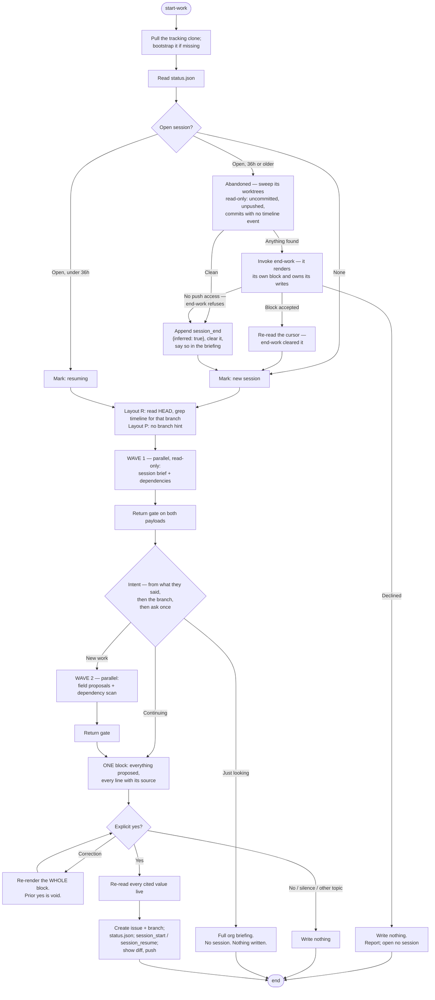

# Start Work

## Overview

Open a work session, decide what it's for, and brief the developer on it. A session is bounded by
start-work and end-work, **not by the calendar** — it may run twenty minutes or span several days,
and it may be one continuous sitting or a series of bursts.

**Announce at start:** "I'm using the start-work skill to open your session."

**READ *The Substrate* BELOW FIRST**, before touching anything under `<base>/.claude/`. It holds the
base resolution, paths, bootstrap procedure, cursor schema, and event format this skill depends on.

**REQUIRED SUB-SKILL:** Use gh-wrapper before running any `gh` command. It routes GitHub access down
a two-rung ladder — a `gh` flag, then `gh api graphql` — and nothing is reported
impossible until both have been walked.

## The Iron Law

```
LOOK IT UP, DON'T ASK IT.
EVERY VALUE HAS A SOURCE, SHOWN BEFORE IT IS WRITTEN.
THE DEVELOPER STILL DECIDES.
```

**Do the looking-up yourself.** The developer should not have to open the project board to answer
your questions. What blocks this thread, what the parent issue's dates are, what siblings carry, what
moved since they left — all of that is discoverable, and discovering it is your job, not theirs.

**Then show your work before you write it.** Every value you propose is rendered next to the source
it came from, and the developer says yes to the block. See **_The Substrate_ → Established vs.
guessed**: a value is established when it has a source, the source is shown, *and* the developer
accepted it — all three. Research moves the work; it does not lower the bar.

**The branch remains a hint, not a decision.** It collapses the common case to a single
confirmation. It never picks for them.

## What This Skill Owns

start-work **owns session lifecycle**: it is the only skill that opens a session, resumes one, or
closes an abandoned one. Recovery belongs here because a developer who abandons a session is, by
definition, one who did not run end-work.

**Owning the lifecycle is not owning the wrap-up.** start-work decides *that* an abandoned session
must be dealt with and *how* — but when the sweep finds real work in it, the reconciliation itself
is end-work's job and start-work invokes it (Step 2.5) rather than reimplementing a second, weaker
version of it here. The two skills meet at the cursor and nowhere else.

**Its write surfaces are three, per target-workflow §2:** branch creation and checkout, issue
creation with its fields, and the tracking clone plus cursor files. **It never modifies a product
repo's file contents, never rewrites an issue body, and never writes a PR.**

**PRs belong to end-work, and the reason is sequencing, not permission.** A PR needs commits, and
at start-work the branch has none — there is nothing to propose. end-work opens PRs over work the
developer has already pushed (target-workflow §2). If a developer asks for one here, say that.

## The Substrate

<!-- SUBSTRATE: the five principles, paths, bootstrap, tracks.yml, issue fields, and the event
     format are shared with end-work and snapshot — keep in sync. Sections marked (start-work only)
     are not. -->

### The Five Principles

When a case isn't covered, decide by these.

1. **State vs. event.** *State* is what is true now — status, assignee, blockers — and lives only in
   GitHub, fetched live, never cached. *Events* are what happened, when, by whom, and live only in
   the timeline, never re-derived from GitHub, because the past does not change.
2. **Pointer, not content.** A track's registry entry points at its parent issue plus the few facts
   GitHub cannot express. If a field exists on the issue, the registry does not store it.
3. **Append-only.** Timeline events are written once and never rewritten. A correction is a new event.
4. **No ranking.** Nothing generated compares people. No durations, ever.
5. **Out-of-band.** The record never lives on a branch of the work it describes. Branch identity is
   *data on an event*, never the *location* of one.

### Paths

Resolve three things once per run, before touching anything. Every path below follows
deterministically from them. **Nothing records these paths and nothing caches them.**

**1. The base** — the working directory the skill was invoked in, as an **absolute** path (`pwd`).
Resolve it once and reuse that absolute form everywhere. A bare relative path is not good enough:
this skill `cd`s into product worktrees to cut branches, and a relative base silently retargets the
moment it does.

**2. The layout and the repo set.** The base is one of two shapes, and one command tells you which:

```bash
git -C <base> rev-parse --show-toplevel 2>/dev/null
```

| Result | Layout | Repo set | Current repo |
|---|---|---|---|
| A path | **R** — the base is, or sits inside, an org repo | that one repo | it |
| Nothing | **P** — the base is a parent of org repo clones | every depth-1 child holding a `.git`, mapped to `owner/repo` from its remote | **none** |

**Layout R is the one-element case of layout P, not a separate mode.** Everything downstream reads
the **repo set** and, where it exists, the **current repo** — never "the repo you're standing in."
That phrase has no referent in P, which is why it is gone from this skill.

```bash
# layout P: build the repo set — one level down, no deeper
for d in <base>/*/; do
  git -C "$d" config --get remote.origin.url 2>/dev/null   # → owner/repo, plus the path
done
```

**Scan one level, never recursively.** A workspace's repos are its children; walking deeper turns a
`node_modules` or a vendored checkout into a candidate product repo.

**In layout P every child repo belongs to the org.** That is the assumed shape, so a child whose
owner differs from the rest is a violated premise, not a case to resolve silently — name it and ask
once.

**3. The org** — in this order, stopping at the first that answers:

| Source | How |
|---|---|
| The current repo's remote *(layout R)* | `git config --get remote.origin.url`, parsed for the owner |
| The repo set's remotes *(layout P)* | the owner they agree on. **They disagree → ask; never pick a majority** |
| A recorded answer | `<base>/.claude/tracking-org`, one line, the org login |
| The developer | Ask once, then **write it to `<base>/.claude/tracking-org`** so no later run asks again |

**A base with no git remote is normal, not an error.** In layout P the base itself never has one —
the org comes from its children. A base that is neither, with no children cloned yet, falls back to
the recorded answer, and that is the designed path rather than a degraded one.

| What | Path |
|---|---|
| Tracking clone | `<base>/.claude/.tracking/<org>/` |
| Session cursor | `<base>/.claude/<org>.status.json` |
| Org record | `<base>/.claude/tracking-org` |

The cursor lives **outside** the clone deliberately: a file that must survive a reclone, a
`git clean`, or a bad rebase inside that clone cannot live where the clone's own git operations reach
it. `<base>/.claude/<org>.snapshot.json` exists and belongs to `/snapshot` — **never open it.**

**The record is per working directory, not per machine.** Two directories on one machine each keep
their own clone and cursor, even for the same org — they share a remote, not a local state. The
consequence is worth stating because it will bite someone: **a session opened in one directory is
invisible from another.** Open and close a session from the same base. A session that looks missing
is usually a session opened somewhere else, not an abandoned one.

**The layouts are the common way to trip on this**, because they are two places one developer can
legitimately start from: the repo, or its parent. So in **layout R, before treating an absent
session as absent, check the parent** — one `ls`, no adoption:

```bash
ls <base>/../.claude/*.status.json 2>/dev/null
```

Found → say the parent holds a cursor and name the directory, so the developer can re-run there.
**Never read it, never adopt it, never write to it.** It belongs to that base, and a session opened
from the parent is closed from the parent.

### When the base is inside a git repo *(layout R)*

The record is **out-of-band** (principle 5) — it must never be committed into the work it describes.
So when `<base>` sits inside a git repo, exclude it, **using `.git/info/exclude`, not `.gitignore`**:

```bash
git -C <base> rev-parse --show-toplevel        # is there a repo, and where is its root?
# if there is, ensure these lines exist in <toplevel>/.git/info/exclude:
.claude/.tracking/
.claude/*.status.json
.claude/*.snapshot.json
.claude/tracking-org
```

**`.git/info/exclude` rather than `.gitignore` is the whole point.** `.gitignore` is a tracked file;
writing it would modify the product repo's contents, show up in the developer's diff, and land in
someone's commit. `.git/info/exclude` is local-only and untracked, so the exclusion costs the repo
nothing and the write surfaces below stay intact.

Check this every run and add any missing line, saying that you did. Note what is **not** excluded:
`.claude/skills/` and other project Claude config are ordinary tracked files and none of this
applies to them.

**In layout P there is nothing to exclude and nothing to check.** `<base>/.claude/` sits in no repo,
so the record is already out-of-band. **Never write exclusion lines into the child repos** — they
don't hold the record, and `.git/info/exclude` is not a file to touch on spec.

### Write surfaces — these three, and nowhere else

| Location | Writes permitted |
|---|---|
| `<base>/.claude/.tracking/<org>/` | The only place anything is committed or pushed — always after showing the diff. The yes was given at the confirmation block, not at the push. |
| `<base>/.claude/<org>.status.json` | Local cursor writes. No git involved. |
| Product repos | **Branch creation and checkout only.** No file contents modified, nothing committed, nothing pushed. `.git/info/exclude` is the one exception, and it is untracked by design — see above. |

**`<base>` being inside a product repo does not widen this.** The tracking clone is still the only
thing committed, and it is committed to `{org}/tracking` — never to the repo it happens to sit in.

Issues get created with their fields — that is this skill's documented job. Issue **bodies** are
never rewritten, and PRs are end-work's surface, not this one — a freshly cut branch has no commits
to propose.

### Bootstrap — every run

**B0. Resolve the base, the layout, the repo set, the org, and the exclusion.** All of it before any
path is used, in this order — the clone path is not computable until the org answers, and the org's
first two sources are the layout's.

```bash
pwd                                            # the base, absolute
git -C <base> rev-parse --show-toplevel        # layout R or P — and, in R, where to check the exclusion
git -C <base>/*/ config --get remote.origin.url  # layout P: the repo set, one level down
cat <base>/.claude/tracking-org                # org, recorded fallback
```

If no org source answers, **ask once and record the answer** — do not guess an org from a directory
name. A directory called `acme-web` implies nothing about which GitHub org owns it.

**B1. Is the clone present?**

```bash
git -C <base>/.claude/.tracking/<org> rev-parse --git-dir 2>/dev/null
```

Present → pull (B3). Missing → `gh repo view {org}/tracking` (a 404 means it does not exist).

**B2. Bootstrap.** Remote exists but no clone → `git clone https://github.com/{org}/tracking.git
<base>/.claude/.tracking/{org}`, and say you did it and where.

**Remote does not exist → offer to create it, and wait for a clear yes.** Creating a repo is
outward-facing and never happens implicitly.

```bash
gh repo create {org}/tracking --private --add-readme \
  --description "Org work tracking — track registry, event timeline, generated views"
```

Then clone it and seed three files in one commit. **The README is not optional — a shared record
whose format nobody can read is not shared.**

`.gitattributes` is exactly one line:

```
*.jsonl merge=union
```

`tracks.yml` starts empty:

```yaml
# Org track registry. See README.md.
tracks: []
```

`README.md` explains the format to anyone opening the repo cold: what `tracks.yml`,
`status-policy.yml`, `timeline/`, and `views/` are — noting that `status-policy.yml` does not exist
until the first board transition needs it, so its absence is normal in a fresh repo rather than
something to fix; that **state lives in GitHub and events live here**; that `tracks.yml` holds four fields
and becomes a second issue tracker if it grows more; that the timeline is append-only, one branch,
`merge=union` on `*.jsonl` only; that `views/` is generated and hand edits are overwritten; and that
there are no durations, no rankings, and no pruning.

**B3. Pull, every run.**

```bash
git -C <base>/.claude/.tracking/<org> pull --rebase
```

A clone left dirty by a previous run gets its own report line — never merged into the developer's
uncommitted-work blocker. Different problems, different fixes.

**No write-access check here.** start-work only reads the tracking repo until its final step, and a
developer without push rights still gets a full briefing.

### The tracking repo

```
{org}/tracking
├── README.md          ├── tracks.yml          └── views/          (generated)
├── .gitattributes     ├── status-policy.yml       gantt.md
                       └── timeline/               dependencies.md
                           YYYY-MM/<dev>.jsonl
```

**One branch, always** — never branched, force-pushed, squashed, or rebased. That linearity is what
lets principle 3 hold. One clone and one `status.json` serve every worktree on the machine.

`status-policy.yml` is written the first time a board transition is needed and no policy exists —
**not at bootstrap.** See *Board `Status` — the transition policy*.

### `<org>.status.json`

```json
{ "schema": 1, "org": "msa1624",
  "last_session": { "started_at": "2026-07-25T09:00:00Z", "started_repo": "msa1624/api",
                    "ended_at": "2026-07-25T18:20:00Z", "ended_repo": "msa1624/api" },
  "session": { "id": "2026-07-25-nilendu-01", "started_at": "2026-07-25T09:00:00Z",
    "threads": [ { "track": "payments-v2", "thread": "msa1624/api#43", "repo": "msa1624/api",
                   "branch": "feat/api-43-refunds", "worktree": "/Users/x/work/api" } ] } }
```

- **`last_session`** — the "since you left off" boundary. Not a calendar cursor; it carries no
  assumption the previous session was yesterday.
- **`session`** — the live session, absent when none is open. At most one at a time.
- **`session.threads[].worktree`** is load-bearing — end-work iterates it to enforce its iron law.
  Store an **absolute** path, never `~`-relative.

### Tracks & threads

A **track** is a set of related work (an epic); a **thread** is one unit inside it — one issue plus
its PRs, branches, and commits. Parent/child comes from GitHub **sub-issues**. A milestone is *not* a
track.

```yaml
tracks:
  - id: payments-v2
    parent: msa1624/api#38          # title, owner, dates all live here
    status: active                  # active | paused | done | abandoned
    exit_criteria: "checkout flow live for 100% of traffic"
```

**Four fields, per principle 2.** Title, owner, and dates live on the parent — follow the pointer and
read them live. `status` exists because an issue offers only open or closed, and a paused track is
not a closed one. **`exit_criteria` is required on every track**: without it a track never closes, it
just stops generating events and leaves a permanent bar on the Gantt.

### Issue Fields in this org

Every thread has an issue, and every issue carries the org's fields, **set at creation**.

**Discover at runtime — never hardcode:**

```bash
gh api /orgs/{org}/issue-fields   # org fields and their valid options
gh api /orgs/{org}/issue-types    # valid issue types
```

At the last check `msa1624` defined exactly these four. **Treat this as the expected result of that
call, not the definition** — if a run discovers a different set, the discovered set wins.

| Field | Type | Valid values |
|---|---|---|
| Priority | single-select | Urgent · High · Medium · Low |
| Effort | single-select | High · Medium · Low |
| Start date | date | `YYYY-MM-DD` — planned start |
| Target date | date | `YYYY-MM-DD` — planned finish |

Types are **Task · Bug · Feature**. There is no `Epic`; a track's parent is a `Feature` unless the
developer says otherwise, and it is a track because `tracks.yml` points at it.

**`Size` and `Estimate` are not defined in this org. Do not invent them.** Effort is the only sizing
signal. If a role has no field, **say so** — never approximate it with a neighbouring field that
happens to accept a write.

**Relationships** is not an Issue Field; it is the dependencies API, writable at rung 1
(`gh issue edit --add-blocked-by`, URL form for cross-repo). **A dependency that research *found* is
not one a session *hit*:** a discovered blocker goes on the issue and **nowhere else**. Only a
blocker a session actually ran into becomes a `blocked` timeline event, which end-work writes.

**Finding a candidate is not declaring one.** Research searches the org's open issues in both
directions — Brief 4 — and searches broadly, because a blocker two repos over is the one nobody
finds by hand. But **retrieval is not evidence.** A shared label, a shared milestone, a similar
title, or two issues touching the same file are fine ways to *find* a candidate and no reason at all
to *declare* an edge. What reaches Relationships is what carries a quotable **direction**: a
sentence saying which way round the two pieces of work go. That gets written without asking and
reported with its quote and a one-line undo — the same rule end-work applies to mirroring a
`blocked_by`, for the same reason. A question with one sensible answer is load, not consent.

### Projects v2 board membership

**Board membership is a fourth mechanism, and the board item's own fields — `Status` among them —
are a fifth.** Issue Fields, Milestone, and Relationships are all visible on the issue the moment you
look at it. The last two are not: an issue on no board looks completely normal, and only the people
planning off that board ever notice it is missing. **They also fail independently** — the add can
land and the `Status` write still be lost. gh-wrapper carries the full five-mechanism table.

**Discover the org's projects once per run, alongside the fields** — gh-wrapper carries the ladder,
the personal-account root, and the idempotency note:

```
gh api graphql -f query='{ organization(login:"{org}"){
  projectsV2(first:20){ nodes{ number title id } } } }'
```

Then treat the result as a line in the confirmation block like any other:

| Discovery | The block shows |
|---|---|
| No project | Nothing to link. Say so once; do not treat it as a failure. |
| Exactly one project, issue would not be on it | Propose the link, `←` the discovery |
| Several projects | `— ask`, listing them. **Never pick one.** |

**Never skip the link because an auto-add workflow probably caught it.** Those workflows are scoped
to some repos and not others, and the scope is not readable from here — an issue created in a repo
outside the scope lands nowhere, which is exactly how a board silently drifts. Adding is idempotent,
so linking something already on the board costs nothing.

**gh-wrapper reports; this skill links.** gh-wrapper has no confirmation surface, so it discovers
and hands back `on_project: true|false` rather than writing. The write happens here, after the block
is accepted, like every other write in this skill.

### Board `Status` — the transition policy

**Membership puts a card on the board; it does not move it.** An item sitting in `Backlog` while its
branch has been cut for a week is the same silent drift as an item on no board at all — it looks
tracked, and everyone planning off that column is reading something false.

`Status` is a board-native single-select (gh-wrapper → *Projects v2 Item Fields*), and the Iron Law
forbids guessing one. **A policy is what makes it not a guess.** `status-policy.yml` in the tracking
repo maps this workflow's lifecycle moments to option names on one board:

```yaml
project: 2                  # the board number this policy governs
field: Status               # the board-native field it drives
transitions:
  issue_created:  Backlog        # start-work
  branch_created: In Progress    # start-work
  resumed:        In Progress    # start-work
  blocked:        Blocked        # end-work
  unblocked:      In Progress    # end-work
  pr_opened:      In Review      # end-work
  handoff:        In Review      # end-work
  done:           Done           # end-work
```

**start-work owns `issue_created`, `branch_created`, and `resumed`.** The rest are end-work's, and
neither skill fires the other's moments.

| Situation | Rule |
|---|---|
| The file is **absent** | The policy is undefined. Render the transition `— ask`, with a suggestion built from the board's **actual** option list, and write the file once the developer says yes. A one-time cost, not a per-session question. |
| A **key** is absent | **Leave `Status` alone at that moment.** Absent means "no transition here" — never "work it out". A board with no `Blocked` column is normal, not a gap to fill. |
| A value names an option the board **no longer returns** | **Stale policy.** Report it by name, write nothing, and re-ask that one key. Never substitute a neighbouring option that happens to accept the write. |
| Several boards carry the item | One policy per board — `project` keys it. A board with no policy gets no transition and one report line. |
| The item is **already** at the target option | No-op. Don't write it, and don't report it as a change that happened. |
| The item is on **no** board | Nothing to transition. The membership line above already covers it. |

**The policy stores option names; the API takes option ids.** Resolve one to the other from *this
run's* discovery (gh-wrapper → *Discover the board's fields at call time*) — a name that doesn't
resolve is the stale-policy row, not a reason to guess an id.

**A policy-derived transition is `derived`, not inferred.** The policy is a source, so the line
renders `← status-policy.yml` and is covered by the single yes like every other line in the block.
It is never a separate gate — and never a silent write. A `Status` that moves without appearing in
the block is exactly the fabrication the Iron Law exists to prevent.

**Do not seed this file at bootstrap.** Its absence is the trigger to ask; an empty `transitions: {}`
reads as "leave everything alone" and would silently make the whole mechanism inert.

### Board-native fields other than `Status`

**`Status` gets a whole section because it has a lifecycle, not because it is the only one.** The
board returns a set, and every field in that set falls under the Iron Law exactly like the org's
Issue Fields do — filled from a source, proposed as a marked guess, or reported unset by name. The
sections above describe `Status` at length and `Size`/`Estimate` as absent *in this org*; neither
statement bounds the set. **If discovery returns a field this file never names, it still gets a line
in the block.** A field nobody wrote a paragraph about is the one that goes blank.

**An iteration field is the case to expect, and it is identified by `dataType: ITERATION` — never by
its name.** Boards call it `Sprint`, `Cycle`, or `Iteration`; msa1624's board #3 calls it `Sprint`.
Looking for a field *named* "Iteration" is how you skip one that is right there. A board with an
iteration field files every card into a sprint, and a card with no iteration is in no sprint —
invisible in the one view that field exists to feed, and invisible in exactly the way an empty
`Status` is. It is board-native, so gh-wrapper writes it with `updateProjectV2ItemFieldValue`
(gh-wrapper → *Iteration fields*), picking from `configuration.iterations`, never from
`completedIterations` and never by title.

Unlike `Status`, it needs no policy file: **the iteration whose window contains today is derived
from the board's own `startDate` and `duration`,** so the line renders
`← board #3: Sprint 1, today 2026-07-27 falls in its 07-27 → 08-09 window` and is covered by the
single yes. A developer who plans work into the next sprint corrects it in four words, like any
other line. Render it `?` only when the dates genuinely don't decide it — a create sitting on a
sprint boundary, or a board whose iterations have lapsed.

**An iteration field with no iterations configured is reported unset by name**, with the reason. That
is the true-empty case, and it is a different sentence from a query that never asked for the values —
gh-wrapper carries the distinction.

### Established vs. guessed

A value is **established** when three things are true:

1. It has a **source** — a live-read issue field, a counted set of timeline events, a structural
   fact, or the calendar.
2. The source is **shown to the developer**, in one line, beside the value.
3. The developer **said yes after seeing it.**

All three. Missing any one, it is **guessed** — and a guessed value is still *proposed*, marked `?`
with the thin source it leaned on, and written once the developer accepts the block. What it is
never is **silent**: an unmarked guess is indistinguishable from an established value, and that is
the thing this section exists to prevent.

Condition 2 is what makes this safe, and it is why filling every field costs the developer one yes
rather than one question per field. **Skipping the field instead of guessing does not satisfy the
bar — it just fails quietly**, and a blank field is the one failure nobody reviews.

Research does not lower the bar — it moves the work. You do the looking-up; the developer does the
accepting. What is never permitted is the middle: a plausible value with a rationale invented
afterwards to justify it, or a guess dressed as a derivation.

**The order is load-bearing: source, then value. Never value, then rationale.**

| Class | What it is | Renders |
|---|---|---|
| **Derived** | the source states the value, or a stated rule maps it | `←` and the source |
| **Inferred** | the source is only suggestive | `?` and the source, **re-listed** in a closing line |
| **Unsourced** | nothing establishes it, no precedent exists | for a **field value**: still a best guess, `?`, with the thin source named — the block stays acceptable. For a **structural choice** (which repo, which board, an undefined policy): `— ask`; there is nothing to guess from and picking one invents a fact. |

### Event timeline

`timeline/YYYY-MM/<dev>.jsonl` — one JSON object per line, newline-terminated, no blank lines. Two
developers never touch the same file; the same developer on two machines can, and `merge=union`
resolves it.

start-work writes **`session_start`**, **`session_resume`**, and **`branch_created`**.

```jsonl
{"schema":1,"ts":"2026-07-25T09:02:11Z","session":"2026-07-25-ali-01","dev":"ali","event":"session_start","mode":"resume_same","threads":1}
{"schema":1,"ts":"2026-07-25T09:14:00Z","session":"2026-07-25-ali-01","dev":"ali","event":"branch_created","track":"payments-v2","thread":"msa1624/api#41","repo":"msa1624/api","branch":"feat/api-41-checkout","title":"checkout endpoint"}
{"schema":1,"ts":"2026-07-25T14:02:00Z","session":"2026-07-25-ali-01","dev":"ali","event":"session_resume","mode":"fan_out","threads":2,"threads_added":["msa1624/web#22"]}
```

| Field | Rule |
|---|---|
| `schema` | always `1` today, so the format can evolve without breaking readers of old files |
| `ts` | UTC, ISO 8601, always — local time makes cross-timezone charts lie |
| `session` | the id shared by every event in one sitting; this is what stitches a session together across tracks, branches, and repos |
| `dev` | the GitHub handle the work is attributed to |
| `track` · `thread` · `repo` · `branch` | thread-scoped events only. `thread` is always `owner/repo#N`, never bare `#N`. `branch` is `null` on `main`/detached, and **never inferred later** |
| `title` | `branch_created` only: the thread's title as of when work started. A label for the views, never refreshed |
| `mode` | `session_start` and `session_resume`: `resume_same` · `fan_out` · `handoff` · `new_track`. On a resume it describes *that resume* |
| `threads` | `session_start`: threads opened with. `session_resume`: the total **after** the resume |
| `threads_added` | `session_resume` only: array of `owner/repo#N` picked up. **Omitted, not `[]`**, when none |
| `inferred` | `true` only on a synthetic `session_end` for an abandoned session. Never on a recorded event |

**Session-scoped vs. thread-scoped.** `session_start`, `session_resume`, and `session_end` describe
the sitting, so `track`/`thread`/`repo`/`branch` are **omitted** — not set to null. `threads_added`
is what lets a resume record *which* thread joined while staying session-scoped.

`branch_created` is its own event type rather than a flavour of `progress`: it fixes a thread's
actual start date, and the Gantt's bars begin there.

**No duration or hours field, ever.** Session boundaries place work on a Gantt at day granularity; a
computed "time worked" is the raw material for exactly the comparison principle 4 rules out.

### Session ids *(start-work only)*

`YYYY-MM-DD-<dev>-NN`, `NN` zero-padded. Derive it by counting `session_start` events already in
`timeline/YYYY-MM/<dev>.jsonl` whose `ts` falls on that date, and adding one. **Never reuse an id.**

### Handoff scan *(start-work only)*

A `handoff` event is written by the **sender**, into the sender's own month file — the recipient's
file has no record of it. Finding one means reading other people's files, which is why the scan needs
a stated bound.

**Bounds: this month and last, all developers.** The clone is local, so this is a grep:

```bash
grep -h '"event":"handoff"' \
  <base>/.claude/.tracking/<org>/timeline/{<this-month>,<last-month>}/*.jsonl
```

Filter to `to == <this dev>`, then drop any whose `thread` has a later `done` event or reads closed
live — a handoff already picked up is not pending. **State the bound in the output**: "1 handoff
waiting (scanned June and July)." Widen only on request, and say that you did.

### Branch naming *(start-work only)*

`<type>/<repo-shortname>-<issue#>-<slug>` — `feat/api-41-checkout`, `fix/platform-12-ratelimit`.
`<type>` is `feat`, `fix`, `chore`, or `docs`. `<slug>` is the issue title lowercased,
non-alphanumerics collapsed to `-`, trimmed to roughly three words.

Generate every branch this way, so the branch→thread link is recoverable **from the name alone**,
with no lookup table to maintain.

### Guardrails

- **Verifiable, not trusted.** Every `progress` event carries commit SHAs; one without renders
  visibly softer in the views.
- **No leaderboards, ever.** Every developer's log sits in one repo, which is what makes the org view
  work and principle 4 easy to violate.
- **Keep everything, forever.** No compaction, no pruning — an append-only log rewritten on a
  schedule is not append-only.
- **The timeline stays event-shaped.** If `tracks.yml` accumulates statuses or assignees, it has
  become a second issue tracker and principle 2 is gone.

## The Process



### Step 1: Preflight

Resolve the layout and repo set, derive the org, bootstrap the clone if missing, `git pull --rebase`.
See **_The Substrate_ → Paths** and **→ Bootstrap**. Say which layout you're in and how many repos
are in scope — it explains the presence or absence of the branch hint before anyone wonders. No write-access check here — start-work only
reads the tracking repo until its final step, and a developer without push rights still gets a full
briefing.

Get the developer's handle with `gh api user --jq .login`.

### Step 2: Resolve the Session

Read `<base>/.claude/<org>.status.json`.

| `session` field | Age of `session.started_at` | What you do |
|---|---|---|
| Absent | — | New session. |
| Present | Under 36h | **Resume it.** Same id, same threads. Append `session_resume`. |
| Present | 36h or older | **Abandoned.** Recover it (Step 2.5), then open a new one. |

**A session still in the cursor is one end-work never closed.** end-work's last step moves `session`
into `last_session` and clears it, so a session sitting here means the wrap-up never ran — that is
what "abandoned" means, and it is why recovery lives in this skill.

**An open session is stale after 36h without a close.** The threshold marks abandonment, not a
calendar boundary: a session left open that long was walked away from rather than paused, since
anyone still working it would have triggered start-work again inside the window and resumed it.

**Re-running start-work on a live session resumes it rather than restarting.** Append
`session_resume` and continue with the same id, so a later burst lands inside the existing session
instead of forking a second one covering the same work.

### Step 2.5: Recover the Abandoned Session *(start-work only)*

**Sweep before you clear.** A synthetic `session_end` on its own records only that the session
stopped — not the work inside it. Everything between the last event and the close is lost, and
**clearing the cursor is the step that makes it unrecoverable**: end-work's window is
`session.started_at`, falling back to *midnight today* when no session is open, so once this cursor
is cleared a later end-work run computes a window that excludes exactly the commits that were
missed.

So look first. All of this is read-only and costs two git commands per worktree:

```bash
git -C <worktree> status --short                          # uncommitted
git -C <worktree> log --oneline @{upstream}..HEAD         # unpushed — no upstream means never pushed
git -C <worktree> log --since="<session.started_at>" --oneline
```

Then grep the stale session's month file for events carrying its `session` id, and compare: commits
in the window with no `progress` event behind them are the unrecorded work.

| Sweep result | What you do |
|---|---|
| Clean tree, nothing unpushed, nothing unrecorded | **Close it synthetically**, one line in the briefing. Nothing was lost, so there is nothing to decide. |
| **Anything found** — uncommitted, unpushed, or unrecorded commits | **Invoke end-work**, before anything else is written |
| A worktree listed in `session.threads[]` is gone from disk | Report it as its own line and keep going. A vanished worktree is a finding, not a reason to skip the rest of the sweep. |

#### The synthetic close

```json
{"schema":1,"ts":"<now>","session":"<the stale id>","dev":"<dev>","event":"session_end","threads_touched":<count from its threads[]>,"repos_touched":<distinct repos>,"inferred":true}
```

Append it to the stale session's **own month file** — `timeline/YYYY-MM/<dev>.jsonl` keyed on
`session.started_at`, not on today — then move it into `last_session`, clear `session`, and say so
in the briefing. Never set `inferred` on an event that was actually recorded.

#### The hand-off to end-work

**Run it. Do not offer it.** The findings are on disk, the developer is about to start new work on
top of them, and asking permission to *look properly* at work already done is a question with one
sensible answer. What the developer still controls is every write end-work makes — **end-work
renders its own confirmation block and nothing lands until they accept it.** That block is the gate;
adding a second one in front of it is the pattern this workflow removes everywhere else.

```
Skill(skill: "end-work")
```

**The cursor is the entire hand-off protocol.** Pass nothing, explain nothing, share no state:
end-work reads `<org>.status.json` exactly as it always does, finds the stale session, and derives
its window from `session.started_at` — which is precisely the window the sweep just showed you.
A hand-off that needed arguments would be a second implementation of end-work living in this file.

**Say what you are doing and why, in one line, before invoking** — a developer who typed "start
work" and got a wrap-up block deserves to know which session it belongs to:

```
Session 2026-07-22-nilendu-01 was left open 84h and never wrapped up.
3 unpushed commits in ~/work/api and 4 commits with no timeline events.
Running end-work over it first — you'll get its block before anything is written.
```

**Four rules for what happens around the call:**

1. **Do not open the new session first.** end-work closes whatever is in the cursor; if this run has
   already written a new `session`, it closes the wrong one and the stale session survives.
2. **Re-read the cursor when it returns.** end-work's Step 9 moved `session` into `last_session` and
   cleared it. Your earlier read is stale, and acting on it opens a session on top of one that no
   longer exists.
3. **No push access → no hand-off.** end-work stops before writing anything in that case, by design.
   Fall back to the synthetic close, and report both the sweep's findings and why the proper wrap-up
   could not run.
4. **A declined block writes nothing — including from this skill.** If the developer says no, says
   nothing, or changes the subject, end-work writes nothing and the cursor still holds the stale
   session. **Do not then close it synthetically, and do not open a new session**: they have just
   been shown exactly what would be recorded and declined it, and discarding it anyway would make
   their "no" mean the opposite of what they said. Report that the session is still open, name the
   two ways forward — wrap it up properly, or say "close it as abandoned" — and stop, having written
   nothing. Next run will find it and offer again, which is correct: the work still isn't recorded.

**Recovery never recurses.** end-work does not invoke start-work, and start-work invokes end-work
only from this step, only for a session 36h or older, and only once per run.

### Step 3: Read the Branch as a Hint *(layout R only)*

```bash
git -C <current repo> rev-parse --abbrev-ref HEAD
git -C <current repo> status --short
```

Branches created by this skill are named `<type>/<repo>-<issue#>-<slug>`, so the thread is
recoverable from the name alone. Confirm it against the timeline:

- Grep the timeline for events carrying this `branch`.
- Found → pre-fill the default: *"You're on `feat/api-41-checkout`, so track `payments-v2`, thread
  `msa1624/api#41`, last touched Thursday by you."*
- Not found → no pre-fill.

**The branch lookup is a hint, not a decision.** It pre-selects a default; the developer can always
choose otherwise. Standing on `main` with a clean tree simply means no pre-fill.

**In layout P this step does not run.** There is no current repo, so there is no branch to read and
no pre-fill to make — say so in one line ("no branch hint; the base is a workspace of 3 repos") and
resolve intent from what the developer said. **Never run `rev-parse` from a layout-P base and never
substitute a child repo's branch for it**: N children have N branches, none of them "the" one, and a
hint picked from an arbitrary child is a confident pre-fill with nothing behind it.

### Step 4: Research — Wave 1 (before you ask anything)

**Spawn two `Explore` subagents in one message, in parallel.** Their output is what the developer
reads *instead of* going to the project board. Give each the shared preamble below plus its brief.

Also grep locally, which no subagent should do for you: this branch's timeline events, and pending
handoffs per *Handoff scan* above (state the bound).

Discover the fields once here — `gh api /orgs/{org}/issue-fields` — and pass the result into both
briefs. **No subagent runs its own discovery**; two discoveries can disagree and the block would show
one schema built from two.

**Discover the org's projects in the same step**, per *The Substrate* → Projects v2 board membership.
It is one cheap query, it has the same never-hardcode rule, and doing it here means the confirmation
block can carry the board line with a source instead of the issue quietly landing on no board.

#### Shared preamble — goes in every brief

```
You are a READ-ONLY research agent. Return findings; never act on them.

NEVER call setIssueFieldValue, addProjectV2ItemById,
updateProjectV2ItemFieldValue, any GraphQL mutation, or gh issue
edit/create/close/comment, gh project item-add/item-edit, or
gh pr create/edit/merge/review. If something seems to need one, return it in asks[] —
never as an action. You CAN call these tools; not calling them is the rule you are
being held to.
DO NOT read the timeline, status.json, or tracks.yml. Everything you must compare
against is supplied in your INPUT. Sourcing both sides of a comparison yourself
destroys the comparison.

Ladder: gh flag → gh api graphql. Never report something unreachable
without walking both and naming both.
Cross-repo blocker rollups start at rung 2 by ROUTING, not escalation — one GraphQL
query costs 1 point where the REST equivalent is 18 requests. Say rung_reason "routing".
NEVER read issue_dependencies_summary to decide whether something is blocked; it lags
a write by ~1s and returns 0. Read dependencies/blocked_by or GraphQL blockedBy.
The fields are blockedBy / blocking on Issue — NOT blockedByIssues.
HTTP 200 can carry an "errors" key. Check every response whatever the exit code.
Nulls under errors are FAILURES, not absences — they go to not_covered[].
On a personally-owned account Issue Fields and issue types are ABSENT, not restricted.
Empty is the complete answer; do not escalate.

Every reference is owner/repo#N. Never bare #N, even within one repo.
Return exactly one fenced json block as your LAST message, in this envelope:
{ "agent","status":"ok|partial|failed","rung","rung_reason","covered":[],
  "not_covered":[],"surface_log":[{"call","rung","class":"read","ok"}],
  "asks":[],"unavailable":[],"data":{} }
covered/not_covered are MANDATORY. A thread you could not read goes in not_covered —
never reported as having nothing to report.
```

#### Brief 1 — session brief

> **Purpose.** What changed since a given moment, and where the named threads stand right now.
>
> **INPUT you supply:** `since` (from `last_session.ended_at`), `threads[]`, `fields[]` (this run's
> discovery), `dev`.
>
> **The boundary is passed in. Never source or invent one.** `since: null` is legal and means no
> prior wrap-up on record: return `moved: []`, note it in `unavailable[]`, and **still return thread
> standing**, which needs no boundary.
>
> **`data`:** `moved[]` — `{ref, kind, title, what, actor, ts, url}`, where `what` says what actually
> changed ("approved by @ali; checks green"), never that a timestamp moved. `awaiting_you[]` —
> `{ref, kind, why, excerpt, ts, url}`. `thread_standing[]` — `{thread, title, state, assignees,
> labels, fields[], open_prs[{ref, review_state, reviewers}]}`.
>
> **`awaiting_you` is the highest-value thing here** — it is exactly what the developer would
> otherwise hunt for. From evidence only: a review requested and not submitted; a comment mentioning
> them or a direct question on a thread they're assigned, with no later reply; a PR of theirs
> approved and mergeable, or with changes requested. **Never "this looks like their area."**
> `excerpt` is a direct quote, one line. `fields[].value: null` means the issue lacks that field —
> a finding, not a row to omit.

#### Brief 2 — dependencies

> **Purpose.** What blocks these threads, right now.
>
> **INPUT you supply:** `threads[]`, `org`, `project_number` if there is one.
>
> **`data`:** `declared[]` — `{thread, blocked_by[{ref, state, title}], blocking[], source}` where
> `source` names where you read it. `prose_hints[]` — `{thread, location, url, text, refs[]}` for
> `#N` references and "blocks"/"depends on" phrasing in bodies and comments; these are **hints, not
> declared dependencies**, so keep them out of `declared`. `ready_now[]` — `{thread, was_blocked_by,
> why}` for threads whose every declared blocker reads closed. `still_blocked[]` — `{thread, by[],
> blocker_state}`.
>
> `ready_now` and `still_blocked` are the point: they let the briefing say where things stand without
> anyone opening the board.
>
> **Never *declare* a dependency you inferred.** A shared label, a shared milestone, a similar title,
> or two issues touching the same file establish nothing, and nothing built from them enters
> `declared[]` — that key carries only what the dependencies API returned. Directional prose goes to
> `prose_hints[]`, quoted.
>
> **Searching for new candidates is Brief 4's job, and its results never arrive here.** This brief
> reports the graph as it stands.

#### The return gate — run before rendering a line

| Gate | On failure |
|---|---|
| **Envelope** parses and carries every required field | Treat as no-return. **Never scrape values out of prose.** |
| **Write-class** — every `surface_log[].class == "read"`, no `call` matching `setIssueFieldValue`, `addProjectV2ItemById`, `updateProjectV2ItemFieldValue`, `^mutation`, `gh issue (edit\|create\|close\|comment)`, `gh project item-(add\|edit)`, `gh pr (create\|edit\|merge\|review)`, `gh api --method (POST\|PATCH\|PUT\|DELETE)` | **Discard the whole payload** and tell the developer a read-only agent attempted a write. Do not retry silently. |
| **Existence** — every `owner/repo#N` resolves | Drop the ref and say so. Distinguish "does not exist" from `data: null` **with an `errors` block at HTTP 200** — that is a permissions or transient failure, not a hallucination. |
| **Discovery** — every field name is in this run's org `issueFields` list | Drop it; report that field unset, naming it. |
| **Reference form** — matches `^[\w.-]+/[\w.-]+#\d+$` | Reject the record rather than guessing the owner. |
| **Ladder honesty** — any unreachability claim is backed by **both** rungs | Unproven. **Re-walk the ladder yourself** before reporting anything unset. |
| **Coverage** — `not_covered[]` is printed | Never omit it. |

**Failure modes.** No return or prose → retry **once** narrowed, then run the inline procedure below
yourself and say the briefing ran degraded. Partial with populated `data` → use it, and print
coverage. Hallucinated ref → drop it, name it. Agents disagree → **never pick a winner silently**;
the more specific query wins and the disagreement is reported.

**Nothing a subagent returns is a receipt.** Every write in this skill happens here, in the main
conversation, after the block is accepted.

Wave 1 must land **before** the intent question, because its output is an input to that question —
that is the join point. It costs nothing on a "just looking" run and **writes nothing**; research
results are never persisted.

**The boundary is read, never invented.** `since` comes from `last_session.ended_at` and is passed
down; the agent is forbidden from substituting one.

| What you read | What you say |
|---|---|
| `ended_at` under 36h old | "Since you wrapped up 2026-07-24 18:40 UTC: …" |
| `ended_at` older | Say how old it is and that it's advisory. Report against it anyway. |
| Absent or malformed | Say there's no prior wrap-up on record. Skip the line; thread standing still renders. |

If an agent fails, retry once narrowed, then run the inline procedure below yourself and say the
briefing ran degraded. **The sections below are both the specification and the fallback.**

### Step 5: Resolve Intent, Then Propose Once

**Intent resolves from three sources, in priority order. Only the third is a question.**

1. **What the developer said when they triggered the skill.** "start work on refund idempotency"
   already answers *new work* and names it. "pick up where I left off" answers *continuing*. This is
   the common case, and it needs no question at all.
2. **The branch**, per Step 3.
3. **Neither** → ask once: continuing, something new, or just looking?

**Q2 and Q3 are no longer questions.** The alternatives they used to offer — other in-flight threads,
a waiting handoff, an existing track vs. a new one — are *named in the confirmation block* as things
the developer can switch to. They read a proposal and either accept it or say what to change, rather
than walking a menu.

#### "Continuing existing work"

Wave 1 already gathered everything this needs. The block proposes one option and **names the rest**:

| Option | Where it comes from |
|---|---|
| **This branch's thread** — proposed when Step 3 found it | the branch name + its timeline events |
| **Other in-flight threads** | the session brief's thread standing across all tracks and repos. Named as alternatives; if the developer picks several, that's `fan_out` — one `session.threads[]` entry each, every branch checked out |
| **Someone's handoff** | the bounded scan in **_The Substrate_ → Handoff scan**. Show the carry-over note, the branch they left it on, and which months you scanned |

Mode for the event: `resume_same` for one thread, `fan_out` for several, `handoff` when picking up
someone else's work.

#### "Starting something new"

| Sub-choice | What you do |
|---|---|
| **Task in an existing track** | Propose the track from `tracks.yml`, with why → sub-issue under its `parent` → branch. |
| **Brand new track** | Parent issue → `tracks.yml` entry → first sub-issue → branch. |

**When `tracks.yml` is empty, "task in an existing track" is not offered.** The flow degrades to
"brand new track" with no special case.

#### Which repo hosts the thread

The issue is created in a repo and the branch is cut in a worktree, so both need a repo **and its
local path**, each with a source like every other line in the block:

| Case | The block shows | Source |
|---|---|---|
| Layout R | the current repo | `← you're standing in ~/work/api` |
| Layout P, one plausible host | that repo set entry | `← <base>/api, remote msa1624/api` |
| Layout P, several plausible | `— ask`, listing the repo set | — |
| The track's other threads sit in one repo, and it's in the set | that repo | `← 2 open threads in payments-v2, both in msa1624/api` |
| The repo isn't in the set at all | `— ask` — **offer to clone it into `<base>/<name>`** | — |

**Cloning a missing repo is a read, so it is allowed — but it is not silent.** It appears as its own
line in the block and happens only on the yes, like every other write in this skill.

**Never cut a branch in a repo that is not in the repo set.** The path would come from somewhere
other than this run's resolution, and `session.threads[].worktree` — which end-work iterates to
enforce its iron law — would point at a directory this skill never verified exists.

**`worktree` is the repo set entry's absolute path** (in layout R, the current repo's root). Never
`~`-relative, never `<base>` plus a guessed directory name: a repo's local directory need not match
its GitHub name, so read the path from the set rather than composing it.

**Wave 2 — dispatch Briefs 3 and 4 now, in one message, in parallel**, once the work has a name.
Neither can merge into Wave 1: both depend on what the developer just decided, and running them
speculatively would research an issue that may never exist. Brief 4 additionally needs a title to
draw search terms from, which does not exist until here.

**Run the sibling enumeration once, here, and pass the result into both briefs.** One GraphQL
request returns the parent, its sub-issues, and every sibling's declared edges — see gh-wrapper's
*Searching Issues*. This is the discover-once rule that already governs the field schema: two agents
enumerating independently can return two sibling sets, and the block would show one.

**Briefs 3 and 4 run under opposite defaults, which is why they are two briefs.** Brief 3 must fill
every row — returning `null` because the evidence felt thin is a contract violation. Brief 4 must
drop every row that lacks a quoted direction, and an empty return is the correct answer more often
than not. One agent cannot hold both instructions without one of them decaying.

#### Brief 3 — field proposals *(Wave 2)*

Shared preamble, plus:

> **Purpose.** Map this org's discovered fields onto the workflow's roles, and propose a value for
> each **with its source**, classified by how well-founded it is.
>
> **INPUT you supply:** `fields[]` (this run's discovery), `types[]`, `issue_intent` (title, track,
> parent, type intent), `established[]`, `precedent_scope` (`siblings_of`, `max_siblings`).
>
> **`established[]` is verbatim quotes from this conversation, with the role each maps to.** You
> cannot see the conversation — that is deliberate. It makes "did the conversation establish this?" a
> mechanical check against a list rather than an impression.
>
> **`data`:** `roles{}`, `unfilled_roles[]`, and `fields[]` where each entry is
> `{name, type, options[], role, proposed, provenance, rationale, evidence[]|candidates[]}`.
>
> | `provenance` | When | `proposed` |
> |---|---|---|
> | `established` | a verbatim maps to exactly one valid option, **no interpretation** | the value |
> | `precedent` | not established, but siblings under the same parent agree | the precedent value |
> | `inferred` | nothing established, no precedent, **or any interpretation required** | **your best guess**, runner-up in `candidates[]` |
> | `role_unavailable` | the org defines no field for this role | `null`, role named in `unfilled_roles` |
>
> **Every field gets a value. `role_unavailable` is the only class that may propose `null`** — there
> is no field to fill, so there is nothing to guess. Returning `null` for `inferred` because the
> evidence felt thin is a contract violation and fails the whole payload: thin evidence is what
> `inferred` is *for*, and the developer correcting one marked line is cheaper than answering a
> question for every field.
>
> **The obligation that replaces "don't guess" is `rationale`.** An `inferred` value must name what
> it was inferred *from* — the sibling, the parent, the phrase in the conversation, the convention.
> An inferred value with no traceable rationale is a fabrication, and that still fails the payload.
>
> The row that shows the shape: "by the 8th of August" needs interpretation — which year, and is "by
> the 8th" the 8th or the 7th? It is `inferred`, `proposed: "2026-08-08"`, with the reasoning in
> `rationale` and `"2026-08-07"` in `candidates[]`. It renders as a marked line the developer can
> overturn in four words, not as a question they must answer before anything can happen.
>
> **`rationale` names a source; it never restates the value.** "High because it's important" is not a
> rationale — "parent #38 is High, sibling #43 is High" is. **Account for every field discovery
> returned**; a field with nothing solid to say is still a row, `inferred`, with an honest rationale
> naming the weak source it leaned on.
> `Milestone` and `Relationships` are **not** Issue Fields — never return them in `fields[]`. Cap
> sibling reads at `max_siblings`; precedent from one sibling is not precedent.
>
> **Relationships are not this brief's output.** Brief 4 owns every dependency proposal, in both
> directions. Return none here — two briefs proposing edges is two sets to reconcile in a block that
> shows one.

Add one gate for this payload: **Provenance** — every non-`role_unavailable` row carries a non-null
`proposed` and a `rationale` naming a real source, and any row claiming `established` has its
verbatim really appearing in this conversation. **All four classes reach a write; the developer's
yes is what authorizes them.** What the gate enforces is *labelling*, not suppression: a row
claiming `established` on an interpreted value is demoted to `inferred` and rendered `?` — never
dropped, never silently promoted.

#### Brief 4 — dependency scan *(Wave 2)*

Shared preamble, plus:

> **Purpose.** Search the org's open issues for work this thread might depend on, and work that might
> depend on it. **Both directions.** Return only what carries a quoted direction.
>
> **INPUT you supply:** `org`, `repo`, `parent`, `siblings[]` (this run's single enumeration, with
> their declared edges), `issue_intent` (title, artifacts), `terms[]`, `established[]`,
> `already_declared[]` (Brief 2's `declared[]` if this thread has one), and
> `caps {queries: 3, first: 20, page: 1}`.
>
> **`terms[]` is supplied. Never invent one.** Morphological variants of a supplied term are fine; a
> new concept is not. An agent that chooses its own search terms and then reports what they found has
> sourced both sides of the comparison, which is the thing the preamble forbids one paragraph up.
>
> **Run at most three searches, page one only.** One term search across the org, and up to two
> reference searches for literal mentions of the parent and the siblings. Never open a cursor. See
> gh-wrapper's *Searching Issues* for the query shapes — prefer GraphQL by routing, because it
> returns each hit's `blockedBy`/`blocking` in the same request.
>
> **`data`:** `scanned` (int — how many distinct issues the queries returned), `queries[]` —
> `{shape, query, scope, returned, page}`, `written {blocked_by[], blocking[]}`,
> `artifact_only` (int), `discarded` (int).
>
> Each entry in `written` is `{issue, title, state, url, evidence_class, evidence_quote,
> evidence_source}`. Every `blocking[]` entry additionally carries `lands_on` — the assignee or
> author of the issue the edge would appear on.

##### The bar — what counts as a real dependency

> A search cannot certify a dependency. A **human statement of direction** can. So the bar is:
> *someone said this work comes after, or before, that work — and the sentence can be quoted.*
>
> | `evidence_class` | What it is | Admissible? |
> |---|---|---|
> | `ordering_prose` | Directional language naming this work or its artifact, quoted verbatim from the candidate's title, body, or a comment — "blocked on X", "waiting on X", "after X lands", "unblocks X" | **written** |
> | `explicit_reference` | The candidate literally contains the parent's or a sibling's `owner/repo#N` **inside a directional sentence** | **written** |
> | `conversation_ordering` | Ordering language in `established[]` — "after the API lands", "once #43 is in" | **written** |
> | `declared_edge` | The candidate is `blockedBy`/`blocking` the parent or a sibling **and** a quote from either side names the same concrete artifact this work touches | **written** |
> | `named_artifact` | Both issues name the same endpoint, table, header, module, type, or flag — nothing directional | **not written** — counted in `artifact_only` |
> | — | shared label · shared milestone · similar title · same repo · same file · "same area" | **discarded** — counted, never returned |
>
> **`evidence_quote` is mandatory and non-empty on every written entry**, and the surface it came
> from appears in `surface_log`. A class name with no quote behind it is exactly the inference this
> bar exists to prevent.
>
> **A bare `declared_edge` is not enough on its own.** "The sibling is blocked by #43, so this one is
> too" is a rationalization this skill names elsewhere. A sibling's blocker is a strong retrieval
> signal, not proof this work inherits it — hence the conjunction in the table: the graph edge **plus**
> a quote naming a shared concrete artifact.
>
> **You may search by anything; you may cite almost nothing.** Searching by shared label is
> retrieval, and retrieval is free. A shared label in `evidence_quote` is a contract violation.
>
> **`blocking[]` is the expensive direction.** That edge lands on someone else's issue, on their
> board, in front of someone who is not in this conversation. Same bar, no exceptions, and `lands_on`
> is always filled.
>
> **Nothing in `already_declared[]` is a candidate** — it is already an edge. Neither is the parent, a
> sibling, or the thread itself. **Closed issues are never written**; a closed `named_artifact` hit
> counts toward `artifact_only` with its close date, because "this may already be done" is worth one
> line.
>
> **Zero is the correct answer more often than not.** Return both `written` lists empty with
> `scanned` populated. Do **not** pad the return to look useful, and **do not return the discarded
> issues** — a near-miss list is the noise the caps exist to prevent.

Add three gates for this payload:

| Gate | On failure |
|---|---|
| **Evidence** — every `written` entry carries an `evidence_class` from the closed enum above, a non-empty `evidence_quote`, and a `surface_log` entry for where the quote was read | **Drop that entry** and say one was dropped. A candidate whose evidence is a class name with no quote is an inference wearing a schema. |
| **Direction** — every `blocking[]` entry is `ordering_prose`, `explicit_reference`, `conversation_ordering`, or `declared_edge`, and carries `lands_on` | **Drop it to `artifact_only`.** Never write an edge onto a third party's issue on evidence that would not survive being read aloud to them. |
| **Bounds** — `queries[]` has at most 3 entries and every `page == 1`; nothing in `written` appears in `already_declared[]` | Truncate and say the scan came back over-broad. A payload that paginated is a payload that went looking for a weaker match. |

**Keep both payloads whole until the write is done.** The block renders one compressed line per
field, and that line is not what the issue body is built from — the body is rendered from Brief 3's
`rationale`, `provenance`, and `candidates[]`, and from Brief 4's `evidence_class`, `evidence_quote`,
and `lands_on`. Consuming a payload down to its rendered line is the one thing that makes
*Field provenance* below unfillable, and the loss is invisible at the moment it happens: the block
still looks right.

Then write every field the discovery returned:

```bash
# rung 1 — title, body, type, parent link, assignee, and dependencies
gh issue create -R {org}/<repo> --title "..." --body "..." \
  --type "<discovered-type>" --parent <parent-number-or-URL> \
  --assignee "@me" \
  --blocked-by <numbers-or-URLs> --blocking <numbers-or-URLs>

# rung 2 — org Issue Fields have no gh flag; set them all in one mutation
gh api graphql -f query='mutation { setIssueFieldValue(input: {
  issueId: "I_..."
  issueFields: [
    { fieldId: "IFSS_...", singleSelectOptionId: "IFSSO_..." },
    { fieldId: "IFD_...",  dateValue: "YYYY-MM-DD" }
  ]}) { issue { id } } }'
```

The field and option ids come from this run's discovery — never a remembered list. Verify after
writing: `gh api /repos/{org}/<repo>/issues/<n> --jq '.issue_field_values'`.

**`--assignee "@me"` is the default and needs no evidence** — the developer starting the work is the
obvious owner, and an unassigned issue is the same kind of quiet blank as an unset `Status`. Omit it
only when the conversation names someone else, in which case that name replaces `@me` rather than
joining it. The assignee line still appears in the block like everything else.

**The dependency flags take the numbers from Brief 4's `written{}`** — never from `artifact_only`,
which is a count of things the scan deliberately did not write. Both flags accept issue URLs, which
is what makes them work across repos. Drop each flag entirely when its list is empty — an empty
`--blocked-by` is not the same as no flag. Verify with the **list** endpoint,
`gh api /repos/{org}/<repo>/issues/<n>/dependencies/blocked_by`, never
`issue_dependencies_summary`, whose counter lags the write by about a second and will read `0` on a
dependency you just created.

**Every written edge carries its quote into the issue body.** The `Field provenance` section
reproduces the `evidence_quote` verbatim beside each dependency, the same way it names the source
under each field — the section is specified below, and rule 3 of the block says why it outlives the
confirmation. This is what survives a developer who skimmed, and it is the only thing that lets
someone a month from now tell a searched edge from a hand-declared one.

Then, if the block's `Project` line was accepted, add the issue to the board — **this does not happen
as part of creating the issue**:

```bash
gh project item-add <number> --owner {org} --url <new issue URL>
```

**And then set its `Status`, because the add does not.** The item-add returns the item id; resolve
the policy's option name to an option id from this run's field discovery and write it:

```bash
gh project item-edit --id <item-id> --project-id <project-id> \
                     --field-id <status-field-id> --single-select-option-id <option-id>
```

Which moment applies: `branch_created` when the accepted block cuts a branch — which is the normal
new-thread case — and `issue_created` when an issue is created with no branch. **One transition per
item, not both**; a thread that goes straight to work never passes through `Backlog`, and writing it
there first would put a state on the board that was never true.

**Account for every field discovery returned** — every one appears in the block, filled, with a
source. Never guess one *silently*, never silently skip one; a marked guess is the default and an
unfilled field is the exception that has to justify itself. **The same applies to the project**: an
issue left off a discovered board is reported, never quietly omitted, and an issue *on* the board
whose `Status` went unset is worse — it looks planned and is not.

#### `Field provenance` — the issue body

**The body is the durable half of the record, and it is written for a different reader than the
block.** The block is read in ten seconds by someone who was in the conversation and already knows
why the work exists. The body is read a month later by someone who wasn't — reviewing the thread,
auditing a date, or wondering why an edge landed on their issue. That asymmetry is why the two
surfaces are not the same length, and why compressing the body to the block's one-line sources
throws away the only copy of the reasoning that survives.

Below the description of the work, the created issue's body carries this section:

```markdown
## Field provenance

Auto-filled at creation. Each entry names the source the value came from, not a
restatement of the value. `?` = inferred: the source was suggestive, not decisive.

### Fields
Discovery returned 4 issue fields; 4 filled, 0 unfilled. Board fields are under
**Board** below — a different mechanism, counted separately.

- **Priority** — `High` · precedent
  Parent #38 is High; sibling #43 (refund webhook retries) is High.
- **Effort** — `Medium` ? inferred
  4 of 5 siblings under #38 carry Medium. Runner-up: `Small` — this thread
  touches one endpoint, where the Medium siblings each touched two or more.
- **Start date** — `2026-07-26` · established
  Today.
- **Target date** — `2026-08-08` ? inferred
  From "by the 8th of August", said when the thread was opened. Read as the
  8th of August 2026. Runner-up: `2026-08-07`, if "by the 8th" meant the day
  before it.

### Relationships
Scanned 34 open issues across 3 queries, page one each. 2 edges written;
3 named the same artifact without stating a direction; 29 discarded.

- **Blocked by msa1624/api#43** — declared_edge
  > "the refund endpoint shape is settled here before anything calls it"

  #43's body. #43 is also a declared blocker of sibling #47.
- **Blocks msa1624/web#33** — ordering_prose · lands on @priya
  > "waiting on refund idempotency before the retry banner"

  #33's body. This edge appears on #33's blocked-by list, not just here.

### Board
Discovery returned 2 board fields; 2 filled, 0 unfilled.

- **payments-board (#2)** — the only project in msa1624.
- **Status `In Progress`** — `status-policy.yml`: `branch_created → In Progress`.
  A branch was cut with this issue, so it does not pass through Backlog.
- **Sprint `Sprint 1`** — the board's current iteration (field `Sprint`,
  `dataType: ITERATION`): today (2026-07-27) falls in its 07-27 → 08-09 window.
  Runner-up: `Sprint 2`, if the work were planned to start after the 9th.
  Resolved by iteration id, not by title.
```

**This section records reasoning, never outcomes.** It is written by `gh issue create`, which runs
*before* the board add and the `Status` write — so a line claiming the issue was added to a board is
asserting something the body cannot observe. Write what was decided and what it was decided from. No
checkmarks, no "added to". Whether the writes landed is a different job, already covered by the
verify calls above and by the report to the developer at the end.

**Length is bounded by discovery, not by judgment.** One entry per field discovery returned, one per
written dependency, one scan-accounting line, one per board mechanism in play. Nothing else. That
bound is what keeps "fuller than the block" from becoming padding — a section nobody finishes reading
protects nobody.

Six rules govern what goes in an entry:

1. **A rationale names a source; it never restates the value.** The same rule Brief 3 runs under —
   "High because it's important" is a restatement, "parent #38 is High, sibling #43 is High" is a
   source. It does not relax because there is more room here.
2. **Every `inferred` entry names its runner-up and the condition that would select it.** This is the
   one thing the block genuinely cannot afford and the body can, and it is the thing a later reader
   cannot reconstruct: the value is on the issue, the second choice is nowhere.
3. **Every written edge reproduces its `evidence_quote` verbatim**, as a blockquote, with the surface
   it was read from named underneath. A paraphrase here is the failure this rule exists to prevent —
   a month on, nobody can tell a searched edge from a hand-declared one except by the quote.
4. **A `blocking` edge names `lands_on`.** The person most surprised by an edge is the one it landed
   on, and this issue is where they will come to find out why.
5. **The scan is three counts on one line** — `scanned`, `artifact_only`, `discarded`. Brief 4 is
   contracted not to return the discarded issues, so the count is all there is to render, and that
   is the correct amount. A near-miss list is the noise the caps exist to prevent.
6. **A role with no field is named, not omitted.** "The org defines no sizing field" is a fact worth
   recording; silence reads as "nobody had to decide", which is a different and false statement.

**The section is written once, as part of the create.** start-work does not rewrite an issue body —
not to add the board outcome, not to correct a field after the fact. That is end-work's surface, and
end-work puts its provenance in the comment it already posts.

#### The confirmation block

**One block. Everything you are about to do. Every line with its source.** Nothing is written until
the developer says yes to it.

```
## New thread — refund idempotency
Nothing is written yet. Everything below has a source.

  Track      payments-v2                  ← "refund" matches parent #38 "Payments v2";
                                            2 open threads in it, both in msa1624/api
  Repo       msa1624/api                  ← ~/work/api (repo set, layout P: 3 clones)
  Parent     msa1624/api#38               ← tracks.yml: payments-v2 → parent api#38

Creating msa1624/api#52 — refund idempotency
  Priority     High        ← parent #38 is High; sibling #43 is High
  Effort     ? Medium      ← 4 of 5 siblings under #38 carry Medium
  Start date   2026-07-26  ← today
  Target date? 2026-08-08  ← you said "by the 8th of August"; read as the 8th, this
                             year. Say "the 7th" and I'll change it.
  Type         Task        ← sub-issue of a Feature
  Assignee     @me         ← default; name someone else and they get it instead
  Blocked by ? api#43 (open)        ← #43 owns the refund endpoint shape.
                                      Goes on the issue only, not the timeline.
  Blocked by   platform#61 (open)   ← #61's body: "the /refunds retry path is unsafe
                                      until idempotency keys land"
  Blocks       web#33 (open)        ← #33's body: "waiting on refund idempotency
                                      before the retry banner". Lands on #33's
                                      blocked-by list, which @priya reads.
  Project      payments-board (#2)   ← the only project in msa1624; #52 would not be
                                       on it. Board membership is separate from the
                                       fields above and is not set by creating the issue.
  Status       In Progress ← status-policy.yml: branch_created → In Progress. Adding
                             to the board does not set this; the branch is being cut
                             now, so #52 does not pass through Backlog.
  Sprint       Sprint 1    ← the board's current iteration; today (2026-07-27) falls
                             in its 07-27 → 08-09 window. Say "next sprint" to move it.

  Discovery returned 4 issue fields and 2 board fields; all 6 are above, all 6
  filled. No role went unfilled.
  ? = inferred, not read off a source. Three lines: Effort, Target date, Blocked by api#43.
  3 more open issues name "POST /refunds" without saying which way round —
  say "show them" if you want them.

  Branch    feat/api-52-refund-idempotency in ~/work/api   ← from #52's title
  Session   new, 1 thread, mode resume_same

Researched: parent #38, 3 siblings, 14 timeline events in payments-v2. Scanned 34 open
issues in msa1624 across 3 queries, first page each — 3 carried a quoted direction.
0 writes so far.
Also available: 2 other in-flight threads (platform#12, web#31), 1 handoff from @ali
on api#48 (scanned June and July), or something else entirely.

→ Yes creates #52 with those values, assigns it to you, links it under #38, records the
  api#43 and platform#61 blockers and the web#33 reverse edge on the issue, adds it to
  payments-board and sets its Status, cuts the branch, and opens the session. Or correct
  any line in plain language — "drop 61" removes one.
```

**The board lines come from discovery, not from this example.** `Status` and `Sprint` appear above
because that board defines them, and `Sprint` is labelled with **the name discovery returned**, not
with its dataType. A board that defines neither renders neither; a board that defines four board
fields renders four. The count line is what ties the block to the call —
*"4 issue fields and 2 board fields"* is checkable against what discovery returned, and a block whose
counts don't match its lines is a block missing a field.

**The dependency lines are written lines like any other.** They sit inside the `Creating #52` region
because that is where everything the yes will write lives, and each carries the sentence it was read
from — not a paraphrase of it. The `?` on `api#43` is the ordinary inferred marker: that one came
from a sibling's interface rather than a quoted sentence.

**The artifact-only line states a fact and asks nothing.** It is one line, it never becomes a list
unless the developer asks, and there is no equivalent line for what the scan discarded. A bar is a
bar, not a fold — offering to unfold it reintroduces the twelve-line block the caps exist to prevent.

**When the scan clears nothing, say so in one line** — *"Scanned 34 open issues in msa1624 across 3
queries; none carried a quoted direction."* Silence reads as "didn't look", which costs the developer
the exact thing the scan is for.

**Ask for the yes through `AskUserQuestion`, once.** Render the block, then put a single question
under it — *"Create #52 with these values?"* — with two options: **Yes, create it** and **Let me
correct a line**. Not one question per `?` line, and not a question per field: the marking and the
provenance section are what buy the right to ask once. A developer who picks the second option
replies in plain language and lands in *Corrections* below.

For a resume, the same shape with the session's standing instead of a creation plan — thread, track,
last event, what's blocking, what moved since the last wrap-up, and what's awaiting them.

**Four rules make the source column load-bearing rather than decorative.** They are what buys the
right to ask for one yes instead of six:

1. **Source first, value second.** Build each line by reading a source and taking the value off it.
   If no source produces a value cleanly, the line still renders a **best guess marked `?`**, with
   the weak source named — and the block is acceptable exactly as it stands. A rationale composed
   after choosing a value is not a source — "High because it's important" is a restatement, not a
   citation, and a `?` line with no citable source at all is a fabrication, not a guess.
2. **Two marked classes, and every line is one of them.** `←` derived — the source states it, or a
   stated rule maps it. `?` inferred — the source is only suggestive. **No *field* line renders
   `— ask`, and none is blank** — a marked guess the developer can overturn in four words beats a
   question they must answer before anything happens. `— ask` survives only on the structural lines
   (repo, project, an undefined policy), where there is no source to guess from and picking one
   invents a fact rather than proposing a default. **Re-list the inferred
   lines in one closing line**, so a developer skimming gets "three lines to check" rather than a
   block to audit.
3. **Provenance outlives the confirmation.** The created issue's **body** carries the
   `Field provenance` section specified above. This is the strongest of the four, because it is the
   only one that survives a developer who didn't read carefully — and it is auditable a month later.
   (start-work creates bodies, so this is legal here; end-work must not rewrite bodies and puts the
   same provenance in the comment it already posts.)
   **It is not a copy of the block.** The block compresses each field to one line for a reader
   deciding in ten seconds; the body carries the reasoning underneath — what an inferred value was
   inferred from, and what the runner-up was. Rendering the block's lines into the body satisfies the
   letter of this rule and discards the thing it exists to preserve.
   **Every dependency written by the scan appears there too, with its quote.** An edge found by
   searching and an edge someone declared by hand are indistinguishable on the issue a month later
   unless the quote is on the record — and the searched one is the one a reader would want to check.
4. **Silence is not consent, and neither is a change of subject.** Only an affirmative *in reply to
   this block* is a yes. A reply naming a field is a correction. A reply about something else is
   neither — re-surface the block once, then drop it having written nothing.

#### Corrections

- A correction targets a line by field name or by value: *"make it Low effort"*, *"target the 8th"*,
  *"that's not payments-v2, it's the auth track"*, *"no, #43 doesn't block it"*.
- **Re-render the whole block, not the changed line.** Mark the corrected line `← you`, and re-derive
  everything downstream of it — changing the repo changes the branch name; changing the track changes
  the parent, which invalidates the Priority and Target date sources, so those get re-researched
  against the new parent and re-render `?` if the new source is only suggestive.
- **A correction that changes track, parent, or repo re-dispatches Wave 2.** Nothing else does — don't
  spend a research round trip on "make it Low".
- **Dropping a dependency is a correction like any other, and it is four words:** *"drop 61"*,
  *"61 doesn't block it"*, *"show them"* to expand the artifact-only line. A dropped edge re-renders
  the block without it; a promoted one from that expanded list renders `← you`. **Neither
  re-dispatches Wave 2** — the candidates are already in the payload.
- An ambiguous correction gets **exactly one question, scoped to that line.** Never re-open the whole
  block as a menu.
- **A fresh yes is required after any re-render.** The previous yes was for a different block.

#### Immediately before writing

**Re-read live every issue whose value the block cited.** For the block above that is one
`gh issue view` on #38, and one each on #43, platform#61, and web#33. A research result is a cache of
live state for the interval between dispatch and write — bounded, but real. If a cited value changed
in that interval, do not write: re-render that line and ask again.

**A searched dependency is the stalest line in the block.** It came from an asynchronous index rather
than a structural walk, so the issue may have closed, or the quoted sentence may have been edited
out from under it. Re-read every dependency in both directions and confirm the quote still appears.
A quote that no longer exists is not a dependency — drop the line and say it was dropped.

**If a role has no field, say so.** Never approximate it with a neighbouring field that happens to
accept a write — that records a different field and puts a fabricated value where someone else will
read it. If a write fails, walk the ladder (gh-wrapper's rung 2) before reporting anything unset.

**On a personally-owned account there are no Issue Fields at all.** Discovery returning nothing
there is the correct and final answer, not a failure to escalate. This workflow is org-scoped by
design (target-workflow §1).

For a brand new track, `exit_criteria` is required — a track without it never closes.

Then create the branch, in the product repo the block named, at the path the repo set gave it, named
`<type>/<repo>-<issue#>-<slug>`:

```bash
git -C <worktree> checkout -b feat/api-41-checkout   # <worktree> from the repo set — never <base>
```

**`git checkout -b` with no `-C` is wrong in both layouts** — in P it runs in a directory that is not
a repo, and in R it depends on nothing having `cd`'d since. Always name the worktree.

and append `branch_created`, carrying the issue's `title` as of now.

Mode: `new_track` when a track was created, otherwise `resume_same` / `fan_out` by thread count.

#### "Just looking"

Full org briefing built from the tracking clone — tracks, their threads, recent events, the
generated views — plus live open issues and PRs.

**No session is opened. Nothing is written.** Not the cursor, not an event, not a branch. A skill
that demands a track before it will say anything is a skill people stop running. Stop after the
briefing.

Wave 1 still ran, and that is fine — **research is read-only and its results are never persisted.**
Add an org-rollup brief over the last 14 days for the wider picture. Still nothing written.

### Step 6: Write

```
BEFORE appending any event:
1. RESOLVED:  the session is open, resumed, or newly created — not assumed
2. GATED:     every agent payload passed the return gate
3. ACCEPTED:  the developer said yes to the block AS RENDERED.
              A correction voided the previous yes; re-render and get a new one.
4. ACCOUNTED: every discovered field carries a value — derived `←` or guessed `?`,
              each with a named source — AND the issue has an assignee, @me unless
              the developer named someone — AND the discovered project is linked or
              reported unlinked, AND its Status is transitioned, no-op'd, or
              reported by name — AND the dependency scan is accounted for: every
              written edge shown with its quote, or one line naming how many
              issues were scanned and that none carried a quoted direction
5. FRESH:     every cited value re-read live since the block was shown, including
              every dependency in both directions and the quote behind it
6. ONLY THEN: write

Skip any step = writing a record of a session that didn't happen that way
```

Then, in order:

1. Create the issue and branch if that's what was accepted, with `Field provenance` in the body,
   then add it to the board if the `Project` line was accepted — creating the issue does not — and
   then set the item's `Status` from the policy, because the add does not do that either.
2. **For a resumed thread, fire `resumed`.** Read the item's current `Status` live; if it is not
   already the policy's `resumed` option, transition it and show the line in the block. This is the
   case that catches a thread someone parked in `Backlog` and is now actively working. If the policy
   has no `resumed` key, or the item is already there, do nothing and say nothing.

   **Claim it if nobody has.** A resumed issue with an empty `assignees` gets
   `gh issue edit N -R {org}/<repo> --add-assignee "@me"`, shown as a line in the block like every
   other write — picking work up and leaving it unowned is the same blank as creating it unassigned.
   **An issue already assigned to someone else is never reassigned here**, not even when they are
   idle and you are doing the work: taking someone's issue is a handoff, it is `end-work`'s job, and
   it needs their name in the event. Say what you found and leave it alone.
3. Write `session.threads[]` into `<base>/.claude/<org>.status.json`. Shape and rules:
   **_The Substrate_ → `<org>.status.json`**.
4. Append `session_start` (carrying `mode` and `threads`) or `session_resume` (carrying `mode`,
   `threads`, and `threads_added` when it picked up a thread) to `timeline/YYYY-MM/<dev>.jsonl`.
5. Write `status-policy.yml` if the block asked for a policy and got one. It rides the same commit
   as the events — it is tracking-repo state like `tracks.yml`, not a cursor.
6. Commit and push the tracking clone — **showing the diff, in the same step.** No second yes: the
   developer's yes was given at the block, and asking again is a gate on a decision already made.
   Showing the diff is disclosure, which is required; waiting on it is not.

`session_start` carries `mode` and the thread list, neither known until intent resolves, which is why
it is written here and not in preflight.

#### Report the dependencies that landed

**Every edge the scan wrote gets named back, with its quote and its undo.** The block said what would
be written; this says what was, and hands over the one command that reverses it. Skipping it is how a
developer discovers a month later that something linked their issue and they never knew what
sentence justified it.

```
Linked on msa1624/api#52:
  blocked by  msa1624/platform#61   "the /refunds retry path is unsafe until keys land"
  blocked by  msa1624/api#43        #43 owns the refund endpoint shape
  blocks      msa1624/web#33        "waiting on refund idempotency before the retry banner"
                                    now visible on #33's board (@priya)

Unlink any:  gh issue edit 52 -R msa1624/api --remove-blocked-by 61
The reverse edge lives on the other issue:
             gh issue edit 33 -R msa1624/web --remove-blocked-by \
               https://github.com/msa1624/api/issues/52
```

**The reverse edge's undo is a different command on a different issue**, and printing it is the
point: `--remove-blocked-by` on #52 will not touch an edge that lives on #33. A developer who reads
"unlink" and runs the obvious command on their own issue would find it still there.

**None of this goes into the timeline.** These are declared dependencies, written to the issues and
nowhere else — `blocked_by` events record what a session ran into, and this session has not run into
anything yet.

If the push fails transiently, say so; the events stay on disk and go up on the next run. If it
fails for permissions, say so — start-work still did its job, and the events will push once access
exists.

## Output Format

```
## Session opened — 2026-07-25 · session 2026-07-25-nilendu-01
Org: msa1624 | Mode: fan_out | Threads: 3

### Since you wrapped up (2026-07-24 18:40 UTC)
- msa1624/api#44 (PR): @ali approved — ready to merge
- msa1624/web#22 (Issue): new comment from @priya awaiting your reply

### This session
| Track | Thread | Title | Branch | Worktree |
|---|---|---|---|---|
| payments-v2 | msa1624/api#43 | refund flow | feat/api-43-refunds | ~/work/api |
| payments-v2 | msa1624/web#22 | payment UI | feat/web-22-payment-ui | ~/work/web |
| auth-hardening | msa1624/platform#12 | rate limiter | fix/platform-12-ratelimit | ~/work/platform |

### Where each thread stands
**msa1624/api#43 — refund flow** (payments-v2)
- Status: in progress · High · Effort Medium · target 2026-08-01 (6 days)
- Last event: progress, 2026-07-24, "refund state machine" (9f2c1ab)
- Moved: @ali approved PR #47 — mergeable, checks green
- Blocks msa1624/web#22 · nothing blocking this one

**msa1624/web#22 — payment UI** (payments-v2)
- Status: in progress · Medium · target 2026-08-05
- ⚠ Blocked by msa1624/api#43 since 2026-07-24 — "UI needs the refund endpoint shape settled",
  and #43 is still open
- Moved: @priya commented 2026-07-25, awaiting your reply

### Needs you
- PR msa1624/api#47 is approved and mergeable — has been for 2 days
- msa1624/web#22 — @priya asked "can you confirm the refund shape before I wire the form?"
- msa1624/platform#12 — review requested from you 2026-07-25

### Recovered
- Session 2026-07-22-nilendu-01 was left open 62h and never wrapped up. Its 2 worktrees swept
  clean — nothing uncommitted, unpushed, or unrecorded — so it was closed as abandoned.

*When the sweep finds something instead, this section says what ran:*

```
### Recovered
- Session 2026-07-22-nilendu-01 was left open 84h and never wrapped up. The sweep found:
  - ~/work/api  3 unpushed: 9f2c1ab, e4f5a6b, 1c2d3e4
  - ~/work/web  uncommitted: src/PaymentForm.tsx
  - msa1624/api#43  4 commits in the window with no timeline events
  - ~/work/platform is in that session but no longer exists on disk
- end-work ran over it and you accepted its block: 4 progress events recorded, PR msa1624/api#58
  opened, payments-board moved to In Review. That session is now properly closed.
```

### Tracking repo
Appended session_start to timeline/2026-07/nilendu.jsonl, pushed to msa1624/tracking as 3f81a2c.

Researched: 22 timeline events, live state on 5 issues and 3 PRs, blockers on 3 threads.
1 handoff pending from @ali on api#48 (scanned June and July).
```

**"Needs you" is the section that earns this skill its keep.** It is what the developer would
otherwise open the board to find. Populate it from evidence only — a review requested and not
submitted, a direct question with no later reply from them, a PR of theirs that is approved and
mergeable, or one with changes requested. Never "this looks like their area."

**Scope it to the session's threads**, plus anything anywhere that is explicitly waiting on this
developer. An org-wide sweep belongs in `/snapshot`.

For **"just looking"**, replace the session sections with the org briefing and end with a line saying
no session was opened and nothing was written.

Report degraded research plainly: *"the dependency scout returned nothing usable; blockers below come
from a single-thread read and may be incomplete."* Print `not_covered` when an agent returns it.

## Red Flags — STOP

- Opening a second session while one is live and under 36h — resume it
- Writing `session_start` before the confirmation block has been accepted
- Treating silence, "ok", or a change of subject as the yes that creates an issue or opens a session
- Writing the value first and the rationale second
- A rationale that restates the value instead of naming where it came from ("High because it's
  important")
- Leaving a thinly-sourced field out of the block, or blank in it, instead of filling it with a
  guess marked `?`
- Creating an issue with no assignee, or asking who to assign instead of defaulting to `@me`
- Asking a question per field instead of rendering one block and one `AskUserQuestion`
- Patching one line after a correction and leaving the lines derived from it stale
- Writing a cited value without re-reading it live, when the block has been sitting
- Writing a *researched* blocker into the timeline as a `blocked` event — research finds **declared**
  dependencies; the timeline records **encountered** ones
- Writing a dependency with no quoted sentence behind it — the class name is not the evidence
- Citing a shared label, a shared milestone, or a similar title as *why* a dependency belongs, rather
  than as *how* the candidate was found
- Writing a `blocks` edge off a string match — it lands on someone else's issue and their board, in
  front of someone who never saw the block
- Rendering the artifact-only candidates as a list nobody asked for, or offering to show what the
  scan discarded — the bar is a bar, not a fold
- Saying nothing when the scan cleared nothing, instead of one line naming how many were scanned
- Paginating the scan past page one to turn up one more match
- Letting Brief 4's output reach Brief 2's `declared[]`, or letting an agent choose its own search
  terms and then report what they found
- Writing an edge without printing its undo — and printing `--remove-blocked-by` on the wrong issue
  for a reverse edge
- Dispatching a research subagent that can write anything, or rendering a payload before it has
  passed the return gate
- Appending an abandoned session's `session_end` to *this* month's file when it started last month
- Setting `inferred: true` on anything but a synthetic close
- **Clearing an abandoned session without sweeping its worktrees first** — the clear is what makes
  the loss permanent, because end-work's window falls back to midnight today once the cursor is empty
- Finding uncommitted, unpushed, or unrecorded work in an abandoned session and closing it
  synthetically anyway
- Opening the new session *before* handing off — end-work would close the wrong one
- Acting on the pre-hand-off cursor read after end-work returns, and opening a session on top of
  one that no longer exists
- Closing the stale session synthetically after the developer declined end-work's block — that
  turns their "no" into the opposite of what they said
- Asking permission before invoking end-work. Its own block is the gate; a second one in front of
  it teaches people to skim both
- Reimplementing end-work's reconciliation here instead of invoking it
- Passing state into end-work instead of letting it read the cursor
- Writing anything at all on a "just looking" run
- Acting on the branch's proposed thread without a yes — or refusing to switch when the developer
  names a different one
- Creating an issue with any field value that has no source line. A proposal with no citation is a
  guess wearing a rationale.
- Writing a field name you did not discover this run
- Leaving a discovered field neither set nor reported unset
- Creating an issue without discovering whether the org has a Projects v2 board
- Leaving a discovered board neither linked nor reported unlinked — the issue looks
  completely normal and is invisible to everyone planning off that board
- Assuming an auto-add workflow covered it; its scope isn't readable from here
- Picking one board when discovery returned several, instead of rendering `— ask`
- Adding an item to a board and leaving its `Status` empty — it looks planned and is not
- Moving a `Status` without a policy key behind it, or without the line appearing in the block
- Inventing a policy option name instead of writing `status-policy.yml` after a yes
- Substituting a neighbouring option when the policy names one the board no longer has
- Firing both `issue_created` and `branch_created` on the same item, recording a `Backlog` state
  that was never true
- Firing end-work's moments — `blocked`, `pr_opened`, `handoff`, `done` — from here
- Approximating a role with a neighbouring field because the real one resisted
- Escalating up the ladder for Issue Fields on a personally-owned account
- Creating a track with no `exit_criteria`
- Offering "existing track" when `tracks.yml` is empty
- A `Field provenance` line claiming a write landed — the body is written before the board writes run
- A field discovery returned that has an entry in the block and none in `Field provenance`
- A dependency rendered in the body without its verbatim quote, or with a paraphrase of it
- Rendering the block's compressed lines into the body and calling it provenance
- Consuming Brief 3's or Brief 4's payload down to its rendered line before the write
- Committing or modifying a file in a product repo — branches only
- Rewriting an issue body, or writing to a PR — a branch cut here has no commits, so there is
  nothing to open a PR over; that is end-work's surface
- Storing a `~`-relative `worktree` path that a later `cd` can't resolve
- Using a **relative** base after any step has `cd`'d into a product worktree
- Guessing the org from the directory name because the base has no remote
- Running `rev-parse --abbrev-ref HEAD` from a layout-P base, or offering a child repo's branch as
  the hint — N children have N branches and none of them is "the" one
- Composing a worktree path as `<base>/<repo name>` instead of reading it off the repo set
- Cutting a branch in a repo that is not in the repo set
- Scanning deeper than one level for the repo set, so a vendored checkout becomes a candidate
- Picking a majority owner when the repo set's remotes disagree, instead of asking
- Writing exclusion lines into child repos in layout P — they don't hold the record
- Writing the tracking paths into a product repo's `.gitignore` instead of `.git/info/exclude`
- Committing `.claude/.tracking/` into the repo it happens to sit in — that is principle 5 inverted
- Pushing the tracking repo without showing the diff
- Waiting for a second yes at the push, after the block was already accepted

**The first group means: stop and ask the developer. The rest mean: you are about to write
something false into the record, or into a repo that isn't yours to write.**

## Quick Reference

| Situation | Action |
|---|---|
| Start of every run | Resolve base + layout + repo set + org (B0) → bootstrap check → `git pull --rebase` → `gh api user --jq .login` |
| Which layout | `git -C <base> rev-parse --show-toplevel` — a path is R, nothing is P |
| Base is a parent of clones (P) | Repo set = depth-1 children with a `.git`. No current repo, no branch hint |
| Base is inside a git repo (R) | Repo set = that repo. Ensure the exclusion lines are in `.git/info/exclude` — never `.gitignore` |
| Base has no git remote | Layout P's normal state — org comes from the children, else `<base>/.claude/tracking-org`, else ask once and write it |
| Repo set's remotes disagree on the owner | Violated premise. Name it and ask; never take the majority |
| Which repo hosts a new thread | See **Which repo hosts the thread** — current repo in R, repo set entry in P, `— ask` when several |
| The thread's repo isn't cloned locally | `— ask`, with an offer to clone it into `<base>/<name>`. Cloning is a read; it still waits for the yes |
| `worktree` for `session.threads[]` | The repo set entry's absolute path — never `<base>` plus a guessed name |
| Layout R, no session in the cursor | `ls <base>/../.claude/*.status.json` and name the parent if it has one. Never adopt it |
| Open session under 36h | Resume: same id, append `session_resume` |
| Open session 36h+ | **Sweep its worktrees first** (Step 2.5), then close or hand off on what you find |
| Sweep came back clean | `session_end {inferred:true}` in *its* month file, clear the cursor, one line in the briefing |
| Sweep found anything at all | Invoke end-work. Don't ask first — its own block is the gate |
| Handing off to end-work | Pass nothing. The cursor is the whole protocol; it derives the window from `session.started_at` |
| end-work returned | Re-read the cursor before doing anything — Step 9 cleared it |
| Developer declined end-work's block | Write nothing. Don't close it, don't open a new session. Report and stop |
| No push access on a hand-off | end-work refuses by design. Synthetic close, and report why the wrap-up couldn't run |
| A session's worktree is gone from disk | Its own report line. Keep sweeping the rest |
| Deriving the session id | See **_The Substrate_ → Session ids** |
| Research | Wave 1 before you ask anything; Wave 2 — Briefs 3 **and** 4, in parallel — only once new work has a name |
| An agent payload | Return gate before you render a line of it |
| Dependencies on new work | Brief 4: ≤3 searches, `--owner <org>`, page one only, both directions |
| Enumerating siblings | One GraphQL call on the parent's `subIssues`, run **once** in the main conversation, passed to both Wave 2 briefs |
| A candidate with a quoted direction | Written on yes, with the quote as its source and in `Field provenance` |
| A candidate sharing only an artifact name | One count line. Never a list unless asked |
| A candidate sharing only a label, milestone, or title | Discarded. Never rendered, never counted as a near-miss |
| A `blocks` edge | Same bar as `blocked by`, and the line names whose board it lands on |
| Scan cleared nothing | One line: how many scanned, across how many queries. Never silence |
| After writing dependencies | Report each with its quote and the exact unlink command — the reverse edge's undo is on the *other* issue |
| On a `<type>/<repo>-<N>-<slug>` branch | Propose the thread with its source; confirm, don't assume |
| On `main`, clean tree | No proposal from the branch. Resolve intent from what they said, else ask once. |
| A field with a thin source | Render a best guess marked `?` with that source named. Block stays acceptable. |
| A new issue, no assignee named | `--assignee "@me"`. Only a named person displaces it. |
| Developer corrects a line | Re-render the whole block, mark it `← you`, get a fresh yes |
| Between the block and the write | Re-read every cited value live |
| Developer picks several threads | `fan_out`, one `session.threads[]` entry each, check out every branch |
| Picking up someone's work | **_The Substrate_ → Handoff scan**: this month + last, all devs, bound stated in the output; mode `handoff` |
| New task in a track | Sub-issue under the track's `parent`, every discovered field accounted for, then branch |
| Which fields to set | `gh api /orgs/{org}/issue-fields` at call time — never a remembered list |
| Which board to add to | `organization(login:){projectsV2}` at call time — never a remembered number |
| Org has no project | Nothing to link. Say so once; not a failure. |
| Org has several projects | `— ask`, listing them. Never pick one. |
| Adding the issue to the board | Separate write after creation — `gh project item-add --url`. Rung 1 is absent. |
| Setting the item's `Status` | A **third** write after the add — `gh project item-edit`. The add sets no values. |
| Which `Status` to set | `status-policy.yml` in the tracking repo. This skill fires `issue_created`, `branch_created`, `resumed` — never end-work's moments. |
| New thread with a branch | `branch_created` only. It never passes through `Backlog`. |
| No `status-policy.yml` | Render `— ask` with the board's real options, then write the file in the same commit as the events |
| Policy names an option the board lost | Report it by name and re-ask that key. Never substitute. |
| Policy has no key for this moment | Leave `Status` alone. Absent means no transition, not "work it out". |
| Item already at the target option | No-op. Don't write it, don't report it as a change. |
| A role has no field | Say so. Never substitute a neighbouring field. |
| A field write fails | Walk gh-wrapper's rung 2, then report unset naming what you tried |
| Brand new track | Parent issue → `tracks.yml` entry with `exit_criteria` → sub-issue → branch |
| `tracks.yml` is empty | Don't offer "existing track" |
| "Just looking" | Brief and stop. No cursor write, no event, no branch. |
| Referencing an item | Always `owner/repo#N` |
| About to run a `gh` command | Stop, use gh-wrapper |

## Rationalization Prevention

| Excuse | Reality |
|---|---|
| "There's already a session open, I'll start a fresh one to keep things clean" | Two sessions covering one stretch of work make the timeline lie about the session's shape. Resume it. |
| "The session is stale, I'll close it and get on with the briefing" | Closing it is the *last* step, not the first. Sweep the worktrees: the clear is what makes anything you didn't look at unrecoverable, because end-work's window collapses to midnight-today once the cursor is empty. |
| "There are 3 unpushed commits in there, but that's the developer's problem from last week" | It's the developer's work, and right now you're the only thing looking at it. Hand off to end-work; that's what it's for. |
| "Running a whole wrap-up when they asked to start work is presumptuous" | They asked to start work on top of work that was never recorded. end-work shows its block before writing anything — the developer decides, they just don't have to know to ask. |
| "I'll ask before invoking end-work, to be safe" | Safe is the block end-work already renders. A confirmation in front of a confirmation means the first one gets skimmed, which is how the second one gets skimmed too. |
| "end-work is heavy — I'll just append the missing progress events myself" | Then this file contains a second, weaker end-work that will drift from the real one. Invoke it. |
| "They declined the wrap-up, so I'll tidy up by closing it as abandoned" | They declined having that work recorded. Discarding it anyway is the same outcome they just refused, reached by a different route. Leave it open and say so. |
| "I opened the session first, then noticed the stale one — end-work can sort it out" | end-work closes what's in the cursor, which is now yours. The stale one survives and its work stays lost. Hand off before you write anything. |
| "end-work finished, so I'll carry on with the session I read at the start" | That read is stale by definition — end-work's last act was to clear it. Read it again. |
| "The branch name says thread 41, so that's what we're working on" | It's a hint. Propose it with its source and open only on a yes. They may be about to switch. |
| "I researched it, so it's established" | Research produces a *sourced proposal*. It becomes established when the developer sees the source and says yes. If you can't write the source line in one line, you didn't research it — you guessed and then explained. |
| "They always say yes to these blocks, I'll fold in the one field I couldn't source" | Folding it in *unmarked* is the failure, not filling it. Guess it, render it `?`, name the thin source, and re-list it in the closing line — that is the line they'd have caught, and marking it is what gives them the chance. |
| "Nothing established the effort, so I'll leave it blank and ask" | An empty field is invisible on the board and reads as untriaged. Guess from siblings, mark it `?`, and let them overturn it in four words. |
| "Six lines is a lot to read, I'll show the two interesting ones" | Then four fields were written without being shown, which is the silent-skip failure with extra steps. Every field discovery returned appears in the block. |
| "They said 'sounds good' about the plan, that covers the issue" | It covers the plan. The block is the consent surface, and it hasn't been shown yet. |
| "The rationale column makes the block long" | The rationale column *is* the block. Without it you're asking someone to approve six values on trust, which is the thing this flow replaced. |
| "The sibling is blocked by #43, so this one is too — I'll write the blocked event" | You found a *declared* dependency. The timeline records what a session ran into. Put it on the issue; leave the timeline to end-work. |
| "The sibling is blocked by #43, so this one is too — I'll declare it" | A sibling's blocker is how you *found* #43, not proof this work inherits it. Find the sentence that says which way round these two go, or leave it out. |
| "Same label, same milestone — obviously the same work" | The label is how you found it. Quote a sentence stating the direction, or drop it. Retrieval is not evidence. |
| "The scan found 11 related issues, I'll list them so they can decide" | Eleven lines they must adjudicate is the cost the caps exist to prevent, and it moves the work rather than doing it. Write what carries a quote, count the rest in one line. |
| "It probably blocks #61 — cheap to add, they can remove it" | It lands on #61's blocked-by list and #61's board, in front of someone who was not in this conversation. Removing it is their afternoon, not yours. |
| "Nothing cleared the bar, so there's nothing to say" | "I scanned 34 open issues and none carried a quoted direction" is the most reassuring line in the block. Silence reads as "didn't look." |
| "Page one missed it — I'll check page two" | If the tie were strong enough to write, it would have ranked. Page two buys noise by construction. |
| "I'll remember they dropped #61 so I don't offer it again" | Research is never persisted, and on a create there is no next time. Don't invent a memory the substrate doesn't have. |
| "The scan is the same work as the field brief, one agent can do both" | They run under opposite defaults — one must fill every row, the other must drop every unquoted one. One agent holding both instructions lets one of them decay. |
| "I read #38 five minutes ago, no need to re-read before writing" | Five minutes is enough for someone to move the target date. Re-read the values you cited, then write. |
| "The agent already discovered the fields" | You discover once and hand the result down. Several agents discovering independently can return several schemas, and the block would show one. |
| "They're just looking, but I'll record the session anyway — it's harmless" | It's a `session_start` with no work behind it, and end-work will later close a session that never happened. Write nothing. |
| "The stale session's `session_end` goes in today's file, that's when I noticed" | `ts` is when you wrote it; the *file* is keyed to when the session ran. Filing it under today hides it from that month's history. |
| "I'll set that field to the middle option — it's the safe default" | A guessed value is indistinguishable from a real one downstream. Ask. |
| "I know this org's fields, I'll skip the discovery call" | Recall is not discovery. An admin can change the set without telling you, and you'd never know. |
| "Discovery returned a field nobody mentioned, I'll leave it out quietly" | A silently skipped field reads as "not applicable" to whoever reads the record next. Set it or say it's unset. |
| "The board auto-adds new issues, so I don't need to link it" | Auto-add workflows are scoped to some repos and not others, and you cannot read that scope from here. The repo hosting this thread may not be covered — and adding is idempotent, so linking costs nothing. |
| "Setting the Issue Fields is the same as putting it on the project" | Five separate mechanisms sit on that issue. An issue can carry every field the org defines and be on no board at all. |
| "It's on no board, but that's a board-config problem, not mine" | An issue nobody can see on the board is work nobody plans around. Link it or say it isn't linked. |
| "I added it to the board, so the board is up to date" | The add sets no values. The card is sitting in whatever the board's default is, which is not the state the work is actually in. Set `Status` too. |
| "Obviously a new issue starts in Backlog" | That's a policy, and it either exists in `status-policy.yml` or it doesn't. If it doesn't, ask once and write it down — don't act on a convention the board never stated. |
| "The board has no Blocked column, I'll use On Hold — it's basically the same" | It's a different option and it means a different thing to whoever built the board. An absent key means leave `Status` alone. |
| "The policy says In Review but the board renamed it to Review — close enough" | Close enough is the substitution this whole section forbids. Report the stale key and re-ask it. |
| "The board's built-in workflow moves it when I cut the branch" | Same unreadable-scope problem as auto-add. You cannot see which workflows are enabled from here, and the write is idempotent. |
| "I'll add it to the board now and set Status at wrap-up" | Later doesn't happen — that is why this is one write sequence and not two. |
| "There's no sizing field, but this one is close enough" | Closest ≠ correct. It records a different field. Report the role unfilled instead. |
| "The field write failed, so it can't be set" | One failed rung is not both. Walk them, then name what you tried. |
| "Exit criteria can be added once the track takes shape" | Then it never is, and the track sits on the Gantt forever. It's required at creation. |
| "I'll just commit the branch's first change while I'm here" | start-work creates branches and issues. It does not modify, commit, or push product-repo files. |
| "The base has no remote, so I can't run — I'll error out" | A working directory with no remote is a normal place to run a session from — it's what layout P looks like. Read the children's remotes, then `tracking-org`, then ask once and record it. |
| "No repo here, so I'll cut the branch in the first child that looks right" | "Looks right" is not a source. The repo line is rendered from the repo set with its path, and `— ask` when more than one child could host it. |
| "The repo is called `api` on GitHub, so it's at `<base>/api`" | A clone's directory name is whatever the developer typed. Read the path off the repo set entry, which came from an actual remote. |
| "The children mostly belong to msa1624, so that's the org" | The premise of layout P is that they all do. A mismatch means the premise is wrong, and a majority vote would bury exactly that. |
| "I'm in the repo but there's no session — nothing was opened" | The parent is the other place this developer might have started from. One `ls` tells you, and it costs nothing to name the directory instead of declaring the session absent. |
| "The directory is called `acme-web`, so the org is `acme`" | A directory name implies nothing about which GitHub org owns the work. Ask, and write the answer down so it's asked once. |
| "I'll add the tracking paths to `.gitignore` — that's what it's for" | `.gitignore` is tracked. Writing it modifies the product repo and lands in someone's commit. `.git/info/exclude` does the same job and touches nothing tracked. |
| "The clone is inside the repo now, so committing it is fine" | The record is out-of-band precisely so that abandoning or squashing the work doesn't take its history with it. Exclude it. |
| "The block already showed the sources, so the body can be brief" | The block is read by someone who was in the conversation, in ten seconds. The body is read by someone who wasn't, in a month. Brevity that works for the first reader fails the second — that asymmetry is why both exist. |
| "I'll paste the block into the body — same content, one render" | The block is a compression, and pasting it makes the compression permanent. The runner-up, the full rationale, and the quote's surface are gone, and nothing downstream can recover them. |
| "The evidence for this field was thin, so leave it out of the body" | Thin evidence is what `inferred` is *for*. A row missing from the body is indistinguishable from a field nobody had to decide, which is a stronger claim than the truth. |
| "The runner-up is obvious from the value" | It's obvious to you, now, holding the payload. The value is on the issue forever; the second choice and the condition that would have selected it are nowhere else. |
| "The board add succeeded, so the body can say it was added" | The body is written by `gh issue create`, before the add runs. You are not reporting an outcome, you are predicting one — and a body that asserts what it cannot observe is worse than one that stays quiet. |
| "The quote is long, I'll summarise it in the body" | The quote is the entire evidence. A summary is your reading of it, which is the inference the bar exists to keep out of the record. |
| "Nobody reads issue bodies a month later" | That is the only reader this section has. If the claim were true the section shouldn't exist — and if it's false, brevity written on that assumption is what fails them. |

## The Bottom Line

**Look it up. Show where it came from. Then get a yes.**

A session record is only worth what its worst entry is worth. A guessed field value and a thread the
developer never chose corrupt it the same way — and so does a proposal whose rationale was written
after the value was picked. Doing the research is the part that saves the developer's time; showing
the source is the part that keeps the record true.
