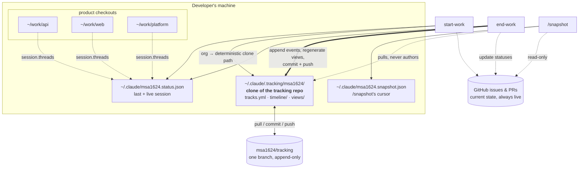
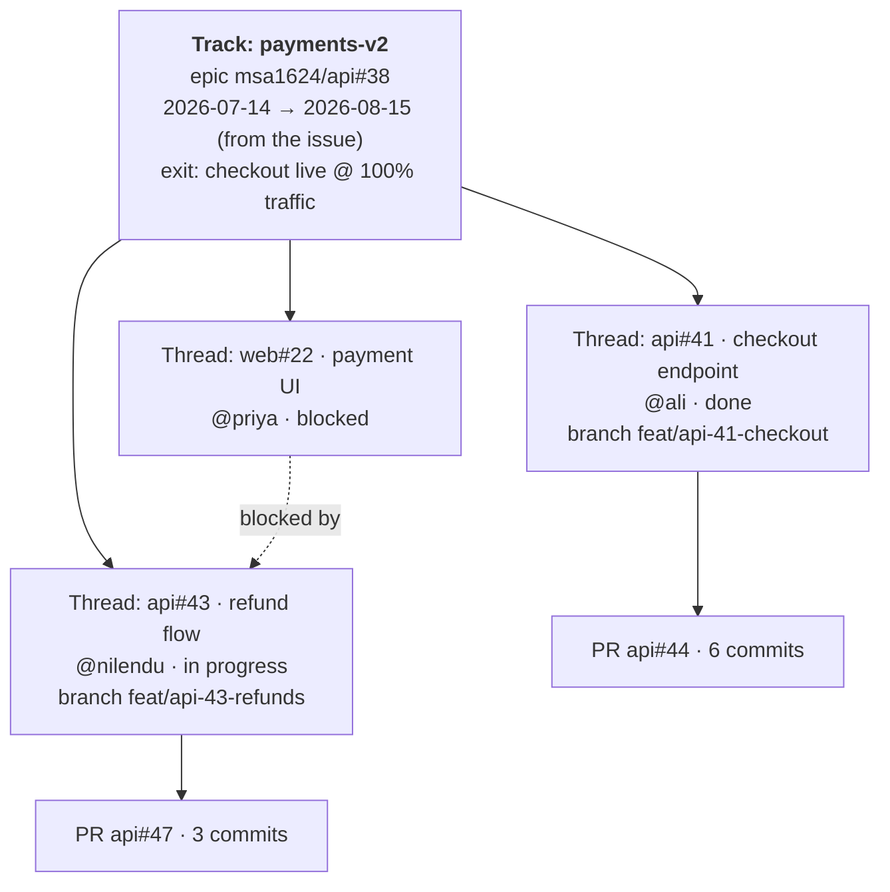
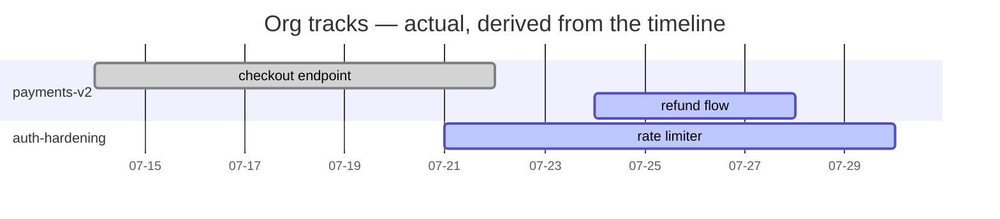
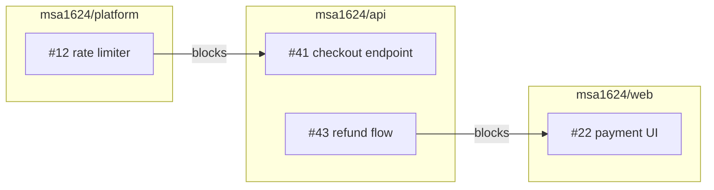
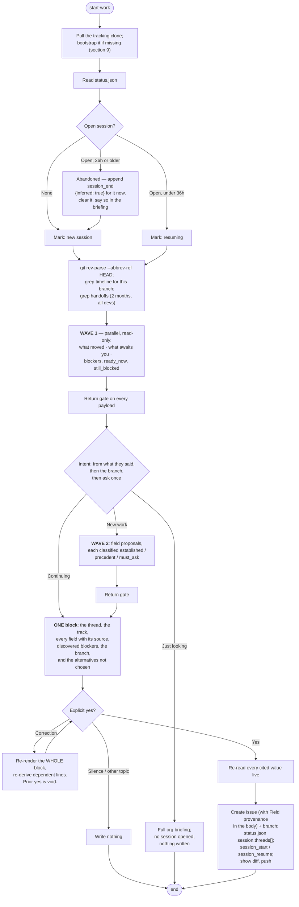
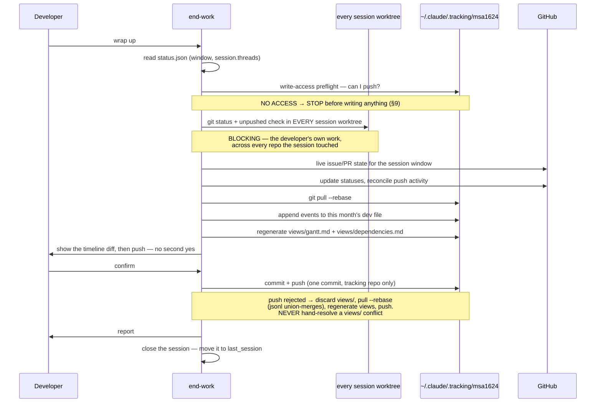
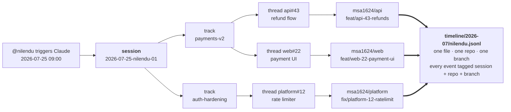
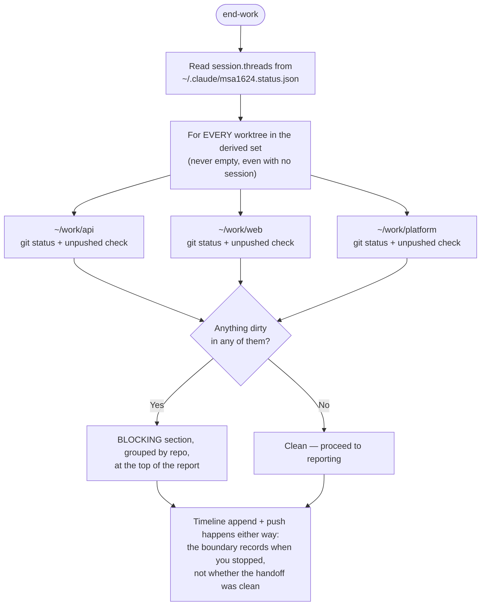

# Target Workflow — Org Tracking & Skill Design

> **Status:** design target. This describes the end state the skills work toward. No skill files are
> edited by this doc.

---

## 1. Design Principles

Five rules govern everything below.

1. **State vs. event.** *State* is what is true right now — an issue's status, its assignee, what is
   blocking it. *Events* are what happened, when, and by whom. State lives only in GitHub and is
   always fetched live; it is never cached anywhere in the tracking system. Events live only in the
   timeline and are never re-derived from GitHub once written, because the past does not change. A
   report that needs both fetches state live and joins timeline history against it. Nothing reads
   current status out of the timeline, and no timeline entry is authoritative for anything but
   history.
2. **Pointer, not content.** A track's registry entry holds a pointer to its epic issue plus the
   handful of facts GitHub cannot express. If a field exists on the issue, the registry does not
   store it.
3. **Append-only.** Timeline events are written once and never rewritten, on any schedule, for any
   reason. A correction is a new event.
4. **No ranking.** The timeline answers "what happened and how does work connect," never "who did
   more." Nothing generated from it compares people against each other.
5. **Out-of-band.** The record of the work never lives on a branch of the work it describes. Branch
   identity is *data on an event*, never the *location* of an event.

**Scope.** This workflow is org-scoped by design. It depends on Issue Fields and issue types, which
are organization-only GitHub features — absent on a personally-owned account, not merely restricted.
`gh-wrapper` is account-agnostic; this workflow is not.

---

## 2. System Layout

Three pieces — one shared repo and two local files.

**The tracking repo**, one per org. A GitHub repo holding the track registry, the per-developer
event log, and the generated views. It contains no application code and runs no CI.

```
msa1624/tracking
├── README.md                       the format, for anyone who opens the repo cold
├── .gitattributes                  *.jsonl merge=union — and nothing else (§3)
├── tracks.yml                      the org-wide track registry
├── timeline/
│   ├── 2026-07/
│   │   ├── ali.jsonl               append-only, one file per developer per month
│   │   ├── nilendu.jsonl
│   │   └── priya.jsonl
│   └── 2026-08/
└── views/                          generated, never hand-edited
    ├── gantt.md
    └── dependencies.md
```

**Two local cursor files**, one pair per org per machine, gitignored and never shared. They live
outside `.claude/.tracking/`, which is a clone of a shared repo — a file that must survive a
reclone, a `git clean`, or a bad rebase inside that clone cannot live where the clone's own git
operations can reach it. The two are split by **who owns the write**:

- **`status.json`** — where hands-on work stands: the previous session's boundary and the live
  session. Owned by start-work and end-work.
- **`snapshot.json`** — when `/snapshot` last ran. Owned by `/snapshot`.

```
~/.claude/
├── .tracking/
│   └── msa1624/                    the working clone; skills pull, append, commit, push here
├── msa1624.status.json             last + live session — start-work / end-work
└── msa1624.snapshot.json           /snapshot's cursor — /snapshot
```

**Product repos get nothing.** No cursor file, no clone, no tracking directory. Nothing this design
creates lands inside a repo you work in, so none of it appears in a product repo's `git status` and
no product repo needs a `.gitignore` entry for any of it.

**Write surfaces.** These skills write in exactly four places, and nowhere else:

| Location | Writes permitted |
|---|---|
| `~/.claude/.tracking/<org>/` | The only place anything is committed or pushed — always after showing the diff. The developer's yes is given at the confirmation block (§8.1, §8.2), not again at the push: showing the diff is a *disclosure* requirement, and waiting on it is a second gate on a decision already made. |
| `~/.claude/<org>.{status,snapshot}.json` | Local cursor writes. No git involved. |
| Product repos | Branch creation and checkout, by start-work only (§8.1). No file contents modified, nothing committed, nothing pushed. |
| Issues in product repos | Creation and field-setting by start-work (§8.1); status reconciliation by end-work (§8.2). Issue *bodies* are not rewritten and PRs are never written. |

Everything else — PRs, issue bodies, other people's repos — is read-only.



One `git pull` on one clone yields every developer, every track, every repo — as local file reads
rather than API calls fanned out across the org.

---

## 3. The Tracking Repo

**One branch. The tracking repo is never branched**, and nothing in it is ever force-pushed,
squashed, or rebased into a different shape. Its history is linear and append-only, which is what
lets principle 3 hold.

**`merge=union` applies to `*.jsonl` and nothing else.** Timeline files are append-only, so a union
merge of two developers' appends is always correct. It is deliberately *not* extended to `views/` —
union-merging two generated Markdown files produces a document that is neither. View conflicts are
resolved by regeneration instead (§8.2).

**Branch identity lives on the event.** Each thread-scoped event records the `repo` and `branch` the
work happened in (§6). Work is therefore locatable in space as well as time, and a session spanning
three repos and three branches still writes to one file.

**Branch names carry the thread number**, in the form `<type>/<repo>-<issue#>-<slug>` — e.g.
`feat/api-41-checkout`. start-work generates every branch it creates this way (§8.1), so the
branch→thread link is recoverable from the branch name alone, with no lookup table to maintain.

### Worktrees

One tracking clone is shared by every worktree and every repo on the machine. One `status.json` is
likewise shared, with each active worktree appearing as an entry in `session.threads[]` (§4.1). A
session working several worktrees in parallel is the normal case, so the cursor tracks them as a set.

---

## 4. Local Cursor Files

Two files, two owners. Both gitignored, both outside every git repo on the machine.

### 4.1 `status.json` — owned by start-work / end-work

```json
{
  "schema": 1,
  "org": "msa1624",
  "last_session": {
    "started_at": "2026-07-25T09:00:00Z",
    "started_repo": "msa1624/api",
    "ended_at": "2026-07-25T18:20:00Z",
    "ended_repo": "msa1624/api"
  },
  "session": {
    "id": "2026-07-25-nilendu-01",
    "started_at": "2026-07-25T09:00:00Z",
    "threads": [
      { "track": "payments-v2",    "thread": "msa1624/api#43",      "repo": "msa1624/api",      "branch": "feat/api-43-refunds",       "worktree": "~/work/api" },
      { "track": "payments-v2",    "thread": "msa1624/web#22",      "repo": "msa1624/web",      "branch": "feat/web-22-payment-ui",    "worktree": "~/work/web" },
      { "track": "auth-hardening", "thread": "msa1624/platform#12", "repo": "msa1624/platform", "branch": "fix/platform-12-ratelimit", "worktree": "~/work/platform" }
    ]
  }
}
```

- **`last_session`** — where the previous session began and ended. This is the "since you left off"
  boundary; it is not a calendar cursor and carries no assumption that the previous session was
  yesterday.
- **`session`** — the live session: its id, when it opened, and every thread it has touched, each
  with the repo, branch, and local worktree path work is happening in. A list, not a single pointer.
  Absent when no session is open.

end-work moves the closing session into `last_session` and clears `session`. At most one session is
open at a time.

`session.threads[].worktree` is load-bearing: it is the list end-work iterates to enforce the
iron law across every repo a session touched (§8.2).

### 4.2 `snapshot.json` — owned by `/snapshot`

```json
{
  "schema": 1,
  "org": "msa1624",
  "last_checked": "2026-07-25T05:26:35Z"
}
```

That is the whole file. `/snapshot` reads `last_checked` to offer "since last check" as a report
window, and overwrites it at the end of each run.

### No cross-reads

The two files share no fields, and neither skill opens the other's. The tracking clone's location is
not recorded in either: `~/.claude/.tracking/<org>/` is a deterministic path from `org`, which every
skill derives from `git config --get remote.origin.url`. Bootstrap-if-missing and pull-before-use
(§9) run on every invocation regardless, so there is nothing to cache.

---

## 5. Tracks & Threads

- **Track** — a set of related work. An epic: "Payments v2," "Q3 auth hardening." Spans repos and
  weeks; has an owner, a target date, and exit criteria.
- **Thread** — one unit of work inside a track. One GitHub issue, plus the PRs, branches, and
  commits that close it.

Every thread has an issue, and **every issue carries the org's standard fields**, set at creation.

The workflow depends on *roles*, not on field names. Which field fills a role is discovered at call
time via `list_issue_fields` and is never hardcoded — the right-hand column is this org's mapping at
the last check, not a contract:

| Role | Used by | Field in this org |
|---|---|---|
| Ordering within a track | §5 | Priority |
| Planned start | §8.3 planned-vs-actual | Start date |
| Planned finish | §8.3 planned-vs-actual | Target date |
| Sizing signal | §8.3 calibration | Effort |
| Release grouping | §8.3 | Milestone — a native issue field, *not* an Issue Field |
| Declared dependencies | §8.3 | Relationships — the dependencies API, *not* an Issue Field |

Those last two are separate GitHub mechanisms that happen to sit on the same issue. They are
discovered, read, and written differently from Issue Fields, and conflating the three is how a
value ends up written somewhere nothing queries.

**If a role has no field, the analysis that needs it degrades and says so.** It is never
approximated with a neighbouring field that happens to accept a write. This org defines no `Size`
or `Estimate`; §8.3 states what that costs.

**These are never guessed.** A value the conversation has not *established* is asked for, not
invented — an estimate nobody stated is not a field to fill in with a plausible number.

**"Established" has a precise meaning**, and the skills own the full definition
(each workflow skill's *The Substrate* → *Established vs. guessed*). In short: a value is established when it has a
**source**, the source is **shown to the developer** beside it, and the developer **said yes after
seeing it** — all three. A value missing any one is guessed.

This is what makes the skills' research-and-propose flow legal rather than a loophole. The skill does
the looking-up so the developer never has to open the project board; the developer still does the
accepting. What is forbidden is the middle — a plausible value with a rationale composed afterwards
to justify it. **Source first, then value. Never value, then rationale.** A field with no source is
rendered as a question carrying a labelled suggestion, not as a proposal.

The planned-start and planned-finish fields are what make a thread's *planned* dates exist at all,
which is what `/snapshot` charts actuals against. Relationships and Milestone are live issue state
and are read live wherever they are needed; neither is copied into the timeline or `tracks.yml`.

**A dependency that research *found* is not a dependency a session *hit*.** A blocker discovered by
reading the issues is written to the issue's Relationship and **nowhere else**; only a blocker a
session actually ran into becomes a `blocked` timeline event. `blocked_by` is the sole input to
`views/dependencies.md` (§7) and to §8.3's declared-vs-encountered join, so feeding it discovered
dependencies makes that join compare a set with itself — degraded with no visible symptom.

Parent/child structure comes from GitHub sub-issues, not a shadow hierarchy. **A milestone is not a
track** — a milestone is a shipping checkpoint owned by GitHub, a track is a registry entry owned by
`tracks.yml`, and one track's threads may span several milestones.

`tracks.yml` is the org-wide registry, and has one home: the tracking repo. A track spanning
`msa1624/api` and `msa1624/web` is a single entry.

```yaml
- id: payments-v2
  parent: msa1624/api#38          # the epic issue — title, owner, dates all live here
  status: active                  # active | paused | done | abandoned
  exit_criteria: "checkout flow live for 100% of traffic"
- id: auth-hardening
  parent: msa1624/platform#12
  status: active
  exit_criteria: "all endpoints behind rate limiter, pen-test clean"
```

**Four fields, per principle 2.** A track's title, owner, start date, and target date live on the
epic issue, so they are not duplicated here — anything needing them follows `parent` and reads them
live. `id` is the stable slug timeline events reference; `parent` is the pointer. The remaining two
are the facts GitHub cannot express:

- **`status`** — four states where an issue offers open or closed. A paused track is not a closed
  one; an abandoned track is not a finished one.
- **`exit_criteria`** — a structured, checkable definition of done. As prose in the epic's body
  nothing could read it. Without it a track never closes; it stops generating events and leaves a
  permanent bar on the Gantt.

A track as a *reader* sees it — dates, owners, and statuses joined live from the issues, not as any
one file stores it. Only the id, `parent`, status, and exit criteria come from `tracks.yml`.



---

## 6. Event Timeline

One file per developer per month: `timeline/YYYY-MM/<dev>.jsonl`. Two developers wrapping up
simultaneously never touch the same file; the same developer on two machines can, and `merge=union`
resolves appended lines automatically.

```jsonl
{"schema":1,"ts":"2026-07-25T09:02:11Z","session":"2026-07-25-ali-01","dev":"ali","event":"session_start","mode":"resume_same","threads":1}
{"schema":1,"ts":"2026-07-25T13:40:00Z","session":"2026-07-25-ali-01","dev":"ali","event":"progress","track":"payments-v2","thread":"msa1624/api#41","repo":"msa1624/api","branch":"feat/api-41-checkout","commits":["a1b2c3d","e4f5a6b"],"note":"idempotency keys on charge endpoint"}
{"schema":1,"ts":"2026-07-25T15:10:00Z","session":"2026-07-25-ali-01","dev":"ali","event":"blocked","track":"payments-v2","thread":"msa1624/api#41","repo":"msa1624/api","branch":"feat/api-41-checkout","blocked_by":["msa1624/platform#12"],"note":"needs the new rate-limit middleware"}
{"schema":1,"ts":"2026-07-25T18:20:00Z","session":"2026-07-25-ali-01","dev":"ali","event":"session_end","threads_touched":1,"repos_touched":1}
```

| Field | Rule |
|---|---|
| `schema` | version integer, so the format can evolve without breaking readers of old files |
| `ts` | UTC, ISO 8601, always — local time makes cross-timezone charts lie |
| `session` | the session id shared by every event in one sitting. This is what stitches a session together when it fans out across tracks, branches, and repos (§12) |
| `dev` | the GitHub handle of the person the work is attributed to |
| `event` | `session_start` · `session_resume` · `branch_created` · `progress` · `blocked` · `unblocked` · `done` · `handoff` · `session_end` |
| `track` | the `tracks.yml` id this work belongs to. Thread-scoped events only |
| `thread` | always `owner/repo#N`, never bare `#N`. Thread-scoped events only |
| `repo` | `owner/repo` — required on every thread-scoped event |
| `branch` | the branch the work happened on, or `null` on `main`/detached. Never inferred later |
| `title` | on `branch_created` only: the thread's title as of when work started. A label for the views, never refreshed and never authoritative (§7) |
| `commits` | short SHAs, so an entry can be checked against git rather than trusted on its word |
| `note` | one line of free text: what actually happened. Expected on `progress` and `blocked` |
| `blocked_by` | array of `owner/repo#N` — a dependency **hit while working**, never one merely discovered on the issue. §7's map is built from this alone |
| `mode` | `session_start` and `session_resume`: `resume_same` · `fan_out` · `handoff` · `new_track`. On a resume it describes *that resume*, not the session's original shape |
| `threads` | `session_start`: threads the session opened with. `session_resume`: the total **after** that resume |
| `threads_added` | `session_resume` only: array of `owner/repo#N` the resume picked up. Omitted, not `[]`, when it added none — it is what lets a session-scoped event record *which* thread joined |
| `threads_touched` / `repos_touched` | `session_end` only: counts, so a session's shape is readable without replaying it |
| `inferred` | `true` on a synthetic `session_end` written for an abandoned session (§8.1). Never set on a recorded event |

**Session-scoped vs. thread-scoped.** `session_start`, `session_resume`, and `session_end` describe
the sitting rather than a piece of work, and a session routinely spans several tracks, repos, and
branches. `track`/`thread`/`repo`/`branch` do not apply to them and are omitted. Every other event
is thread-scoped and carries all four.

`branch_created` is its own event type rather than a flavour of `progress`: it fixes a thread's
actual start date, and the Gantt's bars begin there.

**No duration or hours field.** Session boundaries place work on a Gantt at day granularity. A
computed "time worked" number invites exactly the per-person comparison principle 4 rules out.

**Attribution.** `dev` is the human who triggered the session, matching commit *authorship* — read
from the author field and `Co-authored-by:` trailers, with bots excluded. An agent-authored commit
co-authored to a person attributes to that person.

---

## 7. Generated Views

`views/gantt.md` and `views/dependencies.md` carry a
`<!-- GENERATED — do not edit, rebuilt by end-work -->` header and are rebuilt from `tracks.yml`
and the timeline on every end-work run, after pulling latest.

**They are built from the timeline and `tracks.yml` alone — never from GitHub.** A committed file
carrying an issue's assignee, status, or planned dates would be a cache of state, wrong the moment
someone reassigned the issue. Everything rendered here derives from events, which cannot go stale
because they describe the past.

Node labels show a thread's title, which comes from the `title` recorded on that thread's
`branch_created` event (§6) — not a live lookup. It is the title as it stood when work began, and it
stays that way. If the issue is renamed, the view keeps the old label; the event is a record of what
was true then.

**The Gantt charts actuals only.** Bars run from a thread's `branch_created` to its `done`, or to
its latest event for work still open. Planned dates live on the issue's Start/Target fields, so
charting them here would mean caching them here — `/snapshot` reports the planned-vs-actual
comparison instead, joining live issue data against the timeline at report time (§8.3). A thread
with no events yet does not appear.





No assignees, no statuses, no colour-coding by state — all of that is live GitHub data, rendered by
`/snapshot` on request. What survives here is structure, which the timeline owns outright.

Dependency edges here come from one source only: each event's `blocked_by` field — a dependency
someone actually hit while working, which the timeline owns.

Edges recorded on the issues themselves are **not** baked in, whether they live in the structured
Relationships field or as `#N` references and "blocks"/"depends on" prose in a body. Both are issue
state: an issue's relationships can be edited at any time, so a committed copy would be wrong
without warning. `/snapshot` joins them live to render the fuller map (§8.3), which is also the only
view that can show the two sources disagreeing — a dependency hit in practice but never recorded on
the issue, or a Relationship declared on the issue that no session ever ran into.

---

## 8. Skill Workflows

### 8.1 start-work

start-work **owns session lifecycle**: it is the only skill that opens a session, resumes one, or
closes an abandoned one. Recovery belongs here because a developer who abandons a session is, by
definition, one who did not run end-work.

**start-work researches before it asks.** Everything a developer would otherwise open the project
board to find — what moved since they left, what is waiting on them, what blocks each thread, what
the parent and siblings carry — is gathered first, by read-only subagents running in parallel, and
rendered as one proposal. The developer reads it and says yes, or says what to change.

The branch a developer is standing on is a strong hint about what they are doing, which collapses
the common case of the question tree into a single confirmation. Intent resolves from three sources
in priority order: **what the developer said when they triggered the skill**, then the branch, then —
only if neither answers it — one question.



- **An open session is stale after 36h without a close.** The threshold marks abandonment, not a
  calendar boundary: a session left open that long was walked away from rather than paused, since
  anyone still working it would have triggered start-work again inside the window and resumed it.
- **The stale close happens in preflight; the new session's own event waits.** Closing an abandoned
  session concerns work that is already over and does not depend on the current run's answers, so it
  is written immediately. `session_start` carries `mode` and the thread list, neither known until the
  question tree resolves, so it is appended at the end alongside `session.threads[]`.
- **Re-running start-work on an open session resumes it rather than restarting.** The preflight
  finds it, appends `session_resume`, and continues with the same id, so a later burst lands inside
  the existing session instead of forking a second one covering the same work.
- **The branch lookup is a hint, not a decision.** It pre-selects a default; the developer can always
  choose otherwise. Standing on `main` with a clean tree simply means no pre-fill.
- **Research runs before the question, and writes nothing.** Its output is an input to what the
  developer is being asked, which is why it cannot run after. Results are never persisted — a
  research result is a cache of live state, so every value the block cited is **re-read live
  immediately before writing**, and a value that changed in the interval re-renders instead.
- **One block, one yes.** Every field discovery returned appears in it, each beside the source it was
  read from, with inferred lines marked and re-listed. A field with no source renders as a question
  carrying a labelled suggestion. Silence is not consent; a correction voids the previous yes and the
  whole block re-renders. The issue body carries a `Field provenance` section so the sources survive
  the confirmation and stay auditable.
- **New work creates the branch**, named from the issue it just created (§3).
- **"Just looking" opens nothing and writes nothing.** A skill that demands a track before it will
  say anything is a skill people stop running.

### 8.2 end-work

**The iron law: uncommitted or unpushed work blocks a clean handoff.** It is checked first, on every
run, and reported at the top.

**The check runs over a derived *worktree set*, not over `session.threads[]` directly.** The set is
every `session.threads[].worktree` **plus the repo the developer is standing in**; with no session
open, it is the current repo plus every repo on this developer's timeline since the window. It is
never empty. Iterating `threads[]` alone silently checks nothing on a no-session run — which is
precisely the run where nobody opened a session and work is likeliest to be sitting uncommitted.

**The iron law is never delegated to a subagent.** A subagent the skill cannot see into reporting
"clean" is exactly the failure that ships someone's uncommitted work. It runs in the skill, before
any research is dispatched.

**Write access is verified before anything is written — and after the pull.** A developer without
push rights to the tracking repo does not get a degraded wrap-up that banks events locally forever;
the run stops and says so (§9). The order matters: a clone behind its remote fails a push dry-run
with a non-fast-forward rejection, which is **not** a permission failure and must not be read as one.

**end-work proposes, then writes once.** Research runs as read-only subagents after the iron law;
their findings become a single confirmation block covering the timeline events, the comments, the
labels, the field values, and the dependency links. **A bare yes covers all of those. It never covers
a closure** — closures are listed separately with their evidence and confirmed only by a reply naming
them, because every other write here is additive and correctable while a closure changes what
everyone else believes is finished.



**Blockers are reported grouped by repo**, never as one flat list — three uncommitted files across
three repos are three separate pieces of work to land. A repo in `session.threads[]` that no longer
exists on disk is itself reported rather than silently skipped.

**View conflicts are discarded and regenerated, never resolved.** On a rejected push: throw away
local changes under `views/`, `pull --rebase` (only `*.jsonl` remains in play, and `merge=union`
handles it), regenerate the views from the merged timeline, push again. This is safe because views
are derived — a regenerated file is always correct, a merged one may be neither developer's output.

**A session is bounded by start-work and end-work, not by the calendar.** It may run twenty minutes
or span several days, and it may be one continuous sitting or a series of bursts. Each invocation
inside an open session appends `progress` events carrying its id; end-work closes it once.

Two further conditions:

- **The tracking clone is behind or dirty.** Always `pull --rebase` before appending. A clone left
  dirty by a previous run is surfaced in its own report line, never merged into the developer's
  uncommitted-work blocker. They are different problems with different fixes.
- **A transient push failure** (offline, or a race outliving the retry) leaves events on disk,
  append-only, and reported; they push on the next run. This covers transient failures only — a
  permissions failure is caught by the preflight and is not a delay.

### 8.3 /snapshot

An **explicitly invoked** command, not a skill that fires on conversational phrasing. A three-layer,
org-scoped, per-developer report only runs when someone asks for it.

Three layers: current repo detail, org-wide rollup, and who-did-what. Attribution comes strictly
from author/assignee/reviewer fields.

**Read-only means it never authors.** No events, no commits, no GitHub writes; the only file it
writes is its own `snapshot.json` cursor. It does clone the tracking repo if missing and pull it
before every run (§9) — sync is not authorship, and a report built on a stale clone is wrong. **But
it clones what exists and never creates**: cloning is sync, creating a repo is authorship.

**The layers and joins run as parallel read-only subagents**, which is what makes a three-layer org
report affordable. Two rules keep that safe:

- **Field discovery happens once, in the skill, and is passed to every agent.** Several agents
  discovering independently can return several mappings, which the report would then render as one
  schema — wrong with no visible symptom.
- **Agents return structured findings; the skill renders them.** Principle 4 is a property of the
  output, and prose cannot be reliably de-editorialized after the fact — but a parent can refuse to
  accept anything that isn't rows. For the same reason, **the skill writes the "which comparison I
  ran" line, never the agent**: an agent that ran a partial join is the worst-placed thing in the
  system to describe how partial it was.

It produces four things neither source can show on its own, each a live join of issue state against
timeline history — computed at report time and cached nowhere:

- **A complete org rollup, cheaply.** One `git pull` plus local file reads, rather than fanning out
  across every repo in the org.
- **Planned vs. actual.** Planned dates fetched live from whichever fields fill the planned-start
  and planned-finish roles (§5) — `Start date` and `Target date` in this org — actual dates read
  from the timeline. The committed Gantt charts actuals only (§7).
- **Sizing vs. actual.** The sizing field is what the work was expected to take; the timeline shows
  the sessions it actually took. The two together are how estimates get calibrated, and they are
  never compared across people (principle 4). This org defines no separate `Estimate` or `Size`, so
  the comparison available is Effort against the timeline — one signal, not two. `/snapshot` says
  which comparison it ran rather than presenting a degraded one as the full analysis.
- **Declared vs. encountered dependencies.** The issues' Relationships field says what was expected
  to block what; the timeline's `blocked_by` events say what actually did. Each direction of
  disagreement is worth surfacing — a dependency hit in practice but never declared, and a declared
  Relationship no session ever ran into.

Milestone is available on every issue and is the natural grouping for a release-shaped report, which
cuts across tracks rather than following them (§5).

---

## 9. Bootstrap & Access

| Situation | Behaviour |
|---|---|
| Tracking repo does not exist for the org | **start-work / end-work:** offer to create it — **with confirmation**. Creating a repo is outward-facing and never happens implicitly. **`/snapshot`: never offers.** Cloning is sync; creating is authorship. It reports the absence, names start-work, and runs the GitHub-only layers with the timeline joins reported as not-run. |
| Repo exists, no local clone | Clone to `~/.claude/.tracking/<org>/` — a deterministic path, nothing to record. Whichever of start-work, end-work, or `/snapshot` runs first bootstraps it; the others find it present. |
| Clone exists but is stale | `git pull --rebase` at the start of every start-work, end-work, and `/snapshot` run. Not conditional on a stored sync timestamp — there isn't one. |
| Developer has no write access | **end-work refuses to run**, checking push access before writing anything rather than banking events nobody will see. start-work and `/snapshot` work in full, since both only read. A `--local-only` escape hatch exists for someone knowingly accepting an unshared record; it is never the default and never silent. |
| Empty `tracks.yml` | "Task in an existing track" is not offered in the question tree; the flow degrades to "brand new track" with no special case. |
| MCP tools not loaded this session | Say so once and work the remaining rungs for the rest of the session. Not a reason to report anything unavailable, and not re-checked per command. |
| A field or relationship looks unsettable | Walk all three rungs before saying it cannot be set, then name what was tried. Running out of time makes a field *unset*, never *unsettable*. |
| Owner is a personal account | Issue Fields and issue types do not exist there. The analyses that depend on them degrade per §5 and say so; nothing is approximated to fill the gap. |

Access to GitHub itself is `gh-wrapper`'s job — `.claude/skills/gh-wrapper/SKILL.md` owns the ladder
and the per-surface traps, and `docs/github-surfaces.md` owns the mechanics of what each surface can
and cannot reach. This section states what must hold, not how to reach it; neither is restated here.

Delegated research is named in the output too: what ran, what it read, and what it could not cover.
An agent's partial coverage is printed rather than quietly folded into a complete-looking result.

The skills operate on the tracking repo visibly, not silently. Committing in a directory the
developer never named is something they are told about, even when it is exactly what they asked for.

---

## 10. Guardrails

- **Verifiable, not trusted.** Every `progress` event carries commit SHAs. An entry with no SHAs and
  no issue reference renders visibly softer in the views than one that can be checked.
- **No leaderboards, ever.** Every developer's session log sits in one repo, which is what makes the
  org view work and what makes principle 4 easy to violate. No generated view ranks or compares
  people, and no view may be added that does.
- **`README.md` in the tracking repo, committed.** A shared record whose format nobody can read is
  not shared. People will find this repo with no context for what wrote it.
- **A compliance pass in end-work** checks that every commit referencing `#N` during the session
  has a corresponding timeline event, reported in the same "compliance gaps found" section as a
  missing progress comment.
- **Exit criteria are required on every track**, so tracks can close rather than silently stop
  generating events.
- **Retention: keep everything, forever.** A developer generating ~10 events a day produces a few
  hundred KB a year. There is no compaction and no pruning — an append-only log rewritten on any
  schedule is not append-only.
- **The timeline stays event-shaped.** If `tracks.yml` accumulates statuses, assignees, or
  descriptions duplicating the epic issue, it has become a second issue tracker and principle 2 has
  been abandoned.

---

## 11. Quick Reference

| Question | Answer |
|---|---|
| Where does the timeline live? | A dedicated org-level repo, `<org>/tracking`, with exactly one branch. |
| Where do the local cursors live? | `~/.claude/<org>.status.json` and `~/.claude/<org>.snapshot.json` — outside `.tracking/`, one pair per org per machine. |
| How many cursor files, and who owns them? | Two, fully independent. `status.json` → start-work / end-work. `snapshot.json` → `/snapshot`. Zero shared fields, no cross-reads. |
| Where is the tracking clone's path recorded? | Nowhere. `~/.claude/.tracking/<org>/` is derived from `org` on every run. |
| What does `tracks.yml` store? | Four fields: `id`, `parent`, `status`, `exit_criteria`. |
| What fields does every issue carry? | Whatever the org defines, discovered at call time. The workflow needs roles — ordering, planned start, planned finish, sizing — plus Milestone and Relationships. Set at creation: researched, shown with their sources, and confirmed before writing (§5). |
| Who does the looking-up? | The skill, not the developer. Research runs as read-only subagents in parallel, and nothing they return is written until it has passed the return gate and the developer has accepted the block. |
| Do generated views contain issue state? | No. Timeline and `tracks.yml` only. Every issue-vs-timeline comparison — planned/actual, sizing/actual, declared/encountered dependencies — is computed by `/snapshot` at report time. |
| Is timeline history ever compacted? | No. |
| How are `views/` conflicts resolved? | Discarded and regenerated. `merge=union` covers `*.jsonl` only. |
| Who owns session lifecycle? | start-work — opens, resumes (`session_resume`), and closes abandoned sessions (`session_end {inferred:true}`). |
| Is duration or hours recorded? | No. |
| How is branch tracked? | `repo` + `branch` fields on each thread-scoped event, plus the `<type>/<repo>-<issue#>-<slug>` naming convention. |
| How is a multi-repo session held together? | A `session` id on every event, plus `session.threads[]` in `status.json`. |
| What if a developer cannot push to the tracking repo? | end-work refuses to run, before writing anything. |
| Is `/snapshot` auto-triggered? | No — explicitly invoked. |

---

## 12. Worked Example — One Trigger, Many Tracks, Many Repos

A developer triggers Claude at 09:00. Over the session it works on the refund flow and the payment
UI (both track `payments-v2`, in `msa1624/api` and `msa1624/web`) and on the rate limiter (track
`auth-hardening`, in `msa1624/platform`). Three repos, three new branches, two tracks, one session.



The fan-out converges. Three repos and three branches produce events in one file, in one repo, on
one branch, because `repo` and `branch` are fields on the event rather than the event's location.
Nothing is reconciled across repos afterward because nothing was ever split.

```jsonl
{"schema":1,"ts":"2026-07-25T09:00:00Z","session":"2026-07-25-nilendu-01","dev":"nilendu","event":"session_start","mode":"fan_out","threads":3}
{"schema":1,"ts":"2026-07-25T09:14:00Z","session":"2026-07-25-nilendu-01","dev":"nilendu","event":"branch_created","track":"payments-v2","thread":"msa1624/api#43","repo":"msa1624/api","branch":"feat/api-43-refunds","title":"refund flow"}
{"schema":1,"ts":"2026-07-25T09:31:00Z","session":"2026-07-25-nilendu-01","dev":"nilendu","event":"branch_created","track":"auth-hardening","thread":"msa1624/platform#12","repo":"msa1624/platform","branch":"fix/platform-12-ratelimit","title":"rate limiter"}
{"schema":1,"ts":"2026-07-25T12:05:00Z","session":"2026-07-25-nilendu-01","dev":"nilendu","event":"progress","track":"payments-v2","thread":"msa1624/api#43","repo":"msa1624/api","branch":"feat/api-43-refunds","commits":["9f2c1ab"],"note":"refund state machine"}
{"schema":1,"ts":"2026-07-25T14:40:00Z","session":"2026-07-25-nilendu-01","dev":"nilendu","event":"blocked","track":"payments-v2","thread":"msa1624/web#22","repo":"msa1624/web","branch":"feat/web-22-payment-ui","blocked_by":["msa1624/api#43"],"note":"UI needs the refund endpoint shape settled"}
{"schema":1,"ts":"2026-07-25T18:20:00Z","session":"2026-07-25-nilendu-01","dev":"nilendu","event":"session_end","threads_touched":3,"repos_touched":3}
```

The `blocked` event records a cross-repo dependency — `web#22` waiting on `api#43` — discovered
while doing the work. That edge may never be written into either issue, and it is what feeds §7's
dependency map.

At wrap-up, end-work reads `session.threads[]` and runs the blocking check in all three
worktrees, not just the one the developer is standing in.


