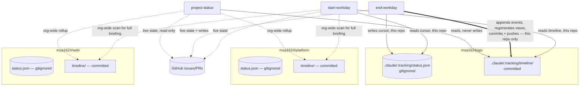
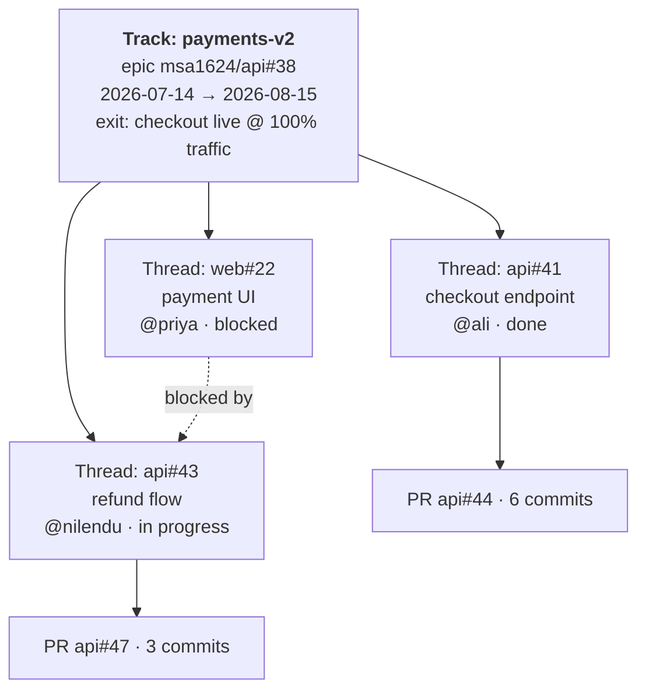
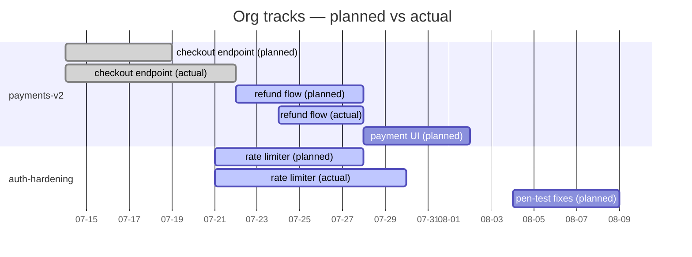
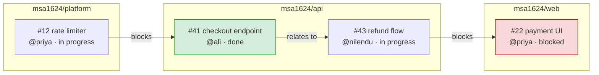
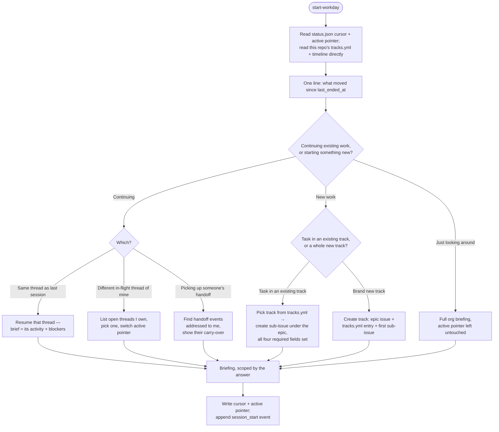
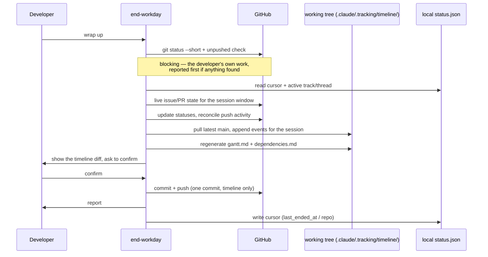

# Target Workflow — Org Tracking & Skill Design

> **Status:** design target. Nothing here is implemented; no skill files are edited by this doc.
> This describes the end state the skills should work toward, not a migration plan.

---

## 1. Design Principles

Four rules govern everything below:

1. **State vs. event.** *State* is what's true right now — an issue's status, its assignee, what's
   blocking it. *Events* are what happened, when, and by whom. State lives only in GitHub and is
   always fetched live; it is never cached in the tracking system. Events live only in the
   timeline and are never re-derived from GitHub after being written, because the past doesn't
   change. A briefing that needs both fetches state live and joins timeline history in — it never
   reads current status from the timeline, and never treats a timeline entry as authoritative for
   anything except history.
2. **Pointer, not content.** A track's registry entry holds a pointer to its epic issue and the
   plan (dates, owner, exit criteria) — never a status or description that duplicates the issue.
   If a field exists in both places, the issue wins and the registry entry stops storing it.
3. **Append-only.** Timeline events are written once and never rewritten. A correction is a new
   event, not an edit to an old one.
4. **No ranking.** The timeline exists to answer "what happened and how do tracks connect," never
   "who did more." Nothing generated from it compares people against each other.

---

## 2. System Layout

Everything lives inside the repo you're already working in — no second repo to clone, get access
to, or remember exists. `.claude/.tracking/` splits into two parts with different git treatment:

- **`status.json`** — gitignored. This machine's cursors and nothing else.
- **`timeline/`** — committed. The track registry, the per-developer event log, and the generated
  views. Ordinary files in the ordinary working tree, read and edited the same way any other
  tracked file is.

A track can span repos (an epic touching both `msa1624/api` and `msa1624/web`), so two light rules
keep that from getting tangled:

- **`tracks.yml` lives in the same repo as the track's epic issue.** That's its one home. A track
  spanning repos still has exactly one registry entry, in the repo where the epic itself lives.
- **A timeline event lives in whichever repo the developer was in during that session** — the repo
  `git config --get remote.origin.url` resolves to, same as every other step already does. It
  references the track by id; nothing needs to be copied between repos for that link to work.

An org-wide view (start-workday's full briefing, project-status's rollup) already scans every repo
in the org via `search_issues`/`search_pull_requests` with an `org:` qualifier — assembling a
cross-repo Gantt or dependency map means the same skills also read each repo's
`.claude/.tracking/timeline/` on demand, the same way, rather than there being one file to open.



---

## 3. `status.json`

One file per machine per repo, gitignored:

```json
{
  "schema": 1,
  "workday": {
    "last_started_at": "2026-07-25T09:00:00Z",
    "last_started_repo": "msa1624/api",
    "last_ended_at": "2026-07-25T18:20:00Z",
    "last_ended_repo": "msa1624/api"
  },
  "project_status": {
    "last_checked": "2026-07-25T05:26:35Z"
  },
  "active": {
    "track": "payments-v2",
    "thread": "msa1624/api#41",
    "since": "2026-07-23T10:00:00Z"
  }
}
```

Three namespaces, three audiences:

- **`workday`** — the daily start/end-workday cursor, for whoever is doing the hands-on work.
- **`project_status`** — the report-cadence cursor, for whoever is checking in on status (a
  product manager, or anyone else in that role) rather than doing the work itself.
- **`active`** — the live track/thread pointer that start-workday's question tree reads and
  writes. Belongs to the `workday` side.

`project_status` may read `workday` but never write it, and vice versa. `.gitignore` targets this
file specifically (`.claude/.tracking/status.json`), not its parent directory — the parent holds
committed files too.

---

## 4. Tracks & Threads

- **Track** — a set of related tasks. An epic: "Payments v2," "Q3 auth hardening." Spans repos and
  weeks, has an owner, a target date, and exit criteria.
- **Thread** — one unit of work inside a track. Normally one GitHub issue, plus the PRs and commits
  that close it.

Every thread has an issue, and every issue created through the org's tooling already carries
Priority, Effort, Start date, and Target date — so every thread already has the dates a Gantt
chart needs. Parent/child structure comes from real GitHub sub-issues, not a shadow hierarchy.

`tracks.yml` is the registry — pointer and plan only:

```yaml
- id: payments-v2
  title: Payments v2
  parent: msa1624/api#38          # the epic issue — content lives here
  owner: nilendu
  started: 2026-07-14
  target: 2026-08-15
  status: active                  # active | paused | done | abandoned
  exit_criteria: "checkout flow live for 100% of traffic"
- id: auth-hardening
  title: Q3 auth hardening
  parent: msa1624/platform#12
  owner: priya
  started: 2026-07-21
  target: 2026-09-01
  status: active
  exit_criteria: "all endpoints behind rate limiter, pen-test clean"
```

`status` and `exit_criteria` are the two fields that belong here rather than the issue: they're
what let a track close instead of just quietly running out of events.



---

## 5. Event Timeline

One file per developer per month: `timeline/2026-07/<dev>.jsonl`. This naming means two
developers wrapping up at the same time never touch the same file — no merge conflicts in the
common case. The same developer on two machines can still collide, and appended JSONL lines are
about the cheapest conflict there is to resolve; a `merge=union` `.gitattributes` entry for
`*.jsonl` auto-resolves it.

```jsonl
{"schema":1,"ts":"2026-07-25T09:02:11Z","dev":"ali","event":"session_start","track":"payments-v2","thread":"msa1624/api#41","mode":"resume_same"}
{"schema":1,"ts":"2026-07-25T13:40:00Z","dev":"ali","event":"progress","track":"payments-v2","thread":"msa1624/api#41","commits":["a1b2c3d","e4f5a6b"],"note":"idempotency keys on charge endpoint"}
{"schema":1,"ts":"2026-07-25T15:10:00Z","dev":"ali","event":"blocked","track":"payments-v2","thread":"msa1624/api#41","blocked_by":["msa1624/platform#12"],"note":"needs the new rate-limit middleware"}
{"schema":1,"ts":"2026-07-25T18:20:00Z","dev":"ali","event":"session_end","track":"payments-v2","thread":"msa1624/api#41","state":"blocked"}
```

| Field | Rule |
|---|---|
| `schema` | version integer, so the format can evolve without breaking readers of old files |
| `ts` | UTC, ISO 8601, always — local time makes cross-timezone Gantt charts lie |
| `dev` | the GitHub handle, matching the identity project-status already attributes work to |
| `event` | `session_start` · `progress` · `blocked` · `unblocked` · `done` · `handoff` · `session_end` |
| `thread` | always `owner/repo#N`, never bare `#N` |
| `commits` | short SHAs, so an entry can be checked against git rather than trusted on its word |

There is no duration or hours field. `session_start`/`session_end` timestamps are enough to place
work on a Gantt at day granularity; a computed "time worked" number invites exactly the kind of
per-person comparison the no-ranking principle rules out, for very little charting benefit.

---

## 6. Generated Views

`timeline/views/gantt.md` and `timeline/views/dependencies.md` are committed alongside the
timeline they're built from, carry a `<!-- GENERATED — do not edit, rebuilt by end-workday -->`
header, and are rebuilt from `tracks.yml` and the timeline on every end-workday run. A
regenerating run always pulls the latest `main` first, so it rebuilds from current data rather
than clobbering someone else's just-pushed events. An org-wide Gantt or dependency map is
assembled the same way any org-wide briefing is — by reading each repo's views on demand, not by
copying them into one place.

Planned dates come from the issue's Priority/Effort/Start/Target fields; actual dates come from
`session_start`/`session_end`/`done` events. Charting both together is the point — the gap between
plan and reality is what a status report can't otherwise show.





Dependency edges come from `#N` / `owner/repo#N` references and "blocks"/"depends on" language in
issue bodies and comments, plus each event's explicit `blocked_by` field — the edges a person said
out loud in a session but never wrote into an issue.

---

## 7. Skill Workflows

### 7.1 start-workday



The one-line glance runs before the question so the answer isn't made blind, but the full
six-section briefing is filtered by the answer rather than shown in full every time — resuming
`api#41` leads with that thread's activity and blockers, not an org-wide stale-items list.
"Just looking around" is a real, deliberate branch: a skill that demands a track before it will
say anything is a skill people stop running.

### 7.2 end-workday

Iron law, unchanged in spirit: uncommitted or unpushed work blocks a clean handoff, checked first,
every run, and reported as a top-of-report blocker rather than a footnote. That check runs against
the developer's own work *before* the timeline is touched, so it always evaluates the tree exactly
as the developer left it.



The timeline write happens *after* the blocking check, is scoped to exactly one commit touching
only `.claude/.tracking/timeline/`, and is shown to the developer before it's pushed — the same
confirm-before-acting step every other push-shaped action in these skills already goes through.
It never gets bundled with, or mistaken for, the developer's own uncommitted work.

### 7.3 project-status

Unchanged in shape: read-only, three layers (this repo, org rollup, who-did-what), attribution
strictly from author/assignee/reviewer fields. It gains one new capability from the timeline:
**planned vs. actual**, pulled straight from the Gantt view rather than re-derived — a status
report can now show not just what shipped, but where the plan and the work diverged.

---

## 8. Guardrails

- **Verifiable, not trusted.** Every `progress` event carries commit SHAs. An entry with no SHAs
  and no issue reference should render visibly softer in the views than one that's checkable.
- **`.claude/.tracking/README.md`, committed.** A shared record nobody can read the format of
  isn't actually shared.
- **A compliance pass in end-workday** checks that every commit referencing `#N` in the session
  also has a corresponding timeline event, the same way it already checks for a missing progress
  comment — one more row in the same "compliance gaps found" report section.
- **Exit criteria are required on every track.** Without them a track never closes; it just stops
  generating events and leaves a zombie bar on the Gantt forever.
- **Day-one bootstrap.** With an empty `tracks.yml`, "task in an existing track" simply isn't an
  offered option in the start-workday question tree — the flow degrades to "brand new track"
  without a special case.
- **Retention.** Monthly files are cheap to keep indefinitely; if the volume ever becomes a
  problem, compact months older than a year into a per-track summary rather than deleting them —
  the summary event carries forward what a track's history showed without keeping every session.
