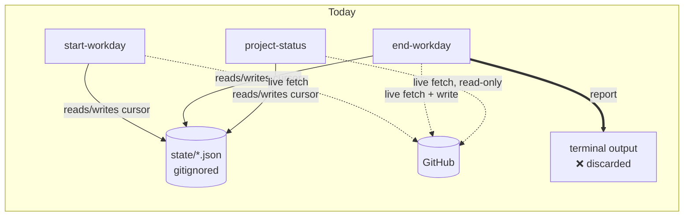
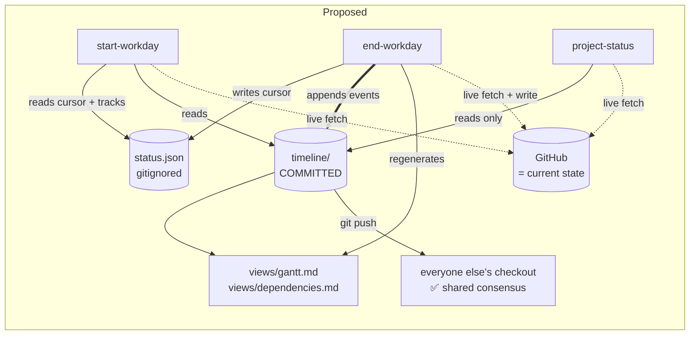
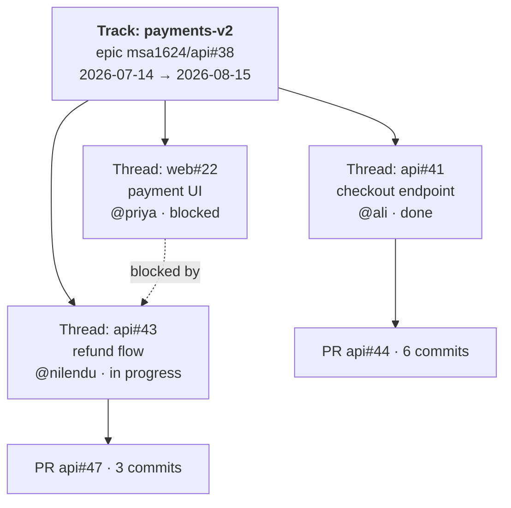
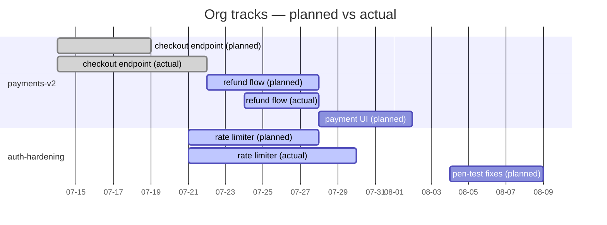
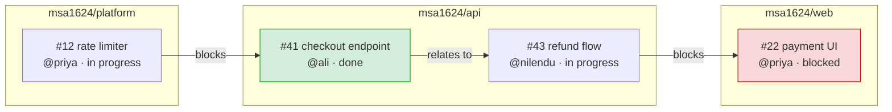
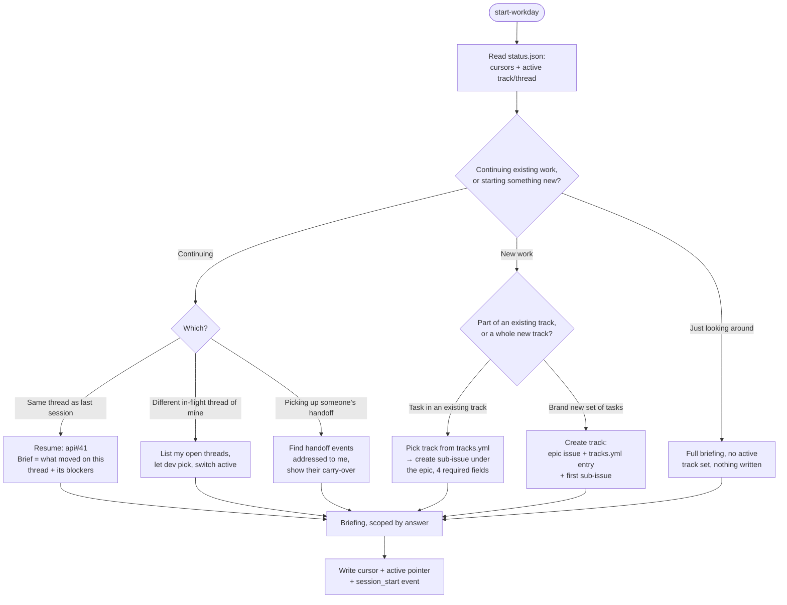
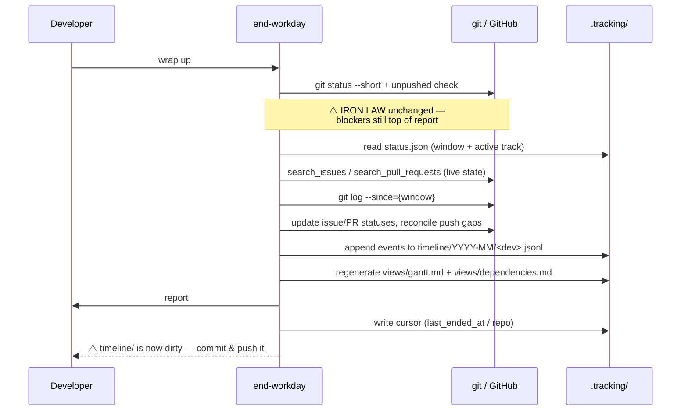

# Tracking Redesign — Brainstorming Scratchpad

> **Status:** exploratory, and now **superseded** — all open questions are settled (§10, now fourteen).
> The resolved design is [`target-workflow.md`](./target-workflow.md); read that one to know what
> we're building. This doc is kept for the reasoning, including the options that lost.
>
> Skill names below are the ones used during this discussion. In the resolved design they are
> **`start-workday` → `start-work`**, **`end-workday` → `end-work`** (a session is bounded by the
> two commands, not by a calendar day), and **`project-status` → `/snapshot`** (§10 item 9), an
> explicitly-invoked command rather than an auto-triggered skill.
>
> Two proposals below were **reversed** by the decision to use a dedicated tracking repo: §2's
> in-repo `.claude/.tracking/timeline/` layout (and the `.gitignore` narrowing it needed), and
> §9.2's recommendation to gitignore the generated views. Both are annotated in place.
>
> A third reversal, after this doc's own §10 was first written: the "merged into one cursor file"
> resolution (item 2 below) didn't hold. The final design splits back into **two** fully independent
> files — `status.json` (start/end-workday) and `snapshot.json` (`/snapshot`) — because a merged
> file made `/snapshot` a plausible place to look for workday state, which is exactly the confusion
> the original merge was trying to avoid, just moved one level down. See `target-workflow.md` §4.

---

## 1. Where we are today

Three top-level skills share two machine-local, gitignored JSON files:

```
.claude/state/
├── workday.json          # 4 fields: last_started_at/repo, last_ended_at/repo
└── project-status.json   # 1 field: last_checked
```

Both are **cursors, not caches**. The skills say so emphatically — `end-workday` has an entire
rationalization table entry defending it ("It holds two timestamps and two repo names. That's the
whole schema."). All actual work state lives in GitHub, and every run re-fetches it live.

That design has one clear virtue and one clear cost.

**Virtue:** nothing can go stale. A timestamp written by your own clock is always true.

**Cost:** the record of *what happened* only exists as GitHub events scattered across issues, PRs,
and commits — and as prose in a report that gets printed to a terminal and then vanishes. Nobody
can answer "who was working on the payments epic in June, and what slipped?" without re-deriving it
from the API every single time. There is no shared, durable, reviewable answer to *what is going on
across the org* — only per-person, per-session reconstructions.



---

## 2. Proposed shape

> **Superseded by §9.3.** `timeline/` moved to a dedicated `msa1624/tracking` repo, which leaves
> `.claude/.tracking/` holding only the gitignored `status.json` — so the `.gitignore` narrowing
> described below is no longer needed and a plain directory ignore still works. The two-halves
> split is still the core idea; the halves just ended up in two different repos.

Replace `.claude/state/` with `.claude/.tracking/`, split into two halves with **different
lifetimes and different git treatment**:

```
.claude/.tracking/
├── status.json                     # gitignored — machine-local cursors (as today)
├── README.md                       # committed — explains the format to humans
└── timeline/                       # committed — the shared, durable record
    ├── tracks.yml                  #   the set-of-tasks registry (epics)
    ├── 2026-07/
    │   ├── nilendu.jsonl           #   append-only events, one file per dev per month
    │   ├── ali.jsonl
    │   └── priya.jsonl
    └── views/                      #   generated, never hand-edited
        ├── gantt.md
        └── dependencies.md
```

The split is the whole idea — and it changes what the `.gitignore` entry has to say. Today's
`.gitignore` ignores the whole `.claude/state/` directory; that pattern can't carry over as-is,
because `timeline/` and `README.md` need to be tracked while `status.json` doesn't. The entry has
to narrow from a directory ignore to a single-file one:

```diff
- .claude/state/
+ .claude/.tracking/status.json
```

`status.json` stays exactly as untracked as `workday.json` and `project-status.json` are today —
nothing about that changes. What changes is that it now shares a parent directory with files that
*are* tracked, so the ignore rule has to get more specific to match.

| | `status.json` | `timeline/` |
|---|---|---|
| Git | ignored | **committed** |
| Scope | this machine, whoever is running these skills here | the whole org |
| Content | cursors + active-track pointer | events that already happened |
| Mutability | overwritten every run | append-only, never rewritten |
| Can it go stale? | no (own clock) | **no — it describes the past** |
| Source of truth for | "where was I?" | "what happened, when, by whom" |
| **Not** the source of truth for | anything | current issue state — that's GitHub |



---

## 3. Resolving the contradiction with the current design

This has to be dealt with head-on, because `end-workday` currently contains explicit instructions
that forbid what we're proposing:

> *"I'll write carry-over to a file so tomorrow is faster"* → **"start-workday re-fetches live. A file
> goes stale the moment someone else pushes."**

That reasoning is correct, and the timeline **must not** violate it. The distinction that makes the
new design safe:

- **State** = "issue #7 is open, assigned to Priya, blocked on #4." Mutable, goes stale in minutes.
  → Lives in GitHub. Always fetched live. Never written to `.tracking/`.
- **Event** = "on 2026-07-24, Ali pushed 3 commits to #7 and moved it from started to blocked."
  Immutable. Cannot go stale, because the past does not change.
  → Lives in `timeline/`. Never fetched from GitHub twice.

The rule to encode in the skills:

> **Never read current status from the timeline.** The timeline answers *when* and *by whom*.
> GitHub answers *what is true now*. If a briefing needs both, it fetches state live and joins the
> timeline in for history.

If we keep that line clean, the rationalization tables in `end-workday` need editing but not
deletion — they get a new row distinguishing "carry-over notes" (still forbidden) from "event log"
(now required).

---

## 4. `status.json`

Merge the two current files into one, namespaced by owner. The skills currently need an explicit
warning not to confuse `workday.json` with `project-status.json`; one file with named sections
removes the failure mode instead of documenting it.

The two existing namespaces keep the audiences they already have — the merge doesn't blur them:

- `workday` — the daily start/end-workday cursor. Whoever is doing the hands-on work.
- `project_status` — the report cadence cursor. Per the skill's own description this is "a product
  manager (or anyone)" checking on status, not the person doing the work — it just happens to sit
  in the same file now instead of a separate one.

`active` (below) belongs to the `workday` side — it's what start-workday's question tree reads and
writes — not to `project_status`.

```json
{
  "schema": 1,
  "workday": {
    "last_started_at": "2026-07-25T09:00:00Z",
    "last_started_repo": "msa1624/claude-workday-test",
    "last_ended_at": "2026-07-25T18:20:00Z",
    "last_ended_repo": "msa1624/claude-workday-test"
  },
  "project_status": {
    "last_checked": "2026-07-25T05:26:35Z"
  },
  "active": {
    "track": "payments-v2",
    "thread": "msa1624/api#41",
    "since": "2026-07-23T10:00:00Z"
  }
}
```

`active` is the new part — it is what makes start-workday's opening question answerable without
interrogating the dev from scratch every morning. Ownership rules stay as strict as today:
`project-status` may read `workday` but never write it, and vice versa.

**Open question:** merged file with namespaces (fewer files, one read) vs. keeping them separate
(ownership enforced by the filesystem rather than by discipline). Leaning merged — the ownership
rule is already written down, and a second file has proven to be its own source of confusion.

---

## 5. Tracks and threads

The branching question in start-workday only makes sense if there's something for the branches to
select. Two concepts:

- **Track** — a set of related tasks. An epic. "Payments v2", "Q3 auth hardening". Spans repos,
  spans weeks, has an owner and a target date.
- **Thread** — one unit of work inside a track. Usually exactly one GitHub issue, plus the PRs and
  commits that close it.

This maps cleanly onto machinery that already exists: GitHub's `sub_issue_write` gives us real
parent/child issues, and `gh-wrapper` already **requires** Priority, Effort, Start date and Target
date on every issue creation. That means every thread already has the dates a Gantt chart needs —
we've just never collected them anywhere they could be charted.

`tracks.yml` is the registry:

```yaml
- id: payments-v2
  title: Payments v2
  parent: msa1624/api#38          # the epic issue
  owner: nilendu
  started: 2026-07-14
  target: 2026-08-15
  status: active                  # active | paused | done | abandoned
  exit_criteria: "checkout flow live for 100% of traffic"
- id: auth-hardening
  title: Q3 auth hardening
  parent: msa1624/platform#12
  owner: priya
  started: 2026-07-21
  target: 2026-09-01
  status: active
  exit_criteria: "all endpoints behind rate limiter, pen-test clean"
```



---

## 6. Timeline event format

One file per developer per month — `timeline/2026-07/<dev>.jsonl`. This naming is chosen
specifically so **two developers ending their workday at the same time never touch the same file**,
which means no merge conflicts in the common case. Same dev on two machines can still collide, but
appended lines in a JSONL file are about the easiest conflict there is to resolve.

JSONL rather than Markdown because the views (Gantt, dependency map) are generated from it, and
because appending a line is an operation that can't corrupt what's already there.

```jsonl
{"ts":"2026-07-25T09:02:11Z","dev":"ali","event":"session_start","track":"payments-v2","thread":"msa1624/api#41","mode":"resume_same"}
{"ts":"2026-07-25T13:40:00Z","dev":"ali","event":"progress","track":"payments-v2","thread":"msa1624/api#41","commits":["a1b2c3d","e4f5a6b"],"note":"idempotency keys on charge endpoint"}
{"ts":"2026-07-25T15:10:00Z","dev":"ali","event":"blocked","track":"payments-v2","thread":"msa1624/api#41","blocked_by":["msa1624/platform#12"],"note":"needs the new rate-limit middleware"}
{"ts":"2026-07-25T18:20:00Z","dev":"ali","event":"session_end","track":"payments-v2","thread":"msa1624/api#41","state":"blocked","duration_min":558}
```

Field notes:

| Field | Rule |
|---|---|
| `ts` | UTC, ISO 8601, always. Local time makes cross-timezone Gantt charts lie. |
| `dev` | the GitHub handle — same identity `project-status` uses, so attribution joins cleanly |
| `event` | `session_start` · `progress` · `blocked` · `unblocked` · `done` · `handoff` · `session_end` |
| `thread` | always `owner/repo#N`, never bare `#N` (matches the existing skill rule) |
| `commits` | short SHAs, so a timeline entry can be verified against git rather than trusted |
| `duration_min` | derived from the session boundary — **wall clock of the session, not "effort"** |

**`duration_min` deserves a decision.** It's what makes a Gantt chart honest, and it's also the
field most easily misread as productivity measurement. Options: (a) record it, (b) record start/end
only and let views derive elapsed time, (c) skip duration entirely and chart at day granularity.
I'd lean (c) or (b) — see §9.

---

## 7. Generated views

`views/gantt.md` and `views/dependencies.md` are **derived artifacts**. They get a
`<!-- GENERATED by end-workday — do not edit -->` header and are rebuilt from `tracks.yml` +
the JSONL files on every end-workday run. Nobody hand-edits them; if they're wrong, the events are
wrong.

Planned dates come from the GitHub Issue Fields (Start date / Target date). Actual dates come from
the timeline. Charting both is the entire value — the gap between them is the thing a PM wants to
see.





Dependency edges come from the same place they do today — `#N` / `owner/repo#N` references and
"blocks"/"depends on" language in issue bodies and comments — plus the explicit `blocked_by` field
on timeline events, which captures the ones a human said out loud but never wrote in an issue.

---

## 8. Skill workflow changes

### 8.1 start-workday — the opening question tree

Today start-workday goes straight to the briefing. Proposal: ask first, because the answer changes
what the briefing should even contain.



Notes on the tree:

- **"Just looking around" is deliberate.** Not every morning is committed work, and a skill that
  forces you to declare a track before it will tell you anything is a skill people stop running.
- The six existing briefing sections stay, but get **filtered by the answer**. Resuming `api#41`
  should lead with that thread, not with an org-wide stale-items list.
- The new-track branch is where the four required Issue Fields get collected — which is exactly
  what makes the Gantt possible. `gh-wrapper` already refuses to guess these; here the conversation
  naturally establishes them.
- **Open question:** should the question tree run *before* the briefing (as drawn) or after? Before
  means better scoping; after means the dev can see what happened before deciding what to work on.
  A middle option: show a one-line "since you left off" summary, then ask, then give the full brief.

### 8.2 end-workday — writing the timeline



The last line is a genuine wrinkle: end-workday's iron law is *no clean handoff with uncommitted
work*, and end-workday now itself creates uncommitted work. Three options:

1. **Commit and push `.tracking/timeline/` itself**, as its own commit, before the final report.
   Cleanest for the org — the shared record is actually shared — but the skill starts making
   commits, which is a real escalation in what it's allowed to do.
2. **Write the files and tell the dev to commit them.** Safe, honest, and will be ignored roughly
   half the time, which quietly breaks the "consensus" the design exists for.
3. **Write via `create_or_update_file` / `push_files`** to the remote directly, bypassing the
   working tree. Sidesteps the dirty-tree problem entirely, but means your local checkout is behind
   after every wrap-up.

I'd go with **(1), with explicit confirmation** — "I'm about to commit and push today's timeline
entry, here's the diff, ok?" — and the timeline commit excluded from the blocking check that
precedes it, since it doesn't exist yet at that point.

### 8.3 project-status — read, never write

Barely changes, and that's a good sign for the design. It gains a much cheaper way to answer "who
did what over this window" — read the JSONL rather than re-deriving from commit authorship every
run — but the attribution rules stay identical, and it still may not write anything, including to
`.tracking/`.

The one addition worth making: `project-status` can now show **planned vs. actual**, because the
Gantt has both. That's new information a PM can't get from GitHub alone.

---

## 9. Suggestions, risks, and things I'd push back on

### 9.1 The timeline is a per-person activity log, and that has weight

Committed, org-visible, timestamped, per-developer, with durations. That is a surveillance surface,
whatever the intent. `project-status` already carries a rule that it *"must never rank or editorialize
about a person's output, only report what the record shows"* — this design makes that rule much
easier to break, because now there is a tidy per-person file sitting in the repo inviting exactly
that comparison.

Concrete mitigations worth deciding on:
- **Drop `duration_min`.** Day-granularity events give you a perfectly good Gantt. Hours worked
  gives you a stick to hit people with, and buys the chart almost nothing.
- Extend the no-editorializing rule to cover any view generated from the timeline.
- Never generate a "leaderboard" view, and say so explicitly in the skill so nobody adds one later.
- Consider recording `dev` only on the events where attribution genuinely matters (handoffs,
  ownership), rather than on every event.

### 9.2 Merge conflicts are the thing most likely to kill this

Per-dev-per-month files solve the common case. Still worth planning for:
- Never rewrite history in the JSONL files — append only, always. A rewrite turns a trivial conflict
  into a real one.
- The generated `views/` **will** conflict constantly, since everyone regenerates them. Options:
  gitignore the views and regenerate on demand; or generate them in CI on `main` only; or accept
  "take theirs and regenerate" as the standing resolution. **I'd gitignore the views** — they're
  derived, and a derived file in version control is a conflict generator by construction.
  → **Reversed by §9.3.** That reasoning holds when the views live on N branches across N repos.
  In a single-branch tracking repo with a pull-before-regenerate rule, they're just files — and
  committing them is what makes the org-wide Gantt readable on GitHub without cloning anything.
- Add a `.gitattributes` `merge=union` for `*.jsonl` so append-only conflicts auto-resolve.

### 9.3 Which repo holds the org-wide timeline? — **SETTLED: a dedicated repo**

The design says "consensus across the org," but the files live in one repo. If every repo gets its
own `.tracking/timeline/`, there is no org-wide view — just N partial ones. Options:

- **A dedicated `msa1624/tracking` repo.** Skills read/write it regardless of which repo you're
  standing in. Cleanest conceptually; needs the skills to know the tracking repo's name.
- **Whichever repo you're in**, accepting fragmentation. Simplest; loses the main benefit.
- **Both** — write locally, sync to the central repo on end-workday.

**Decided: the dedicated repo.** The org-wide-view argument above is what motivated it, but the
argument that actually settles it is **branching**, which the in-repo option handles badly at every
turn. An in-repo timeline is stored *on the branch the work happened on*, so:

- feature-branch events are invisible to everyone not on that branch — the consensus silently
  isn't one;
- rebasing replays timeline commits with new SHAs, rewriting append-only history (§9.2's own rule);
- squash-merging collapses a week of session events into one commit;
- deleting an abandoned branch deletes the record of work that really happened;
- two branches by the same dev on the same day both write `timeline/2026-07/ali.jsonl` — a
  guaranteed conflict on a file nobody was thinking about;
- every PR diff carries session-log noise for a reviewer to approve.

A repo with a single branch has none of these. The branch stops being the *location* of an event
and becomes a *field on* it (`repo` + `branch`), which is strictly more useful — work becomes
locatable in space as well as time, and "when did this branch start and stop" becomes chartable.

Two knock-on effects: the commit-and-push question (§8.2) mostly dissolves, since the tracking
commit lands in a repo the `git status` check doesn't even look at; and the views question (§9.2)
reverses — see the note there.

Full design in [`target-workflow.md`](./target-workflow.md) §2–3.

### 9.4 Smaller suggestions

- **Schema version field** in every JSONL line and in `status.json`. Cheap now, saves a migration
  later.
- **`.tracking/README.md`, committed** — explaining the format to humans who find these files and
  wonder what wrote them. A shared record nobody can read isn't shared.
- **A validation pass** in end-workday: does every commit referencing `#N` have a timeline event?
  That's the same shape as the existing "compliance gaps found" section, and it should feed the
  same report line.
- **Exit criteria on tracks** (already in the `tracks.yml` sketch above). Without them, tracks never
  close — they just stop having events, and the Gantt fills with zombie bars.
- **Timeline is verifiable, not trusted.** Every `progress` event carries commit SHAs; anything
  claiming work with no SHAs and no issue reference should be visibly softer in the views.
- **Decide what happens on day one**, when a dev has no timeline history and `tracks.yml` is empty.
  The question tree needs a sane path where every "existing track" answer is unavailable.
- **Retention.** JSONL grows forever. Monthly directories make archiving easy — decide now whether
  old months get pruned, compacted into a summary, or kept.

### 9.5 The one thing I'd genuinely reconsider

GitHub Projects already does Gantt charts, dependency tracking, and cross-repo rollups, and the
`gh-wrapper` skill already treats Issue Fields (Priority, Effort, Start date, Target date) as the
org's Projects-equivalent enforcement surface. Building a parallel tracking system in flat files
means two places to look and two places to drift.

The strongest argument *for* doing it anyway — and I think it holds — is that the timeline captures
something GitHub structurally cannot: **the session-level narrative.** When work started and
stopped, what someone was actually blocked on at 3pm as opposed to what they eventually wrote in
the issue, who handed what to whom. GitHub records state transitions; this records the work.

But that argues for keeping the timeline **narrow and event-shaped**, and *not* letting it grow into
a second issue tracker. If `tracks.yml` starts accumulating status, assignees, and descriptions that
duplicate the epic issue, the design has failed. The rule that keeps it honest:

> `tracks.yml` holds the **pointer and the plan**. The epic issue holds the **content**.
> If a field exists in both, GitHub wins and `tracks.yml` should stop storing it.

---

## 10. Open questions — resolved

All seven are settled. The resolved design lives in [`target-workflow.md`](./target-workflow.md);
this doc is kept as the record of how it got there.

| # | Question | Resolution |
|---|---|---|
| 1 | In every repo, or a dedicated org-level tracking repo? (§9.3) | **Dedicated repo**, `msa1624/tracking`. Branching settled it. |
| 2 | Merged `status.json`, or two cursor files? (§4) | **Two files, fully independent, no shared fields.** First merged into one (`snapshot.json`, namespaced), then split back apart once `/snapshot` sharing a file with the workday cursor turned out to recreate the exact ownership confusion the merge was meant to fix — see #8 and #9 below. |
| 3 | Does end-workday commit and push the timeline? (§8.2) | **Yes**, to the tracking repo only, after showing the diff and confirming. Mostly dissolved by #1. |
| 4 | Question tree before the briefing, or after? (§8.1) | **The middle option** — one-line glance, then the question, then a briefing scoped by the answer. |
| 5 | Record `duration_min`? (§6, §9.1) | **No.** Session boundaries give day granularity; an hours number buys little and invites ranking. |
| 6 | Views committed or gitignored? (§9.2) | **Committed** — safe once there's one branch and a pull-before-regenerate rule. Conflicts are never merged: discard local `views/` and regenerate from the merged timeline. `merge=union` covers `*.jsonl` only, deliberately. |
| 7 | Migration path for existing `state/*.json`? | **Carry the values over.** The four `workday` fields and `last_checked` map straight into the new namespaces; `session` starts empty and the question tree fills it on first run. |
| 8 | Where do the local cursor files live, and what are they named? | **`~/.claude/<org>.status.json`** (start/end-workday) and **`~/.claude/<org>.snapshot.json`** (`/snapshot`) — both outside `.claude/.tracking/` entirely, not just outside git tracking within it. `.tracking` is a clone of the shared repo; local-only state can't live somewhere a clone's own git operations (reclone, `git clean`, a bad rebase) could reach. |
| 9 | Is `project-status` still the right name/trigger for the report skill? | **No — renamed to `/snapshot`, explicitly invoked** instead of auto-triggered by conversational phrasing. Its cursor is `snapshot.json`'s `last_checked`, unnested — there's nothing else in that file to namespace it against. Functionality (three-layer report: this repo, org rollup, who-did-what) is unchanged; only the name, the invocation model, and the file it owns moved. |

| 10 | Does `tracks.yml` store the track's title, owner, and dates? | **No — four fields only** (`id`, `parent`, `status`, `exit_criteria`). Those three all live on the epic issue, so principle 2 forbids duplicating them; readers follow `parent`. What's left is the two things GitHub can't express: a four-state track status, and structured exit criteria. |
| 11 | May the generated views embed issue state? | **No.** Views build from the timeline and `tracks.yml` alone — no assignees, no statuses, no planned dates. Node labels use the `title` captured on `branch_created`, which is an event (a fact about the past), not a live lookup. Planned-vs-actual moves to `/snapshot`, computed at report time. |
| 12 | Is old timeline history ever compacted? | **No.** ~10 events/day/dev is a few hundred KB a year; an append-only log rewritten on any schedule isn't append-only. Principle 3 stays absolute. |
| 13 | Who owns session lifecycle? | **start-workday.** It opens sessions, resumes open ones with an explicit `session_resume` event, and closes abandoned ones (`session_end {inferred:true}`). Recovery belongs here because a developer who abandoned a session is by definition one who didn't run end-workday. |
| 14 | What happens without push access to the tracking repo? | **end-workday refuses to run**, checking access before it writes anything. Banking events nobody will ever see is worse than not recording them, because only the second is honest. start-workday and `/snapshot` still work, since both only read. |

The naming-collision question that used to be open here is resolved by #8 and #9: `.claude/.tracking/`
is now clone-only, with no local state inside it, so it no longer collides in meaning with anything
local, and the skill that used to share a name with its own cursor field (`project-status` /
`project_status`) no longer does either. See `target-workflow.md` §2, §4, and §8.3.
